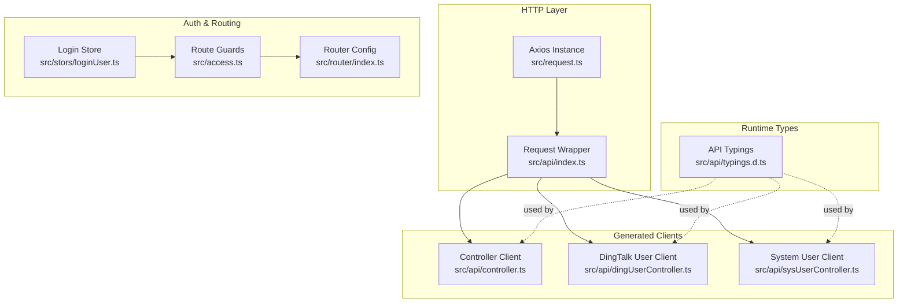
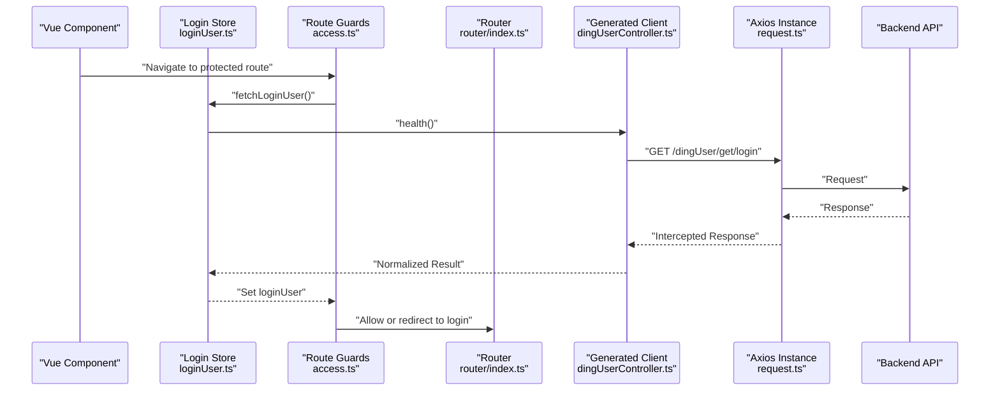
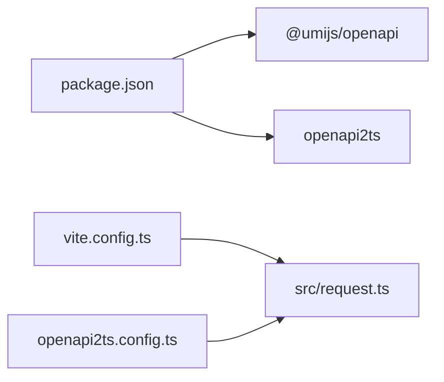

# API Integration

<cite>
**Referenced Files in This Document**
- [src/request.ts](file://src/request.ts)
- [openapi2ts.config.ts](file://openapi2ts.config.ts)
- [src/api/index.ts](file://src/api/index.ts)
- [src/api/controller.ts](file://src/api/controller.ts)
- [src/api/dingUserController.ts](file://src/api/dingUserController.ts)
- [src/api/sysUserController.ts](file://src/api/sysUserController.ts)
- [src/api/typings.d.ts](file://src/api/typings.d.ts)
- [src/config/constants.ts](file://src/config/constants.ts)
- [src/stors/loginUser.ts](file://src/stors/loginUser.ts)
- [src/access.ts](file://src/access.ts)
- [src/router/index.ts](file://src/router/index.ts)
- [src/views/loginUser/js/login-api.js](file://src/views/loginUser/js/login-api.js)
- [package.json](file://package.json)
- [vite.config.ts](file://vite.config.ts)
</cite>

## Table of Contents
1. [Introduction](#introduction)
2. [Project Structure](#project-structure)
3. [Core Components](#core-components)
4. [Architecture Overview](#architecture-overview)
5. [Detailed Component Analysis](#detailed-component-analysis)
6. [Dependency Analysis](#dependency-analysis)
7. [Performance Considerations](#performance-considerations)
8. [Troubleshooting Guide](#troubleshooting-guide)
9. [Conclusion](#conclusion)
10. [Appendices](#appendices)

## Introduction
This document describes the API integration layer of the SSO frontend application. It covers HTTP client configuration, request/response interceptors, error handling strategies, API client generation via OpenAPI, endpoint specifications, data transformation patterns, and integration with backend services. Practical usage examples, authentication headers, response processing, and performance considerations are included.

## Project Structure
The API integration layer centers around a shared HTTP client built on Axios, with generated TypeScript clients for DingTalk user operations and system user management. The OpenAPI specification is consumed to generate strongly typed models and client functions. Routing and global guards enforce authentication and authorization checks.

**Diagram sources**
- [src/request.ts:1-49](file://src/request.ts#L1-L49)
- [src/api/index.ts:1-13](file://src/api/index.ts#L1-L13)
- [src/api/controller.ts:1-12](file://src/api/controller.ts#L1-L12)
- [src/api/dingUserController.ts:1-43](file://src/api/dingUserController.ts#L1-L43)
- [src/api/sysUserController.ts:1-34](file://src/api/sysUserController.ts#L1-L34)
- [src/api/typings.d.ts:1-58](file://src/api/typings.d.ts#L1-L58)
- [src/stors/loginUser.ts:1-33](file://src/stors/loginUser.ts#L1-L33)
- [src/access.ts:1-41](file://src/access.ts#L1-L41)
- [src/router/index.ts:1-40](file://src/router/index.ts#L1-L40)

**Section sources**
- [src/request.ts:1-49](file://src/request.ts#L1-L49)
- [openapi2ts.config.ts:1-7](file://openapi2ts.config.ts#L1-L7)
- [src/api/index.ts:1-13](file://src/api/index.ts#L1-L13)
- [src/api/typings.d.ts:1-58](file://src/api/typings.d.ts#L1-L58)
- [src/stors/loginUser.ts:1-33](file://src/stors/loginUser.ts#L1-L33)
- [src/access.ts:1-41](file://src/access.ts#L1-L41)
- [src/router/index.ts:1-40](file://src/router/index.ts#L1-L40)

## Core Components
- Shared HTTP client configured with base URL, timeout, and credentials policy.
- Request interceptor placeholder for future enhancements.
- Response interceptor handling session expiration and redirect logic.
- OpenAPI-driven client generation configuration pointing to the backend’s OpenAPI docs.
- Generated API modules for DingTalk user operations and system user management.
- Strongly typed models for API responses and request bodies.
- Global Pinia store for login state and route guards enforcing permissions.

Key responsibilities:
- Centralized HTTP configuration and error handling.
- Type-safe API calls with generated clients.
- Authentication-aware routing and user session management.

**Section sources**
- [src/request.ts:1-49](file://src/request.ts#L1-L49)
- [openapi2ts.config.ts:1-7](file://openapi2ts.config.ts#L1-L7)
- [src/api/index.ts:1-13](file://src/api/index.ts#L1-L13)
- [src/api/typings.d.ts:1-58](file://src/api/typings.d.ts#L1-L58)
- [src/stors/loginUser.ts:1-33](file://src/stors/loginUser.ts#L1-L33)
- [src/access.ts:1-41](file://src/access.ts#L1-L41)

## Architecture Overview
The frontend integrates with backend services through a typed HTTP client. Requests flow through Axios interceptors, then to generated API functions, and finally to backend endpoints. Responses are normalized and handled for authentication failures. Route guards use the login store to enforce access control.

**Diagram sources**
- [src/stors/loginUser.ts:1-33](file://src/stors/loginUser.ts#L1-L33)
- [src/access.ts:1-41](file://src/access.ts#L1-L41)
- [src/router/index.ts:1-40](file://src/router/index.ts#L1-L40)
- [src/api/dingUserController.ts:1-43](file://src/api/dingUserController.ts#L1-L43)
- [src/request.ts:1-49](file://src/request.ts#L1-L49)

## Detailed Component Analysis

### HTTP Client Configuration and Interceptors
- Axios instance created with a base URL, 60-second timeout, and credential inclusion for cross-origin requests.
- Request interceptor currently passes requests through; suitable for adding auth tokens or logging.
- Response interceptor:
  - Detects a specific unauthorized code and redirects to the DingTalk login page when not already on the login route.
  - Preserves non-2xx errors for upstream handling.

Practical implications:
- Centralizes network configuration and error normalization.
- Enables single-point session invalidation handling.

**Section sources**
- [src/request.ts:1-49](file://src/request.ts#L1-L49)

### API Client Generation
- OpenAPI-to-TypeScript generation configured via a dedicated config file pointing to the backend’s OpenAPI docs.
- Generated clients are grouped under a single index module and imported by views and stores.
- The generator uses the shared HTTP client as the transport layer.

Usage pattern:
- Import the generated client function and pass request options.
- Responses are typed according to the OpenAPI schema.

**Section sources**
- [openapi2ts.config.ts:1-7](file://openapi2ts.config.ts#L1-L7)
- [src/api/index.ts:1-13](file://src/api/index.ts#L1-L13)

### Endpoint Specifications and Data Transformation
Endpoints and transformations observed in the generated clients:

- DingTalk user operations
  - Health check: GET /dingUser/get/login → returns a typed user object wrapper.
  - Login: POST /dingUser/login → consumes JSON body, returns a typed user object wrapper.
  - Logout: POST /dingUser/logout → returns a typed string wrapper.
  - Test: GET /dingUser/test → returns a typed string.

- System user management (admin)
  - List system users: POST /sysUser/admin/page → consumes a typed query request, returns a typed paginated response.
  - Update user role: PUT /sysUser/admin/update/role → consumes a typed update request, returns a typed boolean wrapper.

Data transformation patterns:
- All endpoints return a standardized response envelope with code, data, and message fields.
- Strongly typed request and response models are used to ensure correctness at compile time.

**Section sources**
- [src/api/dingUserController.ts:1-43](file://src/api/dingUserController.ts#L1-L43)
- [src/api/sysUserController.ts:1-34](file://src/api/sysUserController.ts#L1-L34)
- [src/api/typings.d.ts:1-58](file://src/api/typings.d.ts#L1-L58)

### Authentication Headers and Session Handling
- DingTalk login endpoint sets Content-Type to application/json.
- Axios instance enables credentials to support cookie-based sessions.
- Response interceptor handles session expiration by redirecting to the DingTalk login page when encountering a specific unauthorized code.

Note: The current login form example uses a mock API and local storage for demonstration. The generated client functions integrate with the backend’s session mechanism via the Axios instance.

**Section sources**
- [src/api/dingUserController.ts:1-43](file://src/api/dingUserController.ts#L1-L43)
- [src/request.ts:1-49](file://src/request.ts#L1-L49)
- [src/views/loginUser/js/login-api.js:1-38](file://src/views/loginUser/js/login-api.js#L1-L38)

### Route Guards and Access Control
- Route guards check the login state before navigation.
- For admin-only routes, the guard verifies the user role.
- For routes requiring login, the guard ensures a valid user ID exists.
- On failure, the user is redirected to the DingTalk login page with a redirect parameter.

Integration with the login store ensures that navigation occurs after initial user info retrieval.

**Section sources**
- [src/access.ts:1-41](file://src/access.ts#L1-L41)
- [src/stors/loginUser.ts:1-33](file://src/stors/loginUser.ts#L1-L33)
- [src/router/index.ts:1-40](file://src/router/index.ts#L1-L40)

### Generated API Clients for DingTalk and System Users
- DingTalk user client exports functions for health, login, logout, and test endpoints.
- System user client exports functions for listing users and updating roles.
- Both clients rely on the shared Axios instance and typed models.

Example usage patterns:
- Call health on app initialization to hydrate the login store.
- Call login with a JSON payload and handle the returned user object wrapper.
- Call list and update endpoints with typed request bodies and process paginated or boolean results.

**Section sources**
- [src/api/dingUserController.ts:1-43](file://src/api/dingUserController.ts#L1-L43)
- [src/api/sysUserController.ts:1-34](file://src/api/sysUserController.ts#L1-L34)
- [src/api/index.ts:1-13](file://src/api/index.ts#L1-L13)

### Data Models and Typings
The generated models define:
- Standard response envelopes for various data types.
- Paginated response model with metadata such as page number, size, and totals.
- Request models for querying and updating system users.
- Value objects representing user information.

These types ensure compile-time safety and reduce runtime errors.

**Section sources**
- [src/api/typings.d.ts:1-58](file://src/api/typings.d.ts#L1-L58)

### Constants and Environment
- A DingTalk client identifier constant is defined for potential use in OAuth flows or SDK integrations.

**Section sources**
- [src/config/constants.ts:1-3](file://src/config/constants.ts#L1-L3)

## Dependency Analysis
External libraries and their roles:
- axios: HTTP client providing request/response interceptors and promise-based APIs.
- ant-design-vue: UI feedback (e.g., warning messages).
- element-plus: UI components and theme.
- pinia: Global state management for login user data.
- vue, vue-router: Application framework and routing.

Build and generation:
- vite: Build tool and dev server.
- @umijs/openapi: OpenAPI-to-TypeScript code generation.
- openapi2ts: CLI script for generating TS clients from OpenAPI specs.

**Diagram sources**
- [package.json:1-31](file://package.json#L1-L31)
- [vite.config.ts:1-13](file://vite.config.ts#L1-L13)
- [openapi2ts.config.ts:1-7](file://openapi2ts.config.ts#L1-L7)
- [src/request.ts:1-49](file://src/request.ts#L1-L49)

**Section sources**
- [package.json:1-31](file://package.json#L1-L31)
- [vite.config.ts:1-13](file://vite.config.ts#L1-L13)
- [openapi2ts.config.ts:1-7](file://openapi2ts.config.ts#L1-L7)
- [src/request.ts:1-49](file://src/request.ts#L1-L49)

## Performance Considerations
- Timeout: The Axios instance uses a generous 60-second timeout to accommodate long-running requests. Adjust per endpoint needs to balance responsiveness and reliability.
- Credentials: Enabling credentials supports cookie-based sessions but may increase overhead for CORS preflight checks. Ensure backend CORS policies are optimized.
- Interceptors: Keep interceptors lightweight to avoid request/response latency. Defer heavy operations to background tasks.
- Pagination: Use pagination parameters consistently to limit payload sizes for list endpoints.
- Caching: Consider caching non-sensitive, static data at the application level to reduce redundant network calls.

[No sources needed since this section provides general guidance]

## Troubleshooting Guide
Common issues and resolutions:
- Unauthorized responses:
  - Symptom: Redirect to the DingTalk login page.
  - Cause: Backend returns a specific unauthorized code; response interceptor triggers redirect.
  - Action: Ensure the session is valid and cookies are enabled; verify backend authentication flow.
- Login failures:
  - Symptom: Navigation blocked to login page.
  - Cause: Route guards detect missing user ID or role.
  - Action: Call the health endpoint to populate the login store; confirm successful authentication.
- Network errors:
  - Symptom: Promise rejection in API calls.
  - Cause: Timeout, CORS, or backend downtime.
  - Action: Inspect browser network tab; verify base URL and backend availability.

**Section sources**
- [src/request.ts:1-49](file://src/request.ts#L1-L49)
- [src/access.ts:1-41](file://src/access.ts#L1-L41)

## Conclusion
The API integration layer leverages a centralized Axios client, OpenAPI-generated TypeScript clients, and strong typing to provide a robust, maintainable interface to backend services. Interceptors handle session invalidation, while route guards enforce access control. The design supports scalability, type safety, and predictable error handling.

[No sources needed since this section summarizes without analyzing specific files]

## Appendices

### API Versioning
- The OpenAPI spec is fetched from a fixed path. To adopt versioning, align the OpenAPI endpoint with the backend’s versioned contract and update the generator configuration accordingly.

**Section sources**
- [openapi2ts.config.ts:1-7](file://openapi2ts.config.ts#L1-L7)

### Rate Limiting Considerations
- Implement retry with exponential backoff and jitter for transient failures.
- Use request deduplication to avoid repeated calls for the same resource during short intervals.
- Monitor response headers for rate limit metrics and adjust client-side throttling.

[No sources needed since this section provides general guidance]

### Practical Examples Index
- Initialize login state: call the DingTalk health endpoint via the generated client and hydrate the login store.
- Authenticate user: call the DingTalk login endpoint with a JSON body and process the returned user object wrapper.
- Manage system users: call the list and update endpoints with typed request models and handle paginated or boolean results.

**Section sources**
- [src/api/dingUserController.ts:1-43](file://src/api/dingUserController.ts#L1-L43)
- [src/api/sysUserController.ts:1-34](file://src/api/sysUserController.ts#L1-L34)
- [src/stors/loginUser.ts:1-33](file://src/stors/loginUser.ts#L1-L33)