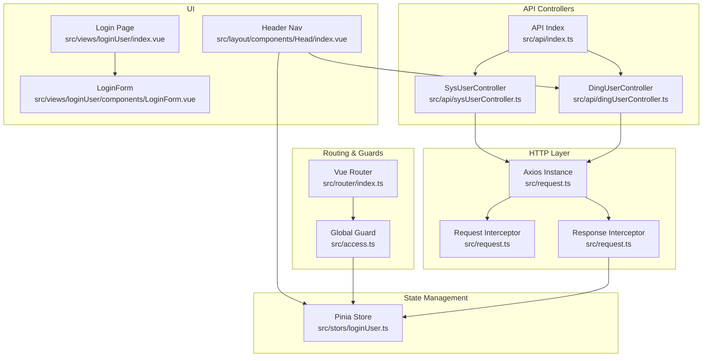
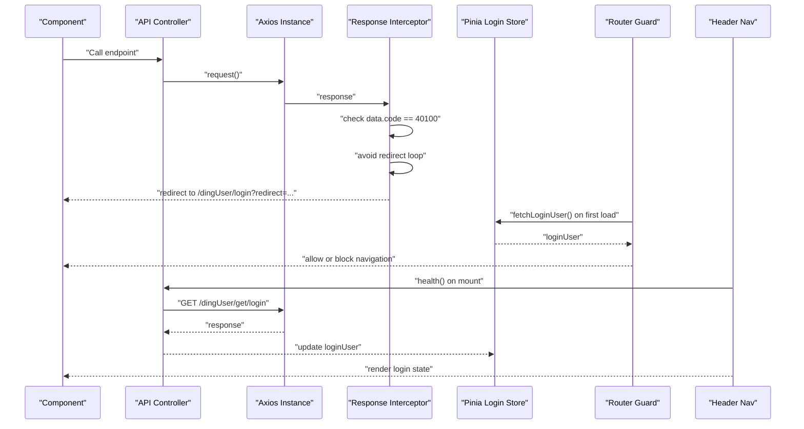
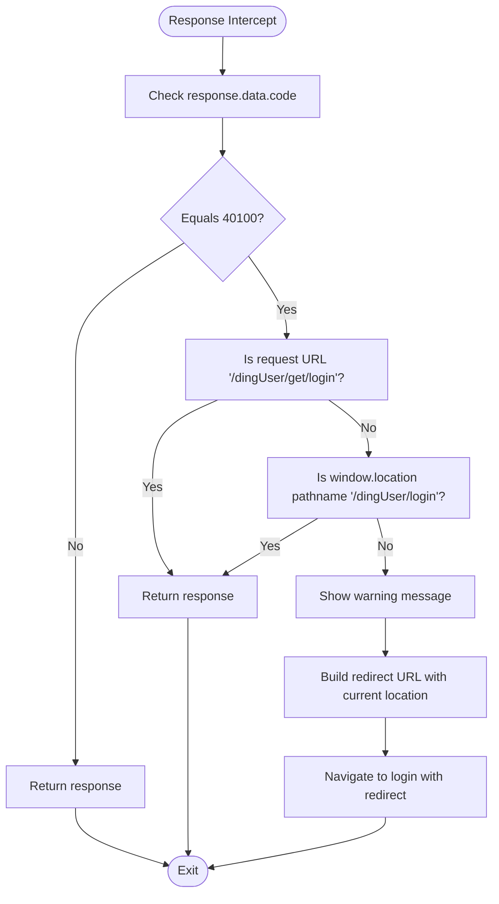
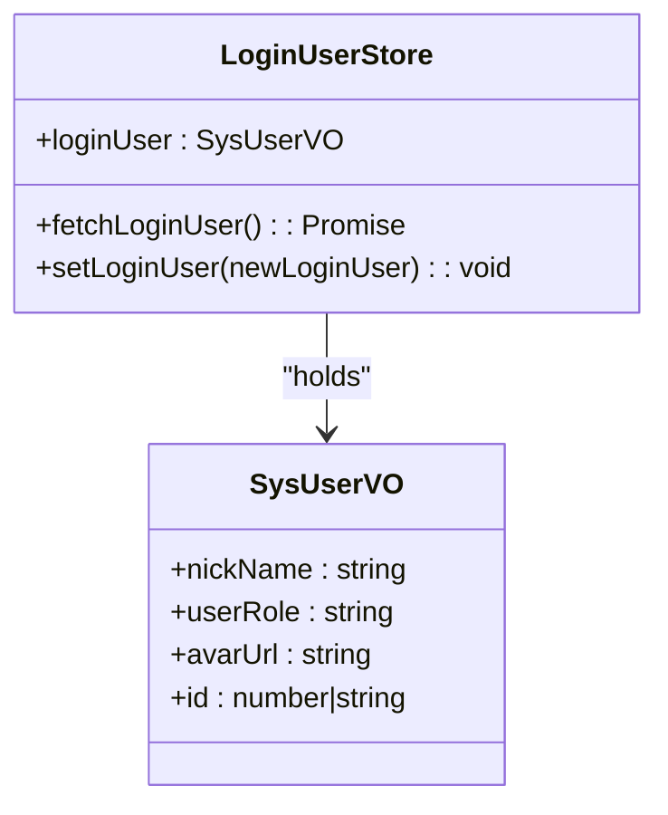
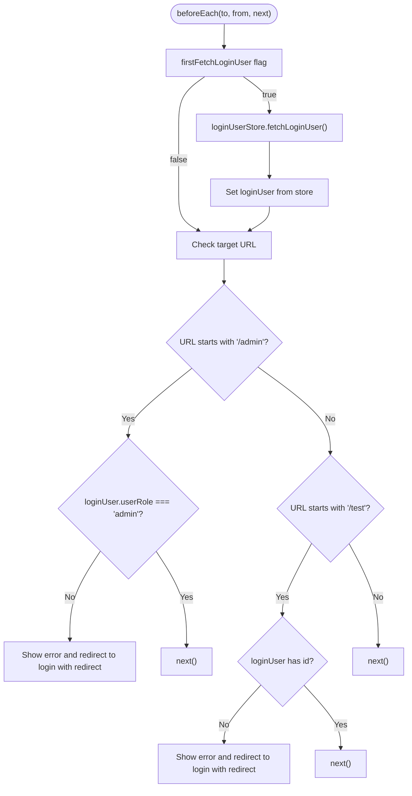
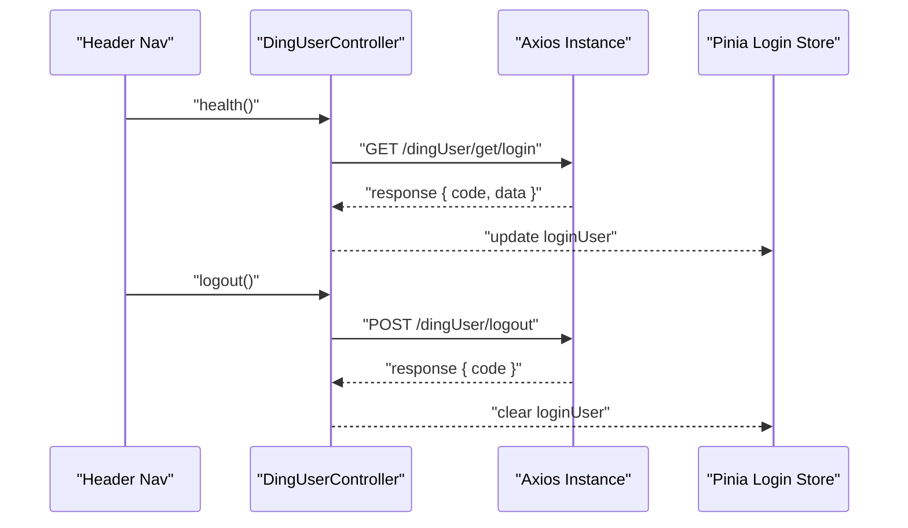
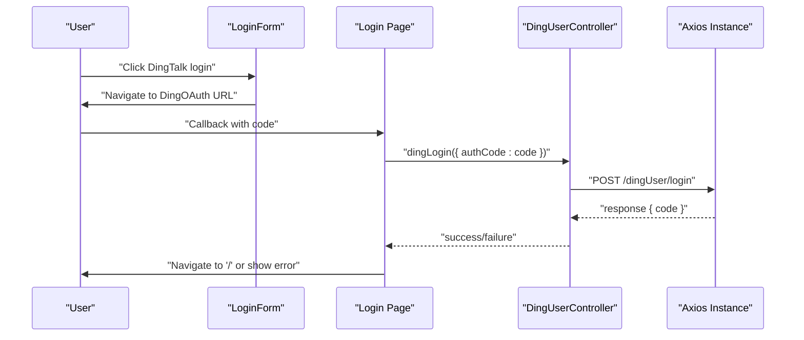
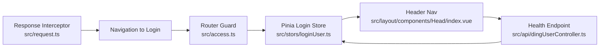
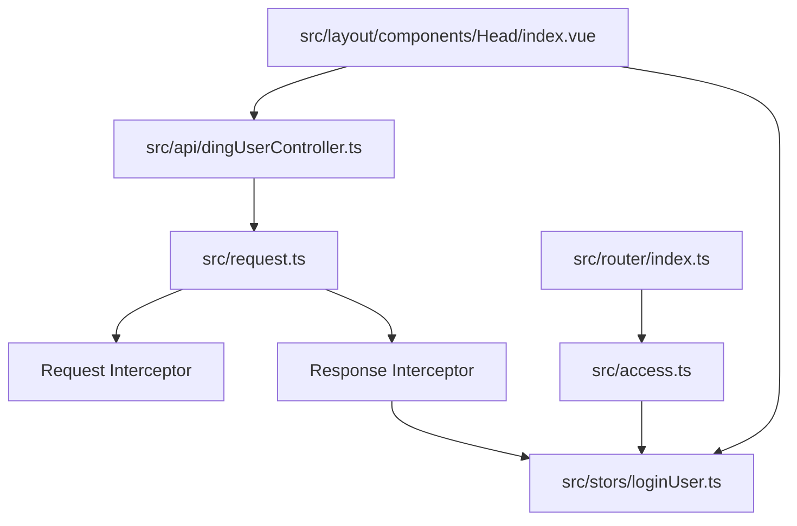

# Authentication & Interceptor Logic

<cite>
**Referenced Files in This Document**
- [request.ts](file://src/request.ts)
- [loginUser.ts](file://src/stors/loginUser.ts)
- [access.ts](file://src/access.ts)
- [dingUserController.ts](file://src/api/dingUserController.ts)
- [index.ts](file://src/api/index.ts)
- [sysUserController.ts](file://src/api/sysUserController.ts)
- [index.ts](file://src/router/index.ts)
- [index.vue](file://src/views/loginUser/index.vue)
- [LoginForm.vue](file://src/views/loginUser/components/LoginForm.vue)
- [login-api.js](file://src/views/loginUser/js/login-api.js)
- [index.vue](file://src/layout/components/Head/index.vue)
- [constants.ts](file://src/config/constants.ts)
</cite>

## Table of Contents
1. [Introduction](#introduction)
2. [Project Structure](#project-structure)
3. [Core Components](#core-components)
4. [Architecture Overview](#architecture-overview)
5. [Detailed Component Analysis](#detailed-component-analysis)
6. [Dependency Analysis](#dependency-analysis)
7. [Performance Considerations](#performance-considerations)
8. [Troubleshooting Guide](#troubleshooting-guide)
9. [Conclusion](#conclusion)

## Introduction
This document explains the authentication and interceptor logic in the frontend API integration layer. It focuses on:
- Automatic login redirection triggered by 401-like responses
- Conditional logic preventing redirect loops
- Integration with the global Pinia login user store
- Response interceptor behavior for unauthorized access and session validation
- How interceptors relate to global authentication state management
- Practical examples for customizing interceptor behavior, adding authentication tokens, and handling different authentication scenarios

## Project Structure
The authentication and interceptor logic spans several modules:
- HTTP client with interceptors
- Global login user store (Pinia)
- Router guards and navigation logic
- API controller modules for DingTalk and system users
- Login page and form components
- Header navigation that reflects login state and triggers logout

**Diagram sources**
- [request.ts:1-49](file://src/request.ts#L1-L49)
- [loginUser.ts:1-33](file://src/stors/loginUser.ts#L1-L33)
- [access.ts:1-41](file://src/access.ts#L1-L41)
- [dingUserController.ts:1-43](file://src/api/dingUserController.ts#L1-L43)
- [sysUserController.ts:1-34](file://src/api/sysUserController.ts#L1-L34)
- [index.ts:1-40](file://src/router/index.ts#L1-L40)
- [index.vue:1-71](file://src/views/loginUser/index.vue#L1-L71)
- [LoginForm.vue:1-42](file://src/views/loginUser/components/LoginForm.vue#L1-L42)
- [index.vue:1-279](file://src/layout/components/Head/index.vue#L1-L279)

**Section sources**
- [request.ts:1-49](file://src/request.ts#L1-L49)
- [loginUser.ts:1-33](file://src/stors/loginUser.ts#L1-L33)
- [access.ts:1-41](file://src/access.ts#L1-L41)
- [dingUserController.ts:1-43](file://src/api/dingUserController.ts#L1-L43)
- [sysUserController.ts:1-34](file://src/api/sysUserController.ts#L1-L34)
- [index.ts:1-40](file://src/router/index.ts#L1-L40)
- [index.vue:1-71](file://src/views/loginUser/index.vue#L1-L71)
- [LoginForm.vue:1-42](file://src/views/loginUser/components/LoginForm.vue#L1-L42)
- [index.vue:1-279](file://src/layout/components/Head/index.vue#L1-L279)

## Core Components
- Axios instance with interceptors:
  - Request interceptor: placeholder for future token injection or request preprocessing
  - Response interceptor: detects unauthorized responses and initiates automatic login redirection while avoiding loops
- Global login user store (Pinia):
  - Holds current user info and exposes methods to fetch and update it
- Router guard:
  - Validates access to protected routes and redirects unauthenticated users to login with a redirect parameter
- API controllers:
  - Provide typed wrappers around HTTP endpoints for DingTalk login, logout, health checks, and admin operations
- Login UI:
  - Supports both traditional login and DingTalk OAuth flow
- Header navigation:
  - Reflects login state, filters menus by permissions, and supports logout with DingTalk session cleanup

**Section sources**
- [request.ts:1-49](file://src/request.ts#L1-L49)
- [loginUser.ts:1-33](file://src/stors/loginUser.ts#L1-L33)
- [access.ts:1-41](file://src/access.ts#L1-L41)
- [dingUserController.ts:1-43](file://src/api/dingUserController.ts#L1-L43)
- [sysUserController.ts:1-34](file://src/api/sysUserController.ts#L1-L34)
- [index.vue:1-279](file://src/layout/components/Head/index.vue#L1-L279)

## Architecture Overview
The authentication pipeline integrates HTTP interceptors, global state, routing guards, and UI components:

**Diagram sources**
- [request.ts:25-47](file://src/request.ts#L25-L47)
- [loginUser.ts:17-22](file://src/stors/loginUser.ts#L17-L22)
- [access.ts:11-40](file://src/access.ts#L11-L40)
- [dingUserController.ts:6-11](file://src/api/dingUserController.ts#L6-L11)
- [index.vue:132-151](file://src/layout/components/Head/index.vue#L132-L151)

## Detailed Component Analysis

### Response Interceptor: Unauthorized Access Handling and Redirect Loop Prevention
The response interceptor inspects the response payload and triggers automatic redirection under specific conditions:
- Detection: Checks for a specific unauthorized code in the response payload
- Avoiding loops: Skips redirect if the current request is for the login health endpoint or if the user is already on the login page
- Redirect pattern: Builds a redirect-aware login URL and navigates the browser to it

**Diagram sources**
- [request.ts:25-47](file://src/request.ts#L25-L47)

**Section sources**
- [request.ts:25-47](file://src/request.ts#L25-L47)

### Global Authentication State Management via Pinia Store
The login user store encapsulates:
- Reactive user object with default placeholder
- Asynchronous fetch method to refresh user info from the backend
- Setter to update user info programmatically

**Diagram sources**
- [loginUser.ts:9-32](file://src/stors/loginUser.ts#L9-L32)

**Section sources**
- [loginUser.ts:1-33](file://src/stors/loginUser.ts#L1-L33)

### Router Guard: Route-Level Access Control and Initial User Fetch
The global beforeEach guard:
- Ensures the user’s login state is loaded on first navigation
- Blocks access to admin-only routes if the user is not an admin
- Blocks access to login-required routes if the user is not logged in
- Redirects to the login page with a redirect parameter

**Diagram sources**
- [access.ts:11-40](file://src/access.ts#L11-L40)

**Section sources**
- [access.ts:1-41](file://src/access.ts#L1-L41)

### API Integration Layer: Health, Login, Logout, and Admin Endpoints
- Health endpoint: Used to validate session and populate the login store
- DingTalk login: Initiates OAuth and finalizes session creation
- Logout: Clears backend session and frontend state
- Admin endpoints: Protected by router guard and rely on session validation

**Diagram sources**
- [dingUserController.ts:6-34](file://src/api/dingUserController.ts#L6-L34)
- [index.vue:132-199](file://src/layout/components/Head/index.vue#L132-L199)

**Section sources**
- [dingUserController.ts:1-43](file://src/api/dingUserController.ts#L1-L43)
- [sysUserController.ts:1-34](file://src/api/sysUserController.ts#L1-L34)
- [index.vue:132-199](file://src/layout/components/Head/index.vue#L132-L199)

### Login UI: DingTalk OAuth and Traditional Login
- DingTalk OAuth:
  - Generates the official OAuth URL with client ID, redirect URI, and state
  - On callback, exchanges the authorization code for a session and navigates to the home page
- Traditional login:
  - Demonstrates token storage and user info caching in local storage

**Diagram sources**
- [LoginForm.vue:24-41](file://src/views/loginUser/components/LoginForm.vue#L24-L41)
- [index.vue:33-71](file://src/views/loginUser/index.vue#L33-L71)
- [dingUserController.ts:14-26](file://src/api/dingUserController.ts#L14-L26)

**Section sources**
- [LoginForm.vue:1-42](file://src/views/loginUser/components/LoginForm.vue#L1-L42)
- [index.vue:1-71](file://src/views/loginUser/index.vue#L1-L71)
- [login-api.js:1-38](file://src/views/loginUser/js/login-api.js#L1-L38)

### Relationship Between Interceptors and Global Authentication State
- The response interceptor triggers navigation to the login page when unauthorized
- The router guard ensures the login store is populated on first navigation
- The header component periodically calls the health endpoint to keep the login store up-to-date
- The login store is the single source of truth for UI rendering and route protection

**Diagram sources**
- [request.ts:25-47](file://src/request.ts#L25-L47)
- [access.ts:11-40](file://src/access.ts#L11-L40)
- [loginUser.ts:17-22](file://src/stors/loginUser.ts#L17-L22)
- [index.vue:132-151](file://src/layout/components/Head/index.vue#L132-L151)
- [dingUserController.ts:6-11](file://src/api/dingUserController.ts#L6-L11)

**Section sources**
- [request.ts:25-47](file://src/request.ts#L25-L47)
- [access.ts:11-40](file://src/access.ts#L11-L40)
- [loginUser.ts:17-22](file://src/stors/loginUser.ts#L17-L22)
- [index.vue:132-151](file://src/layout/components/Head/index.vue#L132-L151)
- [dingUserController.ts:6-11](file://src/api/dingUserController.ts#L6-L11)

### Customizing Interceptor Behavior and Adding Authentication Tokens
Examples of extending the interceptor logic:
- Injecting authentication tokens:
  - Add a request interceptor to attach credentials or tokens to outgoing requests
  - Example path: [request.ts:13-22](file://src/request.ts#L13-L22)
- Handling different authentication scenarios:
  - Expand the response interceptor to handle additional unauthorized codes or error shapes
  - Example path: [request.ts:25-47](file://src/request.ts#L25-L47)
- Integrating with the login store:
  - After successful login, update the store and propagate changes to UI components
  - Example paths: [loginUser.ts:17-22](file://src/stors/loginUser.ts#L17-L22), [index.vue:132-151](file://src/layout/components/Head/index.vue#L132-L151)

**Section sources**
- [request.ts:13-22](file://src/request.ts#L13-L22)
- [request.ts:25-47](file://src/request.ts#L25-L47)
- [loginUser.ts:17-22](file://src/stors/loginUser.ts#L17-L22)
- [index.vue:132-151](file://src/layout/components/Head/index.vue#L132-L151)

## Dependency Analysis
Key dependencies and relationships:
- Axios instance depends on:
  - Request interceptor for pre-processing
  - Response interceptor for post-processing and redirect logic
- Router guard depends on:
  - Login store for user state
  - Navigation to enforce access control
- Header navigation depends on:
  - Health endpoint to reflect real-time login status
  - Login store to render UI state
- API controllers depend on:
  - Axios instance for HTTP communication
  - Router for navigation after actions

**Diagram sources**
- [request.ts:1-49](file://src/request.ts#L1-L49)
- [loginUser.ts:1-33](file://src/stors/loginUser.ts#L1-L33)
- [access.ts:1-41](file://src/access.ts#L1-L41)
- [index.vue:1-279](file://src/layout/components/Head/index.vue#L1-L279)
- [dingUserController.ts:1-43](file://src/api/dingUserController.ts#L1-L43)
- [index.ts:1-40](file://src/router/index.ts#L1-L40)

**Section sources**
- [request.ts:1-49](file://src/request.ts#L1-L49)
- [loginUser.ts:1-33](file://src/stors/loginUser.ts#L1-L33)
- [access.ts:1-41](file://src/access.ts#L1-L41)
- [index.vue:1-279](file://src/layout/components/Head/index.vue#L1-L279)
- [dingUserController.ts:1-43](file://src/api/dingUserController.ts#L1-L43)
- [index.ts:1-40](file://src/router/index.ts#L1-L40)

## Performance Considerations
- Minimize unnecessary re-renders by updating the login store only when user state changes
- Debounce or throttle repeated health checks to avoid excessive network calls
- Use conditional navigation to prevent redirect loops and reduce redundant requests
- Keep interceptors lightweight to avoid blocking critical request paths

## Troubleshooting Guide
Common issues and resolutions:
- Infinite redirect loops:
  - Ensure the response interceptor avoids redirecting when already on the login page or when requesting the health endpoint
  - Verify the redirect parameter is correctly appended and parsed
  - Reference: [request.ts:30-39](file://src/request.ts#L30-L39)
- Stale login state:
  - Trigger the health endpoint on mount and route changes to refresh the login store
  - Reference: [index.vue:132-151](file://src/layout/components/Head/index.vue#L132-L151)
- Admin route access failures:
  - Confirm the router guard checks for admin role and redirects appropriately
  - Reference: [access.ts:22-28](file://src/access.ts#L22-L28)
- Logout not clearing session:
  - Ensure backend logout clears the server session and the frontend state is reset
  - Reference: [index.vue:166-199](file://src/layout/components/Head/index.vue#L166-L199)
- Missing tokens or cookies:
  - For cookie-based sessions, ensure credentials are enabled and cookies are accepted
  - Reference: [request.ts:6-10](file://src/request.ts#L6-L10)

**Section sources**
- [request.ts:30-39](file://src/request.ts#L30-L39)
- [index.vue:132-151](file://src/layout/components/Head/index.vue#L132-L151)
- [access.ts:22-28](file://src/access.ts#L22-L28)
- [index.vue:166-199](file://src/layout/components/Head/index.vue#L166-L199)
- [request.ts:6-10](file://src/request.ts#L6-L10)

## Conclusion
The authentication and interceptor logic forms a cohesive system:
- The response interceptor handles unauthorized responses and prevents redirect loops
- The global login store centralizes user state and powers UI and route protection
- Router guards enforce access control and initialize user state on first navigation
- API controllers integrate with the HTTP client and maintain consistent session handling
- The login UI supports both DingTalk OAuth and traditional flows, seamlessly integrating with the backend session model