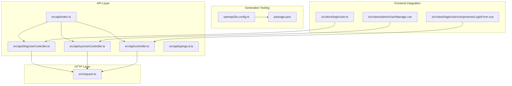
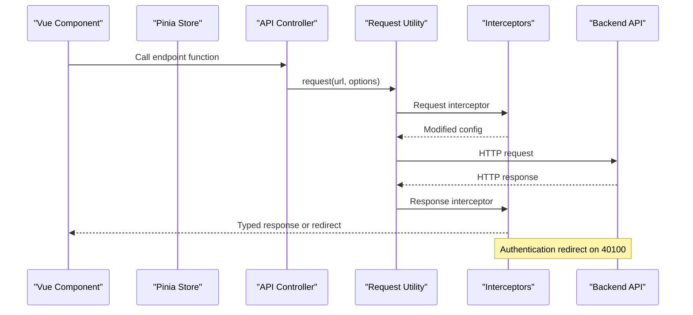
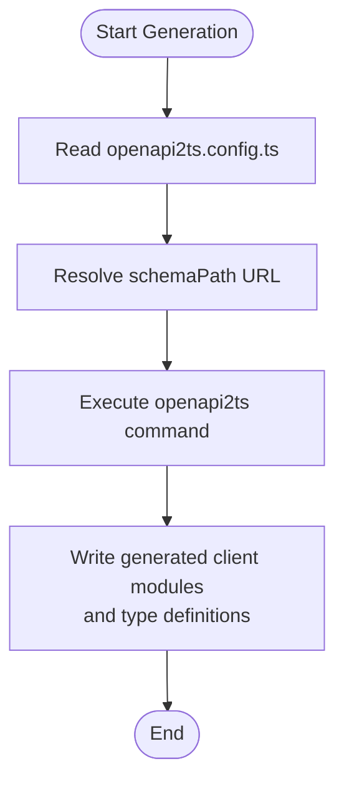
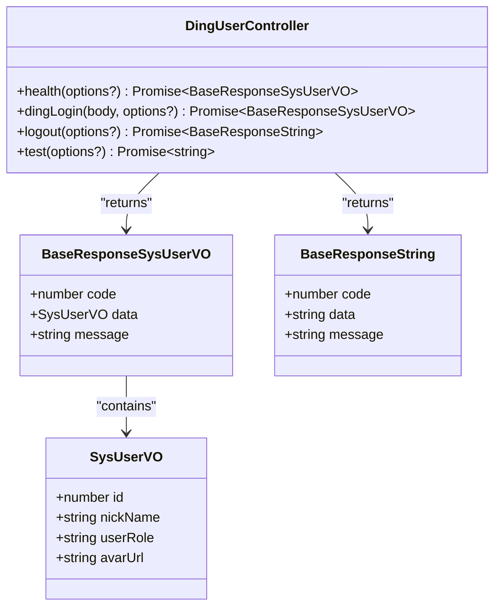
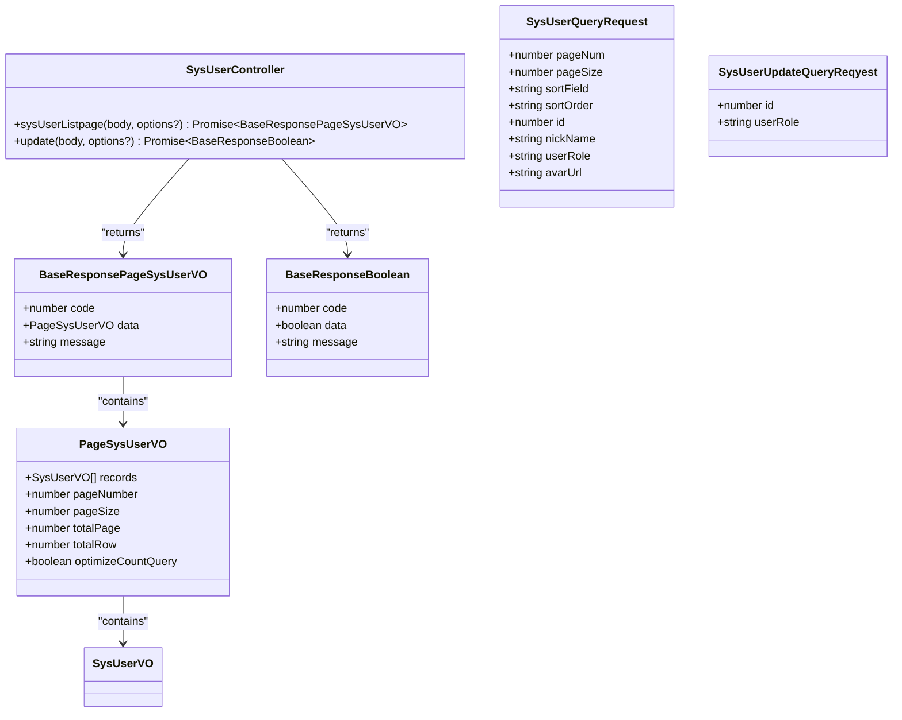
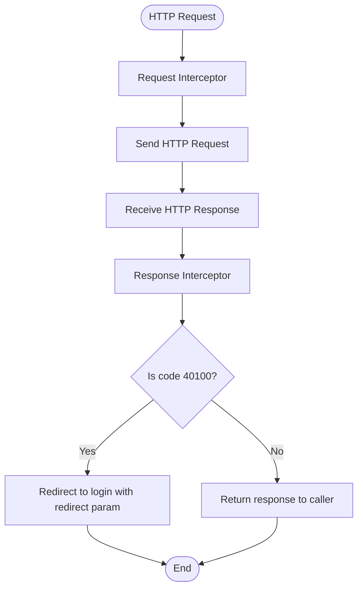
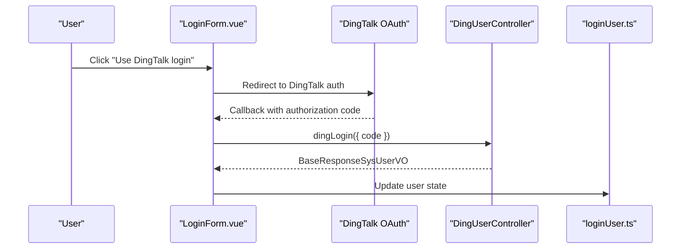
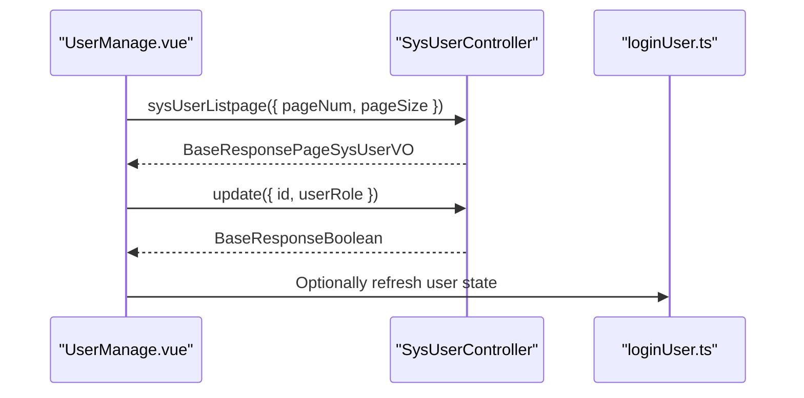
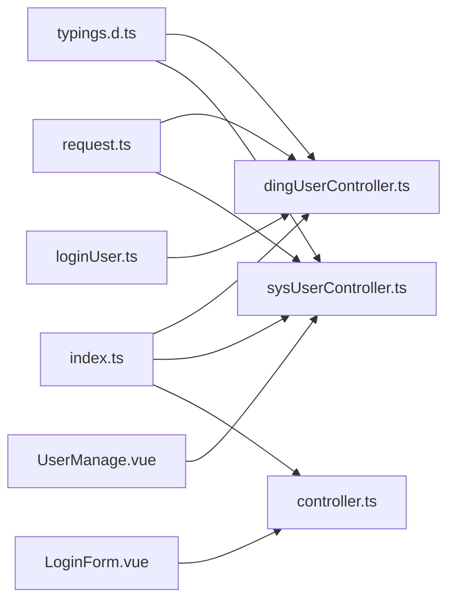

# Generated API Clients

<cite>
**Referenced Files in This Document**
- [src/api/index.ts](file://src/api/index.ts)
- [src/api/controller.ts](file://src/api/controller.ts)
- [src/api/dingUserController.ts](file://src/api/dingUserController.ts)
- [src/api/sysUserController.ts](file://src/api/sysUserController.ts)
- [src/api/typings.d.ts](file://src/api/typings.d.ts)
- [src/request.ts](file://src/request.ts)
- [openapi2ts.config.ts](file://openapi2ts.config.ts)
- [package.json](file://package.json)
- [src/views/admin/UserManage.vue](file://src/views/admin/UserManage.vue)
- [src/stors/loginUser.ts](file://src/stors/loginUser.ts)
- [src/views/loginUser/components/LoginForm.vue](file://src/views/loginUser/components/LoginForm.vue)
</cite>

## Table of Contents
1. [Introduction](#introduction)
2. [Project Structure](#project-structure)
3. [Core Components](#core-components)
4. [Architecture Overview](#architecture-overview)
5. [Detailed Component Analysis](#detailed-component-analysis)
6. [Dependency Analysis](#dependency-analysis)
7. [Performance Considerations](#performance-considerations)
8. [Troubleshooting Guide](#troubleshooting-guide)
9. [Conclusion](#conclusion)

## Introduction
This document provides comprehensive documentation for the generated API clients used in the Single Sign-On (SSO) application. It covers the OpenAPI-to-TypeScript generation process, client interface definitions, endpoint specifications, and integration patterns with frontend components. The focus areas include:
- DingTalk user controller endpoints: /dingUser/get/login, /dingUser/login, /dingUser/logout, /dingUser/test
- System user controller endpoints: /sysUser/admin/page, /sysUser/admin/update/role
- Generated TypeScript interfaces and data models
- Practical usage examples, parameter validation, response handling, and error management
- Integration patterns with Vue components and Pinia stores

## Project Structure
The API client layer is organized under the src/api directory, with separate modules for different controllers and a shared request utility. The structure supports modular imports and centralized exports for easy consumption across the application.

**Diagram sources**
- [src/api/index.ts:1-13](file://src/api/index.ts#L1-L13)
- [src/api/dingUserController.ts:1-43](file://src/api/dingUserController.ts#L1-L43)
- [src/api/sysUserController.ts:1-34](file://src/api/sysUserController.ts#L1-L34)
- [src/api/controller.ts:1-12](file://src/api/controller.ts#L1-L12)
- [src/api/typings.d.ts:1-58](file://src/api/typings.d.ts#L1-L58)
- [src/request.ts:1-49](file://src/request.ts#L1-L49)
- [openapi2ts.config.ts:1-7](file://openapi2ts.config.ts#L1-L7)
- [package.json:1-31](file://package.json#L1-L31)
- [src/views/admin/UserManage.vue:1-147](file://src/views/admin/UserManage.vue#L1-L147)
- [src/stors/loginUser.ts:1-33](file://src/stors/loginUser.ts#L1-L33)
- [src/views/loginUser/components/LoginForm.vue:1-42](file://src/views/loginUser/components/LoginForm.vue#L1-L42)

**Section sources**
- [src/api/index.ts:1-13](file://src/api/index.ts#L1-L13)
- [src/api/dingUserController.ts:1-43](file://src/api/dingUserController.ts#L1-L43)
- [src/api/sysUserController.ts:1-34](file://src/api/sysUserController.ts#L1-L34)
- [src/api/controller.ts:1-12](file://src/api/controller.ts#L1-L12)
- [src/api/typings.d.ts:1-58](file://src/api/typings.d.ts#L1-L58)
- [src/request.ts:1-49](file://src/request.ts#L1-L49)
- [openapi2ts.config.ts:1-7](file://openapi2ts.config.ts#L1-L7)
- [package.json:1-31](file://package.json#L1-L31)

## Core Components
This section documents the generated API client modules and their primary responsibilities.

- Central export module: Aggregates all controller modules for convenient imports across the application.
- DingTalk user controller: Provides endpoints for health checks, DingTalk login, logout, and testing.
- System user controller: Implements administrative operations for user listing and role updates.
- Shared request utility: Encapsulates HTTP client configuration, interceptors, and global error handling.
- Generated TypeScript definitions: Defines base response wrappers and domain models for type-safe consumption.

Key characteristics:
- All client functions return promises resolving to typed responses.
- Content-Type headers are explicitly set for POST/PUT requests.
- Global interceptors handle authentication redirects and error propagation.

**Section sources**
- [src/api/index.ts:8-12](file://src/api/index.ts#L8-L12)
- [src/api/dingUserController.ts:5-42](file://src/api/dingUserController.ts#L5-L42)
- [src/api/sysUserController.ts:5-33](file://src/api/sysUserController.ts#L5-L33)
- [src/request.ts:5-47](file://src/request.ts#L5-L47)
- [src/api/typings.d.ts:1-58](file://src/api/typings.d.ts#L1-L58)

## Architecture Overview
The API client architecture follows a layered design:
- Generation layer: Uses OpenAPI specification to produce TypeScript clients and models.
- HTTP layer: Axios-based request utility with interceptors for authentication and error handling.
- Controller layer: Typed client functions for each endpoint group.
- Frontend integration: Vue components consume controller functions and Pinia stores manage state.

**Diagram sources**
- [src/api/dingUserController.ts:14-26](file://src/api/dingUserController.ts#L14-L26)
- [src/api/sysUserController.ts:6-18](file://src/api/sysUserController.ts#L6-L18)
- [src/request.ts:13-47](file://src/request.ts#L13-L47)

## Detailed Component Analysis

### OpenAPI-to-TypeScript Generation Process
The project integrates an automated generation pipeline driven by the OpenAPI specification:
- Configuration: The generator is configured via openapi2ts.config.ts, specifying the OpenAPI schema path and target output directory.
- Execution: The npm script "openapi2ts" triggers the generation process.
- Output: Generates TypeScript client modules and type definitions aligned with the backend API contract.

**Diagram sources**
- [openapi2ts.config.ts:1-7](file://openapi2ts.config.ts#L1-L7)
- [package.json:8](file://package.json#L8)

**Section sources**
- [openapi2ts.config.ts:1-7](file://openapi2ts.config.ts#L1-L7)
- [package.json:8](file://package.json#L8)

### DingTalk User Controller Endpoints
The DingTalk user controller exposes four endpoints with distinct purposes and response types.

Endpoint specifications:
- GET /dingUser/get/login
  - Purpose: Retrieve user login status.
  - Parameters: Optional request options.
  - Response: BaseResponseSysUserVO containing SysUserVO or null.
  - Usage: Used by Pinia store to hydrate user session state.
- POST /dingUser/login
  - Purpose: Authenticate via DingTalk and retrieve user information.
  - Parameters: body with DingTalk authorization code or token.
  - Response: BaseResponseSysUserVO with authenticated user details.
  - Validation: Enforces JSON content type header.
- POST /dingUser/logout
  - Purpose: Clear user session.
  - Parameters: Optional request options.
  - Response: BaseResponseString indicating operation result.
- GET /dingUser/test
  - Purpose: Health or diagnostic endpoint.
  - Parameters: Optional request options.
  - Response: Plain string.

Integration examples:
- Pinia store fetchLoginUser invokes health to populate user state.
- Vue components import controller functions and handle response codes.

**Diagram sources**
- [src/api/dingUserController.ts:5-42](file://src/api/dingUserController.ts#L5-L42)
- [src/api/typings.d.ts:20-24](file://src/api/typings.d.ts#L20-L24)
- [src/api/typings.d.ts:14-18](file://src/api/typings.d.ts#L14-L18)
- [src/api/typings.d.ts:51-56](file://src/api/typings.d.ts#L51-L56)

**Section sources**
- [src/api/dingUserController.ts:5-42](file://src/api/dingUserController.ts#L5-L42)
- [src/api/typings.d.ts:20-24](file://src/api/typings.d.ts#L20-L24)
- [src/api/typings.d.ts:14-18](file://src/api/typings.d.ts#L14-L18)
- [src/api/typings.d.ts:51-56](file://src/api/typings.d.ts#L51-L56)
- [src/stors/loginUser.ts:17-22](file://src/stors/loginUser.ts#L17-L22)

### System User Controller Endpoints
The system user controller provides administrative capabilities for managing users.

Endpoint specifications:
- POST /sysUser/admin/page
  - Purpose: Paginated listing of system users with filtering and sorting.
  - Parameters: body of type SysUserQueryRequest.
  - Response: BaseResponsePageSysUserVO containing PageSysUserVO.
  - Validation: Enforces JSON content type header.
- PUT /sysUser/admin/update/role
  - Purpose: Update user roles by ID.
  - Parameters: body of type SysUserUpdateQueryReqyest.
  - Response: BaseResponseBoolean indicating success/failure.
  - Validation: Enforces JSON content type header.

Integration examples:
- User management component calls sysUserListpage on mount and pagination events.
- Role change triggers update and handles success/error feedback.

**Diagram sources**
- [src/api/sysUserController.ts:5-33](file://src/api/sysUserController.ts#L5-L33)
- [src/api/typings.d.ts:8-12](file://src/api/typings.d.ts#L8-L12)
- [src/api/typings.d.ts:2-6](file://src/api/typings.d.ts#L2-L6)
- [src/api/typings.d.ts:26-33](file://src/api/typings.d.ts#L26-L33)
- [src/api/typings.d.ts:35-44](file://src/api/typings.d.ts#L35-L44)
- [src/api/typings.d.ts:46-49](file://src/api/typings.d.ts#L46-L49)

**Section sources**
- [src/api/sysUserController.ts:5-33](file://src/api/sysUserController.ts#L5-L33)
- [src/api/typings.d.ts:8-12](file://src/api/typings.d.ts#L8-L12)
- [src/api/typings.d.ts:2-6](file://src/api/typings.d.ts#L2-L6)
- [src/api/typings.d.ts:26-33](file://src/api/typings.d.ts#L26-L33)
- [src/api/typings.d.ts:35-44](file://src/api/typings.d.ts#L35-L44)
- [src/api/typings.d.ts:46-49](file://src/api/typings.d.ts#L46-L49)
- [src/views/admin/UserManage.vue:68-89](file://src/views/admin/UserManage.vue#L68-L89)
- [src/views/admin/UserManage.vue:92-113](file://src/views/admin/UserManage.vue#L92-L113)

### Request Utility and Interceptors
The request utility encapsulates HTTP communication and global behavior:
- Axios instance: Configured with base URL, timeout, and credentials support.
- Request interceptor: Allows modification of outgoing requests.
- Response interceptor: Handles authentication redirects and error propagation.
- Error handling: Centralized logic for unauthenticated access and network errors.

**Diagram sources**
- [src/request.ts:13-47](file://src/request.ts#L13-L47)

**Section sources**
- [src/request.ts:5-47](file://src/request.ts#L5-L47)

### Generated TypeScript Interfaces and Data Models
The typings.d.ts file defines the core type system consumed by the API clients:
- Base response wrappers: Standardized containers for API responses with code, data, and message fields.
- Domain models: SysUserVO, PageSysUserVO, and request DTOs for querying and updating users.
- Type safety: Ensures compile-time validation of API responses and request payloads.

Key types:
- BaseResponseBoolean, BaseResponsePageSysUserVO, BaseResponseString, BaseResponseSysUserVO
- PageSysUserVO with pagination metadata
- SysUserQueryRequest and SysUserUpdateQueryReqyest for administrative operations
- SysUserVO representing user identity and profile

**Section sources**
- [src/api/typings.d.ts:1-58](file://src/api/typings.d.ts#L1-L58)

### Practical Usage Examples

#### Using DingTalk Login in a Vue Component
- Navigate to DingTalk OAuth authorization URL.
- On callback, invoke the DingTalk login endpoint with authorization code.
- Handle response codes and update application state accordingly.

**Diagram sources**
- [src/views/loginUser/components/LoginForm.vue:25-41](file://src/views/loginUser/components/LoginForm.vue#L25-L41)
- [src/api/dingUserController.ts:14-26](file://src/api/dingUserController.ts#L14-L26)
- [src/stors/loginUser.ts:17-22](file://src/stors/loginUser.ts#L17-L22)

**Section sources**
- [src/views/loginUser/components/LoginForm.vue:25-41](file://src/views/loginUser/components/LoginForm.vue#L25-L41)
- [src/api/dingUserController.ts:14-26](file://src/api/dingUserController.ts#L14-L26)
- [src/stors/loginUser.ts:17-22](file://src/stors/loginUser.ts#L17-L22)

#### Managing Users in the Admin Panel
- Fetch paginated user lists using sysUserListpage.
- Update user roles via update and handle success/error messages.
- Refresh data on failures to maintain consistency.

**Diagram sources**
- [src/views/admin/UserManage.vue:68-89](file://src/views/admin/UserManage.vue#L68-L89)
- [src/views/admin/UserManage.vue:92-113](file://src/views/admin/UserManage.vue#L92-L113)
- [src/api/sysUserController.ts:6-18](file://src/api/sysUserController.ts#L6-L18)
- [src/api/sysUserController.ts:21-33](file://src/api/sysUserController.ts#L21-L33)
- [src/stors/loginUser.ts:17-22](file://src/stors/loginUser.ts#L17-L22)

**Section sources**
- [src/views/admin/UserManage.vue:68-89](file://src/views/admin/UserManage.vue#L68-L89)
- [src/views/admin/UserManage.vue:92-113](file://src/views/admin/UserManage.vue#L92-L113)
- [src/api/sysUserController.ts:6-18](file://src/api/sysUserController.ts#L6-L18)
- [src/api/sysUserController.ts:21-33](file://src/api/sysUserController.ts#L21-L33)
- [src/stors/loginUser.ts:17-22](file://src/stors/loginUser.ts#L17-L22)

## Dependency Analysis
The API client layer exhibits clear separation of concerns and minimal coupling:
- Controllers depend on the shared request utility for HTTP operations.
- Frontend components depend on controller functions for business logic.
- Typings.d.ts provides a single source of truth for type definitions.
- The generation toolchain ensures alignment between backend contracts and frontend types.

**Diagram sources**
- [src/api/typings.d.ts:1-58](file://src/api/typings.d.ts#L1-L58)
- [src/api/dingUserController.ts:1-43](file://src/api/dingUserController.ts#L1-L43)
- [src/api/sysUserController.ts:1-34](file://src/api/sysUserController.ts#L1-L34)
- [src/request.ts:1-49](file://src/request.ts#L1-L49)
- [src/api/index.ts:1-13](file://src/api/index.ts#L1-L13)
- [src/views/admin/UserManage.vue:58](file://src/views/admin/UserManage.vue#L58)
- [src/stors/loginUser.ts:3](file://src/stors/loginUser.ts#L3)
- [src/views/loginUser/components/LoginForm.vue:1](file://src/views/loginUser/components/LoginForm.vue#L1)

**Section sources**
- [src/api/index.ts:5-12](file://src/api/index.ts#L5-L12)
- [src/api/dingUserController.ts:3](file://src/api/dingUserController.ts#L3)
- [src/api/sysUserController.ts:3](file://src/api/sysUserController.ts#L3)
- [src/request.ts:3](file://src/request.ts#L3)
- [src/api/typings.d.ts:1](file://src/api/typings.d.ts#L1)

## Performance Considerations
- Timeout configuration: The Axios instance sets a generous timeout suitable for SSO operations.
- Content-type enforcement: Explicit JSON headers prevent unnecessary serialization overhead.
- Pagination: System user listing supports pagination to limit payload sizes.
- Caching: Consider adding request deduplication or caching for frequently accessed endpoints like health checks.

## Troubleshooting Guide
Common issues and resolutions:
- Authentication failures (40100): The response interceptor automatically redirects to the login page with a redirect parameter. Ensure the redirect URL is configured correctly in the DingTalk app settings.
- Network errors: The response interceptor propagates errors; inspect the console for detailed error messages.
- Type mismatches: Verify that the generated types match the backend schema. Re-run the OpenAPI generation process if the backend contract changes.
- CORS issues: Confirm that the backend allows cross-origin requests from the development server origin.

**Section sources**
- [src/request.ts:26-47](file://src/request.ts#L26-L47)

## Conclusion
The generated API clients provide a robust, type-safe foundation for the SSO application’s frontend. They integrate seamlessly with Vue components and Pinia stores, offering clear separation of concerns and consistent error handling. The OpenAPI-driven generation process ensures that frontend types remain synchronized with backend contracts, facilitating maintainable and reliable integrations.