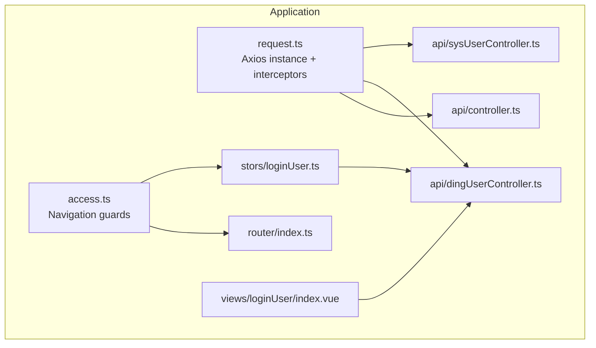
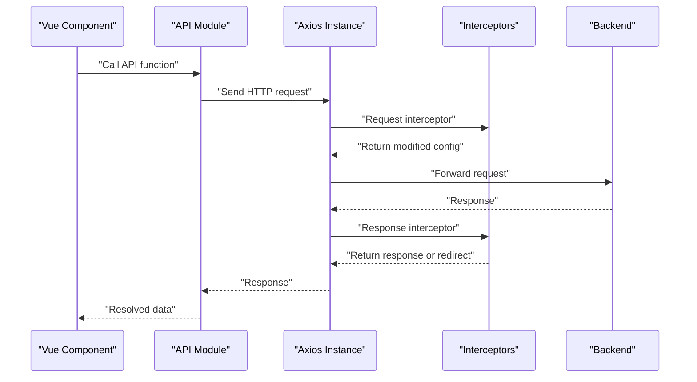
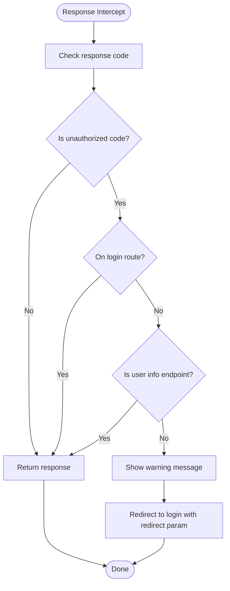
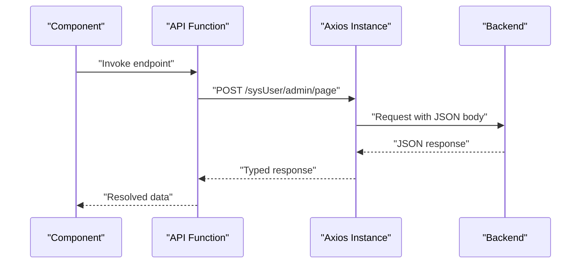
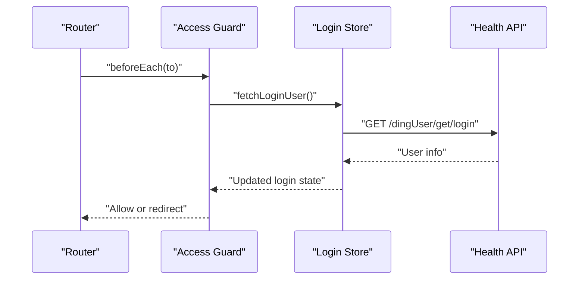
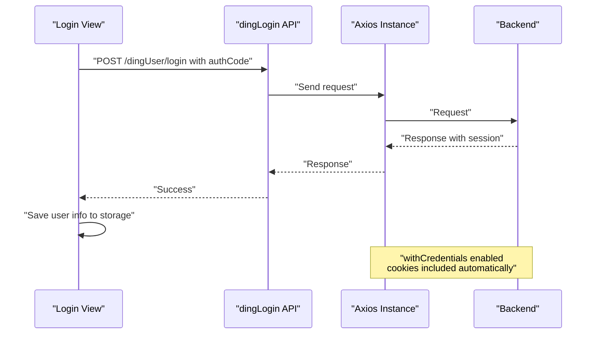
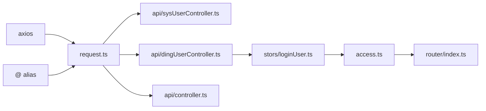

# HTTP Client Configuration

<cite>
**Referenced Files in This Document**
- [request.ts](file://src/request.ts)
- [sysUserController.ts](file://src/api/sysUserController.ts)
- [dingUserController.ts](file://src/api/dingUserController.ts)
- [controller.ts](file://src/api/controller.ts)
- [loginUser.ts](file://src/stors/loginUser.ts)
- [login-api.js](file://src/views/loginUser/js/login-api.js)
- [loginUser/index.vue](file://src/views/loginUser/index.vue)
- [access.ts](file://src/access.ts)
- [index.ts](file://src/router/index.ts)
- [main.ts](file://src/main.ts)
- [package.json](file://package.json)
- [vite.config.ts](file://vite.config.ts)
</cite>

## Table of Contents
1. [Introduction](#introduction)
2. [Project Structure](#project-structure)
3. [Core Components](#core-components)
4. [Architecture Overview](#architecture-overview)
5. [Detailed Component Analysis](#detailed-component-analysis)
6. [Dependency Analysis](#dependency-analysis)
7. [Performance Considerations](#performance-considerations)
8. [Troubleshooting Guide](#troubleshooting-guide)
9. [Conclusion](#conclusion)

## Introduction
This document explains the HTTP client configuration used by the SSO frontend application. It focuses on the Axios instance definition, base URL and timeout configuration, credentials handling, global interceptors for authentication and error handling, environment considerations, and practical usage patterns across the application. It also outlines security considerations, CORS behavior, and performance optimization techniques.

## Project Structure
The HTTP client is centralized in a single module that creates an Axios instance and registers global interceptors. API modules consume this instance to perform authenticated requests. Authentication state is managed via session cookies, and navigation guards enforce access control.

**Diagram sources**
- [request.ts:1-49](file://src/request.ts#L1-L49)
- [sysUserController.ts:1-34](file://src/api/sysUserController.ts#L1-L34)
- [dingUserController.ts:1-43](file://src/api/dingUserController.ts#L1-L43)
- [controller.ts:1-12](file://src/api/controller.ts#L1-L12)
- [loginUser.ts:1-33](file://src/stors/loginUser.ts#L1-L33)
- [access.ts:1-41](file://src/access.ts#L1-L41)
- [index.ts:1-40](file://src/router/index.ts#L1-L40)
- [loginUser/index.vue:1-71](file://src/views/loginUser/index.vue#L1-L71)

**Section sources**
- [request.ts:1-49](file://src/request.ts#L1-L49)
- [main.ts:1-19](file://src/main.ts#L1-L19)
- [vite.config.ts:1-13](file://vite.config.ts#L1-L13)

## Core Components
- Axios instance with base URL, timeout, and credentials:
  - Base URL configured for local development.
  - Timeout set to a generous value suitable for long-running operations.
  - Credentials enabled to support cookie-based session handling.
- Global request interceptor:
  - Placeholder for pre-request customization.
- Global response interceptor:
  - Detects unauthorized responses and redirects to the login page when appropriate.
  - Displays warnings and handles general request errors.

**Section sources**
- [request.ts:5-10](file://src/request.ts#L5-L10)
- [request.ts:12-22](file://src/request.ts#L12-L22)
- [request.ts:25-47](file://src/request.ts#L25-L47)

## Architecture Overview
The HTTP client acts as a central transport layer. API modules import the shared instance and issue typed requests. Authentication relies on server-managed sessions stored in cookies. Navigation guards use the login state to protect routes.

**Diagram sources**
- [request.ts:12-47](file://src/request.ts#L12-L47)
- [sysUserController.ts:10-18](file://src/api/sysUserController.ts#L10-L18)
- [dingUserController.ts:6-11](file://src/api/dingUserController.ts#L6-L11)

## Detailed Component Analysis

### Axios Instance and Interceptors
- Instance creation:
  - Base URL points to the backend service during development.
  - Timeout configured to accommodate slow operations.
  - Credentials enabled to allow cross-origin cookies.
- Request interceptor:
  - Currently a pass-through; can be extended to inject tokens or transform requests.
- Response interceptor:
  - Checks for a specific unauthorized code and conditionally redirects to the login page.
  - Skips redirect when already on the login route or when requesting the current user endpoint.
  - General error handler rejects the promise for downstream handling.

**Diagram sources**
- [request.ts:25-47](file://src/request.ts#L25-L47)

**Section sources**
- [request.ts:5-10](file://src/request.ts#L5-L10)
- [request.ts:12-22](file://src/request.ts#L12-L22)
- [request.ts:25-47](file://src/request.ts#L25-L47)

### API Modules Usage
- API modules import the shared Axios instance and wrap endpoints with typed functions.
- Requests specify method, headers, and payload as needed.
- Responses are typed according to backend-defined schemas.

**Diagram sources**
- [sysUserController.ts:6-18](file://src/api/sysUserController.ts#L6-L18)
- [request.ts:12-47](file://src/request.ts#L12-L47)

**Section sources**
- [sysUserController.ts:1-34](file://src/api/sysUserController.ts#L1-L34)
- [dingUserController.ts:1-43](file://src/api/dingUserController.ts#L1-L43)
- [controller.ts:1-12](file://src/api/controller.ts#L1-L12)

### Authentication State and Navigation Guards
- Login state is fetched via a dedicated API and stored in a Pinia store.
- Navigation guards check the login state and redirect unauthenticated users to the login page.
- The guard waits for initial user info resolution on first load to ensure accurate permission checks.

**Diagram sources**
- [access.ts:11-40](file://src/access.ts#L11-L40)
- [loginUser.ts:16-22](file://src/stors/loginUser.ts#L16-L22)
- [dingUserController.ts:5-11](file://src/api/dingUserController.ts#L5-L11)

**Section sources**
- [loginUser.ts:1-33](file://src/stors/loginUser.ts#L1-L33)
- [access.ts:1-41](file://src/access.ts#L1-L41)

### Login Flow and Session Handling
- The login view triggers a backend login endpoint with an authorization code.
- Successful login updates local storage with user data and relies on session cookies for subsequent authenticated requests.
- The Axios instance automatically includes credentials, so tokens are not manually injected.

**Diagram sources**
- [loginUser/index.vue:33-71](file://src/views/loginUser/index.vue#L33-L71)
- [dingUserController.ts:13-26](file://src/api/dingUserController.ts#L13-L26)
- [request.ts:9](file://src/request.ts#L9)

**Section sources**
- [loginUser/index.vue:1-71](file://src/views/loginUser/index.vue#L1-L71)
- [dingUserController.ts:1-43](file://src/api/dingUserController.ts#L1-L43)
- [request.ts:9](file://src/request.ts#L9)

## Dependency Analysis
- Axios is a runtime dependency used by the HTTP client module.
- API modules depend on the shared Axios instance.
- The login store depends on the user health API.
- Navigation guards depend on the login store and router.
- Vite aliases the source directory for imports.

**Diagram sources**
- [package.json:12-19](file://package.json#L12-L19)
- [request.ts:1](file://src/request.ts#L1)
- [sysUserController.ts:3](file://src/api/sysUserController.ts#L3)
- [dingUserController.ts:3](file://src/api/dingUserController.ts#L3)
- [controller.ts:3](file://src/api/controller.ts#L3)
- [loginUser.ts:3](file://src/stors/loginUser.ts#L3)
- [access.ts:1](file://src/access.ts#L1)
- [index.ts:1-40](file://src/router/index.ts#L1-L40)
- [vite.config.ts:7-11](file://vite.config.ts#L7-L11)

**Section sources**
- [package.json:1-31](file://package.json#L1-L31)
- [vite.config.ts:1-13](file://vite.config.ts#L1-L13)

## Performance Considerations
- Timeout tuning:
  - The current timeout is set to a high value suitable for long operations. Adjust per endpoint characteristics to balance responsiveness and reliability.
- Connection reuse:
  - Axios leverages the browser’s HTTP stack; enable keep-alive at the network level where possible.
- Request batching:
  - Combine related requests when feasible to reduce overhead.
- Caching:
  - Implement selective caching for read-heavy endpoints to reduce load and latency.
- Minimizing retries:
  - Prefer exponential backoff with jitter for transient failures; avoid aggressive retries that amplify load.
- Payload optimization:
  - Send only required fields and compress where supported by the backend.

[No sources needed since this section provides general guidance]

## Troubleshooting Guide
- Unauthorized responses:
  - The response interceptor detects a specific unauthorized code and redirects to the login page unless already on the login route or querying the current user endpoint. Verify the backend response code and endpoint paths used by the interceptor.
- Network errors:
  - Unhandled errors are rejected by the response interceptor. Ensure callers handle rejections appropriately and provide user feedback.
- CORS and credentials:
  - Credentials are enabled; ensure the backend sets appropriate Access-Control-Allow-Origin and Access-Control-Allow-Credentials headers. Cookies are only sent for same-origin by default; cross-origin requires proper CORS configuration.
- Environment base URL:
  - The base URL is configured for local development. For production, configure a reverse proxy or adjust the base URL accordingly.

**Section sources**
- [request.ts:25-47](file://src/request.ts#L25-L47)
- [request.ts:7](file://src/request.ts#L7)

## Conclusion
The SSO frontend’s HTTP client is a focused Axios instance with global interceptors that centralize authentication and error handling. Authentication relies on server-managed sessions via cookies, and navigation guards protect routes based on login state. The configuration supports development with a local base URL and credentials, while the response interceptor provides a robust foundation for handling unauthorized access. For production, align the base URL with deployment, ensure secure CORS policies, and refine timeouts and retry strategies to match backend capabilities and performance goals.