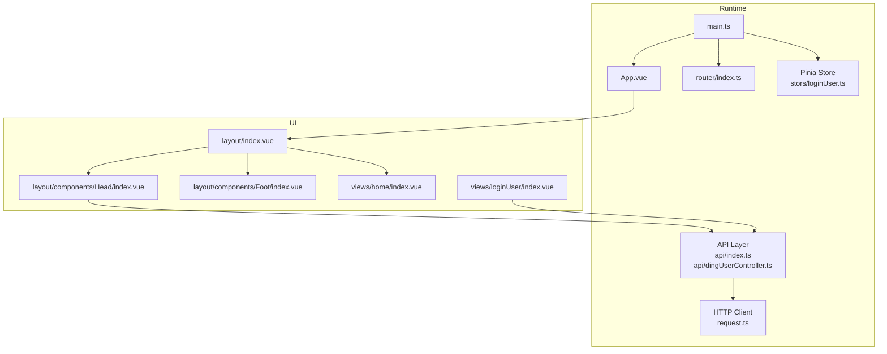
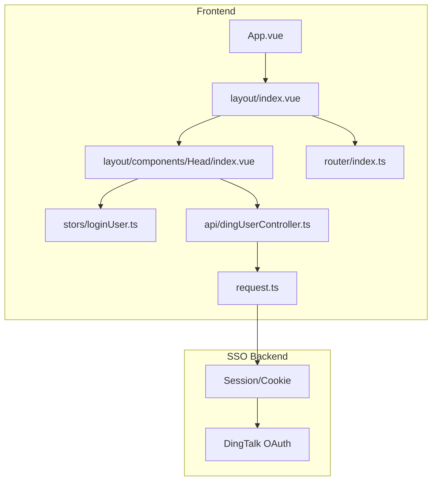
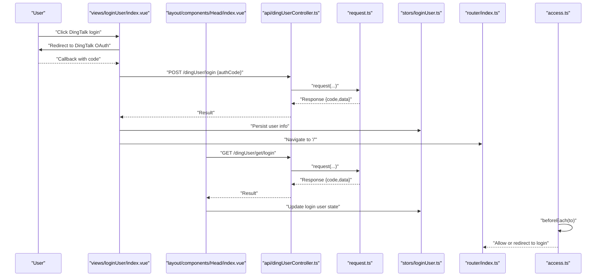
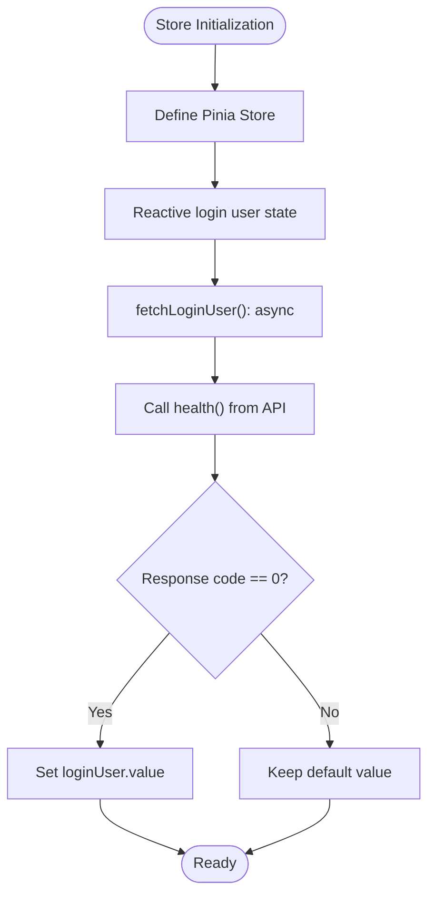
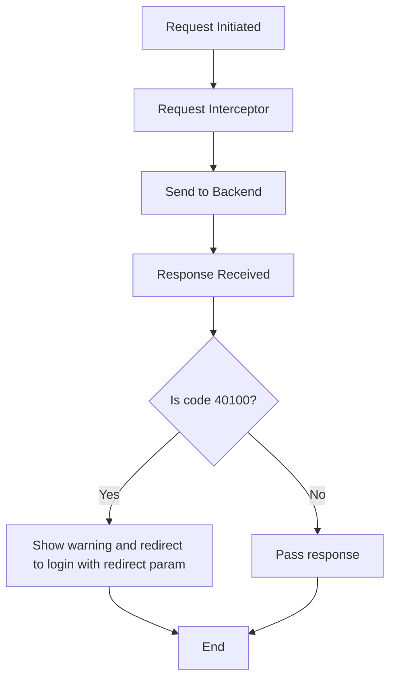
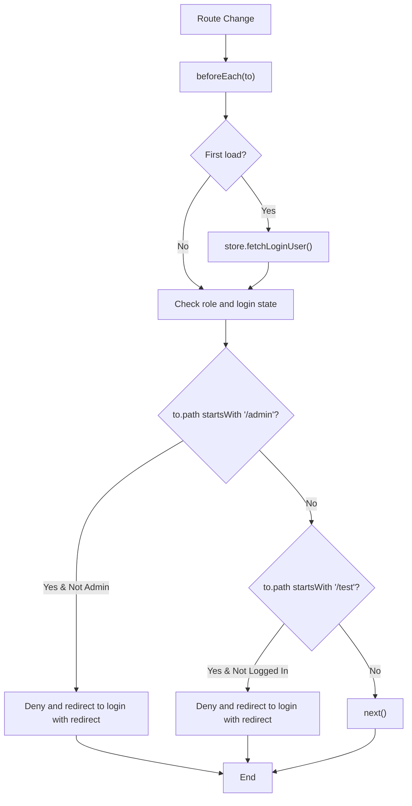
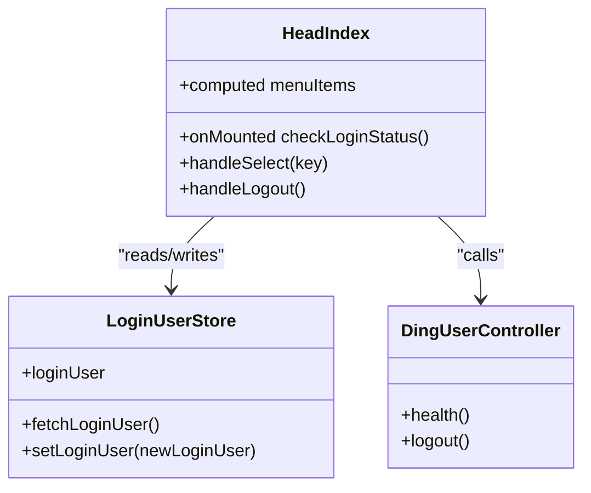
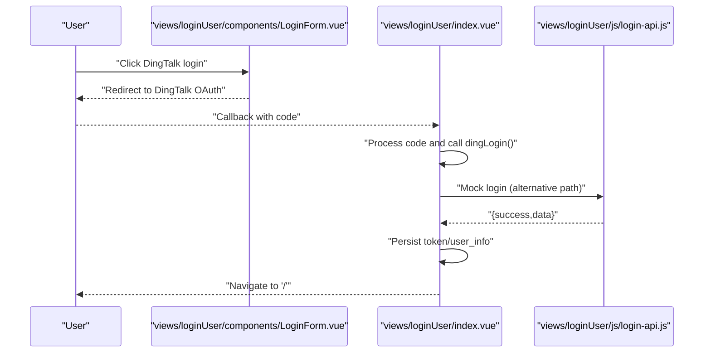
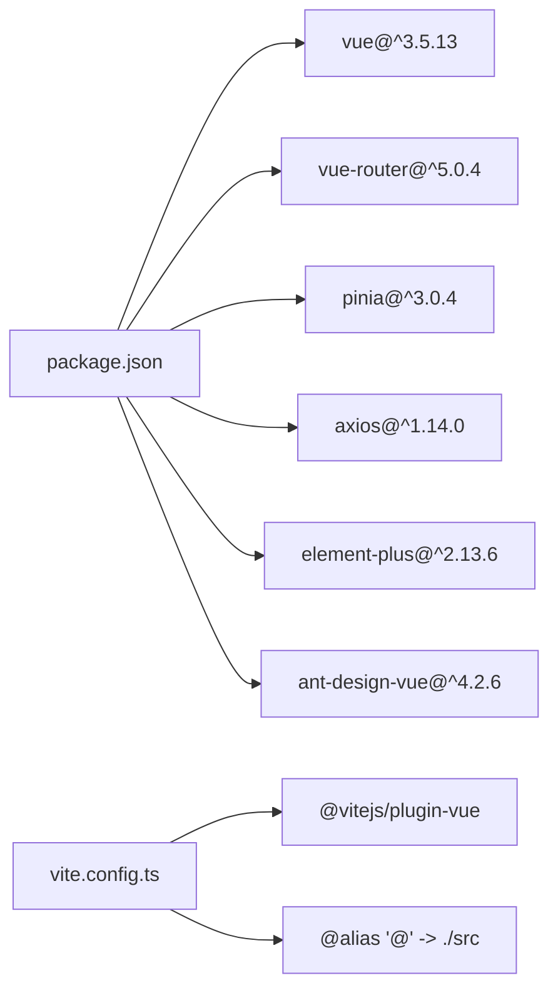
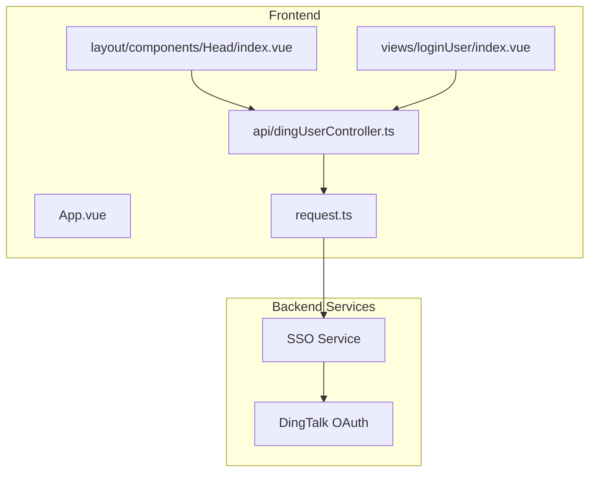

# Application Architecture

<cite>
**Referenced Files in This Document**
- [main.ts](file://src/main.ts)
- [App.vue](file://src/App.vue)
- [router/index.ts](file://src/router/index.ts)
- [stors/loginUser.ts](file://src/stors/loginUser.ts)
- [request.ts](file://src/request.ts)
- [api/index.ts](file://src/api/index.ts)
- [api/dingUserController.ts](file://src/api/dingUserController.ts)
- [access.ts](file://src/access.ts)
- [layout/index.vue](file://src/layout/index.vue)
- [layout/components/Head/index.vue](file://src/layout/components/Head/index.vue)
- [layout/components/Foot/index.vue](file://src/layout/components/Foot/index.vue)
- [views/loginUser/index.vue](file://src/views/loginUser/index.vue)
- [views/loginUser/components/LoginForm.vue](file://src/views/loginUser/components/LoginForm.vue)
- [views/loginUser/js/login-api.js](file://src/views/loginUser/js/login-api.js)
- [views/home/index.vue](file://src/views/home/index.vue)
- [config/constants.ts](file://src/config/constants.ts)
- [vite.config.ts](file://vite.config.ts)
- [package.json](file://package.json)
- [README.md](file://README.md)
</cite>

## Table of Contents
1. [Introduction](#introduction)
2. [Project Structure](#project-structure)
3. [Core Components](#core-components)
4. [Architecture Overview](#architecture-overview)
5. [Detailed Component Analysis](#detailed-component-analysis)
6. [Dependency Analysis](#dependency-analysis)
7. [Performance Considerations](#performance-considerations)
8. [Troubleshooting Guide](#troubleshooting-guide)
9. [Conclusion](#conclusion)
10. [Appendices](#appendices)

## Introduction
This document describes the SSO frontend application architecture built with Vue 3 Composition API, component-based design, and separation of concerns. It explains how authentication, routing, and state management layers interact, and documents technical choices such as Pinia for state management, Vue Router for navigation, and Axios for HTTP requests. It also covers infrastructure requirements, build tool configuration, development workflow, and cross-cutting concerns like authentication flow, route protection, and error handling patterns.

## Project Structure
The project follows a feature-based and layer-based organization:
- Entry point initializes the Vue app, registers Pinia, Vue Router, and UI framework.
- Router defines routes for home, login, user info, test, and admin pages.
- API module encapsulates backend service calls via a shared Axios instance.
- State management uses Pinia stores for global login user state.
- Layout composes header, content area, and footer; header handles navigation and authentication.
- Views implement page-specific logic and integrate with API and stores.
- Build and tooling are configured via Vite with TypeScript support.

**Diagram sources**
- [main.ts:1-19](file://src/main.ts#L1-L19)
- [App.vue:1-19](file://src/App.vue#L1-L19)
- [router/index.ts:1-40](file://src/router/index.ts#L1-L40)
- [stors/loginUser.ts:1-33](file://src/stors/loginUser.ts#L1-L33)
- [api/index.ts:1-13](file://src/api/index.ts#L1-L13)
- [api/dingUserController.ts:1-43](file://src/api/dingUserController.ts#L1-L43)
- [request.ts:1-49](file://src/request.ts#L1-L49)
- [layout/index.vue:1-29](file://src/layout/index.vue#L1-L29)
- [layout/components/Head/index.vue:1-279](file://src/layout/components/Head/index.vue#L1-L279)
- [layout/components/Foot/index.vue:1-15](file://src/layout/components/Foot/index.vue#L1-L15)
- [views/home/index.vue:1-12](file://src/views/home/index.vue#L1-L12)
- [views/loginUser/index.vue:1-71](file://src/views/loginUser/index.vue#L1-L71)

**Section sources**
- [main.ts:1-19](file://src/main.ts#L1-L19)
- [router/index.ts:1-40](file://src/router/index.ts#L1-L40)
- [api/index.ts:1-13](file://src/api/index.ts#L1-L13)
- [api/dingUserController.ts:1-43](file://src/api/dingUserController.ts#L1-L43)
- [stors/loginUser.ts:1-33](file://src/stors/loginUser.ts#L1-L33)
- [request.ts:1-49](file://src/request.ts#L1-L49)
- [layout/index.vue:1-29](file://src/layout/index.vue#L1-L29)
- [layout/components/Head/index.vue:1-279](file://src/layout/components/Head/index.vue#L1-L279)
- [layout/components/Foot/index.vue:1-15](file://src/layout/components/Foot/index.vue#L1-L15)
- [views/home/index.vue:1-12](file://src/views/home/index.vue#L1-L12)
- [views/loginUser/index.vue:1-71](file://src/views/loginUser/index.vue#L1-L71)

## Core Components
- Application bootstrap and plugin registration:
  - Initializes Vue app, installs Pinia, Vue Router, and Element Plus.
- Root component:
  - Mounts the layout and triggers initial login user fetch.
- Router:
  - Defines routes for home, login, user info, test, and admin pages.
- State management:
  - Pinia store manages login user state and exposes async fetch and setter.
- HTTP client:
  - Axios instance with base URL, credentials, and global interceptors for auth redirection and error handling.
- API layer:
  - Centralized exports for backend endpoints (e.g., DingTalk user endpoints).
- Layout and navigation:
  - Layout composes header, content, and footer; header renders menus, handles login/logout, and enforces permissions.
- Authentication flow:
  - Login view supports both mock login and DingTalk OAuth; redirects back after authorization; persists session via cookies.

**Section sources**
- [main.ts:1-19](file://src/main.ts#L1-L19)
- [App.vue:1-19](file://src/App.vue#L1-L19)
- [router/index.ts:1-40](file://src/router/index.ts#L1-L40)
- [stors/loginUser.ts:1-33](file://src/stors/loginUser.ts#L1-L33)
- [request.ts:1-49](file://src/request.ts#L1-L49)
- [api/index.ts:1-13](file://src/api/index.ts#L1-L13)
- [api/dingUserController.ts:1-43](file://src/api/dingUserController.ts#L1-L43)
- [layout/index.vue:1-29](file://src/layout/index.vue#L1-L29)
- [layout/components/Head/index.vue:1-279](file://src/layout/components/Head/index.vue#L1-L279)
- [views/loginUser/index.vue:1-71](file://src/views/loginUser/index.vue#L1-L71)

## Architecture Overview
The system is a single-page application structured around:
- Frontend SPA (Vue 3 + TypeScript)
- Backend SSO service (DingTalk OAuth and session-based auth)
- Shared HTTP client with global interceptors
- Centralized routing and permission checks
- Global state for login user

**Diagram sources**
- [App.vue:1-19](file://src/App.vue#L1-L19)
- [layout/index.vue:1-29](file://src/layout/index.vue#L1-L29)
- [layout/components/Head/index.vue:1-279](file://src/layout/components/Head/index.vue#L1-L279)
- [router/index.ts:1-40](file://src/router/index.ts#L1-L40)
- [stors/loginUser.ts:1-33](file://src/stors/loginUser.ts#L1-L33)
- [api/dingUserController.ts:1-43](file://src/api/dingUserController.ts#L1-L43)
- [request.ts:1-49](file://src/request.ts#L1-L49)

## Detailed Component Analysis

### Authentication Flow and Route Protection
The authentication flow integrates DingTalk OAuth, session-based login, and route guards:
- Login view initiates DingTalk OAuth and processes callback code.
- Header checks login status via health endpoint and updates global state.
- Access guard enforces role-based and login-required access to protected routes.
- HTTP interceptor redirects unauthenticated users to login with redirect parameter.

**Diagram sources**
- [views/loginUser/index.vue:1-71](file://src/views/loginUser/index.vue#L1-L71)
- [layout/components/Head/index.vue:1-279](file://src/layout/components/Head/index.vue#L1-L279)
- [api/dingUserController.ts:1-43](file://src/api/dingUserController.ts#L1-L43)
- [request.ts:1-49](file://src/request.ts#L1-L49)
- [stors/loginUser.ts:1-33](file://src/stors/loginUser.ts#L1-L33)
- [router/index.ts:1-40](file://src/router/index.ts#L1-L40)
- [access.ts:1-41](file://src/access.ts#L1-L41)

**Section sources**
- [views/loginUser/index.vue:1-71](file://src/views/loginUser/index.vue#L1-L71)
- [layout/components/Head/index.vue:1-279](file://src/layout/components/Head/index.vue#L1-L279)
- [api/dingUserController.ts:1-43](file://src/api/dingUserController.ts#L1-L43)
- [request.ts:1-49](file://src/request.ts#L1-L49)
- [access.ts:1-41](file://src/access.ts#L1-L41)

### State Management with Pinia
The login user store encapsulates:
- Reactive login user state
- Async fetch to retrieve current session user
- Setter to update state programmatically

**Diagram sources**
- [stors/loginUser.ts:1-33](file://src/stors/loginUser.ts#L1-L33)
- [api/dingUserController.ts:1-43](file://src/api/dingUserController.ts#L1-L43)

**Section sources**
- [stors/loginUser.ts:1-33](file://src/stors/loginUser.ts#L1-L33)

### HTTP Client and Interceptors
The HTTP client centralizes:
- Base URL and credentials
- Request interceptor (placeholder)
- Response interceptor:
  - Detects unauthenticated responses and redirects to login with current URL as redirect parameter
  - Propagates other errors

**Diagram sources**
- [request.ts:1-49](file://src/request.ts#L1-L49)

**Section sources**
- [request.ts:1-49](file://src/request.ts#L1-L49)

### Navigation and Permission Enforcement
Navigation is handled by Vue Router with:
- Route definitions for home, login, user info, test, and admin
- Global beforeEach guard enforcing:
  - Admin-only routes require admin role
  - Test routes require logged-in user
  - First-load fetch ensures login user is available before checking

**Diagram sources**
- [access.ts:1-41](file://src/access.ts#L1-L41)
- [router/index.ts:1-40](file://src/router/index.ts#L1-L40)
- [stors/loginUser.ts:1-33](file://src/stors/loginUser.ts#L1-L33)

**Section sources**
- [access.ts:1-41](file://src/access.ts#L1-L41)
- [router/index.ts:1-40](file://src/router/index.ts#L1-L40)
- [stors/loginUser.ts:1-33](file://src/stors/loginUser.ts#L1-L33)

### Layout and Header Components
The layout composes:
- Header with dynamic menu filtering based on login state and roles
- Router outlet for page content
- Footer

Header logic:
- Builds menu items and filters based on permissions
- Checks login status via health endpoint
- Handles logout by calling backend logout and redirecting to DingTalk logout

**Diagram sources**
- [layout/components/Head/index.vue:1-279](file://src/layout/components/Head/index.vue#L1-L279)
- [stors/loginUser.ts:1-33](file://src/stors/loginUser.ts#L1-L33)
- [api/dingUserController.ts:1-43](file://src/api/dingUserController.ts#L1-L43)

**Section sources**
- [layout/index.vue:1-29](file://src/layout/index.vue#L1-L29)
- [layout/components/Head/index.vue:1-279](file://src/layout/components/Head/index.vue#L1-L279)
- [layout/components/Foot/index.vue:1-15](file://src/layout/components/Foot/index.vue#L1-L15)

### Login View and Mock Login
The login view:
- Supports DingTalk OAuth via external redirect
- Provides a mock login flow that caches token and user info in localStorage
- After successful login, navigates to home

**Diagram sources**
- [views/loginUser/components/LoginForm.vue:1-42](file://src/views/loginUser/components/LoginForm.vue#L1-L42)
- [views/loginUser/index.vue:1-71](file://src/views/loginUser/index.vue#L1-L71)
- [views/loginUser/js/login-api.js:1-38](file://src/views/loginUser/js/login-api.js#L1-L38)

**Section sources**
- [views/loginUser/index.vue:1-71](file://src/views/loginUser/index.vue#L1-L71)
- [views/loginUser/components/LoginForm.vue:1-42](file://src/views/loginUser/components/LoginForm.vue#L1-L42)
- [views/loginUser/js/login-api.js:1-38](file://src/views/loginUser/js/login-api.js#L1-L38)

## Dependency Analysis
The application’s runtime dependencies and build configuration are defined in package.json and Vite config. The key runtime dependencies include Vue 3, Vue Router, Pinia, Axios, and Element Plus. The build pipeline uses Vite with TypeScript compilation and Vue SFC support.

**Diagram sources**
- [package.json:1-31](file://package.json#L1-L31)
- [vite.config.ts:1-13](file://vite.config.ts#L1-L13)

**Section sources**
- [package.json:1-31](file://package.json#L1-L31)
- [vite.config.ts:1-13](file://vite.config.ts#L1-L13)

## Performance Considerations
- Prefer lazy loading for heavy views to reduce initial bundle size.
- Debounce or cache frequent health checks to avoid redundant network calls.
- Use computed properties and reactive refs efficiently to minimize re-renders.
- Split API modules per domain to enable tree-shaking and on-demand loading.
- Configure Vite to optimize production builds and enable source maps only in development.

## Troubleshooting Guide
Common issues and resolutions:
- Unauthenticated access:
  - Symptom: Automatic redirect to login with warning.
  - Cause: Response interceptor detects unauthorized status.
  - Resolution: Ensure backend session is active; verify cookie presence.
- Login failures:
  - Symptom: Alert indicating failure or network error.
  - Cause: DingTalk OAuth code exchange failure or network issues.
  - Resolution: Verify redirect URI and client ID; retry after network stabilization.
- Permission denied:
  - Symptom: Error message and redirect to login.
  - Cause: Access guard denies access due to missing admin role or login state.
  - Resolution: Log in as admin or navigate to permitted route.
- Logout not clearing state:
  - Symptom: UI still shows logged-in state.
  - Cause: Frontend state not reset or DingTalk logout not triggered.
  - Resolution: Ensure logout handler clears state and redirects to DingTalk logout.

**Section sources**
- [request.ts:1-49](file://src/request.ts#L1-L49)
- [access.ts:1-41](file://src/access.ts#L1-L41)
- [layout/components/Head/index.vue:1-279](file://src/layout/components/Head/index.vue#L1-L279)

## Conclusion
The SSO frontend employs a clean, layered architecture leveraging Vue 3 Composition API, Pinia for state, Vue Router for navigation, and Axios for HTTP. Authentication integrates DingTalk OAuth with session-based backend state, while route guards and interceptors enforce security and improve UX. The modular structure supports maintainability and scalability, and the build toolchain enables efficient development and deployment.

## Appendices

### System Context Diagram
This diagram shows the relationship between frontend components and backend services.

**Diagram sources**
- [App.vue:1-19](file://src/App.vue#L1-L19)
- [layout/components/Head/index.vue:1-279](file://src/layout/components/Head/index.vue#L1-L279)
- [views/loginUser/index.vue:1-71](file://src/views/loginUser/index.vue#L1-L71)
- [api/dingUserController.ts:1-43](file://src/api/dingUserController.ts#L1-L43)
- [request.ts:1-49](file://src/request.ts#L1-L49)

### Development Workflow
- Install dependencies: use package manager to install runtime and dev dependencies.
- Run dev server: Vite serves the app with hot reload.
- Build for production: TypeScript compile followed by Vite build.
- Preview production build: serve built assets locally.

**Section sources**
- [README.md:1-6](file://README.md#L1-L6)
- [package.json:1-31](file://package.json#L1-L31)
- [vite.config.ts:1-13](file://vite.config.ts#L1-L13)