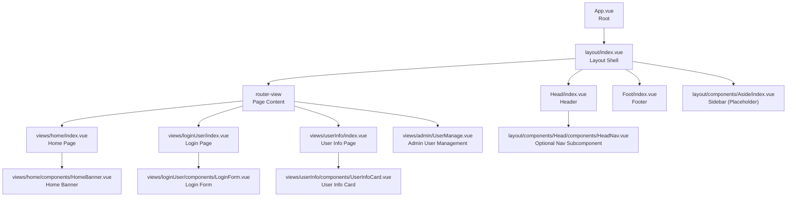
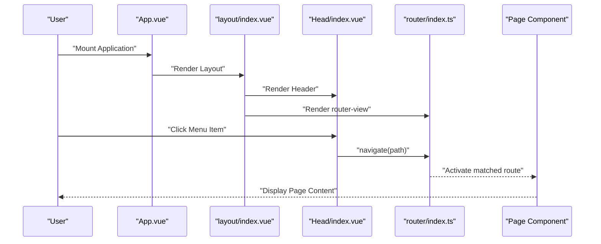
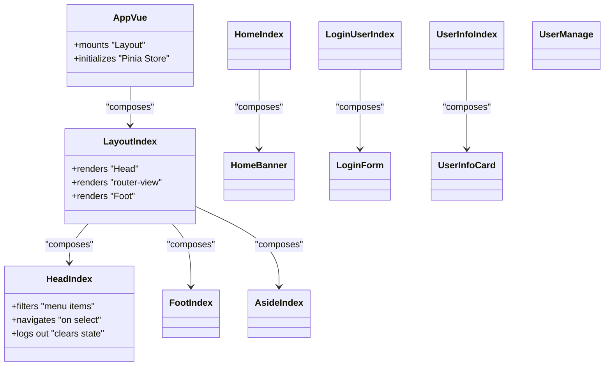

# Component Architecture

<cite>
**Referenced Files in This Document**
- [App.vue](file://src/App.vue)
- [layout/index.vue](file://src/layout/index.vue)
- [layout/components/Head/index.vue](file://src/layout/components/Head/index.vue)
- [layout/components/Head/components/HeadNav.vue](file://src/layout/components/Head/components/HeadNav.vue)
- [layout/components/Foot/index.vue](file://src/layout/components/Foot/index.vue)
- [layout/components/Aside/index.vue](file://src/layout/components/Aside/index.vue)
- [main.ts](file://src/main.ts)
- [router/index.ts](file://src/router/index.ts)
- [views/home/index.vue](file://src/views/home/index.vue)
- [views/home/components/HomeBanner.vue](file://src/views/home/components/HomeBanner.vue)
- [views/loginUser/index.vue](file://src/views/loginUser/index.vue)
- [views/loginUser/components/LoginForm.vue](file://src/views/loginUser/components/LoginForm.vue)
- [views/userInfo/index.vue](file://src/views/userInfo/index.vue)
- [views/userInfo/components/UserInfoCard.vue](file://src/views/userInfo/components/UserInfoCard.vue)
- [views/admin/UserManage.vue](file://src/views/admin/UserManage.vue)
- [stors/loginUser.ts](file://src/stors/loginUser.ts)
- [api/dingUserController.ts](file://src/api/dingUserController.ts)
- [util/stringCaseUtils.ts](file://src/util/stringCaseUtils.ts)
</cite>

## Table of Contents
1. [Introduction](#introduction)
2. [Project Structure](#project-structure)
3. [Core Components](#core-components)
4. [Architecture Overview](#architecture-overview)
5. [Detailed Component Analysis](#detailed-component-analysis)
6. [Dependency Analysis](#dependency-analysis)
7. [Performance Considerations](#performance-considerations)
8. [Troubleshooting Guide](#troubleshooting-guide)
9. [Conclusion](#conclusion)

## Introduction
This document explains the component architecture of the frontend application. It focuses on the hierarchical structure starting from the root component App.vue, the layout system (Header, Footer, Sidebar), and page-level components. It documents composition patterns, prop/event communication, lifecycle management, slots, registration, and performance optimization strategies grounded in the repository’s actual code.

## Project Structure
The application follows a clear hierarchy:
- Root: App.vue initializes the app, mounts the Layout, and bootstraps Pinia and routing.
- Layout: layout/index.vue composes Header, main content via router-view, and Footer.
- Views: Page-level components under src/views represent routed pages.
- Shared utilities: Pinia stores, API clients, and helpers support cross-component behavior.

**Diagram sources**
- [App.vue:1-19](file://src/App.vue#L1-L19)
- [layout/index.vue:1-29](file://src/layout/index.vue#L1-L29)
- [layout/components/Head/index.vue:1-279](file://src/layout/components/Head/index.vue#L1-L279)
- [layout/components/Foot/index.vue:1-15](file://src/layout/components/Foot/index.vue#L1-L15)
- [layout/components/Aside/index.vue:1-17](file://src/layout/components/Aside/index.vue#L1-L17)
- [views/home/index.vue:1-12](file://src/views/home/index.vue#L1-L12)
- [views/home/components/HomeBanner.vue:1-10](file://src/views/home/components/HomeBanner.vue#L1-L10)
- [views/loginUser/index.vue:1-71](file://src/views/loginUser/index.vue#L1-L71)
- [views/loginUser/components/LoginForm.vue:1-42](file://src/views/loginUser/components/LoginForm.vue#L1-L42)
- [views/userInfo/index.vue:1-12](file://src/views/userInfo/index.vue#L1-L12)
- [views/userInfo/components/UserInfoCard.vue:1-15](file://src/views/userInfo/components/UserInfoCard.vue#L1-L15)
- [views/admin/UserManage.vue:1-147](file://src/views/admin/UserManage.vue#L1-L147)

**Section sources**
- [App.vue:1-19](file://src/App.vue#L1-L19)
- [layout/index.vue:1-29](file://src/layout/index.vue#L1-L29)
- [router/index.ts:1-40](file://src/router/index.ts#L1-L40)

## Core Components
- App.vue
  - Mounts the Layout component and initializes the login user store on startup.
  - Imports global styles.
  - Section sources
    - [App.vue:1-19](file://src/App.vue#L1-L19)
- layout/index.vue
  - Provides a flex-column layout container, renders Header, router-view, and Footer.
  - Uses scoped styles to ensure layout integrity.
  - Section sources
    - [layout/index.vue:1-29](file://src/layout/index.vue#L1-L29)
- layout/components/Head/index.vue
  - Renders a horizontal navigation menu with dynamic items, login/logout, and profile dropdown.
  - Implements permission filtering and login state checks.
  - Handles navigation selection and logout flow.
  - Section sources
    - [layout/components/Head/index.vue:1-279](file://src/layout/components/Head/index.vue#L1-L279)
- layout/components/Foot/index.vue
  - Minimal footer component.
  - Section sources
    - [layout/components/Foot/index.vue:1-15](file://src/layout/components/Foot/index.vue#L1-L15)
- layout/components/Aside/index.vue
  - Placeholder sidebar component.
  - Section sources
    - [layout/components/Aside/index.vue:1-17](file://src/layout/components/Aside/index.vue#L1-L17)
- views/home/index.vue and HomeBanner.vue
  - Demonstrates page composition with a banner component.
  - Section sources
    - [views/home/index.vue:1-12](file://src/views/home/index.vue#L1-L12)
    - [views/home/components/HomeBanner.vue:1-10](file://src/views/home/components/HomeBanner.vue#L1-L10)
- views/loginUser/index.vue and LoginForm.vue
  - Orchestrates login flow, handles DingTalk OAuth callback, and emits/fires events to trigger login actions.
  - Section sources
    - [views/loginUser/index.vue:1-71](file://src/views/loginUser/index.vue#L1-L71)
    - [views/loginUser/components/LoginForm.vue:1-42](file://src/views/loginUser/components/LoginForm.vue#L1-L42)
- views/userInfo/index.vue and UserInfoCard.vue
  - Compose a user info page with a card component.
  - Section sources
    - [views/userInfo/index.vue:1-12](file://src/views/userInfo/index.vue#L1-L12)
    - [views/userInfo/components/UserInfoCard.vue:1-15](file://src/views/userInfo/components/UserInfoCard.vue#L1-L15)
- views/admin/UserManage.vue
  - Page-level component using Element Plus table and pagination, with CRUD-like interactions.
  - Section sources
    - [views/admin/UserManage.vue:1-147](file://src/views/admin/UserManage.vue#L1-L147)

## Architecture Overview
The runtime flow begins at App.vue, which mounts the Layout shell. The Layout composes the Header and Footer and exposes a router-view for page content. Navigation updates the route, rendering the appropriate page component. Global state is managed via Pinia, and API interactions are centralized under src/api.

**Diagram sources**
- [App.vue:1-19](file://src/App.vue#L1-L19)
- [layout/index.vue:1-29](file://src/layout/index.vue#L1-L29)
- [layout/components/Head/index.vue:1-279](file://src/layout/components/Head/index.vue#L1-L279)
- [router/index.ts:1-40](file://src/router/index.ts#L1-L40)

## Detailed Component Analysis

### Layout System and Composition Patterns
- Composition model
  - App.vue composes Layout.
  - Layout composes Head, router-view, and Foot.
  - Pages (e.g., Home, Login, Admin) render within router-view.
- Prop and event patterns
  - No explicit props are passed down from Layout to Head/Foot; state is accessed via Pinia and composables.
  - Events are used for navigation (Head emits selection) and form submission (LoginForm triggers navigation).
- Slots
  - router-view acts as a slot for page content; no custom named slots are used in the current structure.
- Responsive design and reusability
  - Layout uses flexbox to achieve a columnar structure and a flexible main content area.
  - Scoped styles isolate layout concerns; deep selectors are used in Head for Element Plus overrides.
- Section sources
  - [layout/index.vue:1-29](file://src/layout/index.vue#L1-L29)
  - [layout/components/Head/index.vue:1-279](file://src/layout/components/Head/index.vue#L1-L279)
  - [layout/components/Foot/index.vue:1-15](file://src/layout/components/Foot/index.vue#L1-L15)

### Navigation and Permission Control (Head Component)
- Dynamic menu generation and filtering
  - Menu items are filtered based on login state, role, and route requirements.
- Event-driven navigation
  - Selecting a menu item navigates to the associated route.
- Logout flow
  - Clears local state, invokes backend logout, and redirects to DingTalk logout endpoint.
- Section sources
  - [layout/components/Head/index.vue:1-279](file://src/layout/components/Head/index.vue#L1-L279)
  - [api/dingUserController.ts:1-43](file://src/api/dingUserController.ts#L1-L43)
  - [stors/loginUser.ts:1-33](file://src/stors/loginUser.ts#L1-L33)
  - [util/stringCaseUtils.ts:1-110](file://src/util/stringCaseUtils.ts#L1-L110)

### Page-Level Components and Lifecycle Management
- Home page
  - Renders HomeBanner; demonstrates local component composition.
  - Section sources
    - [views/home/index.vue:1-12](file://src/views/home/index.vue#L1-L12)
    - [views/home/components/HomeBanner.vue:1-10](file://src/views/home/components/HomeBanner.vue#L1-L10)
- Login page
  - Handles DingTalk OAuth callback via route query, performs login, and redirects.
  - Uses lifecycle hooks to process the callback on mount.
  - Section sources
    - [views/loginUser/index.vue:1-71](file://src/views/loginUser/index.vue#L1-L71)
    - [views/loginUser/components/LoginForm.vue:1-42](file://src/views/loginUser/components/LoginForm.vue#L1-L42)
- Admin user management
  - Implements pagination and table interactions with Element Plus.
  - Uses lifecycle hooks to load data on mount and on pagination changes.
  - Section sources
    - [views/admin/UserManage.vue:1-147](file://src/views/admin/UserManage.vue#L1-L147)

### Component Communication Patterns
- Parent-to-child
  - Layout passes no props to child components; state is derived from Pinia and composables.
- Child-to-parent
  - LoginForm does not emit events in the current implementation; navigation is handled internally.
  - Head emits selection events to navigate; these are handled by the router.
- Global state
  - userLoginUserStore centralizes login state and fetch logic, consumed by Head and App.
- Section sources
  - [stors/loginUser.ts:1-33](file://src/stors/loginUser.ts#L1-L33)
  - [layout/components/Head/index.vue:1-279](file://src/layout/components/Head/index.vue#L1-L279)
  - [views/loginUser/index.vue:1-71](file://src/views/loginUser/index.vue#L1-L71)

### Component Registration and Global Usage
- Global registration
  - Pinia and Vue Router are installed globally in main.ts.
  - Element Plus is globally installed for UI components.
- Local registration
  - Components are locally imported within templates (e.g., App.vue imports Layout, Head imports Foot).
- Section sources
  - [main.ts:1-19](file://src/main.ts#L1-L19)
  - [App.vue:1-19](file://src/App.vue#L1-L19)
  - [layout/index.vue:1-29](file://src/layout/index.vue#L1-L29)

### Class and Relationship Diagrams

**Diagram sources**
- [App.vue:1-19](file://src/App.vue#L1-L19)
- [layout/index.vue:1-29](file://src/layout/index.vue#L1-L29)
- [layout/components/Head/index.vue:1-279](file://src/layout/components/Head/index.vue#L1-L279)
- [layout/components/Foot/index.vue:1-15](file://src/layout/components/Foot/index.vue#L1-L15)
- [layout/components/Aside/index.vue:1-17](file://src/layout/components/Aside/index.vue#L1-L17)
- [views/home/index.vue:1-12](file://src/views/home/index.vue#L1-L12)
- [views/home/components/HomeBanner.vue:1-10](file://src/views/home/components/HomeBanner.vue#L1-L10)
- [views/loginUser/index.vue:1-71](file://src/views/loginUser/index.vue#L1-L71)
- [views/loginUser/components/LoginForm.vue:1-42](file://src/views/loginUser/components/LoginForm.vue#L1-L42)
- [views/userInfo/index.vue:1-12](file://src/views/userInfo/index.vue#L1-L12)
- [views/userInfo/components/UserInfoCard.vue:1-15](file://src/views/userInfo/components/UserInfoCard.vue#L1-L15)
- [views/admin/UserManage.vue:1-147](file://src/views/admin/UserManage.vue#L1-L147)

## Dependency Analysis
- Runtime dependencies
  - App depends on Layout.
  - Layout depends on Head, router-view, and Foot.
  - Pages depend on their sub-components.
- State and API
  - userLoginUserStore is consumed by App and Head.
  - API module provides health, login, and logout functions used by Head and Login page.
- Routing
  - router/index.ts defines routes; pages are rendered inside router-view.
- Section sources
  - [App.vue:1-19](file://src/App.vue#L1-L19)
  - [layout/index.vue:1-29](file://src/layout/index.vue#L1-L29)
  - [stors/loginUser.ts:1-33](file://src/stors/loginUser.ts#L1-L33)
  - [api/dingUserController.ts:1-43](file://src/api/dingUserController.ts#L1-L43)
  - [router/index.ts:1-40](file://src/router/index.ts#L1-L40)

## Performance Considerations
- Component granularity
  - Keep presentational components small and focused (e.g., HomeBanner, UserInfoCard) to improve maintainability and reuse.
- Reactive state
  - Centralize state in Pinia (userLoginUserStore) to avoid prop drilling and reduce unnecessary re-renders.
- Conditional rendering
  - Use v-if judiciously (e.g., login state toggles) to avoid rendering heavy components when not needed.
- Router-based rendering
  - router-view ensures only the active page is mounted, minimizing DOM overhead.
- Styling
  - Prefer scoped styles and targeted deep selectors to avoid global cascade and improve encapsulation.
- Recommendations
  - Lazy-load heavy pages if needed.
  - Debounce or throttle frequent UI interactions.
  - Use computed properties for derived data in Head and pages.

## Troubleshooting Guide
- Login state not updating after logout
  - Verify that logout clears local state and redirects to DingTalk logout URL.
  - Confirm health endpoint returns expected shape and sets Pinia state accordingly.
  - Section sources
    - [layout/components/Head/index.vue:166-199](file://src/layout/components/Head/index.vue#L166-L199)
    - [stors/loginUser.ts:17-30](file://src/stors/loginUser.ts#L17-L30)
    - [api/dingUserController.ts:28-34](file://src/api/dingUserController.ts#L28-L34)
- Navigation menu missing items
  - Check permission filtering logic and ensure login state and role are correctly populated.
  - Section sources
    - [layout/components/Head/index.vue:74-110](file://src/layout/components/Head/index.vue#L74-L110)
    - [util/stringCaseUtils.ts:30-110](file://src/util/stringCaseUtils.ts#L30-L110)
- DingTalk OAuth callback not processed
  - Ensure route query code is present and handled in the login page lifecycle hook.
  - Section sources
    - [views/loginUser/index.vue:34-70](file://src/views/loginUser/index.vue#L34-L70)
- Pagination or table not refreshing after role change
  - Confirm that error handlers refresh data and loading states are toggled appropriately.
  - Section sources
    - [views/admin/UserManage.vue:91-128](file://src/views/admin/UserManage.vue#L91-L128)

## Conclusion
The component architecture follows a clean, hierarchical pattern: App.vue as root, Layout as shell, and page-level components under router-view. Composition relies on local imports and Pinia for state, with minimal prop passing and event-driven navigation. The design supports reusability, modularity, and scalability while keeping the layout responsive and maintainable.