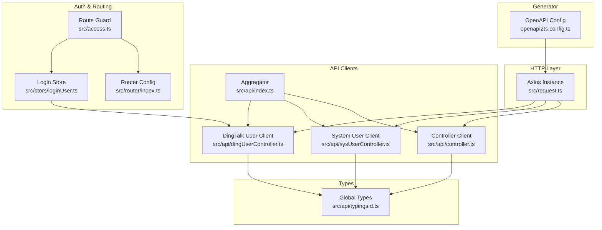
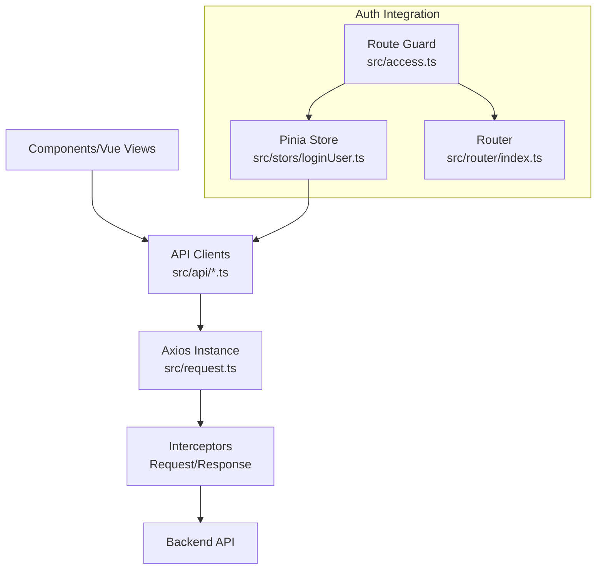
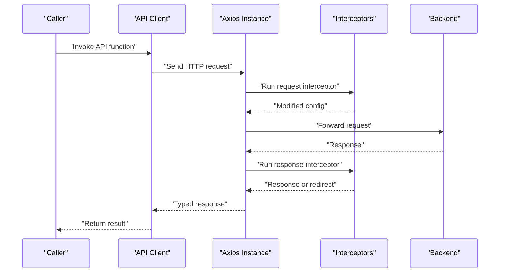
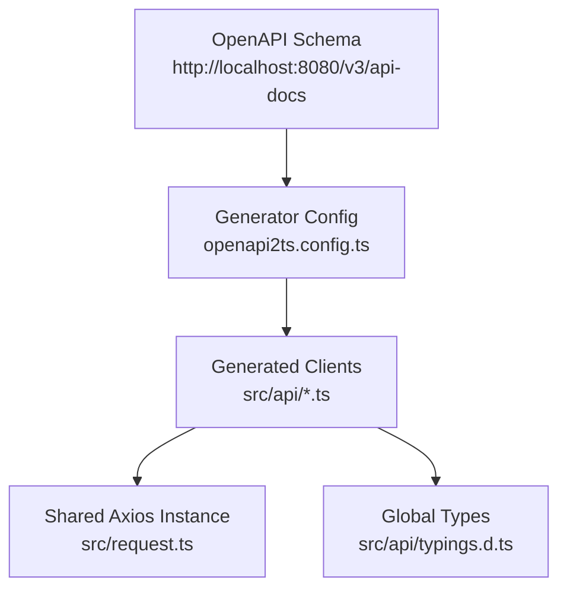
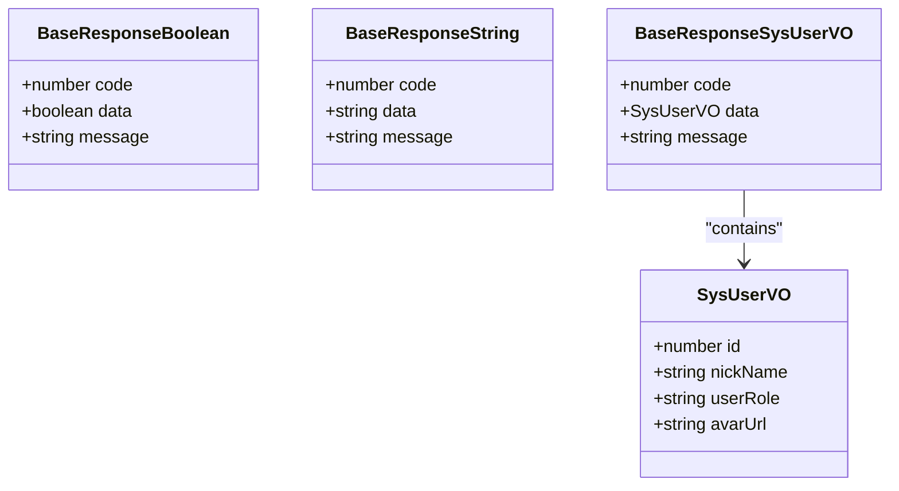
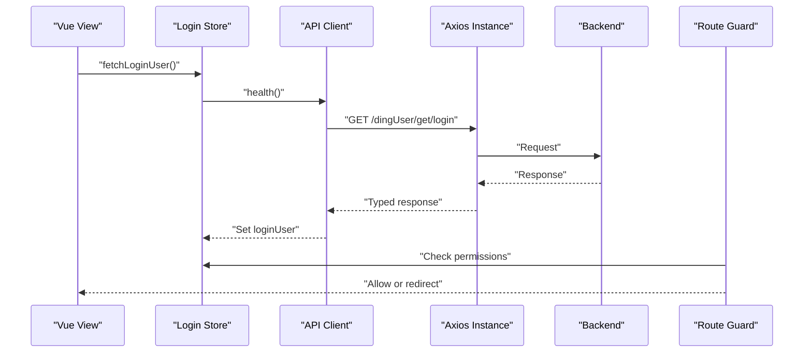
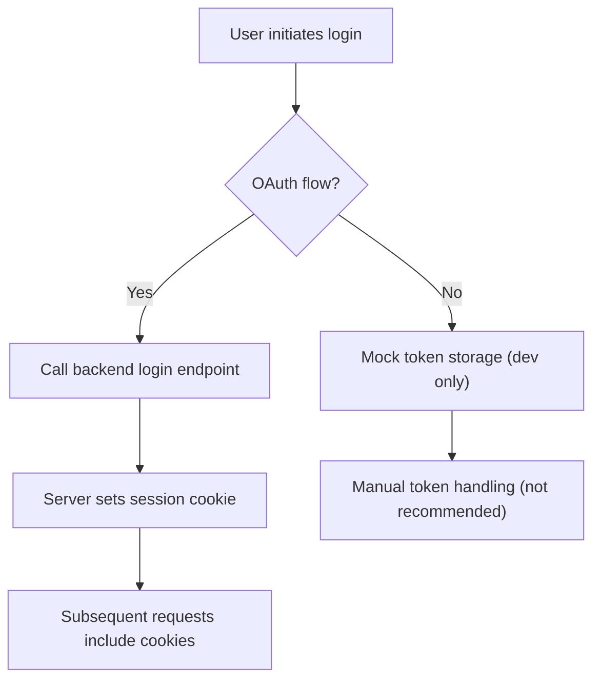
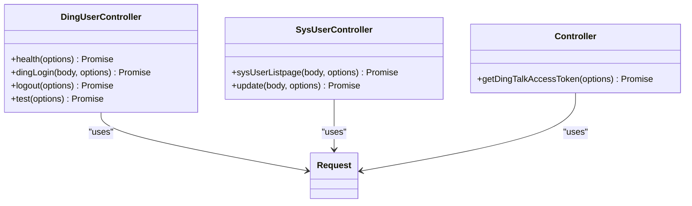
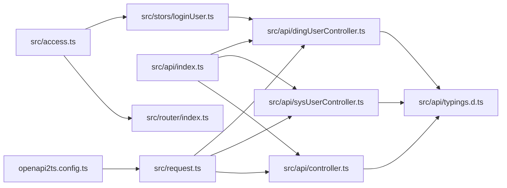

# HTTP Client and API Integration

<cite>
**Referenced Files in This Document**
- [request.ts](file://src/request.ts)
- [index.ts](file://src/api/index.ts)
- [typings.d.ts](file://src/api/typings.d.ts)
- [sysUserController.ts](file://src/api/sysUserController.ts)
- [dingUserController.ts](file://src/api/dingUserController.ts)
- [controller.ts](file://src/api/controller.ts)
- [loginUser.ts](file://src/stors/loginUser.ts)
- [access.ts](file://src/access.ts)
- [index.ts](file://src/router/index.ts)
- [login-api.js](file://src/views/login-user/js/login-api.js)
- [login-api.js](file://src/views/loginUser/js/login-api.js)
- [login-api.ts](file://src/views/login-user/js/login-api.ts)
- [index.vue](file://src/layout/components/Head/index.vue)
- [index.vue](file://src/views/login-user/index.vue)
- [openapi2ts.config.ts](file://openapi2ts.config.ts)
</cite>

## Table of Contents
1. [Introduction](#introduction)
2. [Project Structure](#project-structure)
3. [Core Components](#core-components)
4. [Architecture Overview](#architecture-overview)
5. [Detailed Component Analysis](#detailed-component-analysis)
6. [Dependency Analysis](#dependency-analysis)
7. [Performance Considerations](#performance-considerations)
8. [Troubleshooting Guide](#troubleshooting-guide)
9. [Conclusion](#conclusion)
10. [Appendices](#appendices)

## Introduction
This document explains the HTTP client architecture and API integration patterns used in the frontend. It covers Axios configuration, global request/response interceptors, error handling strategies, API client generation via OpenAPI, TypeScript typing definitions, standardized response handling, authenticated requests, token/session management, and integration with authentication state. It also outlines performance optimizations such as request cancellation, caching strategies, and retry logic for failed requests.

## Project Structure
The HTTP client and API integration are centered around a single Axios instance exported from a dedicated module. API clients are generated per endpoint and grouped under a single export aggregator. Type definitions for API responses are declared globally. Authentication state is managed via a Pinia store and enforced by a router guard. The OpenAPI-to-TypeScript generator configures the request library import path and schema location.

**Diagram sources**
- [request.ts:1-49](file://src/request.ts#L1-L49)
- [index.ts:1-13](file://src/api/index.ts#L1-L13)
- [dingUserController.ts:1-43](file://src/api/dingUserController.ts#L1-L43)
- [sysUserController.ts:1-34](file://src/api/sysUserController.ts#L1-L34)
- [controller.ts:1-12](file://src/api/controller.ts#L1-L12)
- [typings.d.ts:1-58](file://src/api/typings.d.ts#L1-L58)
- [loginUser.ts:1-33](file://src/stors/loginUser.ts#L1-L33)
- [access.ts:1-41](file://src/access.ts#L1-L41)
- [index.ts:1-43](file://src/router/index.ts#L1-L43)
- [openapi2ts.config.ts:1-7](file://openapi2ts.config.ts#L1-L7)

**Section sources**
- [request.ts:1-49](file://src/request.ts#L1-L49)
- [index.ts:1-13](file://src/api/index.ts#L1-L13)
- [typings.d.ts:1-58](file://src/api/typings.d.ts#L1-L58)
- [loginUser.ts:1-33](file://src/stors/loginUser.ts#L1-L33)
- [access.ts:1-41](file://src/access.ts#L1-L41)
- [index.ts:1-43](file://src/router/index.ts#L1-L43)
- [openapi2ts.config.ts:1-7](file://openapi2ts.config.ts#L1-L7)

## Core Components
- Axios instance with base configuration and credentials policy
- Global request/response interceptors for pre-processing and centralized error handling
- API client modules per endpoint with typed return values
- Aggregated API exports for convenient imports
- Global TypeScript response and model definitions
- Authentication state store and route guard for permission enforcement
- OpenAPI-to-TypeScript generator configuration

Key implementation references:
- Axios instance creation and interceptor registration
- API client functions returning typed responses
- Global type definitions for response envelopes and models
- Authentication store and route guard logic
- Generator configuration pointing to the Axios instance

**Section sources**
- [request.ts:1-49](file://src/request.ts#L1-L49)
- [dingUserController.ts:1-43](file://src/api/dingUserController.ts#L1-L43)
- [sysUserController.ts:1-34](file://src/api/sysUserController.ts#L1-L34)
- [controller.ts:1-12](file://src/api/controller.ts#L1-L12)
- [index.ts:1-13](file://src/api/index.ts#L1-L13)
- [typings.d.ts:1-58](file://src/api/typings.d.ts#L1-L58)
- [loginUser.ts:1-33](file://src/stors/loginUser.ts#L1-L33)
- [access.ts:1-41](file://src/access.ts#L1-L41)
- [openapi2ts.config.ts:1-7](file://openapi2ts.config.ts#L1-L7)

## Architecture Overview
The HTTP client architecture follows a layered pattern:
- HTTP Layer: Centralized Axios instance with shared configuration and interceptors
- API Layer: Endpoint-specific clients that encapsulate request shape and return types
- Type Layer: Global TypeScript definitions for response envelopes and domain models
- Auth Layer: Authentication state management and route-level protection
- Generator Layer: Automated generation of clients and types from OpenAPI schema

**Diagram sources**
- [request.ts:1-49](file://src/request.ts#L1-L49)
- [dingUserController.ts:1-43](file://src/api/dingUserController.ts#L1-L43)
- [sysUserController.ts:1-34](file://src/api/sysUserController.ts#L1-L34)
- [controller.ts:1-12](file://src/api/controller.ts#L1-L12)
- [loginUser.ts:1-33](file://src/stors/loginUser.ts#L1-L33)
- [access.ts:1-41](file://src/access.ts#L1-L41)
- [index.ts:1-43](file://src/router/index.ts#L1-L43)

## Detailed Component Analysis

### Axios Instance and Interceptors
- Instance configuration sets base URL, timeout, and credential inclusion for cross-origin cookie handling.
- Request interceptor: placeholder for future enhancements such as token injection or request normalization.
- Response interceptor: centralizes error handling, including unauthorized access detection and redirect logic to the login page when appropriate.

**Diagram sources**
- [request.ts:1-49](file://src/request.ts#L1-L49)
- [dingUserController.ts:1-43](file://src/api/dingUserController.ts#L1-L43)
- [sysUserController.ts:1-34](file://src/api/sysUserController.ts#L1-L34)
- [controller.ts:1-12](file://src/api/controller.ts#L1-L12)

**Section sources**
- [request.ts:5-10](file://src/request.ts#L5-L10)
- [request.ts:12-22](file://src/request.ts#L12-L22)
- [request.ts:25-47](file://src/request.ts#L25-L47)

### API Client Generation and Typings
- OpenAPI-to-TypeScript generator configuration defines the request library import path and schema location.
- Generated clients use the shared Axios instance and return strongly-typed responses based on global type definitions.
- Global type definitions include response envelope shapes and domain models for consistent handling across endpoints.

**Diagram sources**
- [openapi2ts.config.ts:1-7](file://openapi2ts.config.ts#L1-L7)
- [request.ts:1-49](file://src/request.ts#L1-L49)
- [typings.d.ts:1-58](file://src/api/typings.d.ts#L1-L58)

**Section sources**
- [openapi2ts.config.ts:1-7](file://openapi2ts.config.ts#L1-L7)
- [typings.d.ts:1-58](file://src/api/typings.d.ts#L1-L58)

### Standardized Response Handling
- Response envelope types define consistent fields for code, data, and message across all endpoints.
- API clients return typed responses, enabling callers to safely access data and handle errors uniformly.
- Unauthorized responses are handled centrally in the response interceptor, triggering navigation to the login page when applicable.

**Diagram sources**
- [typings.d.ts:1-58](file://src/api/typings.d.ts#L1-L58)

**Section sources**
- [typings.d.ts:1-58](file://src/api/typings.d.ts#L1-L58)
- [request.ts:25-47](file://src/request.ts#L25-L47)

### Authentication State and Route Guards
- Authentication state is maintained in a Pinia store, populated by a health endpoint that checks login status.
- Route guards enforce permissions and redirect unauthenticated users to the login page.
- Login and logout flows leverage API clients and rely on session cookies for token persistence.

**Diagram sources**
- [loginUser.ts:1-33](file://src/stors/loginUser.ts#L1-L33)
- [dingUserController.ts:1-43](file://src/api/dingUserController.ts#L1-L43)
- [access.ts:1-41](file://src/access.ts#L1-L41)

**Section sources**
- [loginUser.ts:1-33](file://src/stors/loginUser.ts#L1-L33)
- [access.ts:1-41](file://src/access.ts#L1-L41)
- [index.ts:1-43](file://src/router/index.ts#L1-L43)

### Token Management and Session Handling
- Current implementation relies on server-managed sessions stored in cookies; the Axios instance includes credentials automatically.
- Login views demonstrate two patterns: a real OAuth flow using a backend endpoint and mock token storage for local development.
- For production, remove manual token storage and rely on cookie-based session management.

**Diagram sources**
- [index.vue:44-71](file://src/views/login-user/index.vue#L44-L71)
- [login-api.js:1-38](file://src/views/login-user/js/login-api.js#L1-L38)
- [login-api.js:1-38](file://src/views/loginUser/js/login-api.js#L1-L38)
- [login-api.ts:1-38](file://src/views/login-user/js/login-api.ts#L1-L38)
- [request.ts:5-10](file://src/request.ts#L5-L10)

**Section sources**
- [index.vue:44-71](file://src/views/login-user/index.vue#L44-L71)
- [login-api.js:1-38](file://src/views/login-user/js/login-api.js#L1-L38)
- [login-api.js:1-38](file://src/views/loginUser/js/login-api.js#L1-L38)
- [login-api.ts:1-38](file://src/views/login-user/js/login-api.ts#L1-L38)
- [request.ts:5-10](file://src/request.ts#L5-L10)

### API Client Functions and Usage Patterns
- Each endpoint is exposed as a typed function returning a promise of a response envelope.
- Clients specify method, headers, and payload as needed; additional options can be merged via spread operator.
- Aggregator module re-exports all clients for convenient imports across the application.

**Diagram sources**
- [dingUserController.ts:1-43](file://src/api/dingUserController.ts#L1-L43)
- [sysUserController.ts:1-34](file://src/api/sysUserController.ts#L1-L34)
- [controller.ts:1-12](file://src/api/controller.ts#L1-L12)
- [index.ts:1-13](file://src/api/index.ts#L1-L13)

**Section sources**
- [dingUserController.ts:1-43](file://src/api/dingUserController.ts#L1-L43)
- [sysUserController.ts:1-34](file://src/api/sysUserController.ts#L1-L34)
- [controller.ts:1-12](file://src/api/controller.ts#L1-L12)
- [index.ts:1-13](file://src/api/index.ts#L1-L13)

## Dependency Analysis
The following diagram shows how modules depend on each other within the HTTP client and API integration layer.

**Diagram sources**
- [request.ts:1-49](file://src/request.ts#L1-L49)
- [dingUserController.ts:1-43](file://src/api/dingUserController.ts#L1-L43)
- [sysUserController.ts:1-34](file://src/api/sysUserController.ts#L1-L34)
- [controller.ts:1-12](file://src/api/controller.ts#L1-L12)
- [index.ts:1-13](file://src/api/index.ts#L1-L13)
- [typings.d.ts:1-58](file://src/api/typings.d.ts#L1-L58)
- [loginUser.ts:1-33](file://src/stors/loginUser.ts#L1-L33)
- [access.ts:1-41](file://src/access.ts#L1-L41)
- [index.ts:1-43](file://src/router/index.ts#L1-L43)
- [openapi2ts.config.ts:1-7](file://openapi2ts.config.ts#L1-L7)

**Section sources**
- [request.ts:1-49](file://src/request.ts#L1-L49)
- [index.ts:1-13](file://src/api/index.ts#L1-L13)
- [typings.d.ts:1-58](file://src/api/typings.d.ts#L1-L58)
- [loginUser.ts:1-33](file://src/stors/loginUser.ts#L1-L33)
- [access.ts:1-41](file://src/access.ts#L1-L41)
- [index.ts:1-43](file://src/router/index.ts#L1-L43)
- [openapi2ts.config.ts:1-7](file://openapi2ts.config.ts#L1-L7)

## Performance Considerations
- Request cancellation: Use AbortController to cancel in-flight requests when components unmount or navigate away. This prevents unnecessary work and memory leaks.
- Caching strategies: Implement a lightweight cache keyed by URL and query parameters for idempotent GET requests. Invalidate cache entries on mutations or explicit refresh triggers.
- Retry logic: Add exponential backoff for transient network errors or 5xx responses. Respect idempotency to avoid duplicate effects.
- Timeout tuning: Adjust Axios timeout based on endpoint SLAs; keep global timeout reasonable to fail fast on network issues.
- Concurrency limits: Throttle concurrent requests to prevent overwhelming the backend and to manage browser connection limits.
- Interceptor overhead: Keep interceptors minimal and non-blocking to avoid slowing down all requests.

[No sources needed since this section provides general guidance]

## Troubleshooting Guide
Common issues and recovery strategies:
- Unauthorized responses: The response interceptor detects unauthorized access and redirects to the login page when appropriate. Verify backend response codes and URLs used for redirection.
- Network errors: Inspect Axios error objects for status codes and messages; surface user-friendly notifications and offer retry actions.
- Type mismatches: Ensure response envelopes match global type definitions; regenerate clients/types from the OpenAPI schema if the backend changes.
- Authentication state desync: Confirm that the login store is populated by the health endpoint and that route guards check the store before navigation.
- Session vs token confusion: Prefer cookie-based sessions managed by the backend; avoid mixing manual token storage with session cookies.

**Section sources**
- [request.ts:25-47](file://src/request.ts#L25-L47)
- [access.ts:1-41](file://src/access.ts#L1-L41)
- [typings.d.ts:1-58](file://src/api/typings.d.ts#L1-L58)

## Conclusion
The HTTP client architecture leverages a centralized Axios instance with global interceptors, endpoint-specific API clients, and strong TypeScript typing. Authentication integrates seamlessly with route guards and a Pinia store, while OpenAPI-driven generation ensures maintainable client and type definitions. By adopting request cancellation, caching, and retry strategies, the system can achieve robustness and performance. Prefer cookie-based sessions for simplicity and security, and avoid manual token management unless absolutely necessary.

[No sources needed since this section summarizes without analyzing specific files]

## Appendices
- Example references for authenticated requests and token/session handling:
  - Health check and login state retrieval
  - OAuth login flow and redirect behavior
  - Mock token storage for development scenarios
  - Logout and session clearing

**Section sources**
- [index.vue:124-173](file://src/layout/components/Head/index.vue#L124-L173)
- [index.vue:44-71](file://src/views/login-user/index.vue#L44-L71)
- [login-api.js:1-38](file://src/views/login-user/js/login-api.js#L1-L38)
- [login-api.js:1-38](file://src/views/loginUser/js/login-api.js#L1-L38)
- [login-api.ts:1-38](file://src/views/login-user/js/login-api.ts#L1-L38)