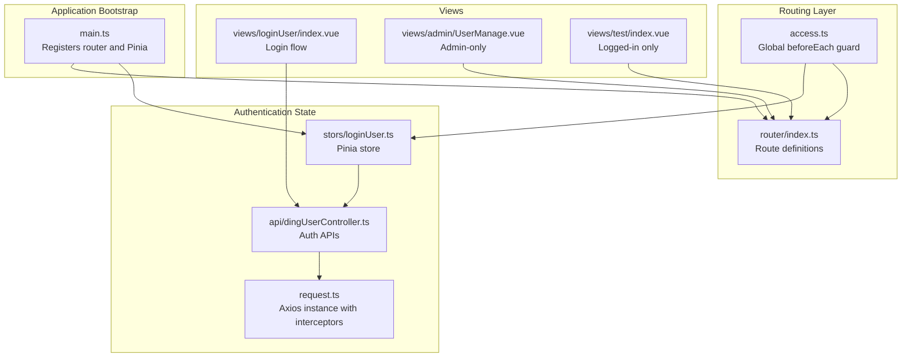
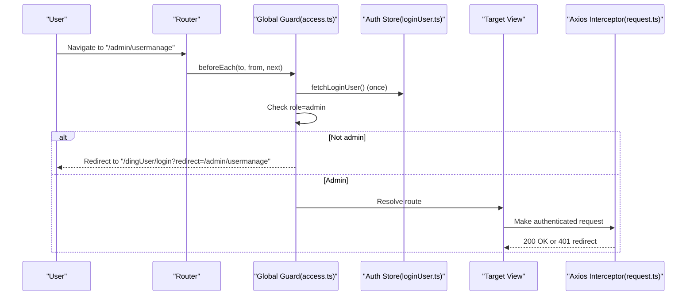
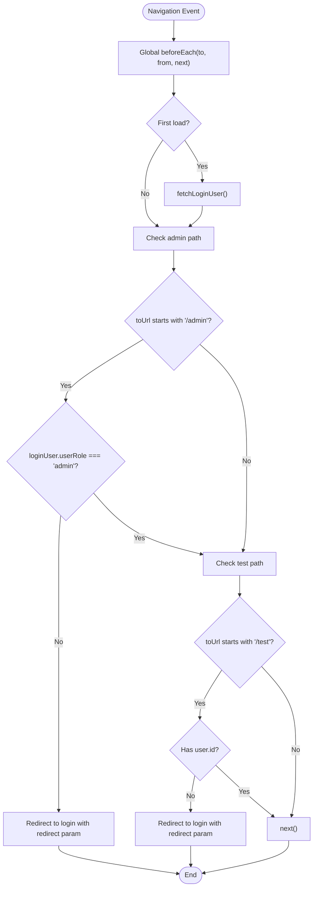
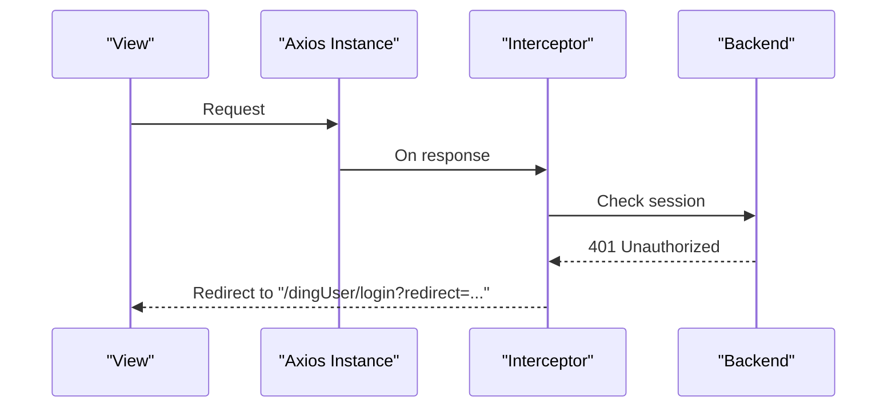
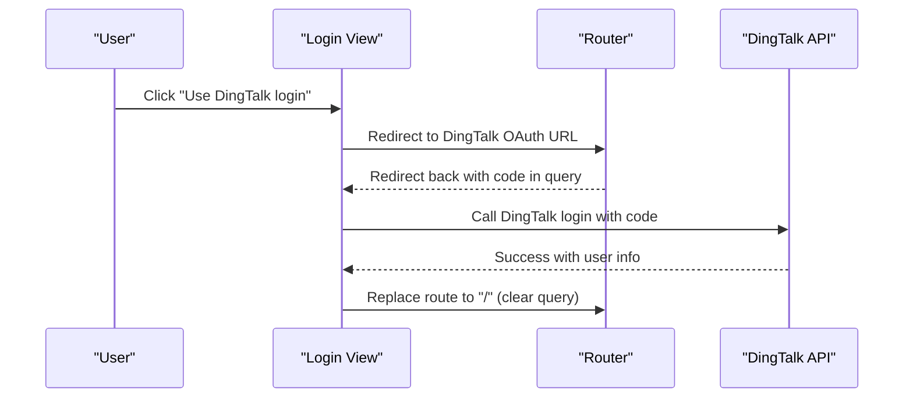
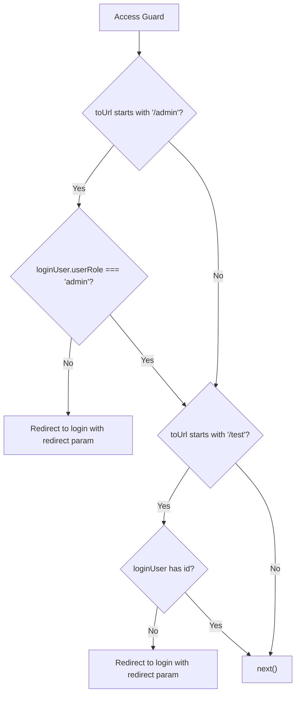
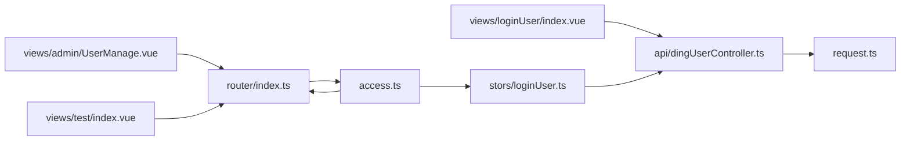

# Routing and Navigation

<cite>
**Referenced Files in This Document**
- [src/router/index.ts](file://src/router/index.ts)
- [src/access.ts](file://src/access.ts)
- [src/stors/loginUser.ts](file://src/stors/loginUser.ts)
- [src/main.ts](file://src/main.ts)
- [src/api/dingUserController.ts](file://src/api/dingUserController.ts)
- [src/request.ts](file://src/request.ts)
- [src/views/loginUser/index.vue](file://src/views/loginUser/index.vue)
- [src/views/loginUser/components/LoginForm.vue](file://src/views/loginUser/components/LoginForm.vue)
- [src/views/admin/UserManage.vue](file://src/views/admin/UserManage.vue)
- [src/views/test/index.vue](file://src/views/test/index.vue)
- [src/config/constants.ts](file://src/config/constants.ts)
- [src/config/userRole.ts](file://src/config/userRole.ts)
</cite>

## Table of Contents
1. [Introduction](#introduction)
2. [Project Structure](#project-structure)
3. [Core Components](#core-components)
4. [Architecture Overview](#architecture-overview)
5. [Detailed Component Analysis](#detailed-component-analysis)
6. [Dependency Analysis](#dependency-analysis)
7. [Performance Considerations](#performance-considerations)
8. [Troubleshooting Guide](#troubleshooting-guide)
9. [Conclusion](#conclusion)

## Introduction
This document explains the Vue Router configuration and navigation system used for access control and user redirection. It covers route definitions, global navigation guards, dynamic route protection, role-based access control, programmatic navigation, redirect handling, and integration with authentication state. It also documents route parameters, query strings, and navigation optimization techniques.

## Project Structure
The routing system is organized around a central router definition, a global access guard, and a Pinia store for authentication state. Views implement login flows and protected content, while request interception handles server-side session-based authentication.

**Diagram sources**
- [src/main.ts:1-19](file://src/main.ts#L1-L19)
- [src/router/index.ts:1-40](file://src/router/index.ts#L1-L40)
- [src/access.ts:1-41](file://src/access.ts#L1-L41)
- [src/stors/loginUser.ts:1-33](file://src/stors/loginUser.ts#L1-L33)
- [src/api/dingUserController.ts:1-43](file://src/api/dingUserController.ts#L1-L43)
- [src/request.ts:1-49](file://src/request.ts#L1-L49)
- [src/views/loginUser/index.vue:1-71](file://src/views/loginUser/index.vue#L1-L71)
- [src/views/admin/UserManage.vue:1-147](file://src/views/admin/UserManage.vue#L1-L147)
- [src/views/test/index.vue:1-4](file://src/views/test/index.vue#L1-L4)

**Section sources**
- [src/main.ts:1-19](file://src/main.ts#L1-L19)
- [src/router/index.ts:1-40](file://src/router/index.ts#L1-L40)

## Core Components
- Router definition: Declares static routes for home, login, user info, test, and admin user management.
- Global access guard: Enforces role-based and login-based protections during navigation.
- Authentication store: Provides login state and fetches current user via backend health endpoint.
- Request interceptor: Handles 401 responses by redirecting to login with a redirect query parameter.
- Login view: Implements DingTalk OAuth redirect flow and post-login redirect handling.

**Section sources**
- [src/router/index.ts:1-40](file://src/router/index.ts#L1-L40)
- [src/access.ts:1-41](file://src/access.ts#L1-L41)
- [src/stors/loginUser.ts:1-33](file://src/stors/loginUser.ts#L1-L33)
- [src/request.ts:1-49](file://src/request.ts#L1-L49)
- [src/views/loginUser/index.vue:1-71](file://src/views/loginUser/index.vue#L1-L71)

## Architecture Overview
The routing and access control architecture integrates Vue Router with a Pinia store and Axios interceptors. Navigation guards enforce permissions before routes are entered, while the request interceptor ensures server-side session-based authentication redirects unauthenticated requests to the login page.

**Diagram sources**
- [src/access.ts:11-40](file://src/access.ts#L11-L40)
- [src/stors/loginUser.ts:17-22](file://src/stors/loginUser.ts#L17-L22)
- [src/request.ts:26-41](file://src/request.ts#L26-L41)
- [src/router/index.ts:32-35](file://src/router/index.ts#L32-L35)

## Detailed Component Analysis

### Route Definitions and Navigation Guards
- Static routes include home, login, user info, test, and admin user management.
- Global guard checks:
  - Admin-only paths: Redirects non-admin users to login with a redirect query parameter.
  - Logged-in-only paths: Redirects anonymous users similarly.
  - First-load user fetch: Ensures the auth store is hydrated before permission checks.

**Diagram sources**
- [src/access.ts:11-40](file://src/access.ts#L11-L40)

**Section sources**
- [src/router/index.ts:10-37](file://src/router/index.ts#L10-L37)
- [src/access.ts:11-40](file://src/access.ts#L11-L40)

### Authentication State and Request Interception
- Authentication store:
  - Exposes a reactive user object.
  - Fetches current user via a health endpoint.
  - Provides setters for login state updates.
- Request interceptor:
  - Detects 401 responses.
  - Redirects to login with the current URL as a redirect query parameter.
  - Ignores login and health endpoints to prevent loops.

**Diagram sources**
- [src/request.ts:26-41](file://src/request.ts#L26-L41)
- [src/api/dingUserController.ts:6-11](file://src/api/dingUserController.ts#L6-L11)

**Section sources**
- [src/stors/loginUser.ts:9-32](file://src/stors/loginUser.ts#L9-L32)
- [src/request.ts:1-49](file://src/request.ts#L1-L49)

### Login Flow and Programmatic Navigation
- Login view:
  - Initiates DingTalk OAuth by redirecting to DingTalk’s OAuth URL with configured parameters.
  - After redirect, reads the authorization code from query parameters.
  - Calls DingTalk login API with the code.
  - On success, stores user info and redirects to home.
  - On failure, replaces route to retry.
- Programmatic navigation:
  - Uses router replace to clear query parameters after errors.
  - Uses router replace to redirect to home after successful login.

**Diagram sources**
- [src/views/loginUser/components/LoginForm.vue:25-41](file://src/views/loginUser/components/LoginForm.vue#L25-L41)
- [src/views/loginUser/index.vue:34-70](file://src/views/loginUser/index.vue#L34-L70)
- [src/api/dingUserController.ts:14-26](file://src/api/dingUserController.ts#L14-L26)

**Section sources**
- [src/views/loginUser/index.vue:1-71](file://src/views/loginUser/index.vue#L1-L71)
- [src/views/loginUser/components/LoginForm.vue:1-42](file://src/views/loginUser/components/LoginForm.vue#L1-L42)

### Role-Based Route Protection and Dynamic Access Control
- Admin-only route:
  - Protected path: "/admin/usermanage".
  - Guard enforces admin role; otherwise redirects to login with redirect parameter.
- Logged-in-only route:
  - Protected path: "/test".
  - Guard requires a valid user ID; otherwise redirects to login with redirect parameter.
- Role constants:
  - Defines user roles for future expansion (e.g., user role constant).

**Diagram sources**
- [src/access.ts:22-37](file://src/access.ts#L22-L37)
- [src/router/index.ts:32-35](file://src/router/index.ts#L32-L35)
- [src/views/test/index.vue:1-4](file://src/views/test/index.vue#L1-L4)

**Section sources**
- [src/access.ts:22-37](file://src/access.ts#L22-L37)
- [src/config/userRole.ts:1-6](file://src/config/userRole.ts#L1-L6)

### Route Parameters, Query Strings, and Navigation Between Protected Pages
- Query strings:
  - Login redirect parameter: "redirect" appended to login URL to preserve intended destination.
  - Authorization code: "code" received from DingTalk OAuth callback.
- Navigation:
  - Programmatic navigation uses router.replace to clear query parameters after errors.
  - Successful login navigates to home path.
- Protected page navigation:
  - Admin-only and logged-in-only routes redirect unauthorized users to login with the intended destination preserved.

**Section sources**
- [src/access.ts:25-34](file://src/access.ts#L25-L34)
- [src/views/loginUser/index.vue:35-56](file://src/views/loginUser/index.vue#L35-L56)

### Integration Between Routing and Authentication State
- Initialization:
  - Router and Pinia registered in main entry.
  - Global guard hydrates auth store on first navigation.
- State synchronization:
  - Auth store fetches user info via health endpoint.
  - Request interceptor redirects on 401, ensuring consistent auth state across the app.

**Section sources**
- [src/main.ts:14-16](file://src/main.ts#L14-L16)
- [src/stors/loginUser.ts:17-22](file://src/stors/loginUser.ts#L17-L22)
- [src/request.ts:30-38](file://src/request.ts#L30-L38)

### Lazy Loading Strategies and Route Meta Fields
- Current implementation:
  - Routes are statically imported; no explicit lazy loading is configured.
- Recommendations:
  - Use dynamic imports for route components to enable code splitting.
  - Add route meta fields for access control (e.g., meta.requiresAuth, meta.roles) to centralize guard logic.

[No sources needed since this section provides general guidance]

### Navigation Optimization Techniques
- Minimize redundant auth checks:
  - Guard hydrates auth store once per session.
- Efficient redirects:
  - Use router.replace to avoid polluting browser history for error scenarios.
- Consistent redirect handling:
  - Centralized redirect logic in both global guard and request interceptor.

**Section sources**
- [src/access.ts:16-20](file://src/access.ts#L16-L20)
- [src/views/loginUser/index.vue:60-61](file://src/views/loginUser/index.vue#L60-L61)
- [src/request.ts:36-37](file://src/request.ts#L36-L37)

## Dependency Analysis
The routing system depends on the authentication store and request interceptor for consistent access control. Views depend on router and API modules for navigation and authentication flows.

**Diagram sources**
- [src/router/index.ts:1-40](file://src/router/index.ts#L1-L40)
- [src/access.ts:1-41](file://src/access.ts#L1-L41)
- [src/stors/loginUser.ts:1-33](file://src/stors/loginUser.ts#L1-L33)
- [src/api/dingUserController.ts:1-43](file://src/api/dingUserController.ts#L1-L43)
- [src/request.ts:1-49](file://src/request.ts#L1-L49)
- [src/views/admin/UserManage.vue:1-147](file://src/views/admin/UserManage.vue#L1-L147)
- [src/views/test/index.vue:1-4](file://src/views/test/index.vue#L1-L4)

**Section sources**
- [src/router/index.ts:1-40](file://src/router/index.ts#L1-L40)
- [src/access.ts:1-41](file://src/access.ts#L1-L41)
- [src/stors/loginUser.ts:1-33](file://src/stors/loginUser.ts#L1-L33)
- [src/api/dingUserController.ts:1-43](file://src/api/dingUserController.ts#L1-L43)
- [src/request.ts:1-49](file://src/request.ts#L1-L49)

## Performance Considerations
- Avoid unnecessary re-renders by caching user state in the Pinia store.
- Defer heavy computations in guards until after the initial hydration.
- Use router.replace judiciously to prevent deep navigation histories for transient error states.

[No sources needed since this section provides general guidance]

## Troubleshooting Guide
- Users redirected to login unexpectedly:
  - Verify that the auth store is hydrated on first navigation.
  - Confirm that the health endpoint returns a valid user object.
- Admin-only pages inaccessible:
  - Ensure the user role is set to admin in the backend and reflected in the auth store.
- Login flow fails after DingTalk redirect:
  - Check that the redirect URI matches the configured value.
  - Verify that the authorization code is present in the query string and passed to the DingTalk login API.

**Section sources**
- [src/access.ts:16-20](file://src/access.ts#L16-L20)
- [src/stors/loginUser.ts:17-22](file://src/stors/loginUser.ts#L17-L22)
- [src/views/loginUser/components/LoginForm.vue:30-37](file://src/views/loginUser/components/LoginForm.vue#L30-L37)
- [src/views/loginUser/index.vue:35-68](file://src/views/loginUser/index.vue#L35-L68)

## Conclusion
The routing and navigation system combines Vue Router with a Pinia-based authentication store and Axios interceptors to provide robust access control. Global guards enforce role-based and login-based protections, while request interceptors ensure consistent session-based authentication. The login flow integrates DingTalk OAuth with programmatic navigation and redirect handling. Future enhancements could include dynamic imports for lazy loading and centralized route meta fields for access control.