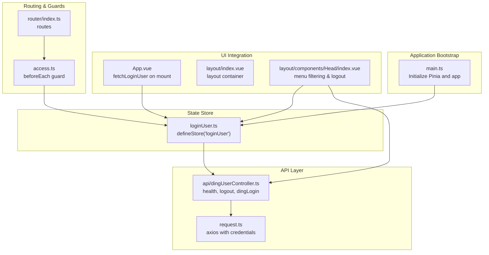
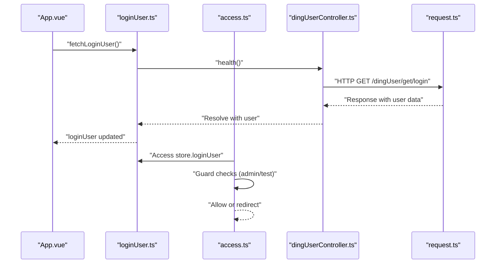
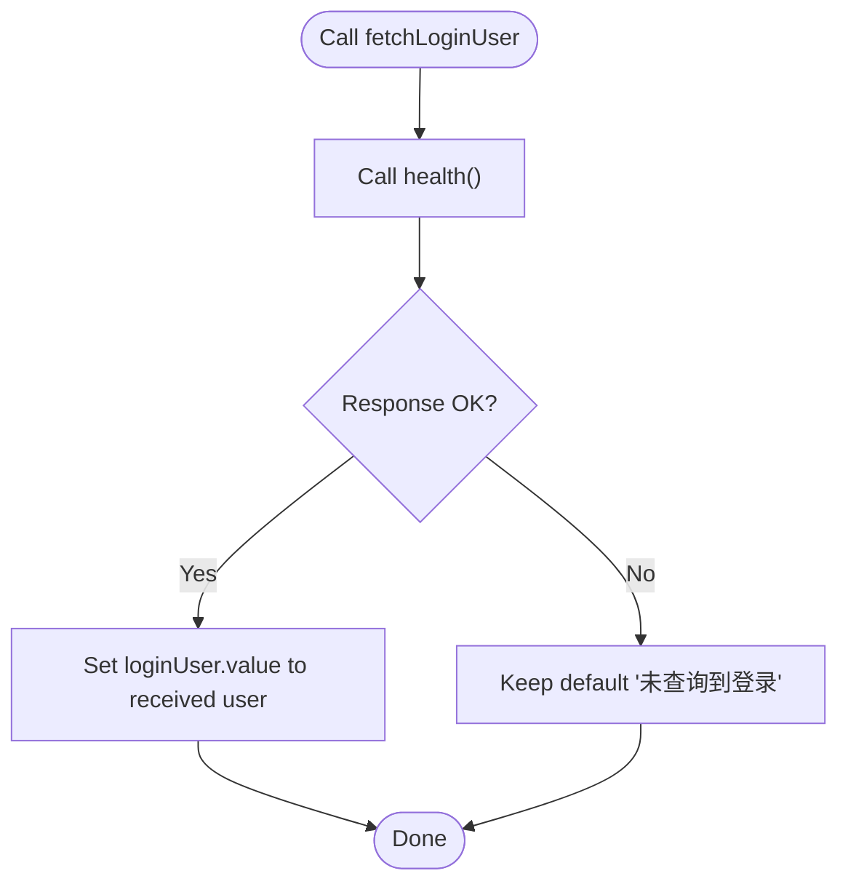
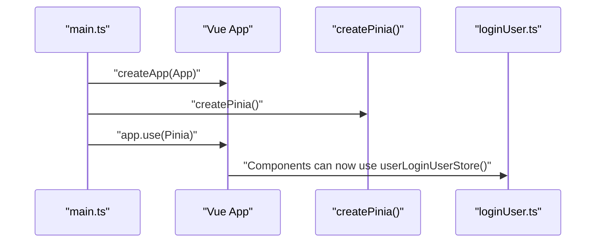
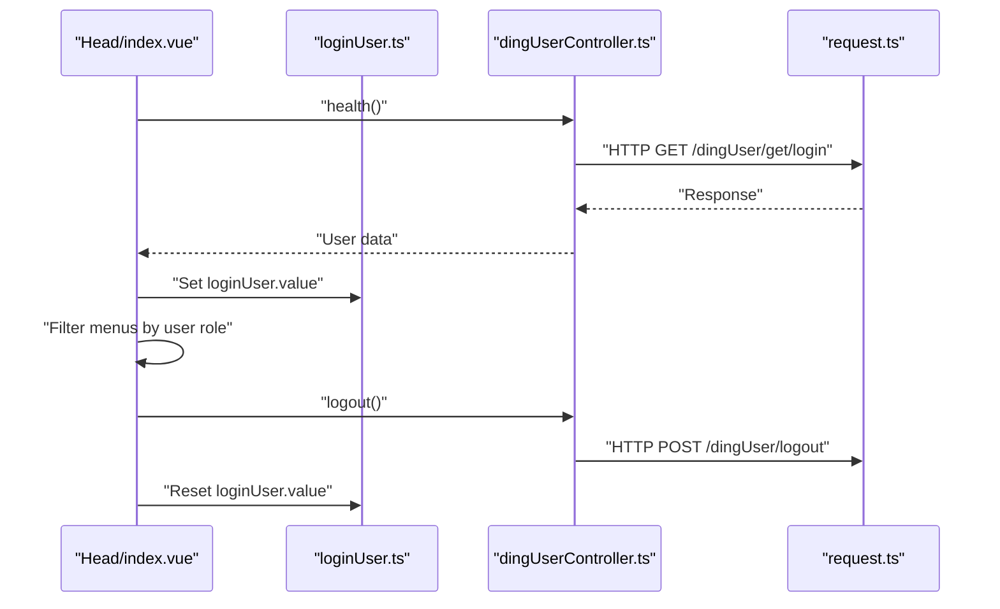
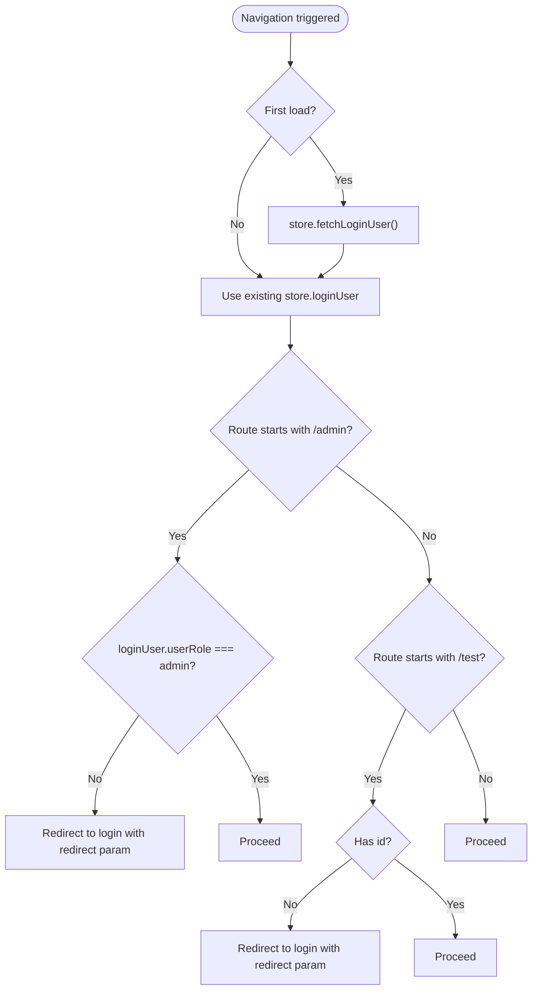
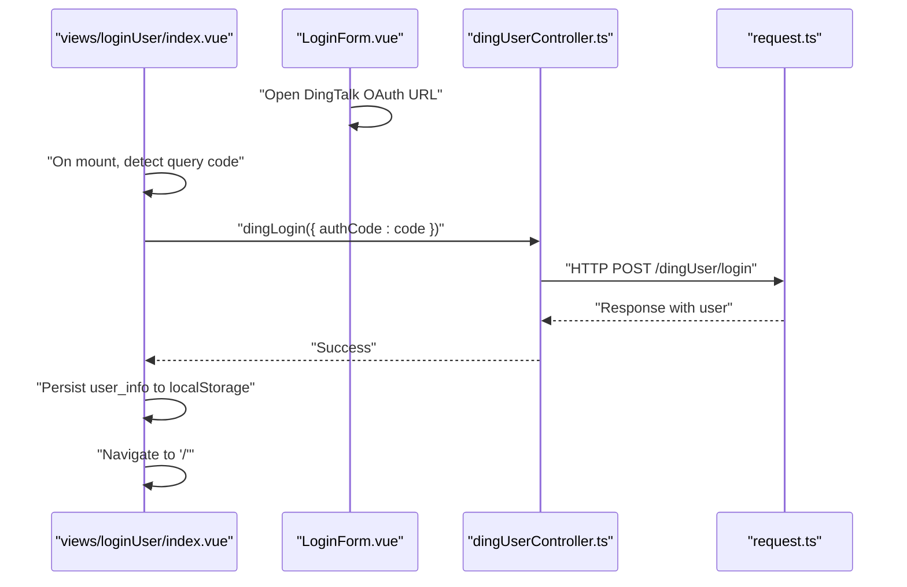
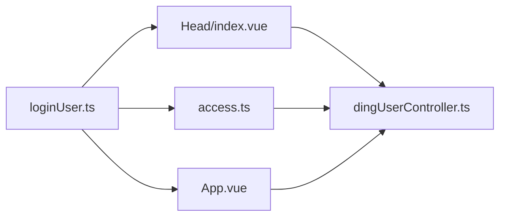
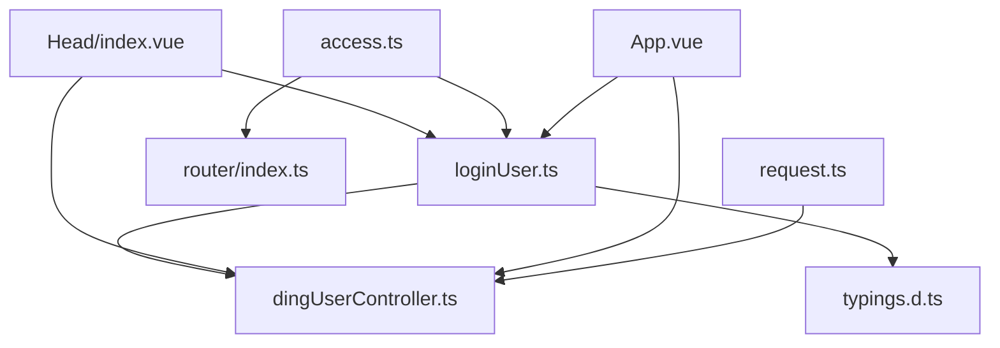

# State Management with Pinia

<cite>
**Referenced Files in This Document**
- [loginUser.ts](file://src/stors/loginUser.ts)
- [main.ts](file://src/main.ts)
- [access.ts](file://src/access.ts)
- [index.ts](file://src/router/index.ts)
- [dingUserController.ts](file://src/api/dingUserController.ts)
- [index.vue](file://src/views/loginUser/index.vue)
- [LoginForm.vue](file://src/views/loginUser/components/LoginForm.vue)
- [login-api.js](file://src/views/loginUser/js/login-api.js)
- [request.ts](file://src/request.ts)
- [App.vue](file://src/App.vue)
- [index.vue](file://src/layout/index.vue)
- [index.vue](file://src/layout/components/Head/index.vue)
- [typings.d.ts](file://src/api/typings.d.ts)
</cite>

## Table of Contents
1. [Introduction](#introduction)
2. [Project Structure](#project-structure)
3. [Core Components](#core-components)
4. [Architecture Overview](#architecture-overview)
5. [Detailed Component Analysis](#detailed-component-analysis)
6. [Dependency Analysis](#dependency-analysis)
7. [Performance Considerations](#performance-considerations)
8. [Troubleshooting Guide](#troubleshooting-guide)
9. [Conclusion](#conclusion)
10. [Appendices](#appendices)

## Introduction
This document explains the Pinia-based state management implementation in the frontend application. It focuses on the store architecture, reactive state patterns, and composables usage across the application. It documents the login user store, including state definition, actions for authentication operations, and computed-like behavior via reactive references. It also covers store composition, state persistence strategies, and integration with Vue components. Finally, it explains the relationship between stores and the authentication flow, including state synchronization and reactive updates, along with best practices for store organization, naming conventions, and performance considerations for large-scale state management.

## Project Structure
The state management is centered around a single composable-style Pinia store located under the stors directory. The application initializes Pinia globally and integrates the store into the layout and router guards to enforce permissions and synchronize user state reactively.

**Diagram sources**
- [main.ts:1-19](file://src/main.ts#L1-L19)
- [loginUser.ts:1-33](file://src/stors/loginUser.ts#L1-L33)
- [App.vue:1-19](file://src/App.vue#L1-L19)
- [index.vue:1-29](file://src/layout/index.vue#L1-L29)
- [index.vue:1-279](file://src/layout/components/Head/index.vue#L1-L279)
- [index.ts:1-40](file://src/router/index.ts#L1-L40)
- [access.ts:1-41](file://src/access.ts#L1-L41)
- [dingUserController.ts:1-43](file://src/api/dingUserController.ts#L1-L43)
- [request.ts:1-49](file://src/request.ts#L1-L49)

**Section sources**
- [main.ts:1-19](file://src/main.ts#L1-L19)
- [loginUser.ts:1-33](file://src/stors/loginUser.ts#L1-L33)
- [App.vue:1-19](file://src/App.vue#L1-L19)
- [index.vue:1-279](file://src/layout/components/Head/index.vue#L1-L279)
- [index.ts:1-40](file://src/router/index.ts#L1-L40)
- [access.ts:1-41](file://src/access.ts#L1-L41)
- [dingUserController.ts:1-43](file://src/api/dingUserController.ts#L1-L43)
- [request.ts:1-49](file://src/request.ts#L1-L49)

## Core Components
- Login user store: A composable-style Pinia store that exposes a reactive reference to the current user and actions to fetch and set user data. It relies on the backend health endpoint to hydrate the user state.
- Global initialization: Pinia is installed globally in the application bootstrap.
- Reactive UI integration: The layout header and app shell reactively reflect login state and update navigation menus accordingly.
- Router guard: A global beforeEach guard ensures protected routes are only accessible to authenticated users and admin users where applicable.

Key responsibilities:
- Define and export a composable-style store with a reactive user reference.
- Provide asynchronous action to fetch user info from the backend.
- Expose a setter to override user state when needed (e.g., after logout).
- Integrate with router guards and UI components for permission checks and reactive updates.

**Section sources**
- [loginUser.ts:1-33](file://src/stors/loginUser.ts#L1-L33)
- [main.ts:1-19](file://src/main.ts#L1-L19)
- [index.vue:1-279](file://src/layout/components/Head/index.vue#L1-L279)
- [access.ts:1-41](file://src/access.ts#L1-L41)

## Architecture Overview
The authentication and state synchronization flow is orchestrated by the login user store and the router guard. The UI reacts to state changes to show/hide menus and enforce access control.

**Diagram sources**
- [App.vue:1-19](file://src/App.vue#L1-L19)
- [loginUser.ts:1-33](file://src/stors/loginUser.ts#L1-L33)
- [access.ts:1-41](file://src/access.ts#L1-L41)
- [dingUserController.ts:1-43](file://src/api/dingUserController.ts#L1-L43)
- [request.ts:1-49](file://src/request.ts#L1-L49)

## Detailed Component Analysis

### Login User Store
The store defines a composable-style Pinia store named “loginUser” with:
- Reactive state: A ref holding the current user object typed against the API SysUserVO interface.
- Actions:
  - fetchLoginUser: Asynchronously retrieves the current user from the backend health endpoint and updates the reactive state.
  - setLoginUser: Allows overriding the current user state directly.

**Diagram sources**
- [loginUser.ts:16-22](file://src/stors/loginUser.ts#L16-L22)

Implementation highlights:
- Uses a composable-style store (returns an object with state and actions) rather than the Options API.
- Relies on the health endpoint to populate the user state.
- Exposes a setter to programmatically update the user state.

**Section sources**
- [loginUser.ts:1-33](file://src/stors/loginUser.ts#L1-L33)
- [typings.d.ts:51-56](file://src/api/typings.d.ts#L51-L56)

### Application Bootstrap and Store Initialization
Pinia is initialized globally during application startup and registered with the Vue app instance. This enables any component to consume the store via its composable.

**Diagram sources**
- [main.ts:10-15](file://src/main.ts#L10-L15)

**Section sources**
- [main.ts:1-19](file://src/main.ts#L1-L19)

### Authentication Flow and UI Integration
The UI integrates the login user store in two primary places:
- App shell: On mount, the app fetches the current user to initialize the store.
- Header navigation: The header filters menus based on the current user’s role and visibility state, and handles logout by clearing both frontend state and backend session.

**Diagram sources**
- [index.vue:1-279](file://src/layout/components/Head/index.vue#L1-L279)
- [loginUser.ts:1-33](file://src/stors/loginUser.ts#L1-L33)
- [dingUserController.ts:1-43](file://src/api/dingUserController.ts#L1-L43)
- [request.ts:1-49](file://src/request.ts#L1-L49)

**Section sources**
- [App.vue:1-19](file://src/App.vue#L1-L19)
- [index.vue:1-279](file://src/layout/components/Head/index.vue#L1-L279)
- [loginUser.ts:1-33](file://src/stors/loginUser.ts#L1-L33)

### Router Guard and Permission Enforcement
The global beforeEach guard ensures:
- On first load, it fetches the current user to avoid stale state after refresh.
- Routes starting with “/admin” require an admin user.
- Routes starting with “/test” require any logged-in user.

**Diagram sources**
- [access.ts:11-39](file://src/access.ts#L11-L39)

**Section sources**
- [access.ts:1-41](file://src/access.ts#L1-L41)

### Login Form and DingTalk OAuth Integration
The login view supports both mock login and DingTalk OAuth:
- Mock login writes token and user info to localStorage and navigates to home.
- DingTalk OAuth redirects to DingTalk, then back to the login page with a code. The view exchanges the code for user info via the backend and persists it to localStorage, then redirects to home.

**Diagram sources**
- [index.vue:1-71](file://src/views/loginUser/index.vue#L1-L71)
- [LoginForm.vue:1-42](file://src/views/loginUser/components/LoginForm.vue#L1-L42)
- [dingUserController.ts:13-26](file://src/api/dingUserController.ts#L13-L26)
- [request.ts:1-49](file://src/request.ts#L1-L49)

**Section sources**
- [index.vue:1-71](file://src/views/loginUser/index.vue#L1-L71)
- [LoginForm.vue:1-42](file://src/views/loginUser/components/LoginForm.vue#L1-L42)
- [dingUserController.ts:1-43](file://src/api/dingUserController.ts#L1-L43)
- [login-api.js:1-38](file://src/views/loginUser/js/login-api.js#L1-L38)

### State Persistence Strategies
- Frontend persistence: The login view persists user info to localStorage upon successful DingTalk login. This can be used to hydrate the store or UI state on subsequent visits.
- Backend persistence: The request module enables withCredentials, allowing cookies to carry the session automatically across requests. This removes the need to manually manage tokens in frontend state for authenticated requests.

Best practices:
- Prefer backend cookies for session management when supported by the server.
- Use localStorage sparingly and defensively (e.g., clear on logout).
- Keep the store as the single source of truth for reactive UI updates.

**Section sources**
- [index.vue:44-56](file://src/views/loginUser/index.vue#L44-L56)
- [request.ts:9](file://src/request.ts#L9)

### Relationship Between Stores and Authentication Flow
- The store is the central reactive source for user identity across the app.
- The header and router guard depend on the store to compute visibility and access control.
- The login view coordinates with the backend to establish a session and persist user info.

**Diagram sources**
- [loginUser.ts:1-33](file://src/stors/loginUser.ts#L1-L33)
- [index.vue:1-279](file://src/layout/components/Head/index.vue#L1-L279)
- [access.ts:1-41](file://src/access.ts#L1-L41)
- [App.vue:1-19](file://src/App.vue#L1-L19)
- [dingUserController.ts:1-43](file://src/api/dingUserController.ts#L1-L43)

## Dependency Analysis
The login user store depends on the API layer for hydration and on the router guard for enforcing access control. The UI components depend on the store for reactive state and on the API for authentication operations.

**Diagram sources**
- [loginUser.ts:1-33](file://src/stors/loginUser.ts#L1-L33)
- [dingUserController.ts:1-43](file://src/api/dingUserController.ts#L1-L43)
- [typings.d.ts:1-58](file://src/api/typings.d.ts#L1-L58)
- [index.vue:1-279](file://src/layout/components/Head/index.vue#L1-L279)
- [access.ts:1-41](file://src/access.ts#L1-L41)
- [index.ts:1-40](file://src/router/index.ts#L1-L40)
- [App.vue:1-19](file://src/App.vue#L1-L19)
- [request.ts:1-49](file://src/request.ts#L1-L49)

**Section sources**
- [loginUser.ts:1-33](file://src/stors/loginUser.ts#L1-L33)
- [dingUserController.ts:1-43](file://src/api/dingUserController.ts#L1-L43)
- [typings.d.ts:1-58](file://src/api/typings.d.ts#L1-L58)
- [index.vue:1-279](file://src/layout/components/Head/index.vue#L1-L279)
- [access.ts:1-41](file://src/access.ts#L1-L41)
- [index.ts:1-40](file://src/router/index.ts#L1-L40)
- [App.vue:1-19](file://src/App.vue#L1-L19)
- [request.ts:1-49](file://src/request.ts#L1-L49)

## Performance Considerations
- Minimize unnecessary re-renders by keeping the user object small and focused. The store currently holds a single reactive reference; avoid deep mutations.
- Debounce or coalesce repeated fetches in quick succession to prevent redundant network calls.
- Use computed properties in components to derive derived data from the store rather than duplicating state.
- Avoid storing large payloads in localStorage; prefer fetching on demand.
- Centralize API calls behind a single request module to leverage caching and deduplication at the HTTP layer when appropriate.

## Troubleshooting Guide
Common issues and resolutions:
- Stale user state after refresh: Ensure the app hydrates the store on mount and the router guard performs an initial fetch on first navigation.
- Permission errors on protected routes: Verify the guard checks align with the user role stored in the store and that the backend enforces the same rules.
- Logout not reflected in UI: Confirm the header clears both frontend state and triggers backend logout, and that the UI re-computes visibility based on the updated store.
- Network failures: The global request interceptor handles 401 responses by redirecting to login; ensure this behavior is desired and that the store state is reset on logout.

**Section sources**
- [App.vue:12-13](file://src/App.vue#L12-L13)
- [access.ts:16-20](file://src/access.ts#L16-L20)
- [index.vue:132-151](file://src/layout/components/Head/index.vue#L132-L151)
- [request.ts:25-41](file://src/request.ts#L25-L41)

## Conclusion
The application employs a clean, composable-style Pinia store to manage the login user state. The store integrates seamlessly with the router guard and UI components to enforce permissions and reflect reactive updates. By centralizing authentication logic in the store and leveraging backend sessions with cookie-based persistence, the system remains maintainable and scalable. Following the best practices outlined here will help sustain performance and clarity as the application grows.

## Appendices
- Naming conventions: Use kebab-case for filenames under stors and PascalCase for store exports. Example: loginUser.ts exports userLoginUserStore.
- Store organization: Place each domain-specific store in stors and keep actions focused on a single responsibility (e.g., fetchLoginUser for hydration).
- Type safety: Align store state types with API response typings to ensure compile-time correctness.