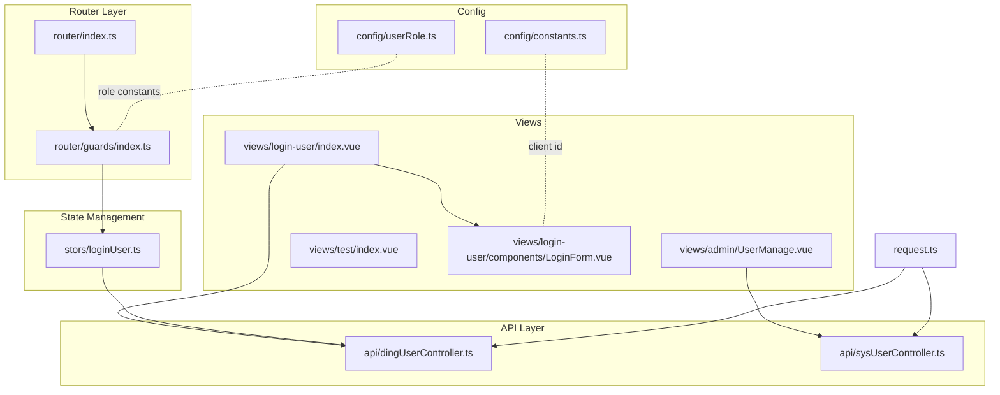
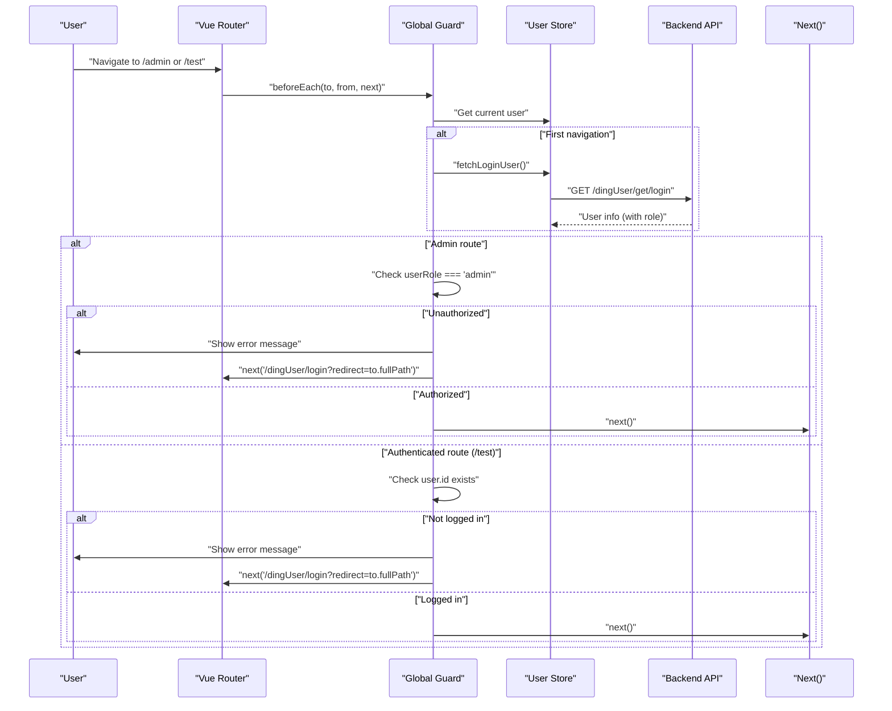
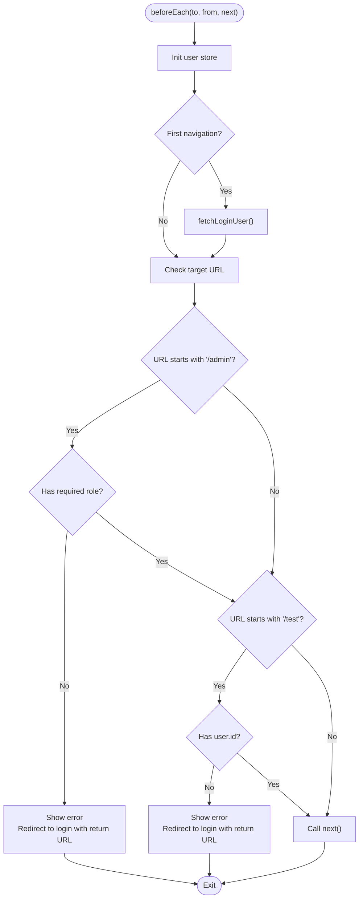
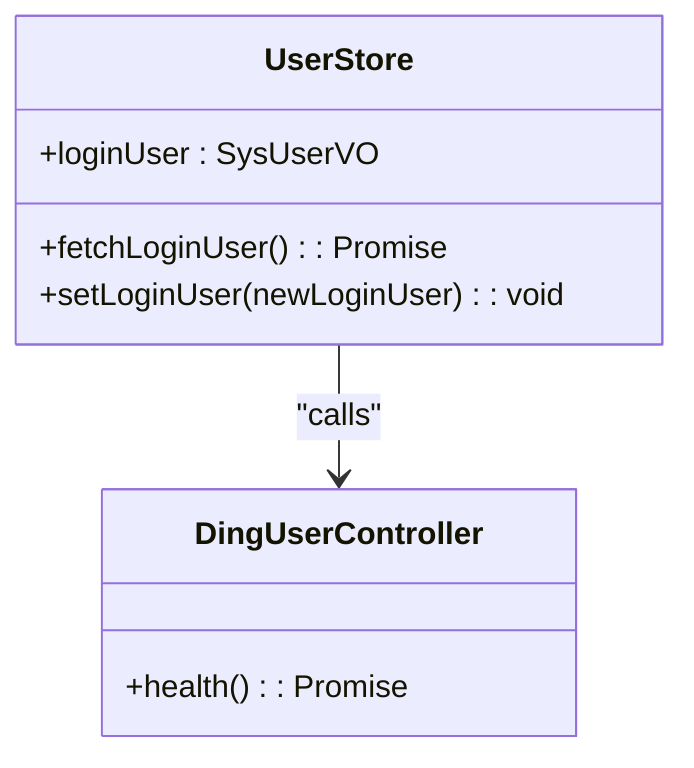
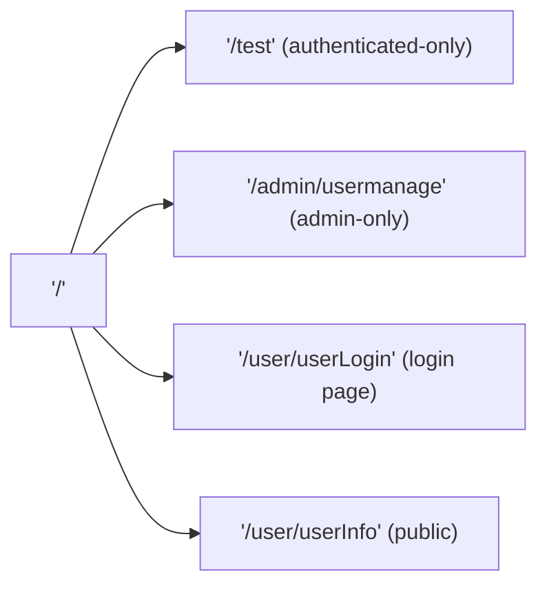
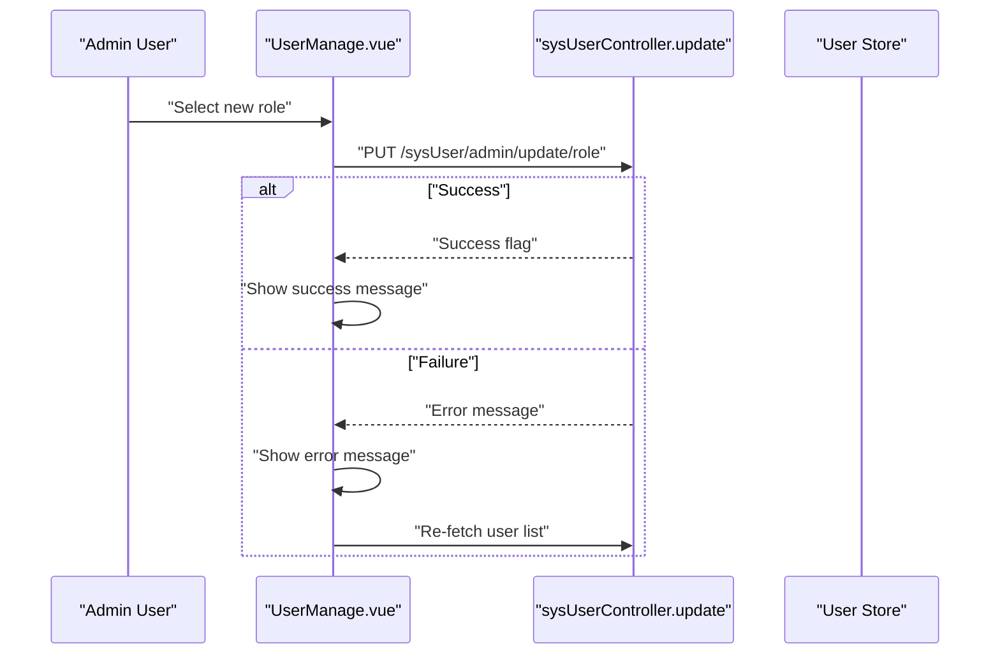
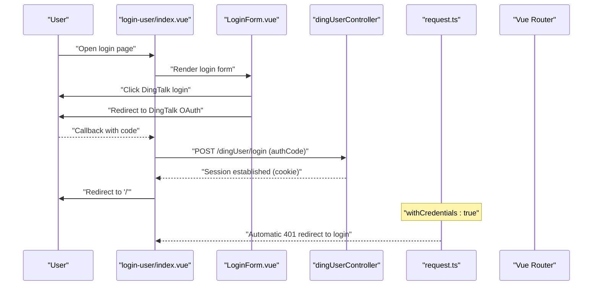
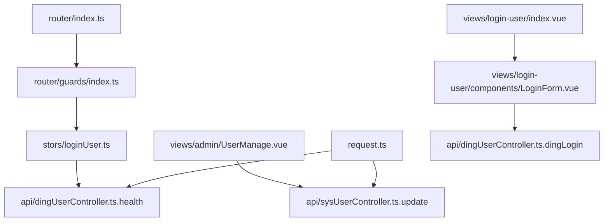

# Access Control System

<cite>
**Referenced Files in This Document**
- [access.ts](file://src/access.ts)
- [guards/index.ts](file://src/router/guards/index.ts)
- [router/index.ts](file://src/router/index.ts)
- [loginUser.ts](file://src/stors/loginUser.ts)
- [userRole.ts](file://src/config/userRole.ts)
- [constants.ts](file://src/config/constants.ts)
- [UserManage.vue](file://src/views/admin/UserManage.vue)
- [index.vue](file://src/views/test/index.vue)
- [dingUserController.ts](file://src/api/dingUserController.ts)
- [sysUserController.ts](file://src/api/sysUserController.ts)
- [request.ts](file://src/request.ts)
- [LoginForm.vue](file://src/views/login-user/components/LoginForm.vue)
- [login-user/index.vue](file://src/views/login-user/index.vue)
- [login-api.js](file://src/views/login-user/js/login-api.js)
</cite>

## Table of Contents
1. [Introduction](#introduction)
2. [Project Structure](#project-structure)
3. [Core Components](#core-components)
4. [Architecture Overview](#architecture-overview)
5. [Detailed Component Analysis](#detailed-component-analysis)
6. [Dependency Analysis](#dependency-analysis)
7. [Performance Considerations](#performance-considerations)
8. [Troubleshooting Guide](#troubleshooting-guide)
9. [Conclusion](#conclusion)

## Introduction
This document describes the role-based access control (RBAC) system implemented in the frontend application. It explains how user roles are determined, how routes are protected, and how permission checks are enforced during navigation. The system supports:
- Role-based route protection (admin-only pages)
- Login-required route protection (authenticated users only)
- Dynamic user role updates via an administrative interface
- Centralized global navigation guards
- Automatic redirection to login with a return URL
- Backend-driven session management via cookies

## Project Structure
The RBAC system spans several modules:
- Router and navigation guards: define protected routes and enforce access rules
- User store: holds current user state and fetches login status from backend
- Views: admin role management UI and test/login-protected pages
- APIs: backend endpoints for user login status, role updates, and logout
- Request layer: centralized HTTP client with automatic login redirection on 401

**Diagram sources**
- [router/index.ts:1-43](file://src/router/index.ts#L1-L43)
- [guards/index.ts:1-41](file://src/router/guards/index.ts#L1-L41)
- [loginUser.ts:1-33](file://src/stors/loginUser.ts#L1-L33)
- [UserManage.vue:1-147](file://src/views/admin/UserManage.vue#L1-L147)
- [index.vue:1-4](file://src/views/test/index.vue#L1-L4)
- [login-user/index.vue:1-72](file://src/views/login-user/index.vue#L1-L72)
- [LoginForm.vue:1-43](file://src/views/login-user/components/LoginForm.vue#L1-L43)
- [dingUserController.ts:1-43](file://src/api/dingUserController.ts#L1-L43)
- [sysUserController.ts:1-34](file://src/api/sysUserController.ts#L1-L34)
- [request.ts:1-49](file://src/request.ts#L1-L49)
- [userRole.ts:1-6](file://src/config/userRole.ts#L1-L6)
- [constants.ts:1-3](file://src/config/constants.ts#L1-L3)

**Section sources**
- [router/index.ts:1-43](file://src/router/index.ts#L1-L43)
- [guards/index.ts:1-41](file://src/router/guards/index.ts#L1-L41)
- [loginUser.ts:1-33](file://src/stors/loginUser.ts#L1-L33)
- [request.ts:1-49](file://src/request.ts#L1-L49)

## Core Components
- Global Navigation Guards: enforce role and login requirements before route change
- User Store: maintains current user info and loads it from backend on first navigation
- Route Definitions: declare protected paths and their intended audiences
- Admin Role Management View: allows changing user roles via backend APIs
- Login Flow: supports both mock login and DingTalk OAuth-based login
- Request Interceptor: centralizes 401 handling to redirect unauthenticated requests

Key responsibilities:
- Determine user identity and role from backend session
- Redirect unauthorized users to login with a return URL
- Protect admin-only routes and authenticated-only routes
- Allow administrators to update roles and reflect changes immediately

**Section sources**
- [guards/index.ts:11-40](file://src/router/guards/index.ts#L11-L40)
- [loginUser.ts:17-22](file://src/stors/loginUser.ts#L17-L22)
- [router/index.ts:13-39](file://src/router/index.ts#L13-L39)
- [UserManage.vue:92-113](file://src/views/admin/UserManage.vue#L92-L113)
- [request.ts:26-41](file://src/request.ts#L26-L41)

## Architecture Overview
The RBAC architecture centers on a global navigation guard that inspects the target route and the current user’s role. It ensures:
- Admin-only routes require a user with a specific role
- Authenticated-only routes require a logged-in user ID
- On failure, the user is redirected to the login page with a return URL
- The user store is primed on first navigation to avoid race conditions

**Diagram sources**
- [guards/index.ts:11-40](file://src/router/guards/index.ts#L11-L40)
- [loginUser.ts:17-22](file://src/stors/loginUser.ts#L17-L22)
- [dingUserController.ts:6-11](file://src/api/dingUserController.ts#L6-L11)

**Section sources**
- [guards/index.ts:11-40](file://src/router/guards/index.ts#L11-L40)
- [loginUser.ts:17-22](file://src/stors/loginUser.ts#L17-L22)
- [dingUserController.ts:6-11](file://src/api/dingUserController.ts#L6-L11)

## Detailed Component Analysis

### Global Navigation Guards
- Purpose: Enforce role and login checks before each route change
- Behavior:
  - On first navigation, fetch current user from backend
  - Deny access to admin-only routes if user role does not match
  - Deny access to authenticated-only routes if user ID is missing
  - Redirect to login with a return URL query parameter
- Implementation pattern: beforeEach hook with early returns and next()

**Diagram sources**
- [guards/index.ts:11-40](file://src/router/guards/index.ts#L11-L40)

**Section sources**
- [guards/index.ts:11-40](file://src/router/guards/index.ts#L11-L40)

### User Store and Login State
- Maintains a reactive user object with default placeholder
- Loads user info on first navigation via a backend health endpoint
- Provides setters for manual overrides if needed
- Integrates with the request layer that uses cookies for session

**Diagram sources**
- [loginUser.ts:9-32](file://src/stors/loginUser.ts#L9-L32)
- [dingUserController.ts:6-11](file://src/api/dingUserController.ts#L6-L11)

**Section sources**
- [loginUser.ts:9-32](file://src/stors/loginUser.ts#L9-L32)
- [dingUserController.ts:6-11](file://src/api/dingUserController.ts#L6-L11)

### Route Definitions and Protection
- Declares routes for home, login, user info, test, and admin user management
- Protected routes:
  - Admin-only: user management page under an admin path
  - Authenticated-only: test page requiring a logged-in user ID
- Navigation guards apply checks based on URL prefixes

**Diagram sources**
- [router/index.ts:13-39](file://src/router/index.ts#L13-L39)
- [guards/index.ts:22-37](file://src/router/guards/index.ts#L22-L37)

**Section sources**
- [router/index.ts:13-39](file://src/router/index.ts#L13-L39)
- [guards/index.ts:22-37](file://src/router/guards/index.ts#L22-L37)

### Admin Role Management View
- Displays a paginated table of users
- Allows changing roles via a select control
- Calls backend to update roles and shows feedback messages
- Refreshes data after errors or successful updates to keep UI consistent

**Diagram sources**
- [UserManage.vue:92-113](file://src/views/admin/UserManage.vue#L92-L113)
- [sysUserController.ts:21-33](file://src/api/sysUserController.ts#L21-L33)

**Section sources**
- [UserManage.vue:92-113](file://src/views/admin/UserManage.vue#L92-L113)
- [sysUserController.ts:21-33](file://src/api/sysUserController.ts#L21-L33)

### Login Flow and Session Management
- Supports mock login and DingTalk OAuth login
- Mock login stores token and user info in local storage
- DingTalk OAuth login redirects to DingTalk authorization, then exchanges code for session
- Backend uses cookies for session; request interceptor automatically redirects on 401

**Diagram sources**
- [login-user/index.vue:34-70](file://src/views/login-user/index.vue#L34-L70)
- [LoginForm.vue:25-41](file://src/views/login-user/components/LoginForm.vue#L25-L41)
- [dingUserController.ts:14-26](file://src/api/dingUserController.ts#L14-L26)
- [request.ts:9, 30-39](file://src/request.ts#L9,L30-L39)

**Section sources**
- [login-user/index.vue:34-70](file://src/views/login-user/index.vue#L34-L70)
- [LoginForm.vue:25-41](file://src/views/login-user/components/LoginForm.vue#L25-L41)
- [dingUserController.ts:14-26](file://src/api/dingUserController.ts#L14-L26)
- [request.ts:9, 30-39](file://src/request.ts#L9,L30-L39)

### Permission Constants and Role Values
- Role constants define standardized role identifiers used across the system
- Admin role value is used in guards for admin-only route checks
- User role constant defines a standard user role identifier

**Section sources**
- [userRole.ts:3](file://src/config/userRole.ts#L3)
- [guards/index.ts:23](file://src/router/guards/index.ts#L23)

## Dependency Analysis
- Router depends on guards for access control logic
- Guards depend on user store for current user state
- User store depends on backend health endpoint to populate user info
- Admin view depends on sysUserController for role updates
- Request layer centralizes HTTP behavior and 401 handling
- Login view integrates with DingTalk OAuth and local storage

**Diagram sources**
- [router/index.ts:1-43](file://src/router/index.ts#L1-L43)
- [guards/index.ts:1-41](file://src/router/guards/index.ts#L1-L41)
- [loginUser.ts:17-22](file://src/stors/loginUser.ts#L17-L22)
- [dingUserController.ts:6-11](file://src/api/dingUserController.ts#L6-L11)
- [sysUserController.ts:21-33](file://src/api/sysUserController.ts#L21-L33)
- [request.ts:1-49](file://src/request.ts#L1-L49)
- [LoginForm.vue:25-41](file://src/views/login-user/components/LoginForm.vue#L25-L41)
- [login-user/index.vue:34-70](file://src/views/login-user/index.vue#L34-L70)

**Section sources**
- [router/index.ts:1-43](file://src/router/index.ts#L1-L43)
- [guards/index.ts:1-41](file://src/router/guards/index.ts#L1-L41)
- [loginUser.ts:17-22](file://src/stors/loginUser.ts#L17-L22)
- [dingUserController.ts:6-11](file://src/api/dingUserController.ts#L6-L11)
- [sysUserController.ts:21-33](file://src/api/sysUserController.ts#L21-L33)
- [request.ts:1-49](file://src/request.ts#L1-L49)
- [LoginForm.vue:25-41](file://src/views/login-user/components/LoginForm.vue#L25-L41)
- [login-user/index.vue:34-70](file://src/views/login-user/index.vue#L34-L70)

## Performance Considerations
- Minimize repeated user fetches: the guard fetches user info only on first navigation to avoid redundant network calls
- Keep guards lightweight: rely on simple checks against the reactive user object
- Avoid blocking UI: use asynchronous fetch and show loading states in views where applicable
- Centralize HTTP configuration: withCredentials enabled ensures cookies are sent automatically, reducing manual token handling overhead

[No sources needed since this section provides general guidance]

## Troubleshooting Guide
Common issues and resolutions:
- Unauthorized access to admin routes:
  - Symptom: Error message and redirect to login
  - Cause: Current user role does not match required admin role
  - Resolution: Ensure backend assigns correct role; refresh page to re-fetch user info
- Access to authenticated-only routes denied:
  - Symptom: Prompt to log in before viewing test page
  - Cause: Missing user ID in current user object
  - Resolution: Complete login flow; verify session cookie is present
- Role update failures:
  - Symptom: Error message and immediate list refresh
  - Cause: Backend returned error or network issue
  - Resolution: Retry operation; confirm backend endpoint availability
- 401 responses from backend:
  - Symptom: Automatic redirect to login page
  - Cause: Request interceptor detects 401 and not already on login page
  - Resolution: Re-authenticate; ensure cookies are accepted by browser

**Section sources**
- [guards/index.ts:22-37](file://src/router/guards/index.ts#L22-L37)
- [UserManage.vue:100-112](file://src/views/admin/UserManage.vue#L100-L112)
- [request.ts:26-41](file://src/request.ts#L26-L41)

## Conclusion
The RBAC system enforces role-based and login-based access control through a centralized navigation guard, a reactive user store, and backend-driven session management. Administrators can dynamically update roles via the admin interface, while regular users benefit from seamless login flows and automatic redirection on unauthorized access attempts. The design emphasizes simplicity, reliability, and maintainability by leveraging Vue Router guards, Pinia state management, and a shared HTTP client.