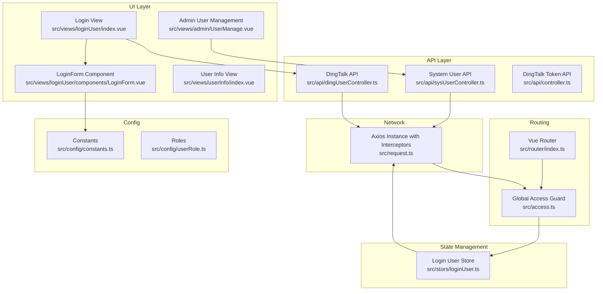
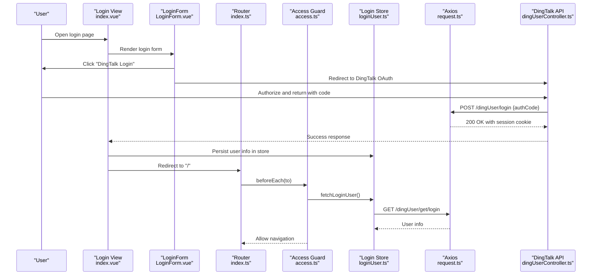
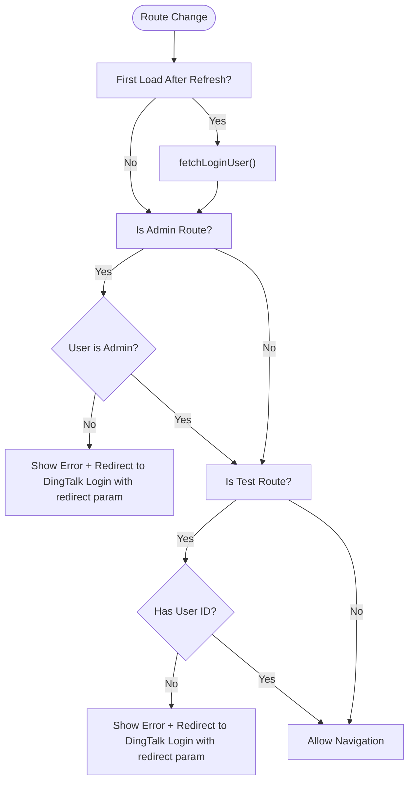
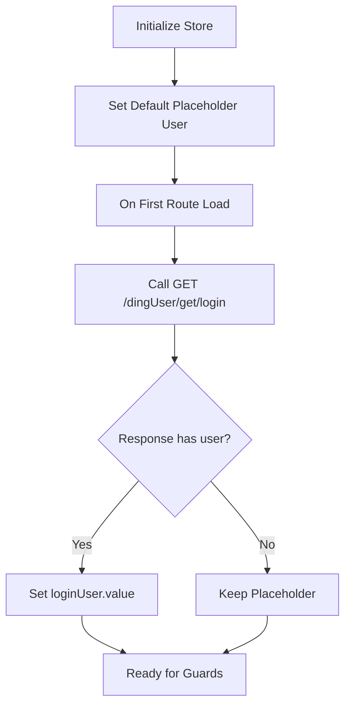
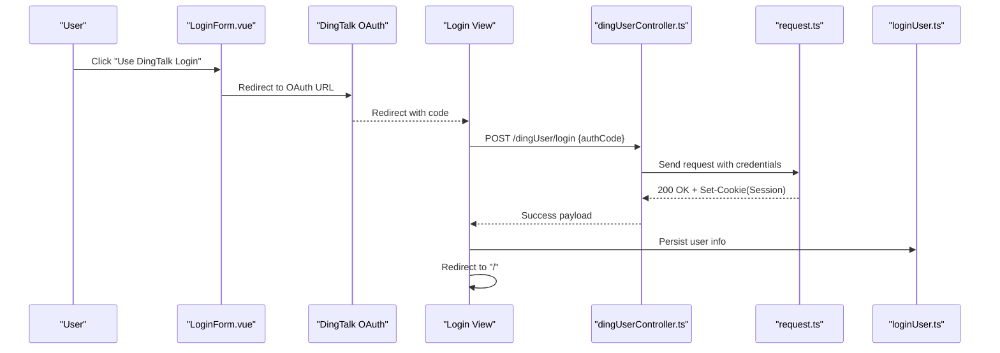
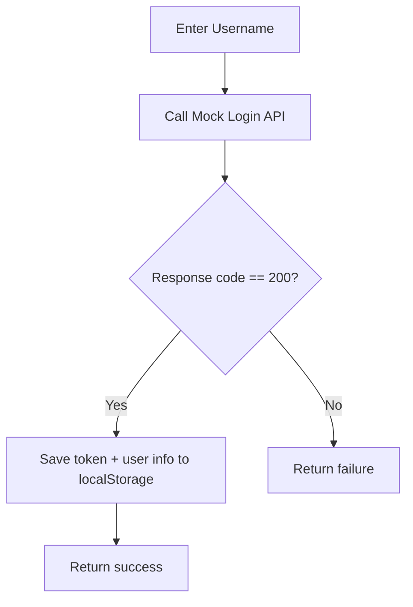
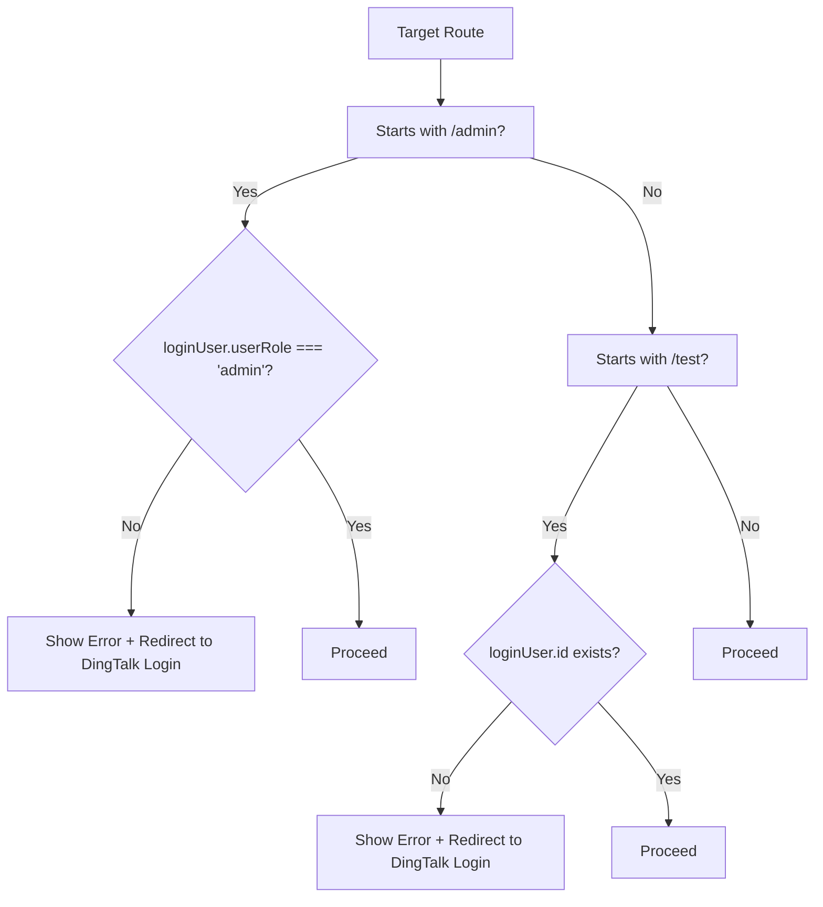
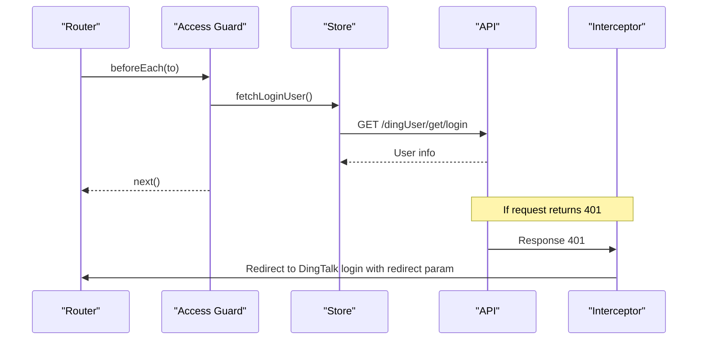
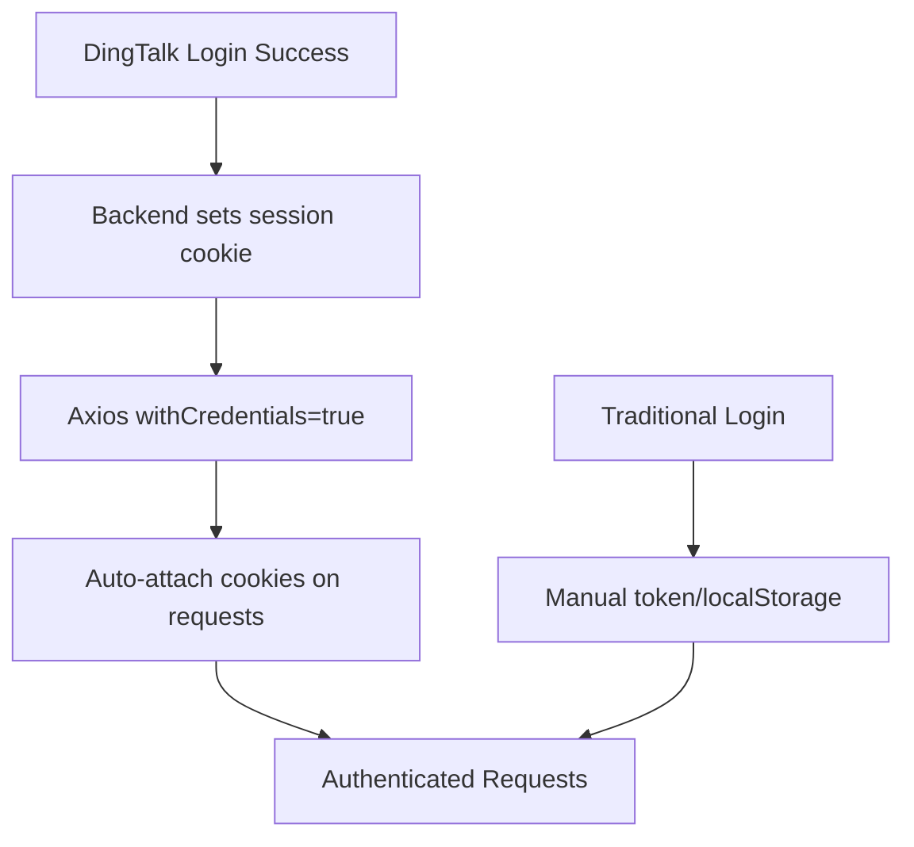
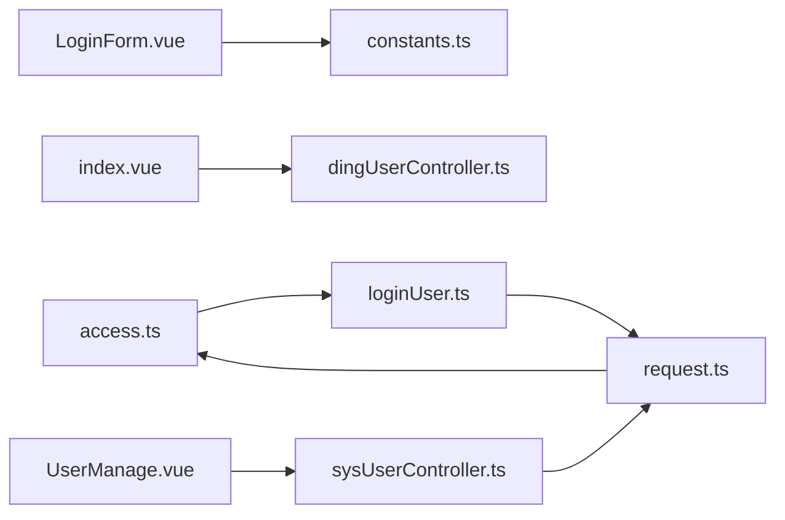

# Authentication & Authorization System

<cite>
**Referenced Files in This Document**
- [access.ts](file://src/access.ts)
- [loginUser.ts](file://src/stors/loginUser.ts)
- [index.vue](file://src/views/loginUser/index.vue)
- [LoginForm.vue](file://src/views/loginUser/components/LoginForm.vue)
- [login-api.js](file://src/views/loginUser/js/login-api.js)
- [index.ts](file://src/router/index.ts)
- [dingUserController.ts](file://src/api/dingUserController.ts)
- [sysUserController.ts](file://src/api/sysUserController.ts)
- [controller.ts](file://src/api/controller.ts)
- [request.ts](file://src/request.ts)
- [constants.ts](file://src/config/constants.ts)
- [userRole.ts](file://src/config/userRole.ts)
- [UserManage.vue](file://src/views/admin/UserManage.vue)
- [index.vue](file://src/views/userInfo/index.vue)
- [main.ts](file://src/main.ts)
</cite>

## Table of Contents
1. [Introduction](#introduction)
2. [Project Structure](#project-structure)
3. [Core Components](#core-components)
4. [Architecture Overview](#architecture-overview)
5. [Detailed Component Analysis](#detailed-component-analysis)
6. [Dependency Analysis](#dependency-analysis)
7. [Performance Considerations](#performance-considerations)
8. [Troubleshooting Guide](#troubleshooting-guide)
9. [Conclusion](#conclusion)

## Introduction
This document explains the authentication and authorization system implemented in the frontend application. The system supports two authentication modes:
- DingTalk OAuth login via DingTalk's unified OAuth2 authorization endpoint
- Traditional username-based login flow (currently mocked)

It covers the authentication flow, session management, automatic login state checking, token handling, role-based access control (RBAC), permission validation, and route protection. Practical examples from the codebase illustrate login form implementation, authentication state management, and access control patterns. Security considerations, error handling, and user experience optimizations are also addressed.

## Project Structure
The authentication and authorization system spans several modules:
- Router guards and route definitions for protected pages
- Global Pinia store for login user state
- Login view and form components for DingTalk OAuth initiation and callback handling
- API clients for DingTalk login, logout, health checks, and admin user management
- Request interceptor for centralized session-based authentication and automatic redirection to login
- Role constants and configuration

**Diagram sources**
- [index.vue:1-71](file://src/views/loginUser/index.vue#L1-L71)
- [LoginForm.vue:1-42](file://src/views/loginUser/components/LoginForm.vue#L1-L42)
- [index.ts:1-40](file://src/router/index.ts#L1-L40)
- [access.ts:1-41](file://src/access.ts#L1-L41)
- [loginUser.ts:1-33](file://src/stors/loginUser.ts#L1-L33)
- [dingUserController.ts:1-43](file://src/api/dingUserController.ts#L1-L43)
- [sysUserController.ts:1-34](file://src/api/sysUserController.ts#L1-L34)
- [controller.ts:1-12](file://src/api/controller.ts#L1-L12)
- [request.ts:1-49](file://src/request.ts#L1-L49)
- [constants.ts:1-3](file://src/config/constants.ts#L1-L3)
- [userRole.ts:1-6](file://src/config/userRole.ts#L1-L6)
- [UserManage.vue:1-147](file://src/views/admin/UserManage.vue#L1-L147)

**Section sources**
- [index.ts:1-40](file://src/router/index.ts#L1-L40)
- [access.ts:1-41](file://src/access.ts#L1-L41)
- [loginUser.ts:1-33](file://src/stors/loginUser.ts#L1-L33)
- [dingUserController.ts:1-43](file://src/api/dingUserController.ts#L1-L43)
- [sysUserController.ts:1-34](file://src/api/sysUserController.ts#L1-L34)
- [request.ts:1-49](file://src/request.ts#L1-L49)
- [constants.ts:1-3](file://src/config/constants.ts#L1-L3)
- [userRole.ts:1-6](file://src/config/userRole.ts#L1-L6)
- [LoginForm.vue:1-42](file://src/views/loginUser/components/LoginForm.vue#L1-L42)
- [index.vue:1-71](file://src/views/loginUser/index.vue#L1-L71)
- [UserManage.vue:1-147](file://src/views/admin/UserManage.vue#L1-L147)

## Core Components
- Global access guard: Validates access to protected routes based on login state and roles.
- Login user store: Centralized state for current user, with a health check to hydrate user info after refresh.
- Router: Defines routes and redirects unauthorized users to DingTalk login with a redirect parameter.
- DingTalk OAuth client: Initiates DingTalk OAuth, handles callback, persists session via backend cookies, and refreshes user info.
- Request interceptor: Enforces session-based authentication, auto-redirects unauthenticated requests, and warns users.
- Admin user management: Provides role-based UI for administrators to manage user roles.

**Section sources**
- [access.ts:11-40](file://src/access.ts#L11-L40)
- [loginUser.ts:9-32](file://src/stors/loginUser.ts#L9-L32)
- [index.ts:8-37](file://src/router/index.ts#L8-L37)
- [index.vue:33-70](file://src/views/loginUser/index.vue#L33-L70)
- [LoginForm.vue:24-41](file://src/views/loginUser/components/LoginForm.vue#L24-L41)
- [request.ts:12-47](file://src/request.ts#L12-L47)
- [UserManage.vue:56-128](file://src/views/admin/UserManage.vue#L56-L128)

## Architecture Overview
The system uses a session-based authentication model with backend-managed cookies. The frontend relies on Axios with credentials enabled to automatically attach cookies for authenticated requests. The global access guard enforces route-level permissions, while the login user store ensures the UI reflects the latest user state after refresh.

**Diagram sources**
- [index.vue:33-70](file://src/views/loginUser/index.vue#L33-L70)
- [LoginForm.vue:24-41](file://src/views/loginUser/components/LoginForm.vue#L24-L41)
- [index.ts:8-37](file://src/router/index.ts#L8-L37)
- [access.ts:11-20](file://src/access.ts#L11-L20)
- [loginUser.ts:17-22](file://src/stors/loginUser.ts#L17-L22)
- [request.ts:9-10](file://src/request.ts#L9-L10)
- [dingUserController.ts:13-26](file://src/api/dingUserController.ts#L13-L26)

## Detailed Component Analysis

### Global Access Guard and Route Protection
- Purpose: Enforce route-level access control using the login user state.
- Behavior:
  - On first load after refresh, fetches current user info to avoid redirect loops.
  - Protects admin routes by requiring an admin role.
  - Protects test routes by requiring any logged-in user.
  - Redirects unauthenticated users to DingTalk login with a redirect parameter.

**Diagram sources**
- [access.ts:11-38](file://src/access.ts#L11-L38)

**Section sources**
- [access.ts:11-40](file://src/access.ts#L11-L40)

### Login User Store and Automatic Login State Checking
- Purpose: Maintain and hydrate the current user state across sessions.
- Behavior:
  - Provides a reactive user object initialized with a default placeholder.
  - On first load, calls a health endpoint to populate user info.
  - Exposes setters to update user state.

**Diagram sources**
- [loginUser.ts:17-22](file://src/stors/loginUser.ts#L17-L22)

**Section sources**
- [loginUser.ts:9-32](file://src/stors/loginUser.ts#L9-L32)

### DingTalk OAuth Integration and Callback Handling
- OAuth initiation:
  - Generates the DingTalk OAuth URL with client_id, redirect_uri, response_type, scope, state, and prompt.
  - Redirects the browser to DingTalk authorization.
- Callback handling:
  - Extracts the authorization code from the route query.
  - Calls the DingTalk login endpoint with the code.
  - Persists user info in local storage.
  - Redirects to the homepage and clears the code from the URL.
  - Relies on backend session cookies for subsequent authenticated requests.

**Diagram sources**
- [LoginForm.vue:24-41](file://src/views/loginUser/components/LoginForm.vue#L24-L41)
- [index.vue:33-70](file://src/views/loginUser/index.vue#L33-L70)
- [dingUserController.ts:13-26](file://src/api/dingUserController.ts#L13-L26)
- [request.ts:9-10](file://src/request.ts#L9-L10)
- [loginUser.ts:24-26](file://src/stors/loginUser.ts#L24-L26)

**Section sources**
- [LoginForm.vue:24-41](file://src/views/loginUser/components/LoginForm.vue#L24-L41)
- [index.vue:33-70](file://src/views/loginUser/index.vue#L33-L70)
- [dingUserController.ts:13-26](file://src/api/dingUserController.ts#L13-L26)
- [request.ts:9-10](file://src/request.ts#L9-L10)
- [loginUser.ts:17-22](file://src/stors/loginUser.ts#L17-L22)

### Traditional Username/Password Login (Mocked)
- Purpose: Demonstrates a traditional login flow with token caching.
- Behavior:
  - Simulates a login API call returning a mock token and user info.
  - Stores token and user info in local storage.
  - Returns success/failure to the caller.

**Diagram sources**
- [login-api.js:5-37](file://src/views/loginUser/js/login-api.js#L5-L37)

**Section sources**
- [login-api.js:1-38](file://src/views/loginUser/js/login-api.js#L1-L38)

### Role-Based Access Control and Permission Validation
- Admin-only routes:
  - Protected by checking the user role against an admin requirement.
  - Non-admin users are redirected to DingTalk login with a redirect parameter.
- Logged-in user routes:
  - Protected by checking the presence of a user ID.
  - Unauthenticated users are redirected to DingTalk login with a redirect parameter.
- Role constants:
  - Defines user role identifiers used across the application.

**Diagram sources**
- [access.ts:22-37](file://src/access.ts#L22-L37)
- [userRole.ts:1-6](file://src/config/userRole.ts#L1-L6)

**Section sources**
- [access.ts:22-37](file://src/access.ts#L22-L37)
- [userRole.ts:1-6](file://src/config/userRole.ts#L1-L6)

### Route Protection Mechanisms
- Router definitions:
  - Declares routes for home, login, user info, test, and admin user management.
- Redirect on unauthenticated requests:
  - Global response interceptor detects 401 responses and redirects to DingTalk login with a redirect parameter.

**Diagram sources**
- [index.ts:8-37](file://src/router/index.ts#L8-L37)
- [access.ts:11-20](file://src/access.ts#L11-L20)
- [loginUser.ts:17-22](file://src/stors/loginUser.ts#L17-L22)
- [request.ts:26-39](file://src/request.ts#L26-L39)

**Section sources**
- [index.ts:8-37](file://src/router/index.ts#L8-L37)
- [request.ts:26-39](file://src/request.ts#L26-L39)

### Token Handling and Session Management
- Backend-managed session:
  - The backend sets a session cookie upon successful DingTalk login.
  - Frontend Axios is configured with credentials enabled so cookies are attached automatically.
- Local storage usage:
  - Traditional login stores token and user info in local storage for demonstration.
  - DingTalk login relies on backend session cookies; manual token storage is not required.
- Health check hydration:
  - The login user store calls a health endpoint to hydrate user info after refresh.

**Diagram sources**
- [request.ts:9-10](file://src/request.ts#L9-L10)
- [index.vue:48-56](file://src/views/loginUser/index.vue#L48-L56)
- [loginUser.ts:17-22](file://src/stors/loginUser.ts#L17-L22)

**Section sources**
- [request.ts:9-10](file://src/request.ts#L9-L10)
- [index.vue:48-56](file://src/views/loginUser/index.vue#L48-L56)
- [loginUser.ts:17-22](file://src/stors/loginUser.ts#L17-L22)

### Practical Examples from the Codebase
- Login form implementation:
  - LoginForm component constructs the DingTalk OAuth URL and triggers browser navigation.
  - Reference: [LoginForm.vue:24-41](file://src/views/loginUser/components/LoginForm.vue#L24-L41)
- Authentication state management:
  - Login view handles DingTalk callback, persists user info, and redirects.
  - Reference: [index.vue:33-70](file://src/views/loginUser/index.vue#L33-L70)
- Access control patterns:
  - Global access guard enforces admin and test route protections.
  - Reference: [access.ts:22-37](file://src/access.ts#L22-L37)
- Role-based UI for administrators:
  - Admin view allows changing user roles and paginating users.
  - Reference: [UserManage.vue:56-128](file://src/views/admin/UserManage.vue#L56-L128)

**Section sources**
- [LoginForm.vue:24-41](file://src/views/loginUser/components/LoginForm.vue#L24-L41)
- [index.vue:33-70](file://src/views/loginUser/index.vue#L33-L70)
- [access.ts:22-37](file://src/access.ts#L22-L37)
- [UserManage.vue:56-128](file://src/views/admin/UserManage.vue#L56-L128)

## Dependency Analysis
The authentication system exhibits clear separation of concerns:
- UI components depend on router and API clients.
- Router guards depend on the login store for user state.
- API clients depend on the shared Axios instance for session handling.
- Constants and role definitions are shared across modules.

**Diagram sources**
- [LoginForm.vue:24-41](file://src/views/loginUser/components/LoginForm.vue#L24-L41)
- [index.vue:17-18](file://src/views/loginUser/index.vue#L17-L18)
- [access.ts:11-12](file://src/access.ts#L11-L12)
- [loginUser.ts:1-2](file://src/stors/loginUser.ts#L1-L2)
- [dingUserController.ts:1-3](file://src/api/dingUserController.ts#L1-L3)
- [sysUserController.ts:1-3](file://src/api/sysUserController.ts#L1-L3)
- [request.ts:1-2](file://src/request.ts#L1-L2)
- [constants.ts:1-3](file://src/config/constants.ts#L1-L3)

**Section sources**
- [LoginForm.vue:24-41](file://src/views/loginUser/components/LoginForm.vue#L24-L41)
- [index.vue:17-18](file://src/views/loginUser/index.vue#L17-L18)
- [access.ts:11-12](file://src/access.ts#L11-L12)
- [loginUser.ts:1-2](file://src/stors/loginUser.ts#L1-L2)
- [dingUserController.ts:1-3](file://src/api/dingUserController.ts#L1-L3)
- [sysUserController.ts:1-3](file://src/api/sysUserController.ts#L1-L3)
- [request.ts:1-2](file://src/request.ts#L1-L2)
- [constants.ts:1-3](file://src/config/constants.ts#L1-L3)

## Performance Considerations
- Minimize unnecessary re-renders by leveraging the reactive login user store and avoiding redundant fetches.
- Defer non-critical UI updates during authentication flows to improve perceived performance.
- Use pagination and lazy loading for admin user lists to reduce initial payload sizes.
- Ensure Axios interceptors are efficient and avoid heavy synchronous work in request/response handlers.

## Troubleshooting Guide
- DingTalk OAuth callback fails:
  - Verify redirect_uri matches the registered DingTalk app configuration.
  - Confirm the backend accepts the authCode and returns a successful response with session cookies.
  - Check browser network tab for CORS and cookie policies.
- Unauthorized access errors:
  - Ensure the global interceptor is configured to redirect to DingTalk login when encountering 401 responses.
  - Confirm the backend sets the session cookie and that Axios sends credentials.
- Admin route access denied:
  - Verify the user role is correctly populated after login and matches the admin requirement.
  - Check the access guard logic for route prefixes and role checks.
- Traditional login token issues:
  - Confirm token and user info are stored in local storage after mock login.
  - Note that DingTalk login relies on backend session cookies, not local tokens.

**Section sources**
- [LoginForm.vue:24-41](file://src/views/loginUser/components/LoginForm.vue#L24-L41)
- [index.vue:33-70](file://src/views/loginUser/index.vue#L33-L70)
- [request.ts:26-39](file://src/request.ts#L26-L39)
- [access.ts:22-37](file://src/access.ts#L22-L37)

## Conclusion
The authentication and authorization system combines DingTalk OAuth with a session-based backend model and a straightforward access guard for route protection. The design emphasizes:
- Seamless DingTalk login with automatic session persistence via backend cookies
- Centralized login state hydration after refresh
- Clear route-level protections for admin and logged-in routes
- A practical admin interface for role management

This foundation supports secure, user-friendly navigation and robust access control across the application.