# Authentication Flow

<cite>
**Referenced Files in This Document**
- [LoginForm.vue](file://src/views/loginUser/components/LoginForm.vue)
- [login-api.js](file://src/views/loginUser/js/login-api.js)
- [index.vue](file://src/views/loginUser/index.vue)
- [dingUserController.ts](file://src/api/dingUserController.ts)
- [controller.ts](file://src/api/controller.ts)
- [request.ts](file://src/request.ts)
- [loginUser.ts](file://src/stors/loginUser.ts)
- [index.ts](file://src/router/index.ts)
- [access.ts](file://src/access.ts)
- [main.ts](file://src/main.ts)
- [typings.d.ts](file://src/api/typings.d.ts)
- [App.vue](file://src/App.vue)
- [Head/index.vue](file://src/layout/components/Head/index.vue)
</cite>

## Table of Contents
1. [Introduction](#introduction)
2. [Project Structure](#project-structure)
3. [Core Components](#core-components)
4. [Architecture Overview](#architecture-overview)
5. [Detailed Component Analysis](#detailed-component-analysis)
6. [Dependency Analysis](#dependency-analysis)
7. [Performance Considerations](#performance-considerations)
8. [Troubleshooting Guide](#troubleshooting-guide)
9. [Conclusion](#conclusion)

## Introduction
This document explains the authentication flow implemented in the frontend application, focusing on the dual authentication system that supports:
- DingTalk OAuth via a unified authorization page
- Traditional username/password login (currently represented by a mock flow)

It documents automatic login state checking, session management, token handling, login form component behavior, input validation, request processing, integration with the API layer, and error handling/loading states. Practical examples illustrate how the system integrates with backend APIs, manages session persistence, and provides user feedback.

## Project Structure
The authentication flow spans several layers:
- View layer: Login page and form component
- API layer: DingTalk and user endpoints
- Request layer: Axios instance with interceptors
- Store layer: Pinia store for login state
- Router and guards: Route protection and navigation
- Layout and header: Automatic login state checks and logout

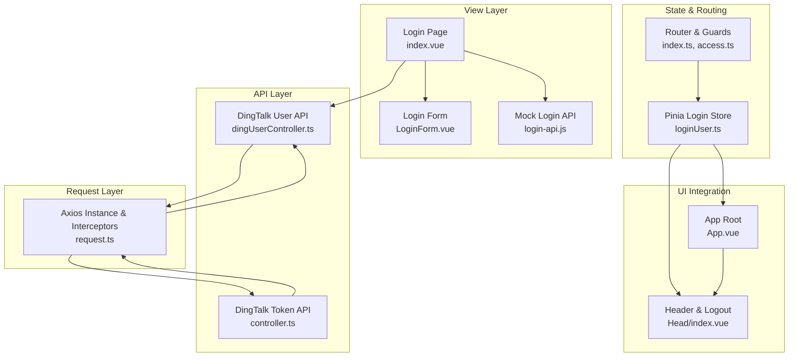

**Diagram sources**
- [index.vue:1-71](file://src/views/loginUser/index.vue#L1-L71)
- [LoginForm.vue:1-42](file://src/views/loginUser/components/LoginForm.vue#L1-L42)
- [login-api.js:1-38](file://src/views/loginUser/js/login-api.js#L1-L38)
- [dingUserController.ts:1-43](file://src/api/dingUserController.ts#L1-L43)
- [controller.ts:1-12](file://src/api/controller.ts#L1-L12)
- [request.ts:1-49](file://src/request.ts#L1-L49)
- [loginUser.ts:1-33](file://src/stors/loginUser.ts#L1-L33)
- [index.ts:1-40](file://src/router/index.ts#L1-L40)
- [access.ts:1-41](file://src/access.ts#L1-L41)
- [App.vue:1-19](file://src/App.vue#L1-L19)
- [Head/index.vue:120-279](file://src/layout/components/Head/index.vue#L120-L279)

**Section sources**
- [index.vue:1-71](file://src/views/loginUser/index.vue#L1-L71)
- [LoginForm.vue:1-42](file://src/views/loginUser/components/LoginForm.vue#L1-L42)
- [login-api.js:1-38](file://src/views/loginUser/js/login-api.js#L1-L38)
- [dingUserController.ts:1-43](file://src/api/dingUserController.ts#L1-L43)
- [controller.ts:1-12](file://src/api/controller.ts#L1-L12)
- [request.ts:1-49](file://src/request.ts#L1-L49)
- [loginUser.ts:1-33](file://src/stors/loginUser.ts#L1-L33)
- [index.ts:1-40](file://src/router/index.ts#L1-L40)
- [access.ts:1-41](file://src/access.ts#L1-L41)
- [App.vue:1-19](file://src/App.vue#L1-L19)
- [Head/index.vue:120-279](file://src/layout/components/Head/index.vue#L120-L279)

## Core Components
- Login page orchestrates the authentication flow, handles DingTalk callback, and triggers mock login when applicable.
- Login form component provides DingTalk OAuth button and placeholder for traditional login.
- Mock login API simulates username/password login and persists token/user info.
- DingTalk user API encapsulates health check, login, and logout endpoints.
- Axios instance centralizes HTTP requests and global 401 handling.
- Pinia store manages login state and exposes a fetch method to refresh current user.
- Router and beforeEach guard enforce access control and redirect unauthenticated users.
- Header component auto-checks login status and performs DingTalk logout.

**Section sources**
- [index.vue:13-71](file://src/views/loginUser/index.vue#L13-L71)
- [LoginForm.vue:14-42](file://src/views/loginUser/components/LoginForm.vue#L14-L42)
- [login-api.js:5-38](file://src/views/loginUser/js/login-api.js#L5-L38)
- [dingUserController.ts:5-43](file://src/api/dingUserController.ts#L5-L43)
- [request.ts:13-47](file://src/request.ts#L13-L47)
- [loginUser.ts:9-32](file://src/stors/loginUser.ts#L9-L32)
- [access.ts:11-40](file://src/access.ts#L11-L40)
- [Head/index.vue:132-199](file://src/layout/components/Head/index.vue#L132-L199)

## Architecture Overview
The authentication architecture follows a layered approach:
- UI triggers actions (DingTalk OAuth or mock login).
- API layer communicates with backend endpoints.
- Axios interceptors manage 401 redirects and global messaging.
- Pinia store maintains reactive login state.
- Router guards protect routes and redirect to login with return URL.
- Header component reflects login state and initiates DingTalk logout.

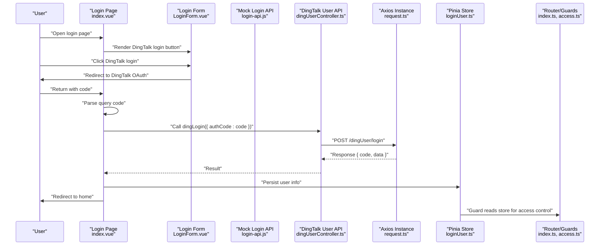

**Diagram sources**
- [LoginForm.vue:25-41](file://src/views/loginUser/components/LoginForm.vue#L25-L41)
- [index.vue:33-70](file://src/views/loginUser/index.vue#L33-L70)
- [dingUserController.ts:14-26](file://src/api/dingUserController.ts#L14-L26)
- [request.ts:6-10](file://src/request.ts#L6-L10)
- [loginUser.ts:17-22](file://src/stors/loginUser.ts#L17-L22)
- [index.ts:17-19](file://src/router/index.ts#L17-L19)
- [access.ts:11-39](file://src/access.ts#L11-L39)

## Detailed Component Analysis

### DingTalk OAuth Login Flow
- The form component constructs the DingTalk OAuth URL with client_id, redirect_uri, scope, state, and prompt parameters, then redirects the browser.
- On return, the login page extracts the authorization code from the URL query and calls the DingTalk login endpoint.
- On success, user info is persisted and the user is redirected to the home page; otherwise, an error message is shown and the route is reloaded.

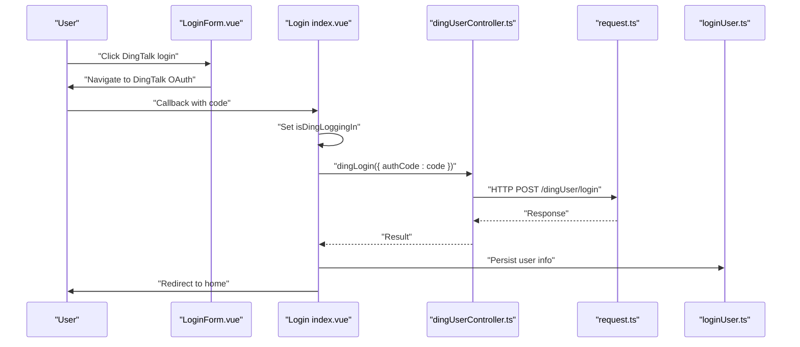

**Diagram sources**
- [LoginForm.vue:25-41](file://src/views/loginUser/components/LoginForm.vue#L25-L41)
- [index.vue:33-70](file://src/views/loginUser/index.vue#L33-L70)
- [dingUserController.ts:14-26](file://src/api/dingUserController.ts#L14-L26)
- [request.ts:6-10](file://src/request.ts#L6-L10)
- [loginUser.ts:17-22](file://src/stors/loginUser.ts#L17-L22)

**Section sources**
- [LoginForm.vue:25-41](file://src/views/loginUser/components/LoginForm.vue#L25-L41)
- [index.vue:33-70](file://src/views/loginUser/index.vue#L33-L70)
- [dingUserController.ts:14-26](file://src/api/dingUserController.ts#L14-L26)

### Traditional Username/Password Login (Mock Flow)
- The login form currently hides the traditional input and emits a submit event for username-based login.
- The mock login API simulates an HTTP-like request, resolves with a token and user info, and stores them in local storage.
- Validation prevents empty usernames and alerts the user if missing.

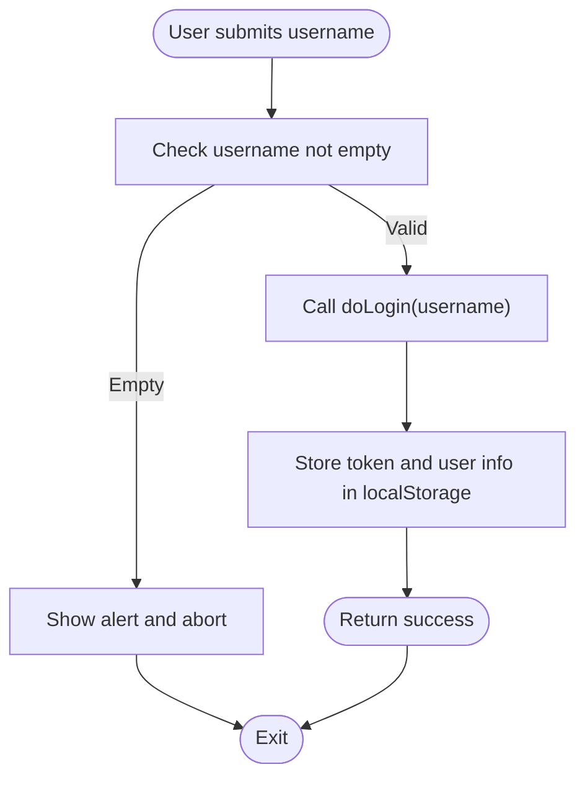

**Diagram sources**
- [LoginForm.vue:14-22](file://src/views/loginUser/components/LoginForm.vue#L14-L22)
- [login-api.js:5-38](file://src/views/loginUser/js/login-api.js#L5-L38)
- [index.vue:25-31](file://src/views/loginUser/index.vue#L25-L31)

**Section sources**
- [LoginForm.vue:14-22](file://src/views/loginUser/components/LoginForm.vue#L14-L22)
- [login-api.js:5-38](file://src/views/loginUser/js/login-api.js#L5-L38)
- [index.vue:25-31](file://src/views/loginUser/index.vue#L25-L31)

### Automatic Login State Checking
- The header component periodically checks the current login state by calling the health endpoint.
- It updates reactive state and the Pinia store accordingly, setting a default “not logged in” value when needed.
- The app root also triggers an initial fetch to populate the store on mount.

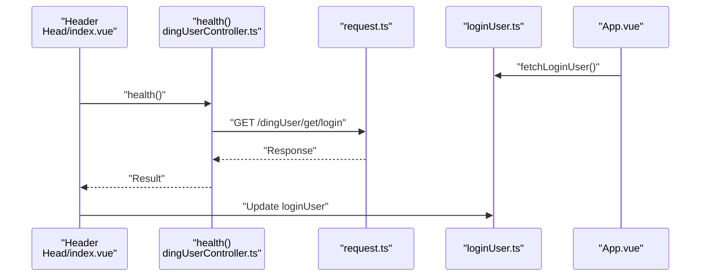

**Diagram sources**
- [Head/index.vue:132-151](file://src/layout/components/Head/index.vue#L132-L151)
- [dingUserController.ts:6-11](file://src/api/dingUserController.ts#L6-L11)
- [request.ts:6-10](file://src/request.ts#L6-L10)
- [loginUser.ts:17-22](file://src/stors/loginUser.ts#L17-L22)
- [App.vue:12-13](file://src/App.vue#L12-L13)

**Section sources**
- [Head/index.vue:132-151](file://src/layout/components/Head/index.vue#L132-L151)
- [loginUser.ts:17-22](file://src/stors/loginUser.ts#L17-L22)
- [App.vue:12-13](file://src/App.vue#L12-L13)

### Session Management and Token Handling
- Axios instance enables cross-origin cookies and sets a base URL.
- Global response interceptor detects 401 responses and redirects to the login page with a return URL, displaying a warning message.
- The mock login flow stores a token and user info in local storage; the DingTalk flow relies on server-side sessions and cookies.

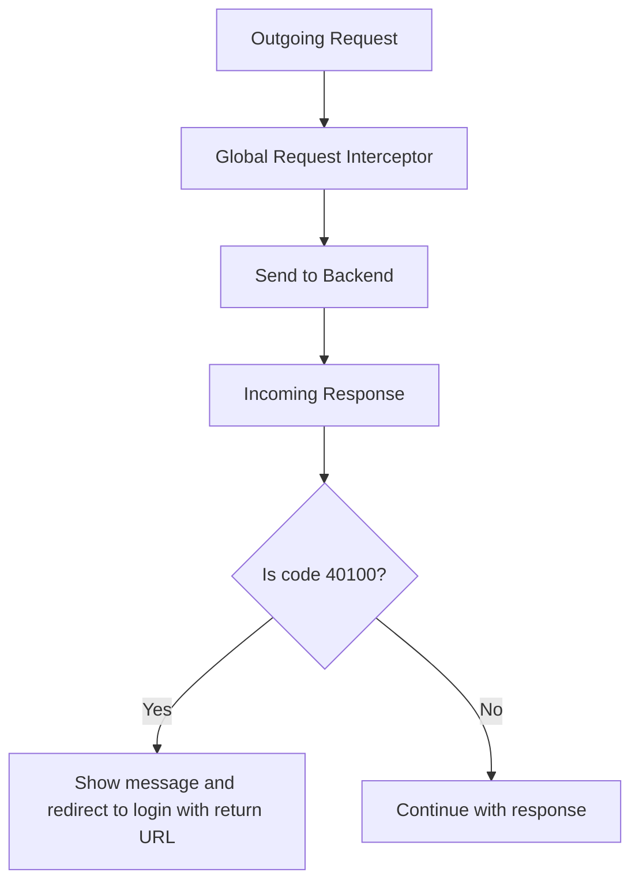

**Diagram sources**
- [request.ts:13-47](file://src/request.ts#L13-L47)

**Section sources**
- [request.ts:6-10](file://src/request.ts#L6-L10)
- [request.ts:26-47](file://src/request.ts#L26-L47)
- [login-api.js:23-31](file://src/views/loginUser/js/login-api.js#L23-L31)
- [index.vue:44-54](file://src/views/loginUser/index.vue#L44-L54)

### Login Form Component Implementation
- Provides a single action to initiate DingTalk OAuth.
- Includes commented-out traditional login logic for future expansion.
- Uses a fixed client ID and redirect URI for DingTalk OAuth.

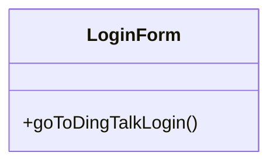

**Diagram sources**
- [LoginForm.vue:25-41](file://src/views/loginUser/components/LoginForm.vue#L25-L41)

**Section sources**
- [LoginForm.vue:1-42](file://src/views/loginUser/components/LoginForm.vue#L1-L42)

### API Layer Integration
- DingTalk endpoints:
  - Health check: GET /dingUser/get/login
  - Login: POST /dingUser/login with authCode
  - Logout: POST /dingUser/logout
- DingTalk token retrieval: GET /api/dingtalk/token
- Typings define response shapes for SysUserVO and BaseResponse wrappers.

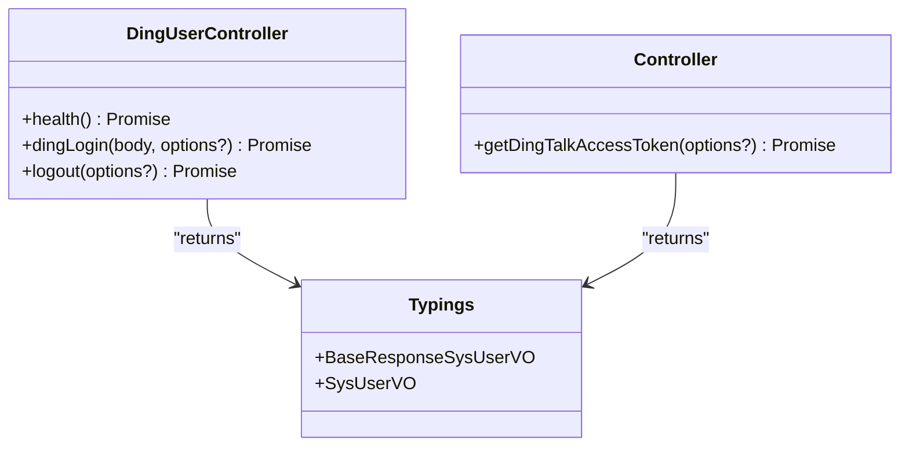

**Diagram sources**
- [dingUserController.ts:5-43](file://src/api/dingUserController.ts#L5-L43)
- [controller.ts:5-11](file://src/api/controller.ts#L5-L11)
- [typings.d.ts:20-57](file://src/api/typings.d.ts#L20-L57)

**Section sources**
- [dingUserController.ts:5-43](file://src/api/dingUserController.ts#L5-L43)
- [controller.ts:5-11](file://src/api/controller.ts#L5-L11)
- [typings.d.ts:20-57](file://src/api/typings.d.ts#L20-L57)

### Route Protection and Access Control
- The router’s beforeEach hook checks the current user from the store.
- Routes under /admin require admin role; routes under /test require any logged-in user.
- Unauthenticated users are redirected to the login page with a return URL.

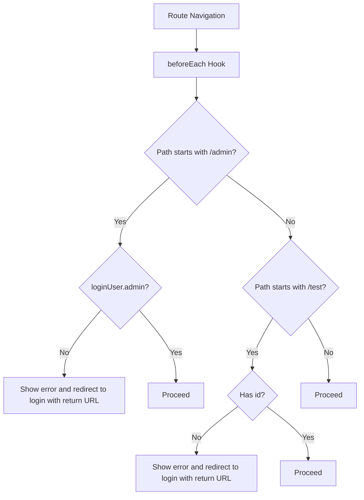

**Diagram sources**
- [access.ts:11-39](file://src/access.ts#L11-L39)

**Section sources**
- [access.ts:11-39](file://src/access.ts#L11-L39)
- [index.ts:17-19](file://src/router/index.ts#L17-L19)

### Logout and DingTalk Session Cleanup
- Calls the logout endpoint and clears local state.
- Triggers DingTalk logout by redirecting to DingTalk’s official logout URL with client_id and continue parameters.

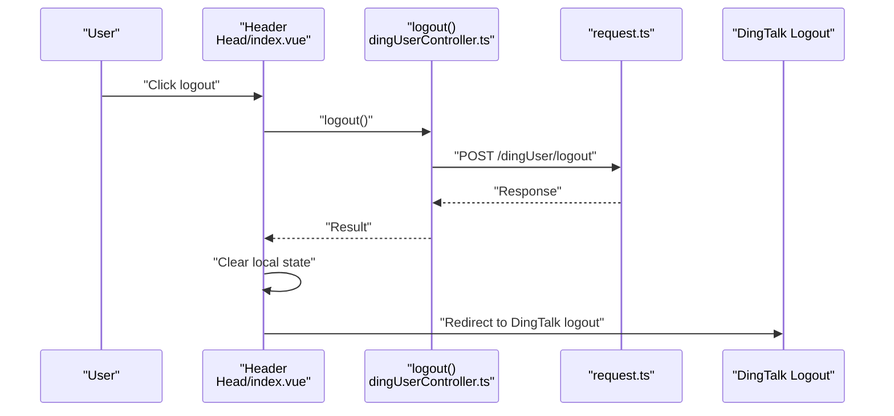

**Diagram sources**
- [Head/index.vue:166-199](file://src/layout/components/Head/index.vue#L166-L199)
- [dingUserController.ts:29-34](file://src/api/dingUserController.ts#L29-L34)
- [request.ts:6-10](file://src/request.ts#L6-L10)

**Section sources**
- [Head/index.vue:166-199](file://src/layout/components/Head/index.vue#L166-L199)
- [dingUserController.ts:29-34](file://src/api/dingUserController.ts#L29-L34)

## Dependency Analysis
- LoginForm depends on window location redirection for DingTalk OAuth.
- Login page depends on router/query parsing, mock login API, and DingTalk login API.
- API layer depends on the shared Axios instance for HTTP communication.
- Pinia store depends on health API to hydrate login state.
- Router guards depend on the store to enforce access policies.
- Header component depends on health and logout APIs and the store.

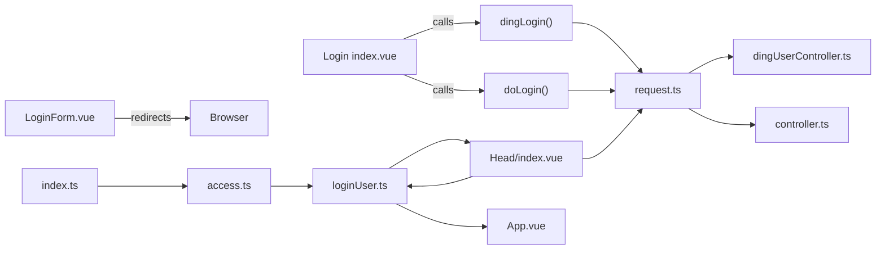

**Diagram sources**
- [LoginForm.vue:25-41](file://src/views/loginUser/components/LoginForm.vue#L25-L41)
- [index.vue:17-70](file://src/views/loginUser/index.vue#L17-L70)
- [login-api.js:5-38](file://src/views/loginUser/js/login-api.js#L5-L38)
- [dingUserController.ts:14-34](file://src/api/dingUserController.ts#L14-L34)
- [controller.ts:6-11](file://src/api/controller.ts#L6-L11)
- [request.ts:6-10](file://src/request.ts#L6-L10)
- [loginUser.ts:17-22](file://src/stors/loginUser.ts#L17-L22)
- [index.ts:1-40](file://src/router/index.ts#L1-L40)
- [access.ts:11-39](file://src/access.ts#L11-L39)
- [App.vue:12-13](file://src/App.vue#L12-L13)
- [Head/index.vue:132-199](file://src/layout/components/Head/index.vue#L132-L199)

**Section sources**
- [LoginForm.vue:25-41](file://src/views/loginUser/components/LoginForm.vue#L25-L41)
- [index.vue:17-70](file://src/views/loginUser/index.vue#L17-L70)
- [login-api.js:5-38](file://src/views/loginUser/js/login-api.js#L5-L38)
- [dingUserController.ts:14-34](file://src/api/dingUserController.ts#L14-L34)
- [controller.ts:6-11](file://src/api/controller.ts#L6-L11)
- [request.ts:6-10](file://src/request.ts#L6-L10)
- [loginUser.ts:17-22](file://src/stors/loginUser.ts#L17-L22)
- [index.ts:1-40](file://src/router/index.ts#L1-L40)
- [access.ts:11-39](file://src/access.ts#L11-L39)
- [App.vue:12-13](file://src/App.vue#L12-L13)
- [Head/index.vue:132-199](file://src/layout/components/Head/index.vue#L132-L199)

## Performance Considerations
- Minimize repeated health checks by caching the login state in the Pinia store and refreshing only when necessary.
- Debounce or throttle route change events that trigger login state checks.
- Avoid unnecessary localStorage writes; batch updates when persisting user info.
- Prefer server-side sessions with cookies (as indicated by the DingTalk flow) to reduce client-side token management overhead.

## Troubleshooting Guide
Common issues and resolutions:
- 401 Unauthorized responses:
  - Symptom: Automatic redirect to login with a warning message.
  - Cause: Backend returned 40100 or missing credentials.
  - Resolution: Ensure cookies/session is present; verify backend authentication middleware.
- DingTalk OAuth failures:
  - Symptom: Login fails with an error message or reloads the page.
  - Cause: Invalid code, backend misconfiguration, or network error.
  - Resolution: Verify redirect_uri matches DingTalk app settings, check backend /dingUser/login endpoint, and inspect network tab for errors.
- Mock login not persisting:
  - Symptom: Token/user info not stored after username/password login.
  - Cause: Empty username or localStorage write failure.
  - Resolution: Add input validation and confirm localStorage availability.
- Route protection not working:
  - Symptom: Unauthorized users can access protected routes.
  - Cause: Store hydration race condition or incorrect role checks.
  - Resolution: Ensure store fetch runs before guards and verify role field presence.

**Section sources**
- [request.ts:29-39](file://src/request.ts#L29-L39)
- [index.vue:57-68](file://src/views/loginUser/index.vue#L57-L68)
- [login-api.js:26-31](file://src/views/loginUser/js/login-api.js#L26-L31)
- [access.ts:22-37](file://src/access.ts#L22-L37)

## Conclusion
The authentication system combines DingTalk OAuth with a mock username/password flow, backed by a centralized Axios instance, Pinia store, and router guards. Automatic login state checks keep the UI synchronized with backend session state, while global interceptors streamline error handling and redirects. The design supports scalable enhancements, such as integrating real username/password endpoints and refining UI feedback and loading states.