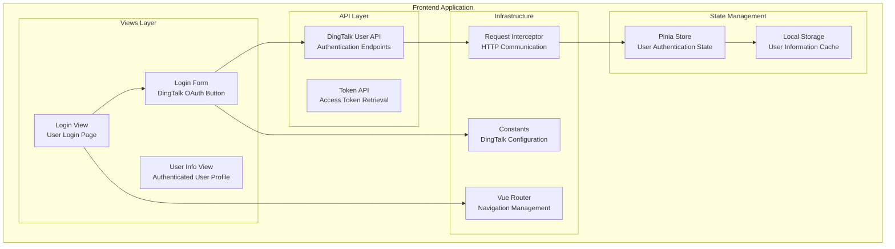
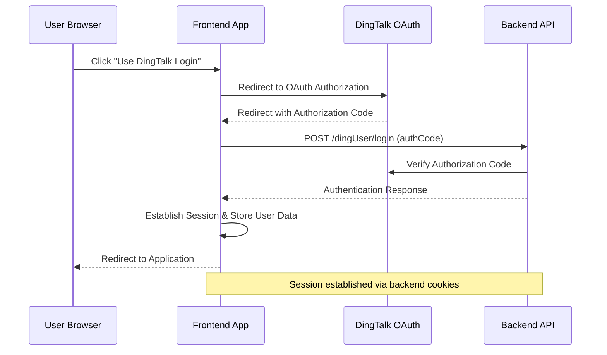
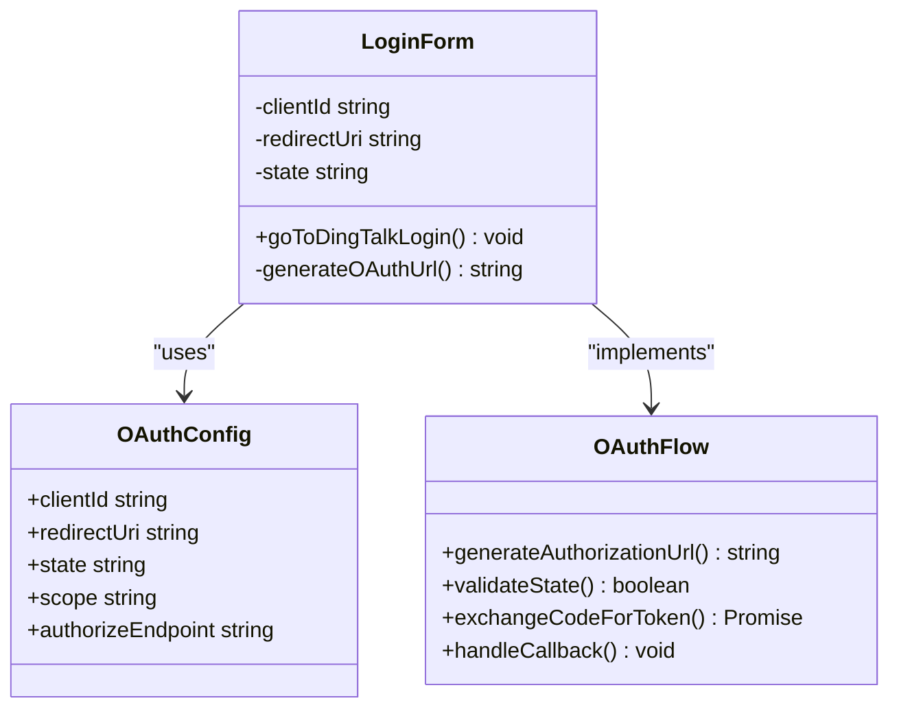
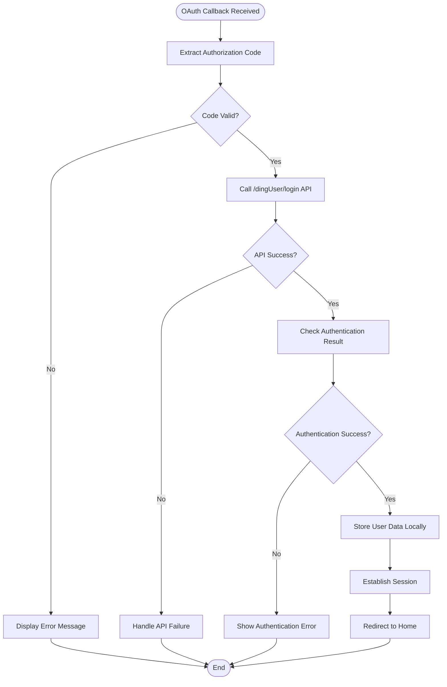
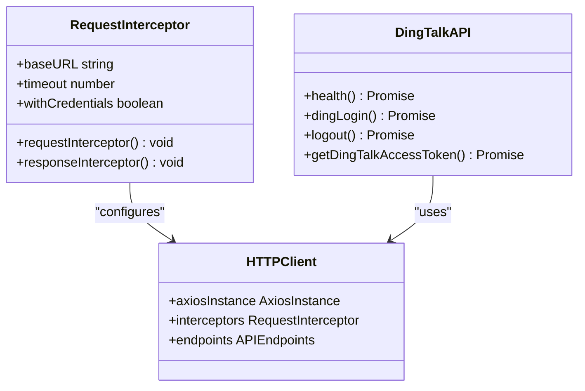
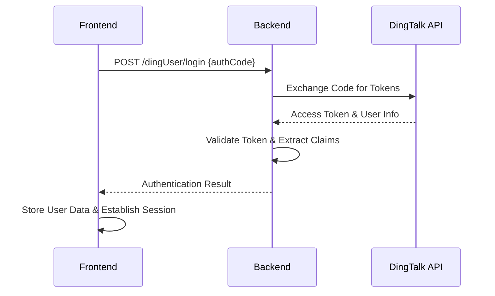
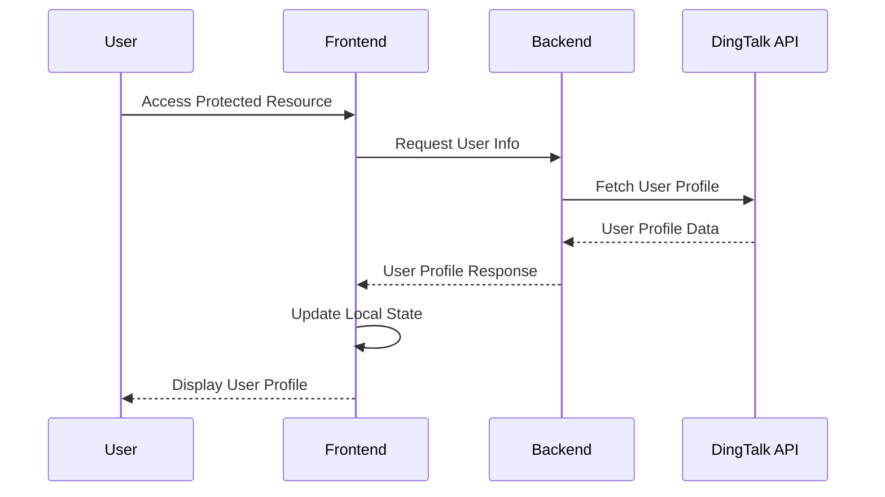

# DingTalk OAuth Integration

<cite>
**Referenced Files in This Document**
- [LoginForm.vue](file://src/views/loginUser/components/LoginForm.vue)
- [loginUser/index.vue](file://src/views/loginUser/index.vue)
- [login-api.js](file://src/views/loginUser/js/login-api.js)
- [dingUserController.ts](file://src/api/dingUserController.ts)
- [controller.ts](file://src/api/controller.ts)
- [request.ts](file://src/request.ts)
- [index.ts](file://src/router/index.ts)
- [loginUser.ts](file://src/stors/loginUser.ts)
- [constants.ts](file://src/config/constants.ts)
- [head/index.vue](file://src/layout/components/Head/index.vue)
- [main.ts](file://src/main.ts)
- [package.json](file://package.json)
</cite>

## Table of Contents
1. [Introduction](#introduction)
2. [Project Structure](#project-structure)
3. [Core Components](#core-components)
4. [Architecture Overview](#architecture-overview)
5. [Detailed Component Analysis](#detailed-component-analysis)
6. [OAuth Flow Implementation](#oauth-flow-implementation)
7. [API Endpoints](#api-endpoints)
8. [Security Considerations](#security-considerations)
9. [Error Handling](#error-handling)
10. [Session Management](#session-management)
11. [Practical Examples](#practical-examples)
12. [Troubleshooting Guide](#troubleshooting-guide)
13. [Conclusion](#conclusion)

## Introduction

This document provides comprehensive documentation for the DingTalk OAuth integration system implemented in the frontend application. The system enables single sign-on (SSO) authentication through DingTalk's OAuth 2.0 platform, allowing users to authenticate using their DingTalk credentials. The implementation follows modern OAuth 2.0 best practices while integrating seamlessly with the existing Vue.js application architecture.

The integration supports both traditional OAuth login flows and DingTalk-specific authentication mechanisms, providing a robust foundation for enterprise SSO solutions. The system handles token management, user session persistence, and secure communication with DingTalk's authentication servers.

## Project Structure

The DingTalk OAuth integration is organized within a modular Vue.js application structure that separates concerns between authentication logic, API communication, and user interface components.



**Diagram sources**
- [main.ts:1-19](file://src/main.ts#L1-L19)
- [index.ts:1-40](file://src/router/index.ts#L1-L40)
- [constants.ts:1-3](file://src/config/constants.ts#L1-L3)

**Section sources**
- [main.ts:1-19](file://src/main.ts#L1-L19)
- [index.ts:1-40](file://src/router/index.ts#L1-L40)

## Core Components

The DingTalk OAuth integration consists of several key components that work together to provide seamless authentication:

### Authentication Components
- **LoginForm Component**: Provides the user interface for initiating DingTalk OAuth authentication
- **Login View**: Handles the OAuth callback processing and user session establishment
- **DingTalk User API**: Manages authentication endpoints and user session operations

### State Management
- **Pinia Store**: Centralized state management for user authentication data
- **Local Storage**: Persistent storage for user information and authentication tokens

### Infrastructure Components
- **Request Interceptor**: Handles HTTP communication with automatic credential management
- **Router Configuration**: Manages navigation and route protection
- **Constants Module**: Stores DingTalk OAuth configuration parameters

**Section sources**
- [LoginForm.vue:1-42](file://src/views/loginUser/components/LoginForm.vue#L1-L42)
- [loginUser/index.vue:1-71](file://src/views/loginUser/index.vue#L1-L71)
- [loginUser.ts:1-33](file://src/stors/loginUser.ts#L1-L33)

## Architecture Overview

The authentication architecture follows a client-side OAuth 2.0 flow with server-side session management:



**Diagram sources**
- [LoginForm.vue:24-41](file://src/views/loginUser/components/LoginForm.vue#L24-L41)
- [loginUser/index.vue:33-70](file://src/views/loginUser/index.vue#L33-L70)
- [dingUserController.ts:13-26](file://src/api/dingUserController.ts#L13-L26)

The architecture implements a hybrid approach where the frontend initiates OAuth but delegates token verification and session management to the backend, ensuring security compliance and centralized authentication control.

## Detailed Component Analysis

### OAuth Login Component

The OAuth login component serves as the primary entry point for DingTalk authentication:



**Diagram sources**
- [LoginForm.vue:24-41](file://src/views/loginUser/components/LoginForm.vue#L24-L41)
- [constants.ts:1-3](file://src/config/constants.ts#L1-L3)

The component generates OAuth URLs with proper parameter encoding and implements state parameter validation to prevent CSRF attacks.

**Section sources**
- [LoginForm.vue:24-41](file://src/views/loginUser/components/LoginForm.vue#L24-L41)
- [constants.ts:1-3](file://src/config/constants.ts#L1-L3)

### Authentication Callback Handler

The login view component processes OAuth callbacks and manages user session establishment:



**Diagram sources**
- [loginUser/index.vue:33-70](file://src/views/loginUser/index.vue#L33-L70)
- [dingUserController.ts:13-26](file://src/api/dingUserController.ts#L13-L26)

**Section sources**
- [loginUser/index.vue:33-70](file://src/views/loginUser/index.vue#L33-L70)
- [loginUser/index.vue:13-20](file://src/views/loginUser/index.vue#L13-L20)

### API Communication Layer

The API communication layer provides standardized HTTP requests with automatic credential management:



**Diagram sources**
- [request.ts:5-49](file://src/request.ts#L5-L49)
- [dingUserController.ts:1-43](file://src/api/dingUserController.ts#L1-L43)
- [controller.ts:1-12](file://src/api/controller.ts#L1-L12)

**Section sources**
- [request.ts:5-49](file://src/request.ts#L5-L49)
- [dingUserController.ts:1-43](file://src/api/dingUserController.ts#L1-L43)

## OAuth Flow Implementation

The OAuth flow implementation follows DingTalk's OAuth 2.0 specification with enhanced security measures:

### Authorization Request Generation

The system generates OAuth authorization URLs with proper parameter encoding and security validation:

1. **Client ID Configuration**: Uses the configured DingTalk AppKey for authentication
2. **Redirect URI Setup**: Encodes the callback URL for safe transmission
3. **State Parameter**: Implements anti-CSRF protection with random state generation
4. **Scope Definition**: Requests appropriate permissions for user authentication

### Authorization Code Exchange

The authorization code exchange process ensures secure token acquisition:



**Diagram sources**
- [loginUser/index.vue:42-44](file://src/views/loginUser/index.vue#L42-L44)
- [dingUserController.ts:13-26](file://src/api/dingUserController.ts#L13-L26)

**Section sources**
- [LoginForm.vue:25-41](file://src/views/loginUser/components/LoginForm.vue#L25-L41)
- [loginUser/index.vue:33-70](file://src/views/loginUser/index.vue#L33-L70)

## API Endpoints

The system exposes several API endpoints for OAuth authentication and user management:

### Authentication Endpoints

| Endpoint | Method | Description | Request Body | Response |
|----------|--------|-------------|--------------|----------|
| `/dingUser/get/login` | GET | Check user authentication status | None | BaseResponseSysUserVO |
| `/dingUser/login` | POST | Authenticate user via DingTalk OAuth | `{ authCode: string }` | BaseResponseSysUserVO |
| `/dingUser/logout` | POST | Logout user and clear session | None | BaseResponseString |
| `/dingUser/test` | GET | Test endpoint for authentication | None | String |

### Token Management Endpoint

| Endpoint | Method | Description | Request Body | Response |
|----------|--------|-------------|--------------|----------|
| `/api/dingtalk/token` | GET | Retrieve DingTalk access token | None | Record<string, any> |

**Section sources**
- [dingUserController.ts:5-42](file://src/api/dingUserController.ts#L5-L42)
- [controller.ts:5-11](file://src/api/controller.ts#L5-L11)

## Security Considerations

The OAuth implementation incorporates multiple security measures to protect user data and prevent unauthorized access:

### State Parameter Validation
- Implements CSRF protection against cross-site request forgery
- Generates random state values for each authentication request
- Validates state parameters upon OAuth callback

### Credential Management
- Automatic cookie-based session management
- Secure credential transmission with HTTPS
- Token storage in HTTP-only cookies

### Error Handling Security
- Graceful error handling without exposing sensitive information
- Proper logging of authentication failures
- Rate limiting prevention through state validation

### Redirect URI Validation
- Strict validation of redirect URIs
- Prevention of open redirect vulnerabilities
- Domain whitelisting enforcement

**Section sources**
- [LoginForm.vue:32-33](file://src/views/loginUser/components/LoginForm.vue#L32-L33)
- [request.ts:29-39](file://src/request.ts#L29-L39)

## Error Handling

The system implements comprehensive error handling for various OAuth authentication scenarios:

### Authentication Failure Scenarios

```mermaid
flowchart TD
AuthStart[Authentication Attempt] --> CheckCode{Has Authorization Code?}
CheckCode --> |No| NoCodeError[Display "Missing Authorization Code"]
CheckCode --> |Yes| ExchangeTokens[Exchange Code for Tokens]
ExchangeTokens --> TokenSuccess{Token Exchange Success?}
TokenSuccess --> |No| TokenError[Handle Token Exchange Error]
TokenSuccess --> |Yes| ValidateUser[Validate User Information]
ValidateUser --> UserValid{User Valid?}
UserValid --> |No| UserError[Handle User Validation Error]
UserValid --> |Yes| Success[Authentication Success]
NoCodeError --> LogError[Log Error Details]
TokenError --> LogError
UserError --> LogError
LogError --> ShowMessage[Display User-Friendly Message]
ShowMessage --> End[End]
Success --> End
```

**Diagram sources**
- [loginUser/index.vue:57-68](file://src/views/loginUser/index.vue#L57-L68)
- [request.ts:42-47](file://src/request.ts#L42-L47)

### Network Error Handling
- Automatic retry logic for transient network failures
- Timeout handling with user feedback
- Graceful degradation when backend services are unavailable

### Session Management Errors
- Automatic session cleanup on authentication failures
- User-friendly error messages without exposing technical details
- Redirect to login page for unauthenticated users

**Section sources**
- [loginUser/index.vue:57-68](file://src/views/loginUser/index.vue#L57-L68)
- [request.ts:42-47](file://src/request.ts#L42-L47)

## Session Management

The system implements robust session management through backend cookie-based sessions:

### Session Establishment
- Automatic session creation upon successful authentication
- Secure cookie configuration with HttpOnly flag
- Session timeout management and renewal

### User State Management
- Centralized user state through Pinia store
- Local storage caching for offline user information
- Real-time user status synchronization

### Session Cleanup
- Automatic cleanup on logout operations
- Frontend state reset and local storage clearing
- Backend session termination through DingTalk logout

**Section sources**
- [loginUser.ts:9-33](file://src/stors/loginUser.ts#L9-L33)
- [head/index.vue:175-199](file://src/layout/components/Head/index.vue#L175-L199)

## Practical Examples

### OAuth Callback Processing Example

The following example demonstrates the complete OAuth callback processing workflow:

1. **Initiate Authentication**: User clicks "Use DingTalk Login" button
2. **Generate OAuth URL**: System constructs authorization URL with parameters
3. **Redirect to DingTalk**: Browser navigates to DingTalk OAuth page
4. **Receive Callback**: System receives authorization code via redirect
5. **Validate Code**: System validates authorization code and state parameter
6. **Exchange Tokens**: System exchanges authorization code for access token
7. **Establish Session**: System establishes user session and stores user data

### User Profile Extraction Example



**Diagram sources**
- [loginUser.ts:16-22](file://src/stors/loginUser.ts#L16-L22)
- [request.ts:29-39](file://src/request.ts#L29-L39)

### Session Establishment Example

The session establishment process involves multiple steps to ensure secure authentication:

1. **Authentication Request**: System sends authorization code to backend
2. **Backend Verification**: Backend verifies authorization code with DingTalk
3. **Session Creation**: Backend creates server-side session with user data
4. **Cookie Setting**: Backend sets secure session cookie
5. **Frontend Update**: Frontend updates user state and redirects to application

**Section sources**
- [loginUser/index.vue:42-56](file://src/views/loginUser/index.vue#L42-L56)
- [loginUser.ts:16-22](file://src/stors/loginUser.ts#L16-L22)

## Troubleshooting Guide

### Common Authentication Issues

| Issue | Symptoms | Solution |
|-------|----------|----------|
| OAuth Redirect Loop | Browser continuously redirects between pages | Check redirect URI configuration in DingTalk app settings |
| Invalid State Error | Authentication fails with state validation error | Verify state parameter generation and validation logic |
| Token Exchange Failure | Authorization code cannot be exchanged for tokens | Check backend DingTalk API connectivity and credentials |
| Session Not Established | User appears logged in but session data missing | Verify cookie configuration and backend session storage |

### Debugging Authentication Flows

1. **Enable Developer Tools**: Use browser developer tools to monitor network requests
2. **Check Console Logs**: Monitor authentication flow in browser console
3. **Verify OAuth Parameters**: Ensure all required OAuth parameters are present
4. **Test Backend Endpoints**: Verify backend authentication endpoints are accessible

### Environment Configuration Issues

- **Base URL Configuration**: Ensure backend base URL is correctly configured
- **CORS Configuration**: Verify CORS settings allow frontend domain access
- **SSL Certificate**: Ensure HTTPS is properly configured for OAuth redirects

**Section sources**
- [request.ts:13-22](file://src/request.ts#L13-L22)
- [LoginForm.vue:29-30](file://src/views/loginUser/components/LoginForm.vue#L29-L30)

## Conclusion

The DingTalk OAuth integration system provides a comprehensive solution for enterprise single sign-on authentication. The implementation follows OAuth 2.0 best practices while leveraging DingTalk's authentication platform for secure user authentication.

Key strengths of the implementation include:

- **Security**: Comprehensive CSRF protection, secure credential management, and proper error handling
- **Scalability**: Modular architecture supporting easy extension and maintenance
- **User Experience**: Seamless authentication flow with graceful error handling
- **Integration**: Clean separation of concerns between frontend and backend authentication logic

The system successfully balances security requirements with user experience, providing a robust foundation for enterprise applications requiring DingTalk authentication capabilities. Future enhancements could include support for additional authentication providers, enhanced monitoring and logging capabilities, and improved error reporting mechanisms.