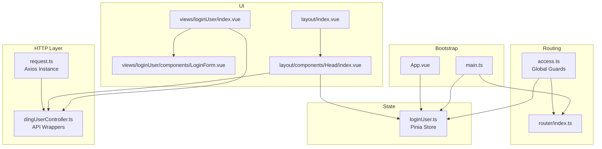
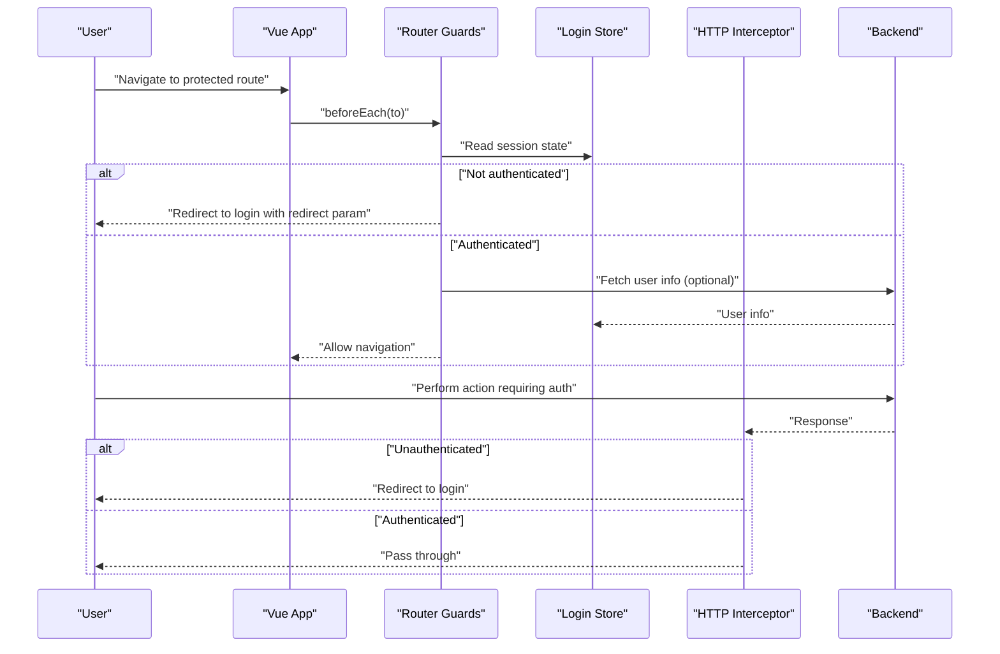
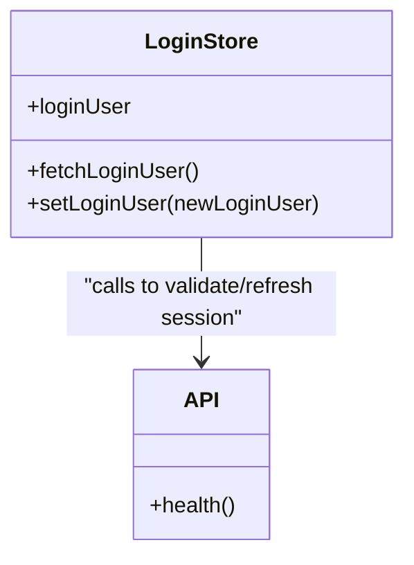
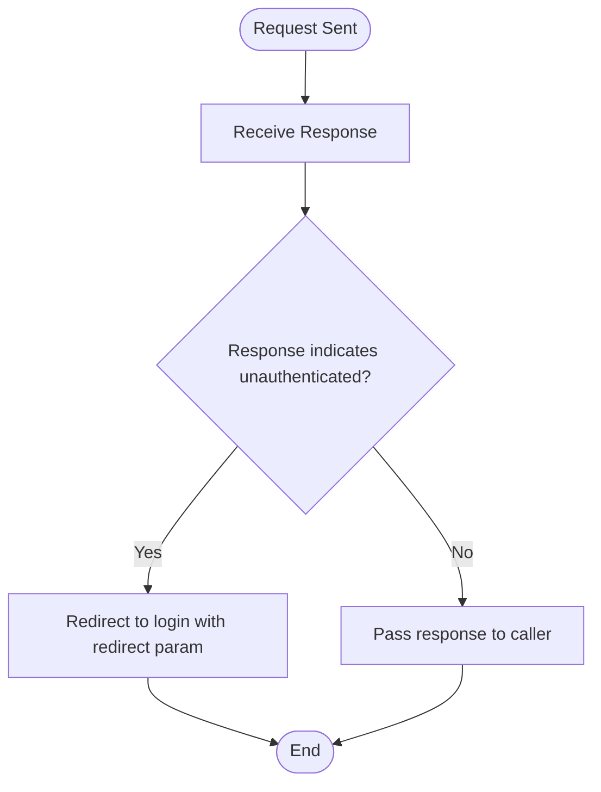
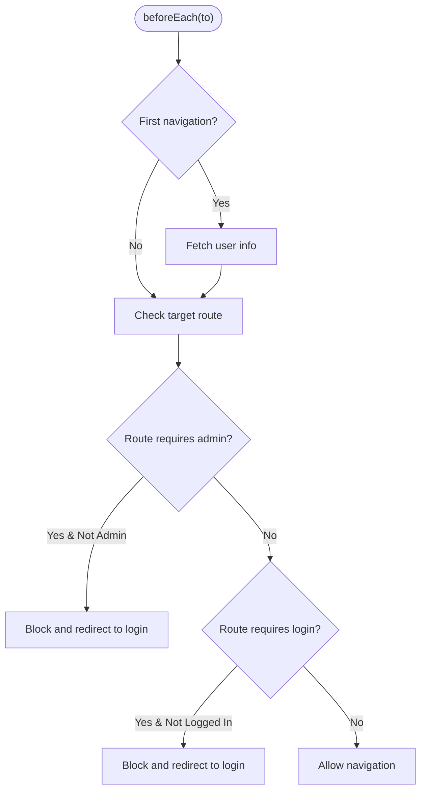
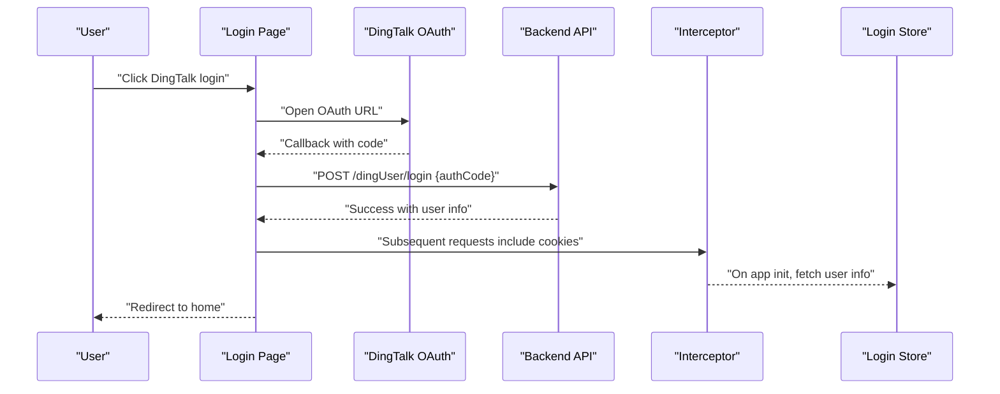
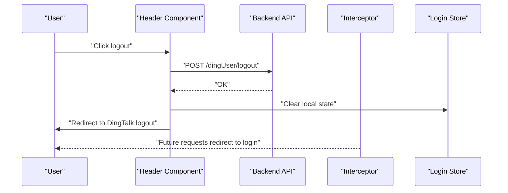
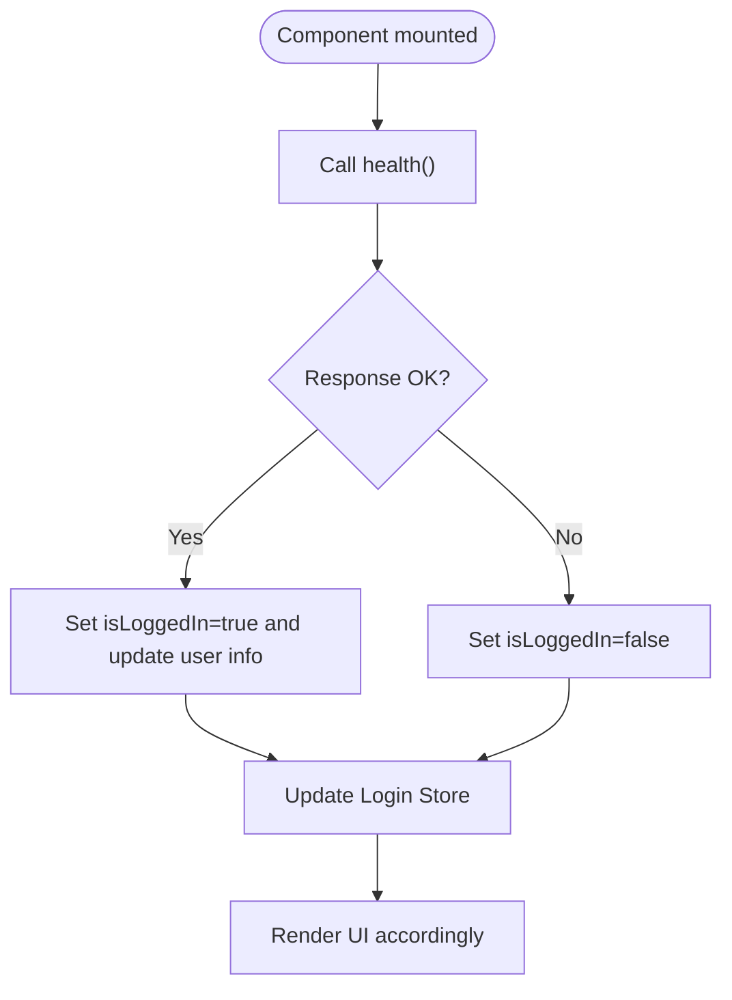
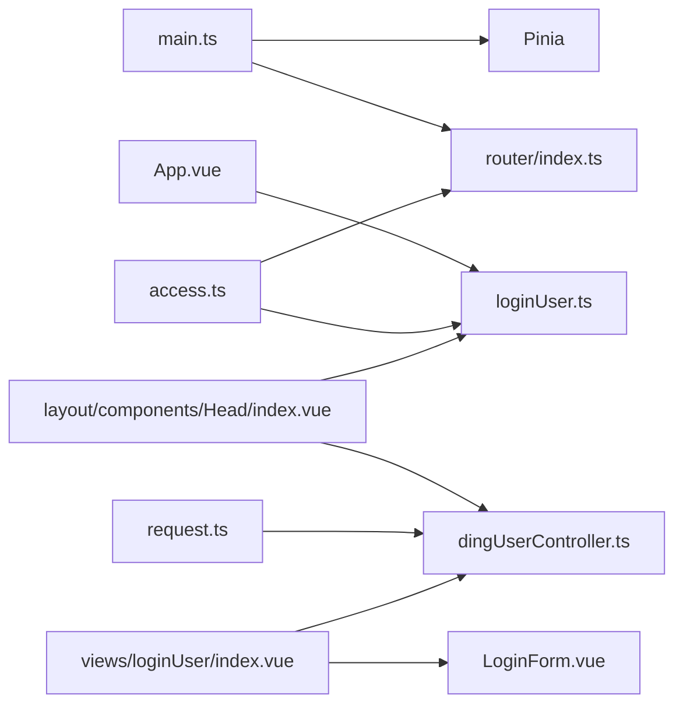

# Session Management

<cite>
**Referenced Files in This Document**
- [main.ts](file://src/main.ts)
- [App.vue](file://src/App.vue)
- [loginUser.ts](file://src/stors/loginUser.ts)
- [index.ts](file://src/router/index.ts)
- [access.ts](file://src/access.ts)
- [request.ts](file://src/request.ts)
- [dingUserController.ts](file://src/api/dingUserController.ts)
- [index.vue](file://src/views/loginUser/index.vue)
- [LoginForm.vue](file://src/views/loginUser/components/LoginForm.vue)
- [login-api.js](file://src/views/loginUser/js/login-api.js)
- [head-api.js](file://src/layout/components/Head/js/foot-api.js)
- [index.vue](file://src/layout/components/Head/index.vue)
- [index.vue](file://src/layout/index.vue)
</cite>

## Table of Contents
1. [Introduction](#introduction)
2. [Project Structure](#project-structure)
3. [Core Components](#core-components)
4. [Architecture Overview](#architecture-overview)
5. [Detailed Component Analysis](#detailed-component-analysis)
6. [Dependency Analysis](#dependency-analysis)
7. [Performance Considerations](#performance-considerations)
8. [Troubleshooting Guide](#troubleshooting-guide)
9. [Conclusion](#conclusion)

## Introduction
This document describes the session management system of the frontend application. It explains how user sessions are created via login flows, validated during navigation, and destroyed upon logout. It documents the integration between the login store, HTTP interceptors, and access control mechanisms, along with session persistence strategies, automatic session validation, and timeout handling. It also covers how session state affects route protection and navigation.

## Project Structure
The session management spans several layers:
- Application bootstrap initializes Pinia and Vue Router.
- A global login store holds the current user’s reactive state.
- HTTP requests are intercepted to centrally handle unauthenticated responses.
- Global route guards enforce access control based on session state.
- Login pages integrate with DingTalk OAuth for SSO-style login.
- UI components periodically validate session status and support logout.

**Diagram sources**
- [main.ts:1-19](file://src/main.ts#L1-L19)
- [App.vue:1-19](file://src/App.vue#L1-L19)
- [loginUser.ts:1-33](file://src/stors/loginUser.ts#L1-L33)
- [index.ts:1-40](file://src/router/index.ts#L1-L40)
- [access.ts:1-41](file://src/access.ts#L1-L41)
- [request.ts:1-49](file://src/request.ts#L1-L49)
- [dingUserController.ts:1-43](file://src/api/dingUserController.ts#L1-L43)
- [index.vue:1-71](file://src/views/loginUser/index.vue#L1-L71)
- [LoginForm.vue:1-42](file://src/views/loginUser/components/LoginForm.vue#L1-L42)
- [index.vue:124-218](file://src/layout/components/Head/index.vue#L124-L218)
- [index.vue:1-29](file://src/layout/index.vue#L1-29)

**Section sources**
- [main.ts:1-19](file://src/main.ts#L1-L19)
- [index.ts:1-40](file://src/router/index.ts#L1-L40)

## Core Components
- Login Store: Provides reactive access to the current user and a method to refresh user info from the backend.
- HTTP Interceptor: Centralizes authentication checks and redirects to login when encountering unauthenticated responses.
- Access Control: Route guards validate session state and enforce role-based access.
- Login Pages: Support both mock login and DingTalk OAuth login flows.
- UI Integration: Header component validates session status and supports logout.

**Section sources**
- [loginUser.ts:9-32](file://src/stors/loginUser.ts#L9-L32)
- [request.ts:13-47](file://src/request.ts#L13-L47)
- [access.ts:11-40](file://src/access.ts#L11-L40)
- [index.vue:1-71](file://src/views/loginUser/index.vue#L1-L71)
- [LoginForm.vue:24-41](file://src/views/loginUser/components/LoginForm.vue#L24-L41)
- [index.vue:132-151](file://src/layout/components/Head/index.vue#L132-L151)

## Architecture Overview
The session lifecycle integrates the following flows:
- On app initialization, the store fetches user info.
- During navigation, guards ensure the user is authenticated and authorized.
- HTTP responses are intercepted to detect unauthenticated states and redirect accordingly.
- Login pages initiate DingTalk OAuth and finalize session creation server-side via cookies.
- Logout clears local state and triggers DingTalk logout to invalidate session cookies.

**Diagram sources**
- [access.ts:11-40](file://src/access.ts#L11-L40)
- [loginUser.ts:17-22](file://src/stors/loginUser.ts#L17-L22)
- [request.ts:26-41](file://src/request.ts#L26-L41)

## Detailed Component Analysis

### Login Store and Session State
- Purpose: Centralizes current user state and exposes a method to refresh it from the backend.
- Persistence: Reactive state is held in memory via Pinia; user info is refreshed on first navigation and on demand.
- Validation: A dedicated endpoint returns the current user if authenticated; otherwise an unauthenticated response is returned by the interceptor.

**Diagram sources**
- [loginUser.ts:9-32](file://src/stors/loginUser.ts#L9-L32)
- [dingUserController.ts:6-11](file://src/api/dingUserController.ts#L6-L11)

**Section sources**
- [loginUser.ts:9-32](file://src/stors/loginUser.ts#L9-L32)
- [dingUserController.ts:6-11](file://src/api/dingUserController.ts#L6-L11)

### HTTP Interceptor and Automatic Session Renewal
- Base configuration enables credentials to be included automatically with cross-origin requests.
- Response interceptor detects unauthenticated responses and redirects to the login page with a redirect parameter.
- This mechanism acts as automatic session renewal by prompting re-authentication when the session expires or is invalid.

**Diagram sources**
- [request.ts:6-10](file://src/request.ts#L6-L10)
- [request.ts:26-41](file://src/request.ts#L26-L41)

**Section sources**
- [request.ts:6-10](file://src/request.ts#L6-L10)
- [request.ts:26-41](file://src/request.ts#L26-L41)

### Access Control and Route Protection
- Global beforeEach guard:
  - On first navigation, fetches user info to ensure session validity.
  - Enforces role-based access for admin routes.
  - Restricts access to authenticated-only routes.
  - Redirects unauthenticated users to the login page with a redirect parameter.

**Diagram sources**
- [access.ts:11-40](file://src/access.ts#L11-L40)

**Section sources**
- [access.ts:11-40](file://src/access.ts#L11-L40)

### Login Flow and Session Creation
- Mock login:
  - Stores token and user info in local storage.
  - Subsequent requests include the token automatically.
- DingTalk OAuth login:
  - Initiates OAuth with DingTalk and receives an authorization code.
  - Exchanges the code for a session via backend endpoint.
  - Backend sets session cookie; subsequent requests include cookies automatically.
  - On success, navigates to home and clears the authorization code from the URL.

**Diagram sources**
- [LoginForm.vue:24-41](file://src/views/loginUser/components/LoginForm.vue#L24-L41)
- [index.vue:34-70](file://src/views/loginUser/index.vue#L34-L70)
- [dingUserController.ts:14-26](file://src/api/dingUserController.ts#L14-L26)
- [request.ts:9](file://src/request.ts#L9)
- [loginUser.ts:17-22](file://src/stors/loginUser.ts#L17-L22)

**Section sources**
- [login-api.js:5-38](file://src/views/loginUser/js/login-api.js#L5-L38)
- [LoginForm.vue:24-41](file://src/views/loginUser/components/LoginForm.vue#L24-L41)
- [index.vue:34-70](file://src/views/loginUser/index.vue#L34-L70)
- [dingUserController.ts:14-26](file://src/api/dingUserController.ts#L14-L26)

### Logout Flow and Session Destruction
- Calls backend logout endpoint to terminate server-side session.
- Clears local reactive state and optional local storage entries.
- Triggers DingTalk logout to clear cookies and redirect back to the login page.

**Diagram sources**
- [index.vue:166-199](file://src/layout/components/Head/index.vue#L166-L199)
- [dingUserController.ts:29-34](file://src/api/dingUserController.ts#L29-L34)
- [request.ts:31-38](file://src/request.ts#L31-L38)

**Section sources**
- [index.vue:166-199](file://src/layout/components/Head/index.vue#L166-L199)
- [dingUserController.ts:29-34](file://src/api/dingUserController.ts#L29-L34)

### Session Validation and UI Integration
- Header component periodically checks session status by calling the health endpoint.
- Updates reactive state and displays user info when authenticated.
- Ensures UI reflects current session state and provides logout controls.

**Diagram sources**
- [index.vue:132-151](file://src/layout/components/Head/index.vue#L132-L151)
- [dingUserController.ts:6-11](file://src/api/dingUserController.ts#L6-L11)
- [loginUser.ts:24-26](file://src/stors/loginUser.ts#L24-L26)

**Section sources**
- [index.vue:132-151](file://src/layout/components/Head/index.vue#L132-L151)
- [loginUser.ts:24-26](file://src/stors/loginUser.ts#L24-L26)

## Dependency Analysis
- Bootstrap dependencies: main.ts registers Pinia and Router globally.
- App initialization: App.vue triggers initial session fetch.
- Store dependency: access.ts and header component depend on the login store.
- HTTP dependency: All API calls go through the configured Axios instance with interceptors.
- Routing dependency: access.ts depends on router configuration and the login store.

**Diagram sources**
- [main.ts:10-16](file://src/main.ts#L10-L16)
- [App.vue:10-13](file://src/App.vue#L10-L13)
- [access.ts:1-3](file://src/access.ts#L1-L3)
- [index.vue:1-20](file://src/layout/components/Head/index.vue#L1-L20)
- [request.ts:1-10](file://src/request.ts#L1-L10)
- [index.vue:1-20](file://src/views/loginUser/index.vue#L1-L20)
- [LoginForm.vue:1-42](file://src/views/loginUser/components/LoginForm.vue#L1-L42)

**Section sources**
- [main.ts:10-16](file://src/main.ts#L10-L16)
- [App.vue:10-13](file://src/App.vue#L10-L13)
- [access.ts:1-3](file://src/access.ts#L1-L3)

## Performance Considerations
- Minimize unnecessary session refreshes: cache user info after the first fetch and reuse until logout or invalidation.
- Debounce or throttle periodic health checks in UI components to avoid excessive backend calls.
- Keep interceptors lightweight to reduce latency on every request.
- Prefer server-side session timeouts aligned with backend policies to avoid stale client-side state.

## Troubleshooting Guide
- Symptom: Redirect loop to login after successful DingTalk login.
  - Cause: Interceptor redirect logic triggered by a non-session request returning 401-like response.
  - Resolution: Ensure the login callback does not trigger the interceptor redirect and that the session cookie is present before subsequent requests.
  - Section sources
    - [index.vue:44-56](file://src/views/loginUser/index.vue#L44-L56)
    - [request.ts:31-38](file://src/request.ts#L31-L38)

- Symptom: Admin-only routes still accessible by non-admin users.
  - Cause: Missing role check or incorrect role field.
  - Resolution: Verify the role check condition and ensure the backend returns the correct role value.
  - Section sources
    - [access.ts:22-28](file://src/access.ts#L22-L28)

- Symptom: UI shows “Logged in” but backend rejects requests.
  - Cause: Session expired or cleared; missing cookie propagation.
  - Resolution: Trigger a fresh session fetch on first navigation and ensure credentials are enabled.
  - Section sources
    - [access.ts:16-20](file://src/access.ts#L16-L20)
    - [request.ts:9](file://src/request.ts#L9)

- Symptom: Logout does not clear UI state.
  - Cause: Missing local state reset or incomplete cookie clearing.
  - Resolution: Clear reactive state and optionally local storage; trigger DingTalk logout to clear cookies.
  - Section sources
    - [index.vue:175-193](file://src/layout/components/Head/index.vue#L175-L193)

## Conclusion
The session management system combines a reactive login store, centralized HTTP interceptors, and global route guards to maintain secure and consistent session state. Login flows support both mock and DingTalk OAuth, while logout ensures both client and server-side cleanup. The design leverages automatic cookie inclusion and interceptor-driven redirects to handle session expiration transparently, and route guards enforce access control based on session and role checks.