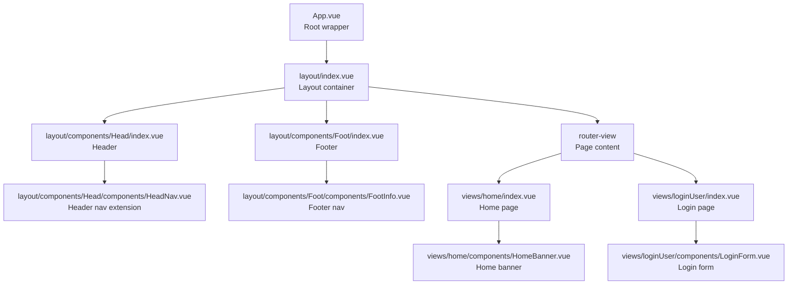
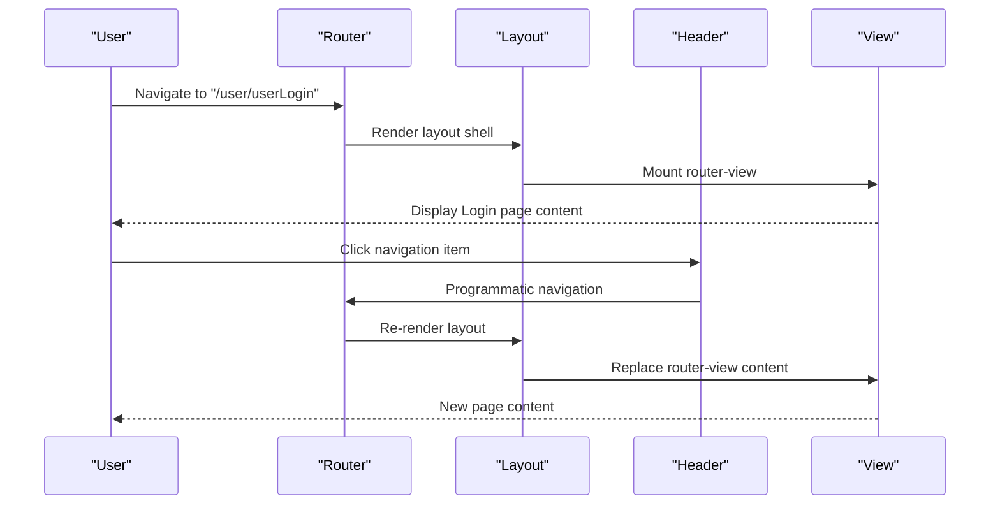
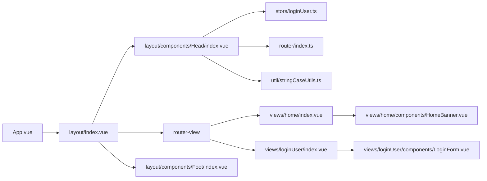

# Component System

<cite>
**Referenced Files in This Document**
- [App.vue](file://src/App.vue)
- [layout/index.vue](file://src/layout/index.vue)
- [layout/components/Head/index.vue](file://src/layout/components/Head/index.vue)
- [layout/components/Head/components/HeadNav.vue](file://src/layout/components/Head/components/HeadNav.vue)
- [layout/components/Foot/index.vue](file://src/layout/components/Foot/index.vue)
- [layout/components/Foot/components/FootInfo.vue](file://src/layout/components/Foot/components/FootInfo.vue)
- [layout/components/Aside/index.vue](file://src/layout/components/Aside/index.vue)
- [router/index.ts](file://src/router/index.ts)
- [views/home/index.vue](file://src/views/home/index.vue)
- [views/home/components/HomeBanner.vue](file://src/views/home/components/HomeBanner.vue)
- [views/loginUser/index.vue](file://src/views/loginUser/index.vue)
- [views/loginUser/components/LoginForm.vue](file://src/views/loginUser/components/LoginForm.vue)
- [stors/loginUser.ts](file://src/stors/loginUser.ts)
- [util/stringCaseUtils.ts](file://src/util/stringCaseUtils.ts)
- [style.css](file://src/style.css)
</cite>

## Table of Contents
1. [Introduction](#introduction)
2. [Project Structure](#project-structure)
3. [Core Components](#core-components)
4. [Architecture Overview](#architecture-overview)
5. [Detailed Component Analysis](#detailed-component-analysis)
6. [Dependency Analysis](#dependency-analysis)
7. [Performance Considerations](#performance-considerations)
8. [Troubleshooting Guide](#troubleshooting-guide)
9. [Conclusion](#conclusion)
10. [Appendices](#appendices)

## Introduction
This section documents the component-based architecture of the frontend application, focusing on the layout system composed of header, footer, and sidebar components, and how they integrate with page-level views. It explains the component hierarchy, prop passing, event handling, and slot-based composition patterns. It also covers reusable UI components, customization options, styling approaches, responsive design patterns, lifecycle considerations, performance optimization, and accessibility.

## Project Structure
The application follows a clear separation of concerns:
- Global layout container wraps all pages and defines the top-level structure.
- Header and Footer are reusable layout components.
- Sidebar is present but currently minimal; it is intended for future expansion.
- Views represent page-level containers that render page-specific content via router-view.
- Utilities and stores encapsulate cross-cutting concerns like user roles and global state.

**Diagram sources**
- [App.vue:1-19](file://src/App.vue#L1-L19)
- [layout/index.vue:1-29](file://src/layout/index.vue#L1-L29)
- [layout/components/Head/index.vue:1-279](file://src/layout/components/Head/index.vue#L1-L279)
- [layout/components/Head/components/HeadNav.vue:1-2](file://src/layout/components/Head/components/HeadNav.vue#L1-L2)
- [layout/components/Foot/index.vue:1-15](file://src/layout/components/Foot/index.vue#L1-L15)
- [layout/components/Foot/components/FootInfo.vue:1-15](file://src/layout/components/Foot/components/FootInfo.vue#L1-L15)
- [views/home/index.vue:1-12](file://src/views/home/index.vue#L1-L12)
- [views/home/components/HomeBanner.vue:1-10](file://src/views/home/components/HomeBanner.vue#L1-L10)
- [views/loginUser/index.vue:1-71](file://src/views/loginUser/index.vue#L1-L71)
- [views/loginUser/components/LoginForm.vue:1-42](file://src/views/loginUser/components/LoginForm.vue#L1-L42)

**Section sources**
- [App.vue:1-19](file://src/App.vue#L1-L19)
- [layout/index.vue:1-29](file://src/layout/index.vue#L1-L29)
- [router/index.ts:1-40](file://src/router/index.ts#L1-L40)

## Core Components
- Layout container: Provides a flex-column layout with a sticky header and footer, and a flexible main content area that expands to fill available space.
- Header (navigation): Renders a horizontal menu with nested submenus, dynamic visibility based on login and role, and a profile dropdown with avatar and actions.
- Footer: Placeholder component for bottom navigation or branding.
- Sidebar: Minimal placeholder for future vertical navigation or auxiliary panels.
- Page-level views: Home and Login views demonstrate composition with reusable components and router-driven rendering.

Key integration patterns:
- Composition: The layout composes header, router-view, and footer. Pages are rendered inside router-view.
- State sharing: A Pinia store holds login state consumed by the header and propagated to downstream components.
- Routing: Vue Router maps paths to views; navigation triggers programmatic routing in the header.

**Section sources**
- [layout/index.vue:1-29](file://src/layout/index.vue#L1-L29)
- [layout/components/Head/index.vue:1-279](file://src/layout/components/Head/index.vue#L1-L279)
- [layout/components/Foot/index.vue:1-15](file://src/layout/components/Foot/index.vue#L1-L15)
- [layout/components/Aside/index.vue:1-17](file://src/layout/components/Aside/index.vue#L1-L17)
- [views/home/index.vue:1-12](file://src/views/home/index.vue#L1-L12)
- [views/loginUser/index.vue:1-71](file://src/views/loginUser/index.vue#L1-L71)
- [stors/loginUser.ts:1-33](file://src/stors/loginUser.ts#L1-L33)

## Architecture Overview
The layout system centers around a single-page application (SPA) pattern:
- App.vue renders the Layout container.
- Layout defines the shell with header, main content area, and footer.
- Router-view renders the current view based on the URL.
- Views import and compose page-specific components.

**Diagram sources**
- [router/index.ts:1-40](file://src/router/index.ts#L1-L40)
- [layout/index.vue:1-29](file://src/layout/index.vue#L1-L29)
- [layout/components/Head/index.vue:159-161](file://src/layout/components/Head/index.vue#L159-L161)

## Detailed Component Analysis

### Layout Container
Responsibilities:
- Define the overall page shell with a flex layout.
- Host the header, router-view, and footer.
- Ensure the main content area grows to fill available vertical space.

Integration patterns:
- Imports and renders Header and Footer.
- Uses scoped styles to control layout and deep selectors to style child components.

Customization options:
- Adjust layout classes and deep selectors to change spacing or alignment.
- Add optional sidebar insertion point between header and router-view.

Accessibility:
- Ensure focus order matches visual order.
- Provide skip links if additional navigation regions are introduced.

**Section sources**
- [layout/index.vue:1-29](file://src/layout/index.vue#L1-L29)

### Header (Navigation)
Responsibilities:
- Build a hierarchical menu from static configuration.
- Apply runtime filtering based on login state, role, and route requirements.
- Manage active menu highlighting based on current route.
- Provide user profile dropdown with avatar and logout action.
- Integrate with external identity provider for SSO.

Implementation highlights:
- Computed menu items derived from a base configuration and filtered by permissions.
- Reactive login state and user info sourced from a store and health endpoint.
- Event-driven navigation via router push on menu selection.
- Logout flow integrates with backend and redirects to DingTalk logout.

Prop passing and events:
- Menu items are passed as reactive computed values.
- Navigation emits no custom events; uses programmatic navigation.

Slot-based composition:
- Uses named template slots for menu item titles and custom DOM in the profile menu.

Styling and responsiveness:
- Horizontal menu with centered logo and flexible spacer.
- Scoped and deep styles for Element Plus menu and profile dropdown.

Lifecycle:
- Checks login status on mount; updates reactive state accordingly.

**Section sources**
- [layout/components/Head/index.vue:1-279](file://src/layout/components/Head/index.vue#L1-L279)
- [stors/loginUser.ts:1-33](file://src/stors/loginUser.ts#L1-L33)
- [util/stringCaseUtils.ts:1-110](file://src/util/stringCaseUtils.ts#L1-L110)

### Footer
Responsibilities:
- Provide a placeholder for bottom navigation or branding.
- Example shows a simple horizontal menu with styled items.

Composition:
- Can host a dedicated component (FootInfo) for structured content.

Styling:
- External stylesheet imported for consistent footer appearance.

**Section sources**
- [layout/components/Foot/index.vue:1-15](file://src/layout/components/Foot/index.vue#L1-L15)
- [layout/components/Foot/components/FootInfo.vue:1-15](file://src/layout/components/Foot/components/FootInfo.vue#L1-L15)

### Sidebar
Responsibilities:
- Reserved area for vertical navigation or auxiliary panels.

Current state:
- Minimal placeholder with basic background and height.

Future enhancements:
- Integrate with router for collapsible navigation.
- Support nested routes and active-state indicators.

**Section sources**
- [layout/components/Aside/index.vue:1-17](file://src/layout/components/Aside/index.vue#L1-L17)

### Page-Level Views and Composition
Home View:
- Wraps a reusable banner component.
- Demonstrates importing and composing page-specific components.

Login View:
- Conditionally renders a “logging in” indicator during DingTalk callback.
- Composes a login form component and handles submission.
- Integrates with router and API for DingTalk OAuth flow.

Reusable components:
- HomeBanner: Presentational block with headline and description.
- LoginForm: Encapsulates login action and redirects to DingTalk OAuth.

Event handling:
- LoginForm emits submit events (currently commented out) and navigates to DingTalk login.
- Parent view listens for events and orchestrates API calls.

Styling:
- Each view imports its own stylesheet for scoped presentation.

**Section sources**
- [views/home/index.vue:1-12](file://src/views/home/index.vue#L1-L12)
- [views/home/components/HomeBanner.vue:1-10](file://src/views/home/components/HomeBanner.vue#L1-L10)
- [views/loginUser/index.vue:1-71](file://src/views/loginUser/index.vue#L1-L71)
- [views/loginUser/components/LoginForm.vue:1-42](file://src/views/loginUser/components/LoginForm.vue#L1-L42)

## Dependency Analysis
Component relationships and data flow:
- App.vue depends on Layout.
- Layout composes Header, router-view, and Footer.
- Header depends on router, store, and API for health and logout.
- Views depend on their subcomponents and router.
- Store provides login state to Header and downstream consumers.

**Diagram sources**
- [App.vue:1-19](file://src/App.vue#L1-L19)
- [layout/index.vue:1-29](file://src/layout/index.vue#L1-L29)
- [layout/components/Head/index.vue:1-279](file://src/layout/components/Head/index.vue#L1-L279)
- [stors/loginUser.ts:1-33](file://src/stors/loginUser.ts#L1-L33)
- [router/index.ts:1-40](file://src/router/index.ts#L1-L40)
- [views/home/index.vue:1-12](file://src/views/home/index.vue#L1-L12)
- [views/loginUser/index.vue:1-71](file://src/views/loginUser/index.vue#L1-L71)

**Section sources**
- [router/index.ts:1-40](file://src/router/index.ts#L1-L40)
- [stors/loginUser.ts:1-33](file://src/stors/loginUser.ts#L1-L33)

## Performance Considerations
- Lazy loading: Consider lazy-loading heavy views to reduce initial bundle size.
- Conditional rendering: Keep the header’s permission checks efficient; avoid unnecessary recomputation.
- Store usage: Centralize state in the store to minimize prop drilling and re-renders.
- Styles: Prefer scoped styles and avoid deep selectors when not necessary to reduce specificity and improve maintainability.
- Router transitions: Add transitions for smoother SPA navigation if needed.

## Troubleshooting Guide
Common issues and resolutions:
- Navigation not highlighting: Verify active menu computation matches current route.
- Permission denied: Confirm store state reflects user role and that filtering logic is applied consistently.
- Logout not clearing session: Ensure both frontend reactive state and local storage are cleared and that the redirect to DingTalk logout is executed.
- Styling conflicts: Check scoped vs deep styles and ensure global resets are applied.

**Section sources**
- [layout/components/Head/index.vue:132-151](file://src/layout/components/Head/index.vue#L132-L151)
- [layout/components/Head/index.vue:166-199](file://src/layout/components/Head/index.vue#L166-L199)
- [stors/loginUser.ts:17-22](file://src/stors/loginUser.ts#L17-L22)

## Conclusion
The component system employs a clean, modular layout with a header, footer, and reserved sidebar area. Header logic integrates routing, state, and permissions to deliver a dynamic navigation experience. Views remain thin and composable, leveraging reusable components and router-driven rendering. With proper performance and accessibility practices, this architecture scales effectively for larger applications.

## Appendices

### Practical Examples and Patterns
- Using router-view inside layout: The layout renders router-view to switch page content dynamically.
- Composing views with subcomponents: Home and Login views import and render reusable components.
- Styling approaches: Scoped styles per component with global resets; deep styles for third-party widgets.
- Responsive patterns: Flexbox layout ensures content area grows; horizontal menus adapt to available space.

### Accessibility Checklist
- Keyboard navigation: Ensure menu items and dropdowns are operable via keyboard.
- Focus management: Manage focus after programmatic navigation and modal-like actions.
- ARIA attributes: Add roles and labels where appropriate for menus and dropdowns.
- Contrast and readability: Maintain sufficient contrast in header and footer themes.