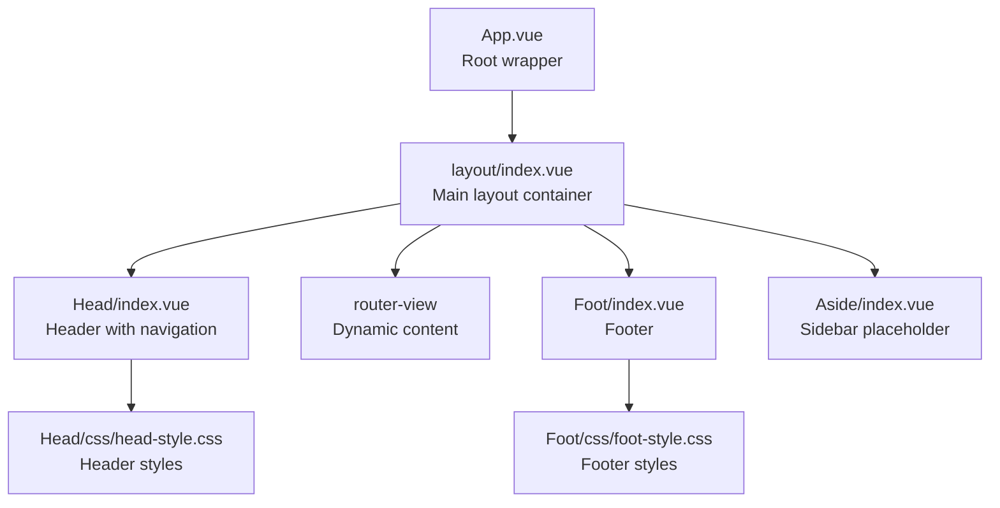
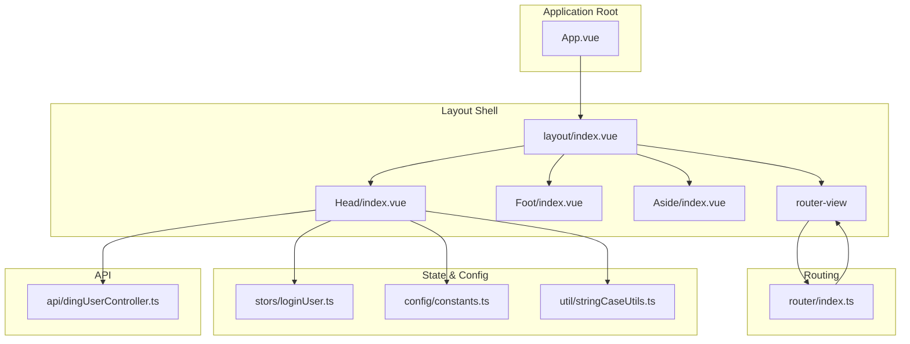
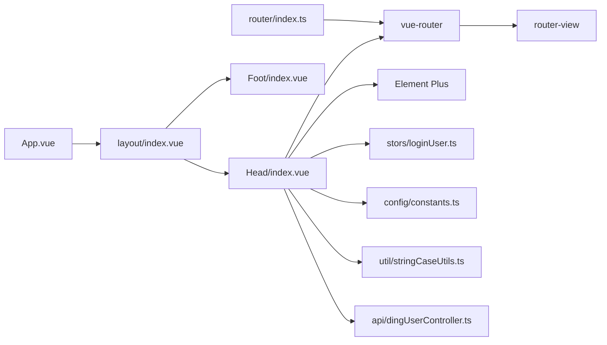

# Layout Components

<cite>
**Referenced Files in This Document**
- [App.vue](file://src/App.vue)
- [layout/index.vue](file://src/layout/index.vue)
- [layout/components/Head/index.vue](file://src/layout/components/Head/index.vue)
- [layout/components/Head/css/head-style.css](file://src/layout/components/Head/css/head-style.css)
- [layout/components/Foot/index.vue](file://src/layout/components/Foot/index.vue)
- [layout/components/Foot/css/foot-style.css](file://src/layout/components/Foot/css/foot-style.css)
- [layout/components/Aside/index.vue](file://src/layout/components/Aside/index.vue)
- [router/index.ts](file://src/router/index.ts)
- [stors/loginUser.ts](file://src/stors/loginUser.ts)
- [config/constants.ts](file://src/config/constants.ts)
- [util/stringCaseUtils.ts](file://src/util/stringCaseUtils.ts)
- [api/dingUserController.ts](file://src/api/dingUserController.ts)
</cite>

## Table of Contents
1. [Introduction](#introduction)
2. [Project Structure](#project-structure)
3. [Core Components](#core-components)
4. [Architecture Overview](#architecture-overview)
5. [Detailed Component Analysis](#detailed-component-analysis)
6. [Dependency Analysis](#dependency-analysis)
7. [Performance Considerations](#performance-considerations)
8. [Troubleshooting Guide](#troubleshooting-guide)
9. [Conclusion](#conclusion)

## Introduction
This document describes the layout component system used in the application. It covers the main layout container, header navigation, footer, and a placeholder sidebar component. It explains the component hierarchy, template structure, CSS styling patterns, and how the layout integrates with the router-view for dynamic content rendering. It also documents composition patterns, prop passing, slots, responsive design considerations, accessibility, and customization options.

## Project Structure
The layout system is organized under the src/layout directory with separate components for header, footer, and aside. The main layout container composes these components and renders the active route content via router-view. The application bootstraps the layout in App.vue.

**Diagram sources**
- [App.vue:1-19](file://src/App.vue#L1-L19)
- [layout/index.vue:1-29](file://src/layout/index.vue#L1-L29)
- [layout/components/Head/index.vue:1-279](file://src/layout/components/Head/index.vue#L1-L279)
- [layout/components/Foot/index.vue:1-15](file://src/layout/components/Foot/index.vue#L1-L15)
- [layout/components/Aside/index.vue:1-17](file://src/layout/components/Aside/index.vue#L1-L17)

**Section sources**
- [App.vue:1-19](file://src/App.vue#L1-L19)
- [layout/index.vue:1-29](file://src/layout/index.vue#L1-L29)

## Core Components
- Main layout container: Provides a flex-column layout with a fixed header and footer and a flexible main content area that expands to fill available space.
- Header component: Renders a horizontal navigation menu with nested submenus, a centered logo/title, and user profile controls. Handles login state, role-based visibility, and navigation selection.
- Footer component: Renders a simple informational footer bar.
- Sidebar component: Placeholder component for future sidebar navigation.

Key integration points:
- The layout container includes router-view to render the active route’s component.
- The header component uses vue-router to navigate and maintains active menu highlighting based on the current route.
- Login state is managed globally and influences header behavior and menu filtering.

**Section sources**
- [layout/index.vue:1-29](file://src/layout/index.vue#L1-L29)
- [layout/components/Head/index.vue:1-279](file://src/layout/components/Head/index.vue#L1-L279)
- [layout/components/Foot/index.vue:1-15](file://src/layout/components/Foot/index.vue#L1-L15)
- [layout/components/Aside/index.vue:1-17](file://src/layout/components/Aside/index.vue#L1-L17)

## Architecture Overview
The layout system follows a hierarchical composition pattern:
- App.vue mounts the Layout component.
- Layout/index.vue defines the page shell with header, main content area, and footer.
- Head/index.vue manages navigation, user profile, and login state.
- router-view renders the current route’s view component inside the main content area.
- Footer/index.vue provides a static footer.
- Aside/index.vue is reserved for future sidebar navigation.

**Diagram sources**
- [App.vue:1-19](file://src/App.vue#L1-L19)
- [layout/index.vue:1-29](file://src/layout/index.vue#L1-L29)
- [layout/components/Head/index.vue:1-279](file://src/layout/components/Head/index.vue#L1-L279)
- [layout/components/Foot/index.vue:1-15](file://src/layout/components/Foot/index.vue#L1-L15)
- [layout/components/Aside/index.vue:1-17](file://src/layout/components/Aside/index.vue#L1-L17)
- [router/index.ts:1-40](file://src/router/index.ts#L1-L40)
- [stors/loginUser.ts:1-33](file://src/stors/loginUser.ts#L1-L33)
- [config/constants.ts:1-3](file://src/config/constants.ts#L1-L3)
- [util/stringCaseUtils.ts:1-110](file://src/util/stringCaseUtils.ts#L1-L110)
- [api/dingUserController.ts:1-43](file://src/api/dingUserController.ts#L1-L43)

## Detailed Component Analysis

### Main Layout Container
Responsibilities:
- Defines the overall page shell with a vertical flex layout.
- Ensures the main content area grows to fill remaining space below the header and above the footer.
- Hosts the router-view for dynamic content rendering.

Template structure:
- Single outer container with class layout-container.
- Header component.
- Main content area containing router-view.
- Footer component.

Styling patterns:
- Uses scoped styles to define a flex-column container with min-height: 100vh.
- Uses :deep to target the main-content element so it can grow flexibly.

Integration with router-view:
- The router-view is placed inside the main content area, enabling route transitions without affecting header/footer.

Customization options:
- Modify layout-container styles for spacing, gutters, or background.
- Adjust main-content flex behavior for sticky headers/footers if needed.

**Section sources**
- [layout/index.vue:1-29](file://src/layout/index.vue#L1-L29)

### Header Component (Navigation)
Responsibilities:
- Render a horizontal navigation menu with nested submenus.
- Display a centered logo/title.
- Provide login/logout actions and user profile dropdown.
- Dynamically filter menu items based on login state and roles.
- Highlight the active menu item based on the current route.

Template structure:
- Outer wrapper div nav-wrapper.
- Element Plus el-menu configured for horizontal mode.
- Dynamic menu items generated from a computed menuItems list.
- Conditional login button vs. user profile dropdown.
- Centered logo/title and a flexible spacer to push items to edges.

Processing logic:
- Menu filtering:
  - Recursively filters children to remove empty groups.
  - Filters admin-only pages for non-admin users.
  - Filters pages requiring login for anonymous users.
- Active menu tracking:
  - activeMenu is bound to the current route path.
  - On menu select, navigates to the selected index.
- Login state:
  - On mount, checks health endpoint to determine login status.
  - Stores user info in a global store and local reactive refs.
  - Logout triggers API call, resets state, and redirects to DingTalk logout URL.

Styling patterns:
- Scoped styles for layout and alignment.
- Deep selectors to customize Element Plus sub-menu title alignment.
- Global CSS file for base menu background and hover states.

Accessibility considerations:
- Ensure keyboard navigation works with Element Plus menu.
- Provide meaningful aria-labels for menu items and buttons.
- Maintain sufficient color contrast for hover/focus states.

Responsive design patterns:
- Horizontal menu layout; consider switching to a mobile-friendly variant on small screens.
- The centered logo uses absolute positioning; test with long labels.

Prop passing and slots:
- No explicit props are passed to the header component; state is derived internally.
- The header does not currently expose named slots.

**Section sources**
- [layout/components/Head/index.vue:1-279](file://src/layout/components/Head/index.vue#L1-L279)
- [layout/components/Head/css/head-style.css:1-18](file://src/layout/components/Head/css/head-style.css#L1-L18)
- [stors/loginUser.ts:1-33](file://src/stors/loginUser.ts#L1-L33)
- [config/constants.ts:1-3](file://src/config/constants.ts#L1-L3)
- [util/stringCaseUtils.ts:1-110](file://src/util/stringCaseUtils.ts#L1-L110)
- [api/dingUserController.ts:1-43](file://src/api/dingUserController.ts#L1-L43)

### Footer Component
Responsibilities:
- Render a simple informational footer bar.
- Provide a baseline for page layout spacing.

Template structure:
- A footer element with a span containing static text.

Styling patterns:
- Global CSS file defines background, color, padding, and border styles.

Customization options:
- Replace the static text with dynamic content or links.
- Add additional menu items using Element Plus menu if desired.

**Section sources**
- [layout/components/Foot/index.vue:1-15](file://src/layout/components/Foot/index.vue#L1-L15)
- [layout/components/Foot/css/foot-style.css:1-10](file://src/layout/components/Foot/css/foot-style.css#L1-L10)

### Sidebar Component
Responsibilities:
- Placeholder for future sidebar navigation.
- Currently renders a simple message indicating a test sidebar.

Styling patterns:
- Scoped styles give the sidebar a light background and full height.

Customization options:
- Integrate a navigation menu with collapsible behavior.
- Add responsive breakpoints to hide/show the sidebar on small screens.

**Section sources**
- [layout/components/Aside/index.vue:1-17](file://src/layout/components/Aside/index.vue#L1-L17)

### Integration with Router-View
The layout container includes router-view inside the main content area. This enables:
- Route-based rendering of views without reloading the entire page.
- Seamless transitions between views while preserving header and footer.

Routing configuration:
- Routes are defined in router/index.ts with components for home, login, user info, admin user management, and a test route.
- The header’s active menu tracks the current route and highlights the corresponding menu item.

**Section sources**
- [layout/index.vue:6](file://src/layout/index.vue#L6)
- [router/index.ts:1-40](file://src/router/index.ts#L1-L40)
- [layout/components/Head/index.vue:159-161](file://src/layout/components/Head/index.vue#L159-L161)

## Dependency Analysis
Component dependencies:
- App.vue depends on layout/index.vue.
- layout/index.vue depends on Head and Foot components.
- Head/index.vue depends on:
  - vue-router for navigation and route tracking.
  - Element Plus for menu components.
  - stors/loginUser.ts for global login state.
  - config/constants.ts for DingTalk client ID.
  - util/stringCaseUtils.ts for role comparison.
  - api/dingUserController.ts for health and logout APIs.
- router/index.ts defines the routing configuration used by router-view.

**Diagram sources**
- [App.vue:1-19](file://src/App.vue#L1-L19)
- [layout/index.vue:1-29](file://src/layout/index.vue#L1-L29)
- [layout/components/Head/index.vue:1-279](file://src/layout/components/Head/index.vue#L1-L279)
- [router/index.ts:1-40](file://src/router/index.ts#L1-L40)
- [stors/loginUser.ts:1-33](file://src/stors/loginUser.ts#L1-L33)
- [config/constants.ts:1-3](file://src/config/constants.ts#L1-L3)
- [util/stringCaseUtils.ts:1-110](file://src/util/stringCaseUtils.ts#L1-L110)
- [api/dingUserController.ts:1-43](file://src/api/dingUserController.ts#L1-L43)

**Section sources**
- [App.vue:1-19](file://src/App.vue#L1-L19)
- [layout/index.vue:1-29](file://src/layout/index.vue#L1-L29)
- [layout/components/Head/index.vue:1-279](file://src/layout/components/Head/index.vue#L1-L279)
- [router/index.ts:1-40](file://src/router/index.ts#L1-L40)

## Performance Considerations
- Computed menu filtering runs on mount and when dependencies change; keep the menu tree shallow for optimal performance.
- Avoid heavy computations in the header’s active menu binding; route.path is lightweight.
- Debounce or cache API calls if the health endpoint is frequently accessed.
- Consider lazy-loading views to reduce initial bundle size.

## Troubleshooting Guide
Common issues and resolutions:
- Navigation not highlighting:
  - Ensure activeMenu is bound to the current route path and that menu indices match route paths.
  - Verify router-view is present in the layout container.
- Login state not updating:
  - Confirm health endpoint returns the expected response structure and that the store is initialized on app load.
  - Check network connectivity and CORS settings for the API.
- Logout not clearing DingTalk session:
  - Verify DING_CLIENT_ID matches the one used during login.
  - Ensure the return URL is correctly encoded and accessible.
- Menu visibility incorrect:
  - Review role-based filtering logic and string case comparisons.
  - Confirm that admin-only routes are protected by guards if needed.

**Section sources**
- [layout/components/Head/index.vue:122-156](file://src/layout/components/Head/index.vue#L122-L156)
- [layout/components/Head/index.vue:166-199](file://src/layout/components/Head/index.vue#L166-L199)
- [stors/loginUser.ts:17-22](file://src/stors/loginUser.ts#L17-L22)
- [config/constants.ts:1-3](file://src/config/constants.ts#L1-L3)
- [util/stringCaseUtils.ts:84-89](file://src/util/stringCaseUtils.ts#L84-L89)

## Conclusion
The layout component system provides a clean, modular foundation for the application. The main layout container, header, footer, and sidebar components integrate seamlessly with vue-router to deliver a responsive and accessible user interface. The header’s dynamic menu filtering and login state management demonstrate robust composition patterns. Future enhancements could include responsive navigation, sidebar integration, and improved accessibility attributes.