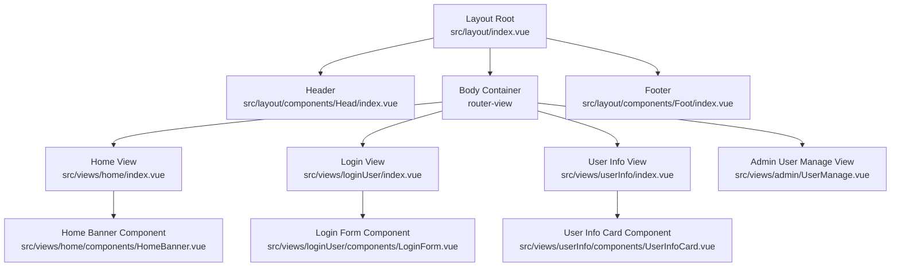
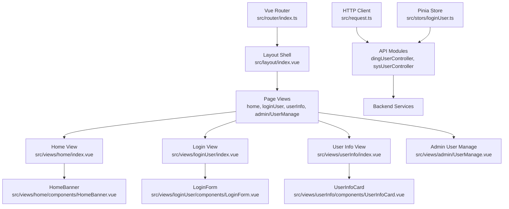
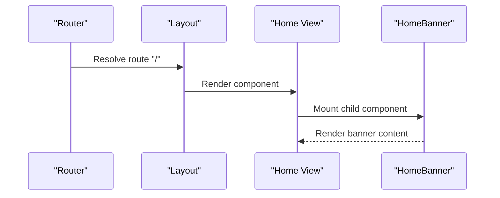
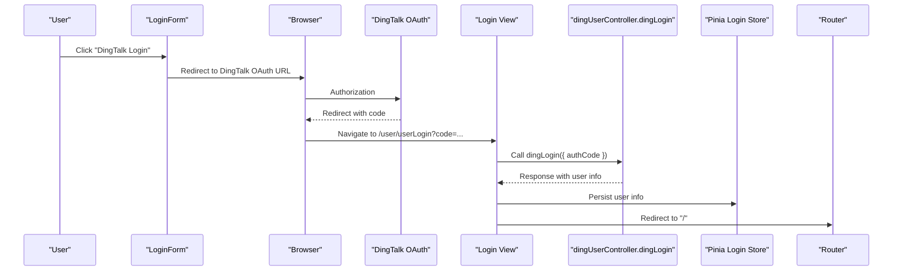
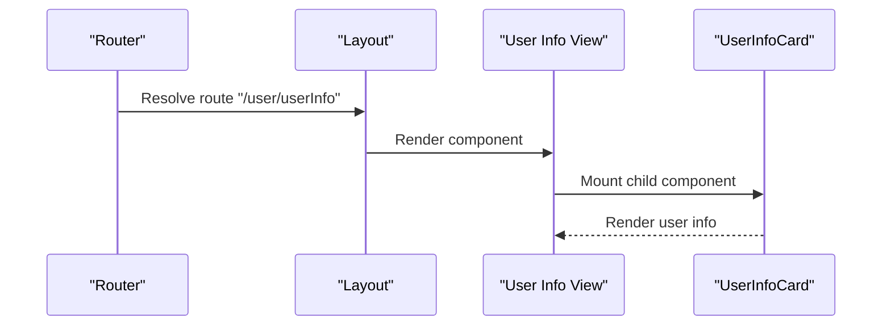
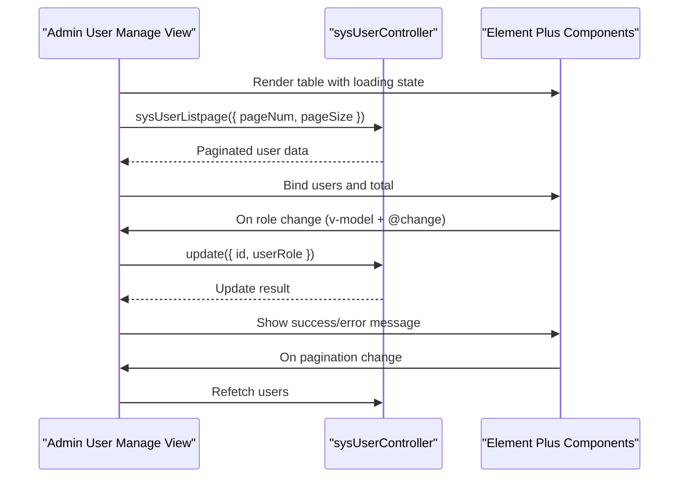
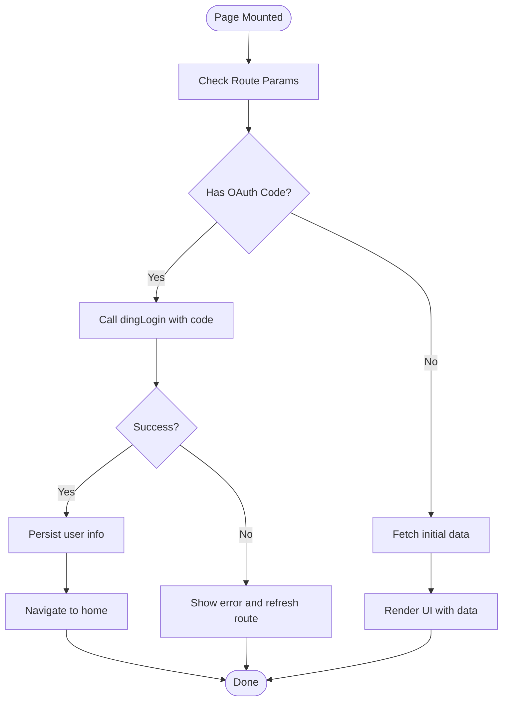
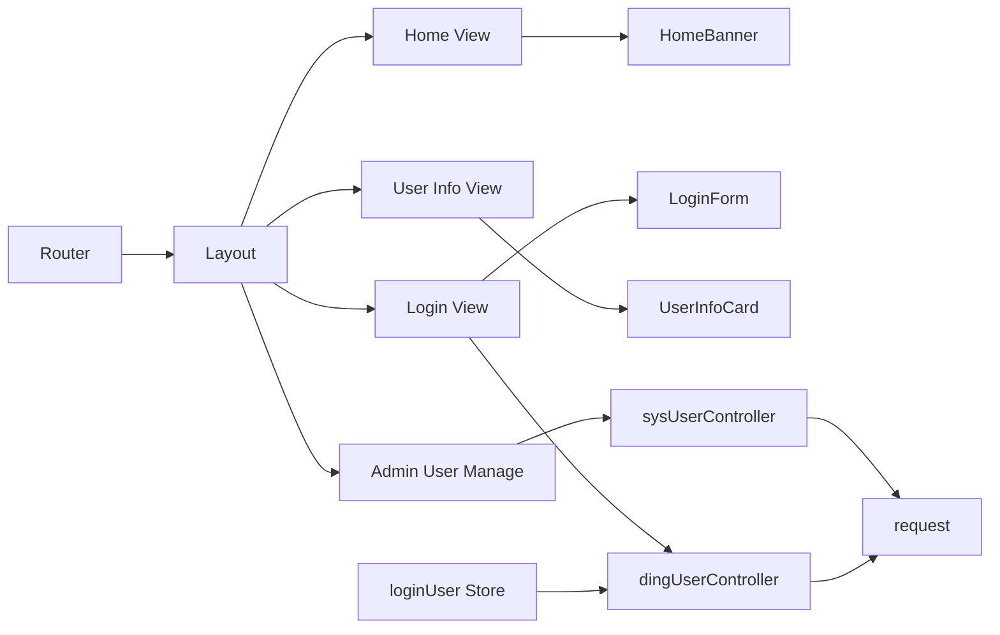

# Page Components

<cite>
**Referenced Files in This Document**
- [src/views/home/index.vue](file://src/views/home/index.vue)
- [src/views/home/components/HomeBanner.vue](file://src/views/home/components/HomeBanner.vue)
- [src/views/loginUser/index.vue](file://src/views/loginUser/index.vue)
- [src/views/loginUser/components/LoginForm.vue](file://src/views/loginUser/components/LoginForm.vue)
- [src/views/loginUser/js/login-api.js](file://src/views/loginUser/js/login-api.js)
- [src/views/userInfo/index.vue](file://src/views/userInfo/index.vue)
- [src/views/userInfo/components/UserInfoCard.vue](file://src/views/userInfo/components/UserInfoCard.vue)
- [src/views/admin/UserManage.vue](file://src/views/admin/UserManage.vue)
- [src/layout/index.vue](file://src/layout/index.vue)
- [src/router/index.ts](file://src/router/index.ts)
- [src/request.ts](file://src/request.ts)
- [src/stors/loginUser.ts](file://src/stors/loginUser.ts)
- [src/api/dingUserController.ts](file://src/api/dingUserController.ts)
- [src/api/sysUserController.ts](file://src/api/sysUserController.ts)
</cite>

## Table of Contents
1. [Introduction](#introduction)
2. [Project Structure](#project-structure)
3. [Core Components](#core-components)
4. [Architecture Overview](#architecture-overview)
5. [Detailed Component Analysis](#detailed-component-analysis)
6. [Dependency Analysis](#dependency-analysis)
7. [Performance Considerations](#performance-considerations)
8. [Troubleshooting Guide](#troubleshooting-guide)
9. [Conclusion](#conclusion)

## Introduction
This document focuses on the page-level components and view implementations of the frontend application. It covers the home dashboard, user information management, authentication interface, and admin user management pages. The documentation explains component structure, data binding patterns, layout integration, page-specific functionality, form handling, user interactions, component composition, API integration patterns, state management integration, routing integration, navigation patterns, and page lifecycle management.

## Project Structure
The application follows a feature-based structure under the views directory, with each page encapsulating its own template, script, styles, and supporting components. The layout system composes header, body, and footer components and renders page content via router-view. Routing defines the available pages and their paths.

**Diagram sources**
- [src/layout/index.vue:1-29](file://src/layout/index.vue#L1-L29)
- [src/views/home/index.vue:1-12](file://src/views/home/index.vue#L1-L12)
- [src/views/home/components/HomeBanner.vue:1-10](file://src/views/home/components/HomeBanner.vue#L1-L10)
- [src/views/loginUser/index.vue:1-71](file://src/views/loginUser/index.vue#L1-L71)
- [src/views/loginUser/components/LoginForm.vue:1-42](file://src/views/loginUser/components/LoginForm.vue#L1-L42)
- [src/views/userInfo/index.vue:1-12](file://src/views/userInfo/index.vue#L1-L12)
- [src/views/userInfo/components/UserInfoCard.vue:1-15](file://src/views/userInfo/components/UserInfoCard.vue#L1-L15)
- [src/views/admin/UserManage.vue:1-147](file://src/views/admin/UserManage.vue#L1-L147)

**Section sources**
- [src/layout/index.vue:1-29](file://src/layout/index.vue#L1-L29)
- [src/router/index.ts:1-40](file://src/router/index.ts#L1-L40)

## Core Components
- Home Dashboard: Renders a banner component and applies scoped styles.
- Authentication Interface: Provides a login form and handles DingTalk OAuth redirection and callback processing.
- User Information Management: Displays a user info card component.
- Admin User Management: Lists users in a paginated table with inline role editing and Element Plus UI components.
- Layout System: Composes header, body, and footer and renders the active route view.

**Section sources**
- [src/views/home/index.vue:1-12](file://src/views/home/index.vue#L1-L12)
- [src/views/loginUser/index.vue:1-71](file://src/views/loginUser/index.vue#L1-L71)
- [src/views/userInfo/index.vue:1-12](file://src/views/userInfo/index.vue#L1-L12)
- [src/views/admin/UserManage.vue:1-147](file://src/views/admin/UserManage.vue#L1-L147)
- [src/layout/index.vue:1-29](file://src/layout/index.vue#L1-L29)

## Architecture Overview
The application integrates Vue 3 Composition API with Element Plus for UI, Pinia for state management, and a centralized request module for HTTP communication. Routing maps URLs to page components. The layout system injects page content into a consistent shell.

**Diagram sources**
- [src/router/index.ts:1-40](file://src/router/index.ts#L1-L40)
- [src/layout/index.vue:1-29](file://src/layout/index.vue#L1-L29)
- [src/views/home/index.vue:1-12](file://src/views/home/index.vue#L1-L12)
- [src/views/loginUser/index.vue:1-71](file://src/views/loginUser/index.vue#L1-L71)
- [src/views/userInfo/index.vue:1-12](file://src/views/userInfo/index.vue#L1-L12)
- [src/views/admin/UserManage.vue:1-147](file://src/views/admin/UserManage.vue#L1-L147)
- [src/request.ts:1-49](file://src/request.ts#L1-L49)
- [src/stors/loginUser.ts:1-33](file://src/stors/loginUser.ts#L1-L33)
- [src/api/dingUserController.ts:1-43](file://src/api/dingUserController.ts#L1-L43)
- [src/api/sysUserController.ts:1-34](file://src/api/sysUserController.ts#L1-L34)

## Detailed Component Analysis

### Home Dashboard Component
- Purpose: Render the home page with a banner component and scoped styles.
- Structure:
  - Template: Includes the HomeBanner component.
  - Script: Imports HomeBanner and sets up the page with script setup.
  - Style: Applies home-style.css via style tag.
- Data Binding Patterns: Uses a child component composition pattern; no reactive state is declared in the parent.
- Integration with Layout: Placed inside router-view and rendered by the layout shell.
- Lifecycle: No lifecycle hooks are used; the component is static aside from importing child components.

**Diagram sources**
- [src/router/index.ts:10-15](file://src/router/index.ts#L10-L15)
- [src/layout/index.vue:5-7](file://src/layout/index.vue#L5-L7)
- [src/views/home/index.vue:1-12](file://src/views/home/index.vue#L1-L12)
- [src/views/home/components/HomeBanner.vue:1-10](file://src/views/home/components/HomeBanner.vue#L1-L10)

**Section sources**
- [src/views/home/index.vue:1-12](file://src/views/home/index.vue#L1-L12)
- [src/views/home/components/HomeBanner.vue:1-10](file://src/views/home/components/HomeBanner.vue#L1-L10)

### Authentication Interface
- Purpose: Provide a login experience with DingTalk OAuth redirection and post-login callback handling.
- Structure:
  - Template: Conditionally renders a “dingding logging in” indicator or the LoginForm component.
  - Script:
    - Uses vue-router to read query parameters.
    - Implements onMounted to intercept the DingTalk OAuth code.
    - Calls dingLogin API to exchange the code for session.
    - Persists user info and redirects to home on success.
    - Handles errors and refreshes the current route on failure.
  - LoginForm:
    - Generates DingTalk OAuth URL with redirect_uri, client_id, scope, state, and prompt.
    - Redirects the browser to DingTalk login.
- Data Binding Patterns:
  - Reactive flag isDingLoggingIn controls UI visibility during OAuth verification.
  - Event emission is prepared for future username-based login scenarios.
- API Integration:
  - Uses dingUserController.dingLogin for OAuth verification.
  - Uses request module configured with credentials for session-based auth.
- State Management:
  - Integrates with Pinia store for login user state retrieval.
- Routing Integration:
  - Route path for login is mapped to the login view.
  - Redirects to home after successful login.

**Diagram sources**
- [src/views/loginUser/components/LoginForm.vue:24-41](file://src/views/loginUser/components/LoginForm.vue#L24-L41)
- [src/views/loginUser/index.vue:33-70](file://src/views/loginUser/index.vue#L33-L70)
- [src/api/dingUserController.ts:13-26](file://src/api/dingUserController.ts#L13-L26)
- [src/stors/loginUser.ts:16-22](file://src/stors/loginUser.ts#L16-L22)
- [src/router/index.ts:16-20](file://src/router/index.ts#L16-L20)

**Section sources**
- [src/views/loginUser/index.vue:1-71](file://src/views/loginUser/index.vue#L1-L71)
- [src/views/loginUser/components/LoginForm.vue:1-42](file://src/views/loginUser/components/LoginForm.vue#L1-L42)
- [src/api/dingUserController.ts:1-43](file://src/api/dingUserController.ts#L1-L43)
- [src/stors/loginUser.ts:1-33](file://src/stors/loginUser.ts#L1-L33)
- [src/request.ts:1-49](file://src/request.ts#L1-L49)
- [src/router/index.ts:1-40](file://src/router/index.ts#L1-L40)

### User Information Management
- Purpose: Display user information via a dedicated card component.
- Structure:
  - Template: Includes the UserInfoCard component.
  - Script: Imports and mounts the card component.
  - Style: Applies user-info-style.css via style tag.
- Data Binding Patterns: Delegates user data rendering to the child component.
- Integration with Layout: Placed inside router-view and rendered by the layout shell.

**Diagram sources**
- [src/router/index.ts:21-25](file://src/router/index.ts#L21-L25)
- [src/layout/index.vue:5-7](file://src/layout/index.vue#L5-L7)
- [src/views/userInfo/index.vue:1-12](file://src/views/userInfo/index.vue#L1-L12)
- [src/views/userInfo/components/UserInfoCard.vue:1-15](file://src/views/userInfo/components/UserInfoCard.vue#L1-L15)

**Section sources**
- [src/views/userInfo/index.vue:1-12](file://src/views/userInfo/index.vue#L1-L12)
- [src/views/userInfo/components/UserInfoCard.vue:1-15](file://src/views/userInfo/components/UserInfoCard.vue#L1-L15)

### Admin User Management Pages
- Purpose: Allow administrators to view and manage users with pagination and inline role updates.
- Structure:
  - Template: Uses Element Plus card, table, avatar, select, and pagination components.
  - Script:
    - Reactive state: users, total, pageNum, pageSize, loading.
    - Fetches paginated user list via sysUserController.sysUserListpage.
    - Updates user roles via sysUserController.update with inline select change.
    - Handles pagination events to refresh data.
    - Displays success/error messages using Element Plus.
- Data Binding Patterns:
  - Two-way binding on pageSize and pageNum via v-model modifiers.
  - One-way binding on table data with computed records from API response.
  - Inline editing with v-model on userRole and immediate change handler.
- API Integration:
  - Uses sysUserController for listing and updating user roles.
  - Relies on request module with credentials for session-based requests.
- State Management:
  - Integrates with Pinia store for login user state retrieval.
- Routing Integration:
  - Route path for admin user management is mapped to the admin view.

**Diagram sources**
- [src/views/admin/UserManage.vue:67-128](file://src/views/admin/UserManage.vue#L67-L128)
- [src/api/sysUserController.ts:5-34](file://src/api/sysUserController.ts#L5-L34)

**Section sources**
- [src/views/admin/UserManage.vue:1-147](file://src/views/admin/UserManage.vue#L1-L147)
- [src/api/sysUserController.ts:1-34](file://src/api/sysUserController.ts#L1-L34)
- [src/stors/loginUser.ts:1-33](file://src/stors/loginUser.ts#L1-L33)
- [src/request.ts:1-49](file://src/request.ts#L1-L49)
- [src/router/index.ts:31-35](file://src/router/index.ts#L31-L35)

### Conceptual Overview
- Component Composition: Each page composes one or more child components to modularize UI concerns.
- API Integration Patterns:
  - Centralized HTTP client with global interceptors for authentication and error handling.
  - Feature-specific API modules encapsulate endpoint definitions and request shapes.
- State Management Integration:
  - Pinia store exposes a login user resource and fetch helper for downstream components.
- Routing Integration:
  - Routes map logical paths to page components; navigation leverages vue-router.
- Navigation Patterns:
  - Programmatic navigation after login and pagination-driven re-fetching.
- Page Lifecycle Management:
  - onMounted triggers initial data fetching for admin user management and login callback handling.

[No sources needed since this diagram shows conceptual workflow, not actual code structure]

[No sources needed since this section doesn't analyze specific source files]

## Dependency Analysis
- Component Coupling:
  - Home and User Info views depend on child components for UI rendering.
  - Admin User Manage depends on Element Plus components and API modules.
  - Login View depends on LoginForm and API modules for OAuth handling.
- Direct Dependencies:
  - Views import layout components and child components.
  - API modules import the centralized request client.
  - Pinia store imports API modules for fetching login user data.
- Indirect Dependencies:
  - Global request interceptor enforces authentication and redirects to login when unauthenticated.
- External Dependencies:
  - Element Plus for UI components.
  - Vue Router for routing.
  - Pinia for state management.

**Diagram sources**
- [src/views/home/index.vue:8](file://src/views/home/index.vue#L8)
- [src/views/loginUser/index.vue:16](file://src/views/loginUser/index.vue#L16)
- [src/views/userInfo/index.vue:8](file://src/views/userInfo/index.vue#L8)
- [src/views/admin/UserManage.vue:58](file://src/views/admin/UserManage.vue#L58)
- [src/api/dingUserController.ts:3](file://src/api/dingUserController.ts#L3)
- [src/api/sysUserController.ts:3](file://src/api/sysUserController.ts#L3)
- [src/stors/loginUser.ts:3](file://src/stors/loginUser.ts#L3)
- [src/request.ts:1-49](file://src/request.ts#L1-L49)
- [src/router/index.ts:1-40](file://src/router/index.ts#L1-L40)
- [src/layout/index.vue:14-15](file://src/layout/index.vue#L14-L15)

**Section sources**
- [src/router/index.ts:1-40](file://src/router/index.ts#L1-L40)
- [src/request.ts:1-49](file://src/request.ts#L1-L49)
- [src/stors/loginUser.ts:1-33](file://src/stors/loginUser.ts#L1-L33)
- [src/api/dingUserController.ts:1-43](file://src/api/dingUserController.ts#L1-L43)
- [src/api/sysUserController.ts:1-34](file://src/api/sysUserController.ts#L1-L34)

## Performance Considerations
- Pagination: Admin user management uses pagination to limit payload sizes and improve responsiveness.
- Loading States: Use of loading flags prevents redundant requests and improves perceived performance.
- Caching: Local storage is used for user info persistence; consider integrating with Pinia for centralized state caching.
- Network Efficiency: Centralized request client with credentials avoids repeated manual cookie/session handling.

[No sources needed since this section provides general guidance]

## Troubleshooting Guide
- Authentication Redirect Loop:
  - Symptom: Continuous redirect to login page.
  - Cause: Unauthenticated requests trigger a redirect to the login route.
  - Resolution: Ensure cookies/session are present; check backend session configuration.
- DingTalk OAuth Failure:
  - Symptom: Login fails after DingTalk redirect.
  - Cause: Invalid code or network error during dingLogin.
  - Resolution: Validate redirect_uri and client_id; inspect API response and logs.
- Admin Role Update Errors:
  - Symptom: Role change does not persist or shows error.
  - Cause: Backend validation or network error.
  - Resolution: Refresh list on error; confirm payload shape and permissions.
- Missing Styles:
  - Symptom: Components render without expected styling.
  - Cause: Missing style imports or scoped styles not applied.
  - Resolution: Verify style tags and scoped style paths in each view.

**Section sources**
- [src/request.ts:25-47](file://src/request.ts#L25-L47)
- [src/views/loginUser/index.vue:41-68](file://src/views/loginUser/index.vue#L41-L68)
- [src/views/admin/UserManage.vue:91-113](file://src/views/admin/UserManage.vue#L91-L113)

## Conclusion
The page-level components are structured around reusable child components and feature-specific API modules, integrated with a centralized request client and Pinia store. The layout system consistently renders page content, while routing maps logical paths to views. The admin user management page demonstrates robust pagination and inline editing patterns, and the authentication interface implements DingTalk OAuth with proper error handling and redirection. Following the documented patterns ensures maintainable and scalable page implementations.