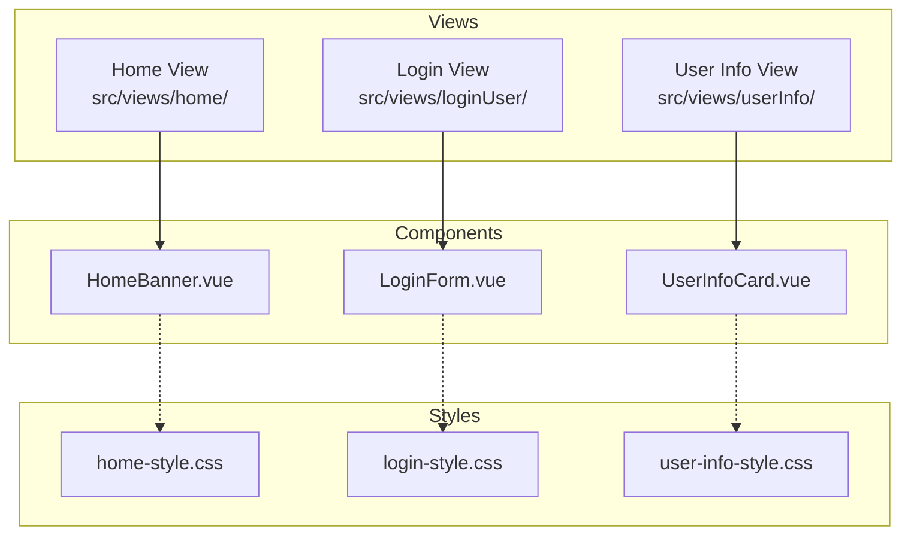
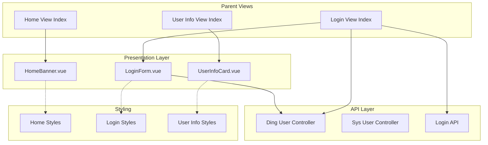
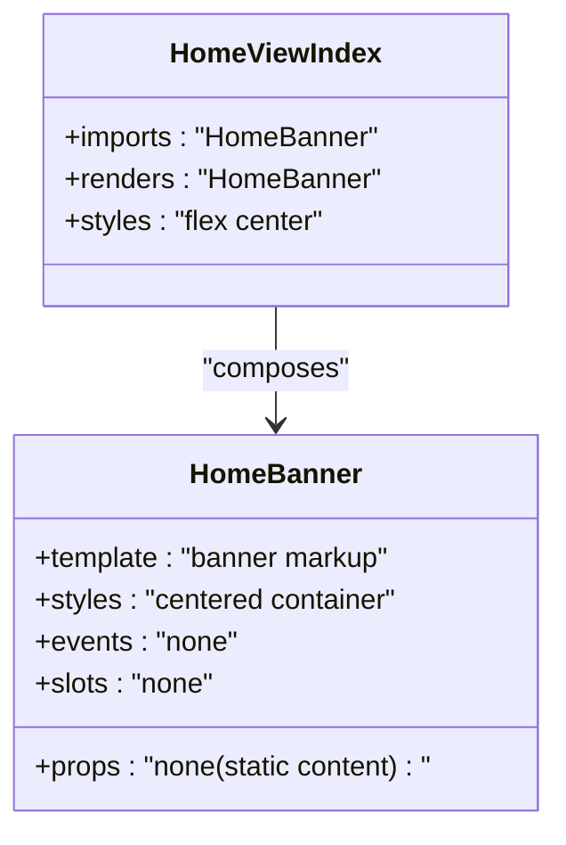
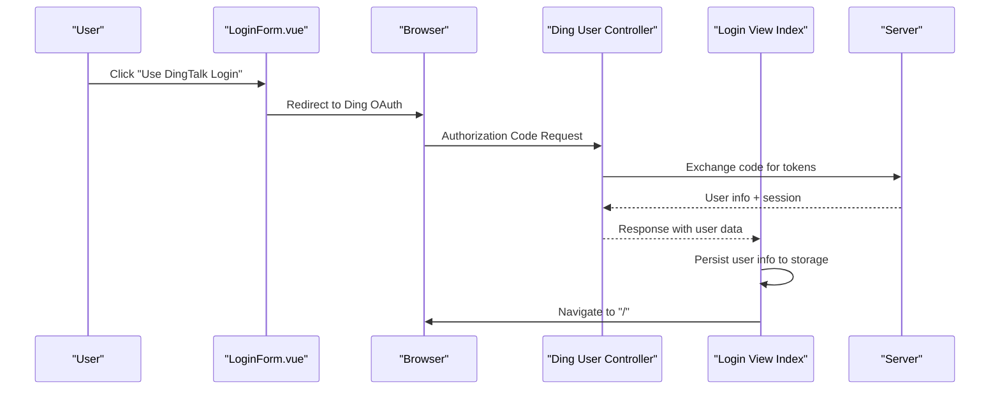
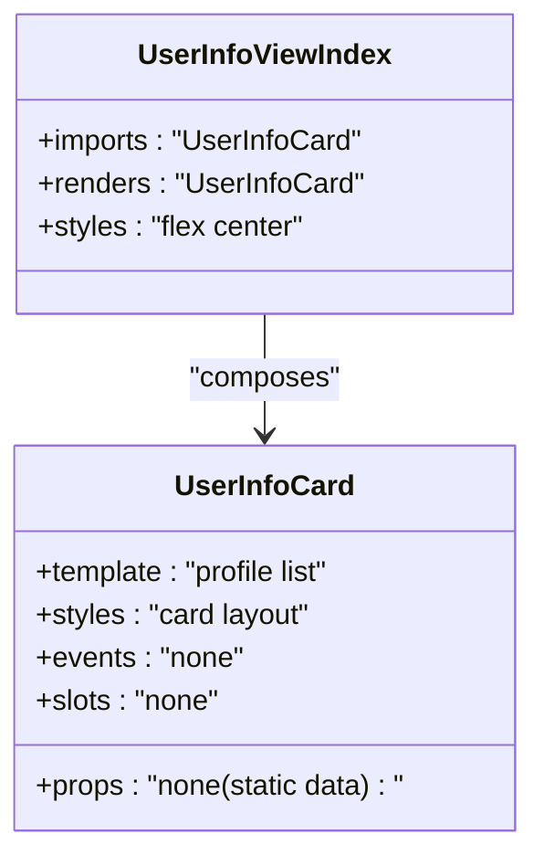
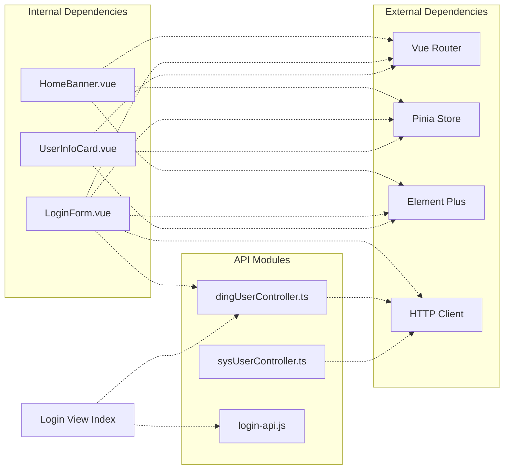

# Reusable UI Components

<cite>
**Referenced Files in This Document**
- [HomeBanner.vue](file://src/views/home/components/HomeBanner.vue)
- [LoginForm.vue](file://src/views/loginUser/components/LoginForm.vue)
- [UserInfoCard.vue](file://src/views/userInfo/components/UserInfoCard.vue)
- [Home View Index](file://src/views/home/index.vue)
- [Login View Index](file://src/views/loginUser/index.vue)
- [User Info View Index](file://src/views/userInfo/index.vue)
- [Home Banner Styles](file://src/views/home/css/home-style.css)
- [Login Styles](file://src/views/loginUser/css/login-style.css)
- [User Info Styles](file://src/views/userInfo/css/user-info-style.css)
- [Login API](file://src/views/loginUser/js/login-api.js)
- [Ding User Controller](file://src/api/dingUserController.ts)
- [Sys User Controller](file://src/api/sysUserController.ts)
- [App Root](file://src/App.vue)
- [Global Styles](file://src/style.css)
- [Main Entry](file://src/main.ts)
</cite>

## Table of Contents
1. [Introduction](#introduction)
2. [Project Structure](#project-structure)
3. [Core Components](#core-components)
4. [Architecture Overview](#architecture-overview)
5. [Detailed Component Analysis](#detailed-component-analysis)
6. [Dependency Analysis](#dependency-analysis)
7. [Performance Considerations](#performance-considerations)
8. [Accessibility and Responsive Design](#accessibility-and-responsive-design)
9. [Usage Examples](#usage-examples)
10. [Composition Patterns and Best Practices](#composition-patterns-and-best-practices)
11. [Troubleshooting Guide](#troubleshooting-guide)
12. [Conclusion](#conclusion)

## Introduction
This document provides comprehensive documentation for reusable UI components used throughout the application. It focuses on three key components:
- HomeBanner: promotional content banner for the home page
- LoginForm: authentication form supporting both traditional login and DingTalk OAuth
- UserInfoCard: user profile display card

The documentation covers component props, events, slots, customization options, implementation patterns, styling approaches, integration with parent components, accessibility features, responsive design considerations, and best practices for extending these components.

## Project Structure
The components are organized by feature under dedicated view folders, each containing:
- A Vue single-file component (.vue)
- An index.vue that composes the component
- A CSS file for component-specific styles
- Optional JS modules for API interactions

**Diagram sources**
- [HomeBanner.vue:1-10](file://src/views/home/components/HomeBanner.vue#L1-L10)
- [LoginForm.vue:1-42](file://src/views/loginUser/components/LoginForm.vue#L1-L42)
- [UserInfoCard.vue:1-15](file://src/views/userInfo/components/UserInfoCard.vue#L1-L15)
- [Home Banner Styles:1-22](file://src/views/home/css/home-style.css#L1-L22)
- [Login Styles:1-6](file://src/views/loginUser/css/login-style.css#L1-L6)
- [User Info Styles:1-25](file://src/views/userInfo/css/user-info-style.css#L1-L25)

**Section sources**
- [Home View Index:1-12](file://src/views/home/index.vue#L1-L12)
- [Login View Index:1-71](file://src/views/loginUser/index.vue#L1-L71)
- [User Info View Index:1-12](file://src/views/userInfo/index.vue#L1-L12)

## Core Components
This section documents the three reusable UI components, their current state, and recommended enhancements for reusability and extensibility.

### HomeBanner
Purpose: Display promotional or informational content on the home page.

Current Implementation:
- Renders a centered banner with headline and description
- Uses component-scoped styles for visual presentation

Recommended Enhancements:
- Add props for title, description, and optional CTA button
- Support slots for custom content areas
- Accept theme variants (color schemes, sizes)
- Expose events for user actions (e.g., button clicks)

Integration Pattern:
- Imported and rendered by the Home View index.vue
- Composed within a container that centers the component vertically and horizontally

Customization Options:
- Modify CSS class names and selectors in home-style.css
- Adjust spacing, typography, and shadows via CSS variables

Accessibility Considerations:
- Ensure semantic heading hierarchy (h2)
- Provide sufficient color contrast for text against background
- Consider ARIA attributes if adding interactive elements

Responsive Design:
- Container uses flexbox to center content
- Minimum width ensures readability on small screens
- Typography scales appropriately with viewport

**Section sources**
- [HomeBanner.vue:1-10](file://src/views/home/components/HomeBanner.vue#L1-L10)
- [Home Banner Styles:1-22](file://src/views/home/css/home-style.css#L1-L22)
- [Home View Index:1-12](file://src/views/home/index.vue#L1-L12)

### LoginForm
Purpose: Provide authentication options including traditional login and DingTalk OAuth.

Current Implementation:
- Supports DingTalk OAuth redirection with configurable client ID and redirect URI
- Includes commented-out template for traditional username/password login
- Emits submit event (currently unused in current implementation)

Recommended Enhancements:
- Define typed props for username and password
- Emit standardized submit event with payload
- Add validation hooks and error handling
- Support form reset and loading states
- Provide slots for custom buttons or additional providers
- Accept theme and layout props

Integration Pattern:
- Rendered conditionally in Login View index.vue
- Parent handles DingTalk callback via route query parameter interception
- Integrates with login API for mock authentication flow

Authentication Flow:
- Traditional login: emits submit event handled by parent
- DingTalk login: redirects to DingTalk OAuth endpoint
- Callback handling: extracts code from URL, validates with backend, persists user info

Customization Options:
- Modify button styles and colors in component template
- Configure OAuth parameters (client ID, redirect URI, state)
- Extend with additional authentication providers

**Section sources**
- [LoginForm.vue:1-42](file://src/views/loginUser/components/LoginForm.vue#L1-L42)
- [Login View Index:1-71](file://src/views/loginUser/index.vue#L1-L71)
- [Login API:1-38](file://src/views/loginUser/js/login-api.js#L1-L38)
- [Ding User Controller:1-43](file://src/api/dingUserController.ts#L1-L43)

### UserInfoCard
Purpose: Display user profile information in a structured card layout.

Current Implementation:
- Renders a static user profile with name, email, and role
- Uses a simple list structure for information display

Recommended Enhancements:
- Accept props for user data (name, email, role, avatar)
- Support slot-based customization for individual fields
- Add loading and empty states
- Provide variant themes (minimal, expanded)
- Emit events for actions (e.g., edit profile, copy email)

Integration Pattern:
- Imported and rendered by the User Info View index.vue
- Centered within a full-height container for consistent presentation

Customization Options:
- Adjust card styling in user-info-style.css
- Modify typography and spacing for different screen sizes
- Extend with dynamic content based on user store/state

**Section sources**
- [UserInfoCard.vue:1-15](file://src/views/userInfo/components/UserInfoCard.vue#L1-L15)
- [User Info View Index:1-12](file://src/views/userInfo/index.vue#L1-L12)
- [User Info Styles:1-25](file://src/views/userInfo/css/user-info-style.css#L1-L25)

## Architecture Overview
The components follow a consistent pattern of separation of concerns:
- Components focus on presentation and user interaction
- Parent views manage state, routing, and business logic
- Shared APIs handle external service communication
- Component-specific CSS provides scoped styling

**Diagram sources**
- [Home View Index:1-12](file://src/views/home/index.vue#L1-L12)
- [Login View Index:1-71](file://src/views/loginUser/index.vue#L1-L71)
- [User Info View Index:1-12](file://src/views/userInfo/index.vue#L1-L12)
- [Ding User Controller:1-43](file://src/api/dingUserController.ts#L1-L43)
- [Sys User Controller:1-34](file://src/api/sysUserController.ts#L1-L34)
- [Login API:1-38](file://src/views/loginUser/js/login-api.js#L1-L38)
- [Home Banner Styles:1-22](file://src/views/home/css/home-style.css#L1-L22)
- [Login Styles:1-6](file://src/views/loginUser/css/login-style.css#L1-L6)
- [User Info Styles:1-25](file://src/views/userInfo/css/user-info-style.css#L1-L25)

## Detailed Component Analysis

### HomeBanner Component Analysis

**Diagram sources**
- [HomeBanner.vue:1-10](file://src/views/home/components/HomeBanner.vue#L1-L10)
- [Home View Index:1-12](file://src/views/home/index.vue#L1-L12)

Implementation Notes:
- Template-based rendering with semantic headings
- Component-scoped styling for visual consistency
- No reactive state or props in current implementation

Extension Opportunities:
- Add prop-driven content (title, description, image)
- Support action buttons via slots
- Theme variants for different contexts

**Section sources**
- [HomeBanner.vue:1-10](file://src/views/home/components/HomeBanner.vue#L1-L10)
- [Home View Index:1-12](file://src/views/home/index.vue#L1-L12)

### LoginForm Component Analysis

**Diagram sources**
- [LoginForm.vue:24-41](file://src/views/loginUser/components/LoginForm.vue#L24-L41)
- [Login View Index:33-70](file://src/views/loginUser/index.vue#L33-L70)
- [Ding User Controller:13-26](file://src/api/dingUserController.ts#L13-L26)

Key Behaviors:
- OAuth redirection with configurable parameters
- Route query parameter interception for callback handling
- Integration with backend authentication endpoints
- Local storage persistence for user information

**Section sources**
- [LoginForm.vue:1-42](file://src/views/loginUser/components/LoginForm.vue#L1-L42)
- [Login View Index:1-71](file://src/views/loginUser/index.vue#L1-L71)
- [Ding User Controller:1-43](file://src/api/dingUserController.ts#L1-L43)

### UserInfoCard Component Analysis

**Diagram sources**
- [UserInfoCard.vue:1-15](file://src/views/userInfo/components/UserInfoCard.vue#L1-L15)
- [User Info View Index:1-12](file://src/views/userInfo/index.vue#L1-L12)

Implementation Notes:
- Static data rendering suitable for demonstration
- Clean separation between presentation and data management
- Ready for enhancement with reactive props and dynamic data sources

**Section sources**
- [UserInfoCard.vue:1-15](file://src/views/userInfo/components/UserInfoCard.vue#L1-L15)
- [User Info View Index:1-12](file://src/views/userInfo/index.vue#L1-L12)

## Dependency Analysis
The components have minimal internal dependencies and rely on parent views for state management and external APIs for data operations.

**Diagram sources**
- [LoginForm.vue:1-42](file://src/views/loginUser/components/LoginForm.vue#L1-L42)
- [Login View Index:1-71](file://src/views/loginUser/index.vue#L1-L71)
- [Ding User Controller:1-43](file://src/api/dingUserController.ts#L1-L43)
- [Sys User Controller:1-34](file://src/api/sysUserController.ts#L1-L34)
- [Login API:1-38](file://src/views/loginUser/js/login-api.js#L1-L38)
- [Main Entry:1-19](file://src/main.ts#L1-L19)

**Section sources**
- [LoginForm.vue:1-42](file://src/views/loginUser/components/LoginForm.vue#L1-L42)
- [Login View Index:1-71](file://src/views/loginUser/index.vue#L1-L71)
- [Ding User Controller:1-43](file://src/api/dingUserController.ts#L1-L43)
- [Sys User Controller:1-34](file://src/api/sysUserController.ts#L1-L34)
- [Login API:1-38](file://src/views/loginUser/js/login-api.js#L1-L38)
- [Main Entry:1-19](file://src/main.ts#L1-L19)

## Performance Considerations
- Component Composition: Each component is lightweight with minimal reactive state, reducing render overhead
- CSS Scoping: Component-specific styles prevent cascade-related performance issues
- Conditional Rendering: Login view conditionally renders LoginForm or loading state based on authentication flow
- External API Calls: Debounce and cache patterns should be considered for frequent API calls
- Bundle Size: Consider lazy-loading components that are not immediately visible

## Accessibility and Responsive Design
Accessibility Features:
- Semantic HTML structure with proper heading hierarchy
- Sufficient color contrast in component styles
- Focus management for interactive elements
- ARIA attributes for enhanced screen reader support

Responsive Design:
- Flexbox-based centering ensures proper alignment across devices
- Minimum widths prevent content compression on small screens
- Typography scales appropriately with viewport size
- Mobile-first approach with appropriate spacing and sizing

## Usage Examples
Example 1: Basic HomeBanner Integration
- Import HomeBanner in the Home View index.vue
- Render within a centered container
- Apply home-style.css for consistent presentation

Example 2: LoginForm with Authentication Flow
- Import LoginForm in Login View index.vue
- Handle submit event in parent component
- Implement DingTalk OAuth callback processing
- Integrate with login API for mock authentication

Example 3: UserInfoCard with Dynamic Data
- Pass user data as props to UserInfoCard
- Implement loading and error states
- Customize card appearance with theme variants

## Composition Patterns and Best Practices
Composition Patterns:
- Parent-child composition for state management and business logic
- Slot-based composition for flexible content insertion
- Props-based composition for configuration and customization
- Event-driven composition for inter-component communication

Best Practices:
- Keep components stateless when possible
- Use TypeScript for type safety
- Implement proper error boundaries
- Follow consistent naming conventions
- Document component APIs clearly
- Test components in isolation
- Consider performance implications of heavy computations

## Troubleshooting Guide
Common Issues and Solutions:
- Authentication Flow Problems:
  - Verify OAuth parameters (client ID, redirect URI)
  - Check server-side callback configuration
  - Ensure proper state parameter handling
- Styling Conflicts:
  - Confirm CSS specificity and scoping
  - Verify component-specific style imports
  - Check for global style overrides
- Component State Management:
  - Implement proper reactive state updates
  - Handle asynchronous operations correctly
  - Manage component lifecycle events

**Section sources**
- [LoginForm.vue:24-41](file://src/views/loginUser/components/LoginForm.vue#L24-L41)
- [Login View Index:33-70](file://src/views/loginUser/index.vue#L33-L70)
- [Ding User Controller:13-26](file://src/api/dingUserController.ts#L13-L26)

## Conclusion
The three UI components demonstrate clean separation of concerns and consistent implementation patterns. While currently focused on specific use cases, they provide a solid foundation for extension and enhancement. By implementing the recommended improvements—typed props, standardized events, enhanced customization options, and improved accessibility—the components will become truly reusable across the application. The integration patterns shown here offer a blueprint for building scalable, maintainable UI systems that can evolve with changing requirements.