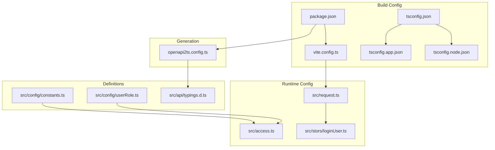
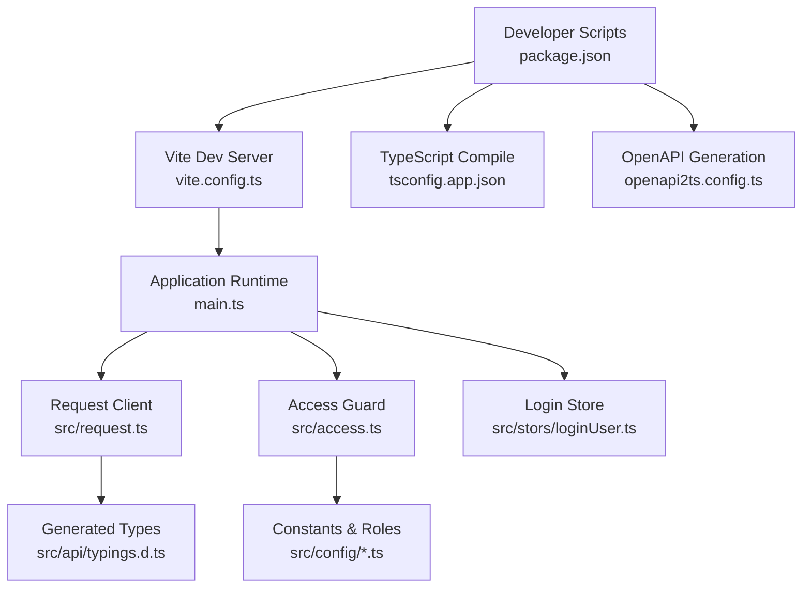
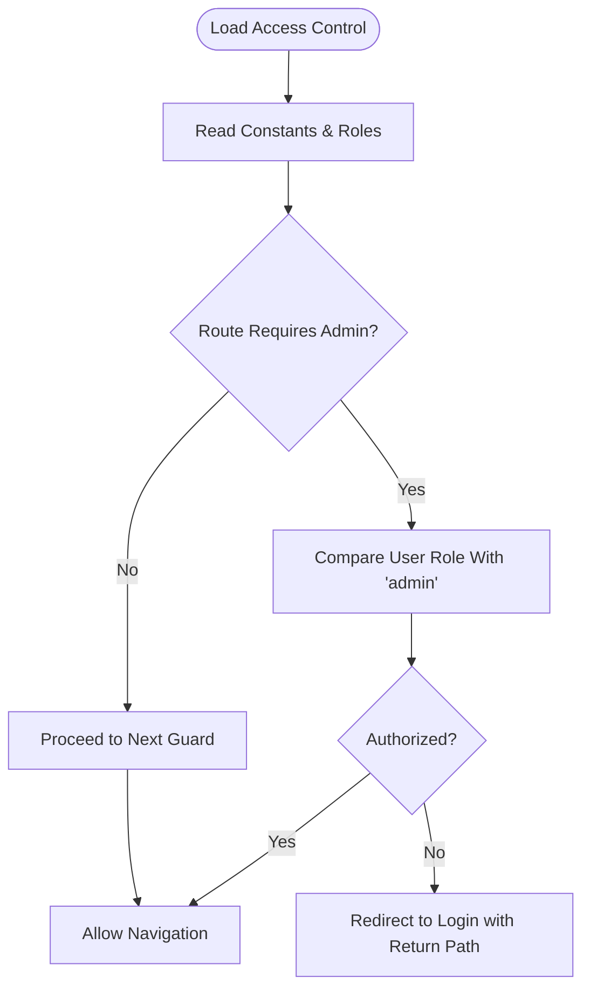
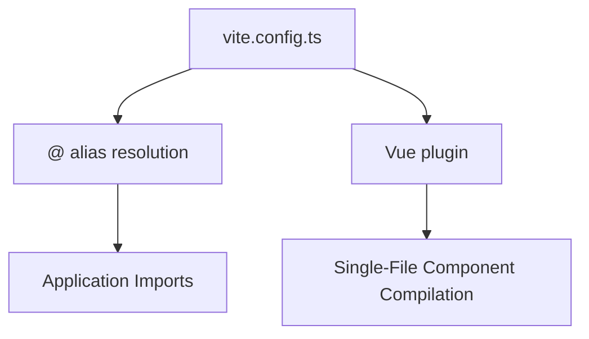
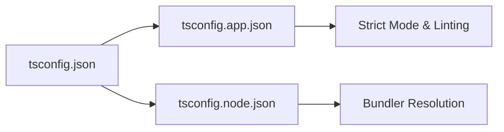
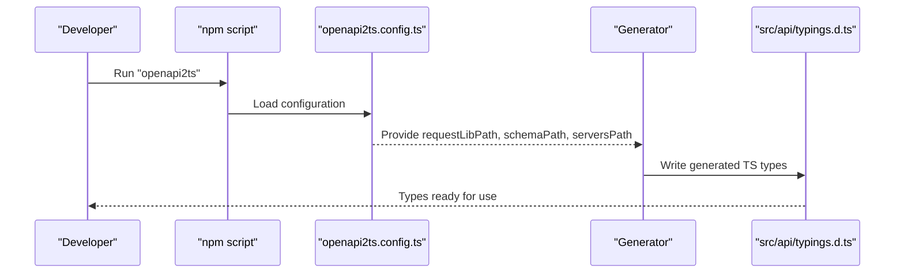
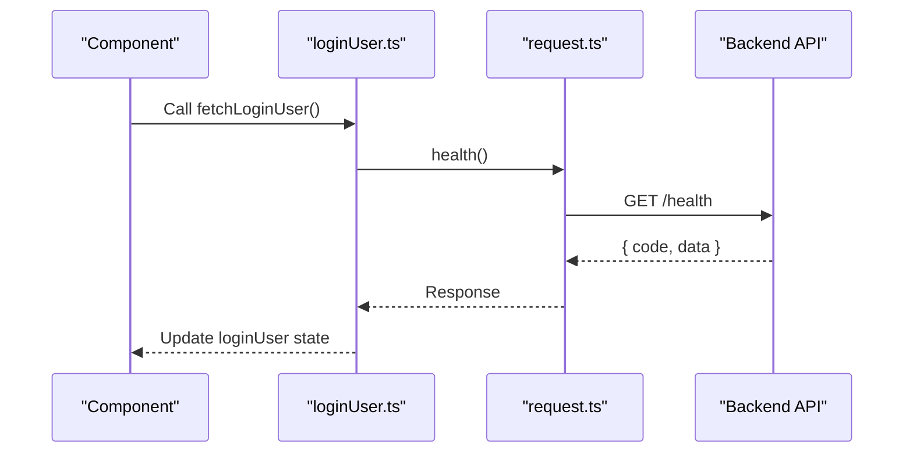
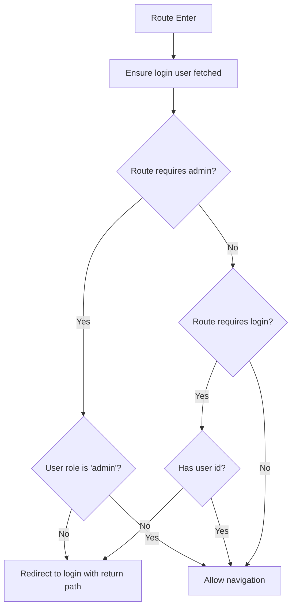
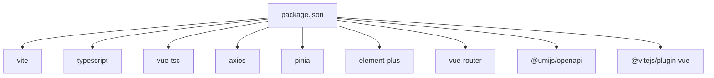

# Configuration & Settings

<cite>
**Referenced Files in This Document**
- [constants.ts](file://src/config/constants.ts)
- [userRole.ts](file://src/config/userRole.ts)
- [vite.config.ts](file://vite.config.ts)
- [openapi2ts.config.ts](file://openapi2ts.config.ts)
- [tsconfig.json](file://tsconfig.json)
- [tsconfig.app.json](file://tsconfig.app.json)
- [tsconfig.node.json](file://tsconfig.node.json)
- [package.json](file://package.json)
- [request.ts](file://src/request.ts)
- [access.ts](file://src/access.ts)
- [loginUser.ts](file://src/stors/loginUser.ts)
- [typings.d.ts](file://src/api/typings.d.ts)
- [main.ts](file://src/main.ts)
</cite>

## Table of Contents
1. [Introduction](#introduction)
2. [Project Structure](#project-structure)
3. [Core Components](#core-components)
4. [Architecture Overview](#architecture-overview)
5. [Detailed Component Analysis](#detailed-component-analysis)
6. [Dependency Analysis](#dependency-analysis)
7. [Performance Considerations](#performance-considerations)
8. [Troubleshooting Guide](#troubleshooting-guide)
9. [Conclusion](#conclusion)

## Introduction
This section documents the application’s configuration and settings management. It covers:
- Constants definition and user role management
- Build-time configuration via Vite and TypeScript
- OpenAPI-to-TypeScript generation setup
- Environment-specific configurations and deployment considerations
- Practical usage examples across the application
- Best practices, security considerations, and maintenance strategies

## Project Structure
The configuration system is organized around small, focused modules:
- Application constants and roles live under src/config
- Build configuration is centralized in vite.config.ts and TypeScript configs
- OpenAPI generation is configured via openapi2ts.config.ts
- Runtime configuration is embedded in request.ts and consumed by stores and guards

**Diagram sources**
- [vite.config.ts:1-13](file://vite.config.ts#L1-L13)
- [tsconfig.json:1-8](file://tsconfig.json#L1-L8)
- [tsconfig.app.json:1-20](file://tsconfig.app.json#L1-L20)
- [tsconfig.node.json:1-25](file://tsconfig.node.json#L1-L25)
- [package.json:1-31](file://package.json#L1-L31)
- [request.ts:1-49](file://src/request.ts#L1-L49)
- [access.ts:1-41](file://src/access.ts#L1-L41)
- [loginUser.ts:1-33](file://src/stors/loginUser.ts#L1-L33)
- [constants.ts:1-3](file://src/config/constants.ts#L1-L3)
- [userRole.ts:1-6](file://src/config/userRole.ts#L1-L6)
- [typings.d.ts:1-58](file://src/api/typings.d.ts#L1-L58)
- [openapi2ts.config.ts:1-7](file://openapi2ts.config.ts#L1-L7)

**Section sources**
- [vite.config.ts:1-13](file://vite.config.ts#L1-L13)
- [tsconfig.json:1-8](file://tsconfig.json#L1-L8)
- [tsconfig.app.json:1-20](file://tsconfig.app.json#L1-L20)
- [tsconfig.node.json:1-25](file://tsconfig.node.json#L1-L25)
- [package.json:1-31](file://package.json#L1-L31)

## Core Components
- Constants and roles: Centralized constants and user role identifiers enable consistent enforcement across guards and stores.
- Request client: Axios instance with base URL, timeouts, credentials, and global interceptors for unified API behavior.
- Access control: Route-level guard validates permissions and redirects unauthorized users.
- Store: Global login user state initialized and refreshed via API calls.
- Generation: OpenAPI-to-TypeScript configuration defines request library import and schema source.

Practical usage examples:
- Using constants and roles in route guards to restrict admin-only routes
- Consuming the login user store to check authentication state before rendering protected views
- Leveraging generated TS types for API responses and requests

**Section sources**
- [constants.ts:1-3](file://src/config/constants.ts#L1-L3)
- [userRole.ts:1-6](file://src/config/userRole.ts#L1-L6)
- [request.ts:1-49](file://src/request.ts#L1-L49)
- [access.ts:1-41](file://src/access.ts#L1-L41)
- [loginUser.ts:1-33](file://src/stors/loginUser.ts#L1-L33)
- [typings.d.ts:1-58](file://src/api/typings.d.ts#L1-L58)
- [openapi2ts.config.ts:1-7](file://openapi2ts.config.ts#L1-L7)

## Architecture Overview
The configuration architecture integrates build-time and runtime concerns:
- Build-time: Vite resolves aliases, TypeScript compiles with strictness and references, and scripts orchestrate generation and builds.
- Runtime: Request client encapsulates network behavior; access control enforces permissions; stores manage state; constants and roles provide shared definitions.

**Diagram sources**
- [package.json:1-31](file://package.json#L1-L31)
- [vite.config.ts:1-13](file://vite.config.ts#L1-L13)
- [tsconfig.app.json:1-20](file://tsconfig.app.json#L1-L20)
- [openapi2ts.config.ts:1-7](file://openapi2ts.config.ts#L1-L7)
- [main.ts:1-19](file://src/main.ts#L1-L19)
- [request.ts:1-49](file://src/request.ts#L1-L49)
- [access.ts:1-41](file://src/access.ts#L1-L41)
- [loginUser.ts:1-33](file://src/stors/loginUser.ts#L1-L33)
- [typings.d.ts:1-58](file://src/api/typings.d.ts#L1-L58)
- [constants.ts:1-3](file://src/config/constants.ts#L1-L3)
- [userRole.ts:1-6](file://src/config/userRole.ts#L1-L6)

## Detailed Component Analysis

### Constants and Role Management
- Purpose: Provide shared constants and role identifiers used across guards and stores.
- Usage pattern: Import constants and roles in access control and store logic to enforce policies consistently.

**Diagram sources**
- [access.ts:1-41](file://src/access.ts#L1-L41)
- [userRole.ts:1-6](file://src/config/userRole.ts#L1-L6)
- [constants.ts:1-3](file://src/config/constants.ts#L1-L3)

**Section sources**
- [constants.ts:1-3](file://src/config/constants.ts#L1-L3)
- [userRole.ts:1-6](file://src/config/userRole.ts#L1-L6)
- [access.ts:1-41](file://src/access.ts#L1-L41)

### Vite Build Configuration
- Aliasing: Resolves @ to src for clean imports.
- Plugins: Vue plugin enabled for SFC support.
- Extensibility: Additional Vite plugins or server/proxy settings can be added here for dev/prod differences.

**Diagram sources**
- [vite.config.ts:1-13](file://vite.config.ts#L1-L13)

**Section sources**
- [vite.config.ts:1-13](file://vite.config.ts#L1-L13)

### TypeScript Configuration
- Root references: tsconfig.json aggregates app and node configs.
- App config: Strict compiler options, path mapping, and DOM targets.
- Node config: Bundler mode for Vite, strictness, and included files.

**Diagram sources**
- [tsconfig.json:1-8](file://tsconfig.json#L1-L8)
- [tsconfig.app.json:1-20](file://tsconfig.app.json#L1-L20)
- [tsconfig.node.json:1-25](file://tsconfig.node.json#L1-L25)

**Section sources**
- [tsconfig.json:1-8](file://tsconfig.json#L1-L8)
- [tsconfig.app.json:1-20](file://tsconfig.app.json#L1-L20)
- [tsconfig.node.json:1-25](file://tsconfig.node.json#L1-L25)

### OpenAPI-to-TypeScript Generation Setup
- Request library import: Defines how generated clients import the request module.
- Schema source: Points to the backend OpenAPI document endpoint.
- Output location: Generated files written under src.

**Diagram sources**
- [package.json:1-31](file://package.json#L1-L31)
- [openapi2ts.config.ts:1-7](file://openapi2ts.config.ts#L1-L7)
- [typings.d.ts:1-58](file://src/api/typings.d.ts#L1-L58)

**Section sources**
- [openapi2ts.config.ts:1-7](file://openapi2ts.config.ts#L1-L7)
- [package.json:1-31](file://package.json#L1-L31)
- [typings.d.ts:1-58](file://src/api/typings.d.ts#L1-L58)

### Runtime Configuration: Request Client and Interceptors
- Base URL and timeout: Centralized API endpoint and request limits.
- Credentials: Enables cookie-based sessions.
- Interceptors: Global handling for authentication checks and error propagation.

**Diagram sources**
- [loginUser.ts:1-33](file://src/stors/loginUser.ts#L1-L33)
- [request.ts:1-49](file://src/request.ts#L1-L49)

**Section sources**
- [request.ts:1-49](file://src/request.ts#L1-L49)
- [loginUser.ts:1-33](file://src/stors/loginUser.ts#L1-L33)

### Access Control and Route Guards
- Guard logic: Validates user roles and login state before navigation.
- Redirect behavior: Sends unauthenticated or unauthorized users to the login page with a return path.

**Diagram sources**
- [access.ts:1-41](file://src/access.ts#L1-L41)
- [loginUser.ts:1-33](file://src/stors/loginUser.ts#L1-L33)

**Section sources**
- [access.ts:1-41](file://src/access.ts#L1-L41)
- [loginUser.ts:1-33](file://src/stors/loginUser.ts#L1-L33)

## Dependency Analysis
- Build-time dependencies: Vite, TypeScript, and related plugins define compile-time behavior and aliases.
- Runtime dependencies: Axios for HTTP, Pinia for state, Element Plus for UI, and Vue Router for navigation.
- Generation dependency: @umijs/openapi drives OpenAPI-to-TypeScript generation.

**Diagram sources**
- [package.json:1-31](file://package.json#L1-L31)

**Section sources**
- [package.json:1-31](file://package.json#L1-L31)

## Performance Considerations
- Keep base URL and timeouts aligned with backend capacity to avoid unnecessary retries.
- Prefer lazy loading for heavy components to reduce initial bundle size.
- Use strict TypeScript settings to catch errors early and improve DX.
- Limit interceptor logic to essential checks to minimize overhead.

## Troubleshooting Guide
Common issues and resolutions:
- OpenAPI generation fails
  - Verify schema path and network connectivity to the backend endpoint.
  - Confirm request library import path matches the project structure.
- Axios requests fail or redirect unexpectedly
  - Check base URL and CORS settings on the backend.
  - Review interceptor logic for authentication redirects.
- Route guard denies access incorrectly
  - Ensure the login user store is populated before navigation.
  - Validate role comparisons against constants and roles.

**Section sources**
- [openapi2ts.config.ts:1-7](file://openapi2ts.config.ts#L1-L7)
- [request.ts:1-49](file://src/request.ts#L1-L49)
- [access.ts:1-41](file://src/access.ts#L1-L41)
- [loginUser.ts:1-33](file://src/stors/loginUser.ts#L1-L33)

## Conclusion
The configuration system combines centralized constants, strict TypeScript compilation, Vite-based builds, and OpenAPI-driven type generation. Runtime configuration is encapsulated in a reusable request client and enforced by route guards and a global login store. Following the best practices and security considerations outlined ensures maintainable, secure, and scalable frontend behavior.