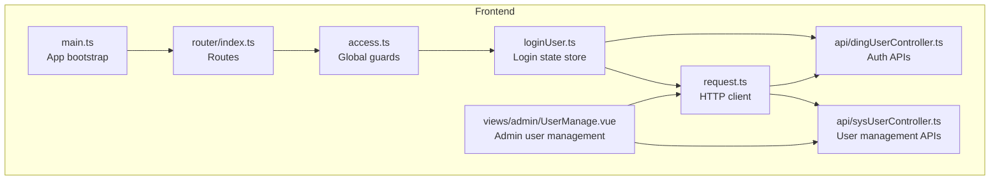
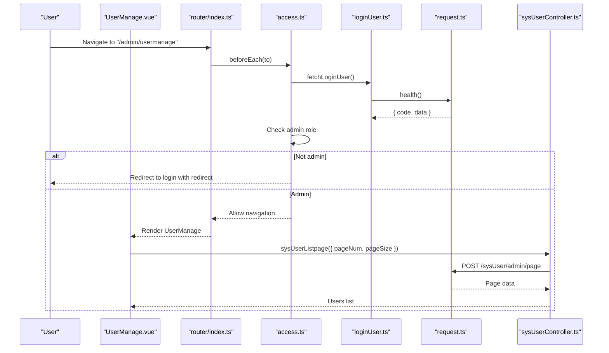
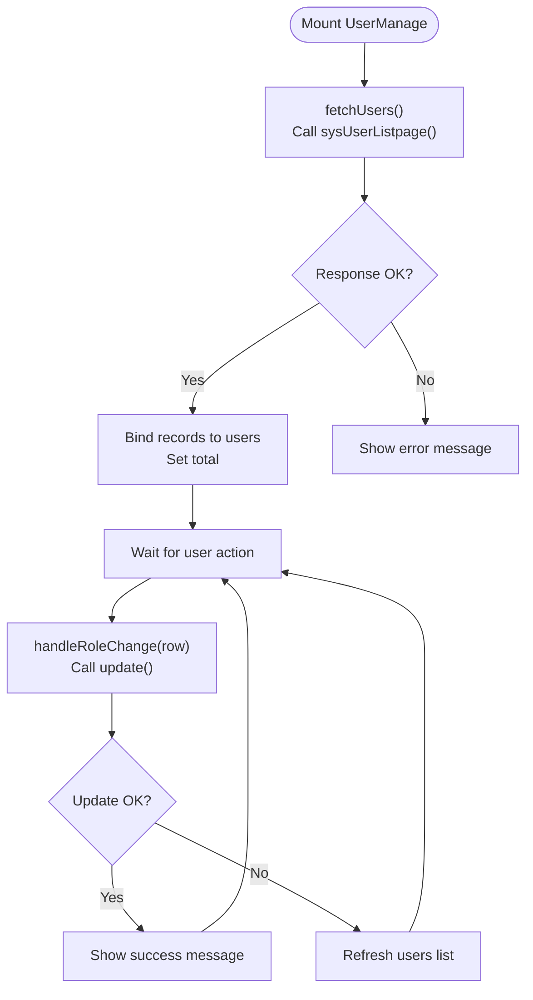
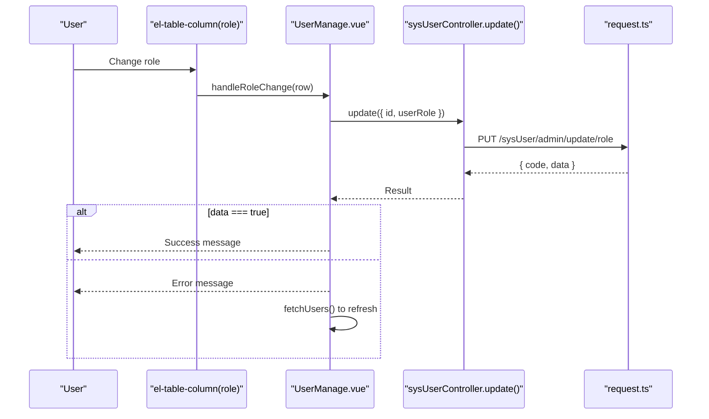
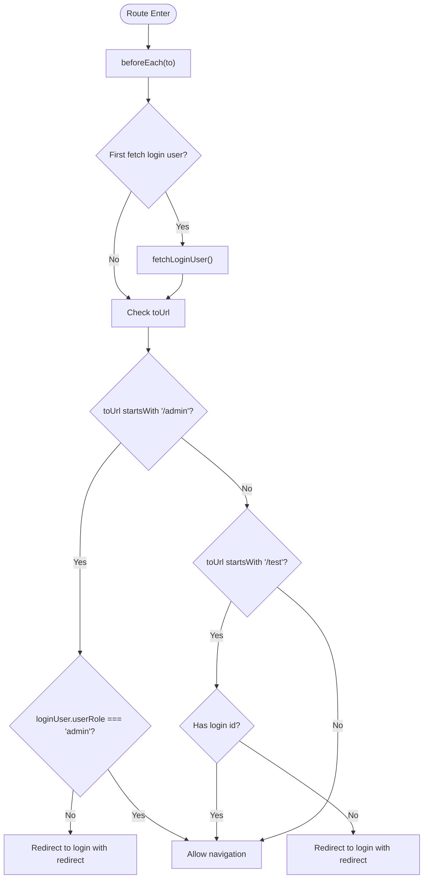
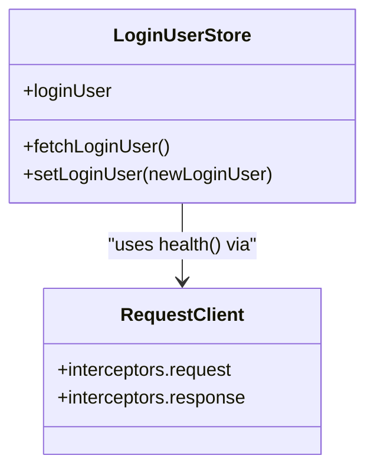
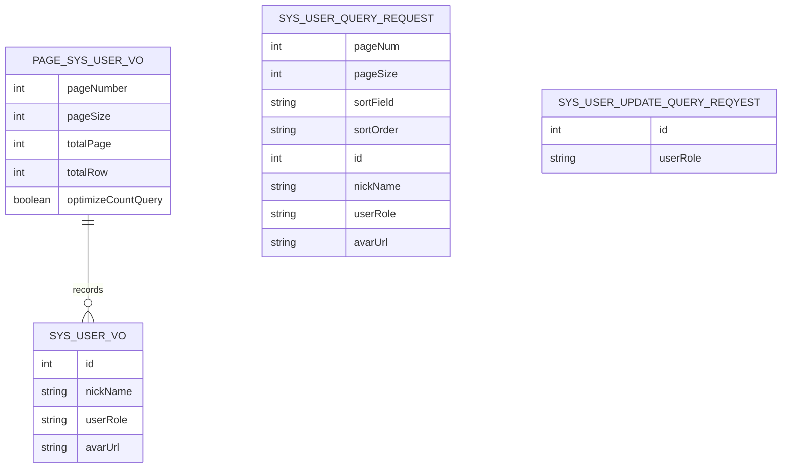
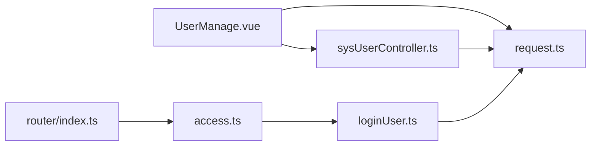

# Administrative Controls

<cite>
**Referenced Files in This Document**
- [UserManage.vue](file://src/views/admin/UserManage.vue)
- [sysUserController.ts](file://src/api/sysUserController.ts)
- [dingUserController.ts](file://src/api/dingUserController.ts)
- [request.ts](file://src/request.ts)
- [access.ts](file://src/access.ts)
- [loginUser.ts](file://src/stors/loginUser.ts)
- [index.ts](file://src/router/index.ts)
- [constants.ts](file://src/config/constants.ts)
- [userRole.ts](file://src/config/userRole.ts)
- [typings.d.ts](file://src/api/typings.d.ts)
- [main.ts](file://src/main.ts)
</cite>

## Table of Contents
1. [Introduction](#introduction)
2. [Project Structure](#project-structure)
3. [Core Components](#core-components)
4. [Architecture Overview](#architecture-overview)
5. [Detailed Component Analysis](#detailed-component-analysis)
6. [Dependency Analysis](#dependency-analysis)
7. [Performance Considerations](#performance-considerations)
8. [Troubleshooting Guide](#troubleshooting-guide)
9. [Conclusion](#conclusion)
10. [Appendices](#appendices)

## Introduction
This document explains the administrative controls feature, focusing on the admin user management interface, role-based access patterns, and administrative workflow automation. It documents the UserManage component architecture, user listing functionality, role assignment mechanisms, and administrative action handling. It also covers integration with the authentication system, permission validation, admin-only route protection, practical user management operations, pagination, and error handling. Security considerations, data validation, and workflow optimization recommendations are included.

## Project Structure
The administrative controls feature centers around a dedicated admin view and supporting modules:
- Admin view: User management page under the admin route
- API layer: Backend integration for listing users and updating roles
- Authentication and routing: Global guards and login state management
- Request layer: Shared HTTP client with interceptors
- Type definitions: Strong typing for API requests and responses

**Diagram sources**
- [main.ts:1-19](file://src/main.ts#L1-L19)
- [index.ts:1-40](file://src/router/index.ts#L1-L40)
- [access.ts:1-41](file://src/access.ts#L1-L41)
- [loginUser.ts:1-33](file://src/stors/loginUser.ts#L1-L33)
- [request.ts:1-49](file://src/request.ts#L1-L49)
- [sysUserController.ts:1-34](file://src/api/sysUserController.ts#L1-L34)
- [dingUserController.ts:1-43](file://src/api/dingUserController.ts#L1-L43)
- [UserManage.vue:1-147](file://src/views/admin/UserManage.vue#L1-L147)

**Section sources**
- [main.ts:1-19](file://src/main.ts#L1-L19)
- [index.ts:1-40](file://src/router/index.ts#L1-L40)
- [access.ts:1-41](file://src/access.ts#L1-L41)
- [loginUser.ts:1-33](file://src/stors/loginUser.ts#L1-L33)
- [request.ts:1-49](file://src/request.ts#L1-L49)
- [sysUserController.ts:1-34](file://src/api/sysUserController.ts#L1-L34)
- [dingUserController.ts:1-43](file://src/api/dingUserController.ts#L1-L43)
- [UserManage.vue:1-147](file://src/views/admin/UserManage.vue#L1-L147)

## Core Components
- UserManage view: Renders a paginated table of system users, allows inline role updates via dropdown, and displays loading states and messages.
- API module: Provides typed functions to list users and update roles.
- Authentication store: Centralizes login state and fetches current user info.
- Router and global guards: Enforce admin-only access and login-required access for protected pages.
- HTTP client: Shared Axios instance with request/response interceptors for unified error handling and session management.

Key responsibilities:
- Admin-only route protection ensures only admin users can access the user management page.
- Login state is fetched on first navigation to validate permissions.
- User listing supports pagination and exposes a role column with inline editing.
- Role updates are persisted via API and validated with feedback.

**Section sources**
- [UserManage.vue:56-128](file://src/views/admin/UserManage.vue#L56-L128)
- [sysUserController.ts:5-33](file://src/api/sysUserController.ts#L5-L33)
- [loginUser.ts:9-30](file://src/stors/loginUser.ts#L9-L30)
- [access.ts:11-39](file://src/access.ts#L11-L39)
- [request.ts:13-47](file://src/request.ts#L13-L47)

## Architecture Overview
The admin user management feature follows a layered architecture:
- Presentation layer: Vue Single File Component renders the UI and orchestrates user actions.
- Domain service layer: API functions encapsulate backend interactions.
- Infrastructure layer: HTTP client handles transport, credentials, timeouts, and interceptors.
- Security layer: Router guards and login state store enforce access policies.

**Diagram sources**
- [index.ts:32-35](file://src/router/index.ts#L32-L35)
- [access.ts:11-39](file://src/access.ts#L11-L39)
- [loginUser.ts:17-22](file://src/stors/loginUser.ts#L17-L22)
- [request.ts:6-10](file://src/request.ts#L6-L10)
- [sysUserController.ts:6-18](file://src/api/sysUserController.ts#L6-L18)

## Detailed Component Analysis

### UserManage Component
The UserManage component implements:
- Data binding to a reactive users array and pagination state
- Loading indicators during network requests
- Inline role selection per user with immediate persistence
- Pagination controls for navigating pages and changing page sizes
- Error handling and user feedback via message notifications

**Diagram sources**
- [UserManage.vue:67-128](file://src/views/admin/UserManage.vue#L67-L128)
- [sysUserController.ts:6-33](file://src/api/sysUserController.ts#L6-L33)

**Section sources**
- [UserManage.vue:10-53](file://src/views/admin/UserManage.vue#L10-L53)
- [UserManage.vue:67-128](file://src/views/admin/UserManage.vue#L67-L128)

### Role Assignment Mechanism
Inline role assignment is implemented via an element-plus select bound to each user’s role field. On change:
- The update API is invoked with the user ID and selected role
- Success triggers a positive message; failure triggers an error message and refreshes the list to revert UI state

**Diagram sources**
- [UserManage.vue:91-113](file://src/views/admin/UserManage.vue#L91-L113)
- [sysUserController.ts:20-33](file://src/api/sysUserController.ts#L20-L33)
- [request.ts:25-41](file://src/request.ts#L25-L41)

**Section sources**
- [UserManage.vue:21-37](file://src/views/admin/UserManage.vue#L21-L37)
- [UserManage.vue:91-113](file://src/views/admin/UserManage.vue#L91-L113)
- [sysUserController.ts:20-33](file://src/api/sysUserController.ts#L20-L33)

### Admin-Only Route Protection
The global router guard enforces:
- Admin-only access for URLs starting with "/admin"
- Login-required access for URLs starting with "/test"
- On admin route violations, redirects to the login page with a redirect parameter
- On first navigation, waits for login state resolution before evaluating permissions

**Diagram sources**
- [access.ts:11-39](file://src/access.ts#L11-L39)
- [loginUser.ts:17-22](file://src/stors/loginUser.ts#L17-L22)

**Section sources**
- [access.ts:11-39](file://src/access.ts#L11-L39)
- [loginUser.ts:17-22](file://src/stors/loginUser.ts#L17-L22)

### Authentication and Login State Management
The login state store:
- Holds a reactive login user object
- Fetches current user info via a health endpoint
- Exposes setters for programmatic updates

The HTTP client:
- Sets base URL, timeout, and credentials
- Intercepts responses to detect unauthenticated states and redirect to login

**Diagram sources**
- [loginUser.ts:9-30](file://src/stors/loginUser.ts#L9-L30)
- [request.ts:6-10](file://src/request.ts#L6-L10)
- [request.ts:25-41](file://src/request.ts#L25-L41)

**Section sources**
- [loginUser.ts:9-30](file://src/stors/loginUser.ts#L9-L30)
- [request.ts:6-10](file://src/request.ts#L6-L10)
- [request.ts:25-41](file://src/request.ts#L25-L41)

### API Layer and Data Contracts
The API module defines:
- Listing users with pagination and optional filters/sorting
- Updating a user’s role by ID

Type definitions:
- Base response wrappers for booleans, strings, and paginated user lists
- Page metadata and user entity structures
- Query and update request shapes

**Diagram sources**
- [typings.d.ts:26-57](file://src/api/typings.d.ts#L26-L57)

**Section sources**
- [sysUserController.ts:5-33](file://src/api/sysUserController.ts#L5-L33)
- [typings.d.ts:8-57](file://src/api/typings.d.ts#L8-L57)

### Practical Examples and Workflows
- Viewing the user management page:
  - Navigate to "/admin/usermanage"
  - Global guard checks admin role and redirects if unauthorized
- Filtering and sorting:
  - The query request type includes sortField and sortOrder fields for future extension
- Bulk actions:
  - Current implementation supports inline per-user role updates
  - Bulk operations can be added by extending the API and UI to support multi-selection and batch endpoints
- Administrative audit trails:
  - No explicit audit trail is implemented in the frontend
  - Backend audit logs should record admin actions; the UI can surface summaries via additional API endpoints

**Section sources**
- [index.ts:32-35](file://src/router/index.ts#L32-L35)
- [access.ts:22-28](file://src/access.ts#L22-L28)
- [typings.d.ts:35-49](file://src/api/typings.d.ts#L35-L49)

## Dependency Analysis
The admin feature exhibits clear separation of concerns:
- UserManage depends on API functions and Element Plus components
- API functions depend on the shared HTTP client
- Router guards depend on the login state store
- The login state store depends on the auth API and HTTP client

**Diagram sources**
- [UserManage.vue:58](file://src/views/admin/UserManage.vue#L58)
- [sysUserController.ts:3](file://src/api/sysUserController.ts#L3)
- [request.ts:1](file://src/request.ts#L1)
- [access.ts:11-20](file://src/access.ts#L11-L20)
- [loginUser.ts:17-22](file://src/stors/loginUser.ts#L17-L22)
- [index.ts:32-35](file://src/router/index.ts#L32-L35)

**Section sources**
- [UserManage.vue:58](file://src/views/admin/UserManage.vue#L58)
- [sysUserController.ts:3](file://src/api/sysUserController.ts#L3)
- [request.ts:1](file://src/request.ts#L1)
- [access.ts:11-20](file://src/access.ts#L11-L20)
- [loginUser.ts:17-22](file://src/stors/loginUser.ts#L17-L22)
- [index.ts:32-35](file://src/router/index.ts#L32-L35)

## Performance Considerations
- Pagination reduces payload sizes and improves responsiveness for large user bases
- Inline role updates trigger individual requests; consider debouncing or batching for high-frequency updates
- Loading states prevent redundant requests while data is being fetched
- Global interceptors centralize error handling and reduce repeated logic across components

[No sources needed since this section provides general guidance]

## Troubleshooting Guide
Common issues and resolutions:
- Unauthorized access to admin routes:
  - Ensure the user role is "admin" after login; otherwise, guard redirects to login
- Network failures during role updates:
  - UI shows error messages and refreshes the list to reflect server state
- Unauthenticated responses:
  - HTTP interceptor detects unauthenticated states and redirects to login

**Section sources**
- [access.ts:22-28](file://src/access.ts#L22-L28)
- [UserManage.vue:100-112](file://src/views/admin/UserManage.vue#L100-L112)
- [request.ts:29-39](file://src/request.ts#L29-L39)

## Conclusion
The administrative controls feature provides a focused, secure, and user-friendly interface for managing system users. Admin-only route protection, inline role updates, and robust error handling form a solid foundation. Extending the UI to support filtering/sorting and bulk operations, and integrating backend audit logs, would further enhance the administrative workflow.

[No sources needed since this section summarizes without analyzing specific files]

## Appendices

### Security Considerations
- Admin-only routes must be enforced on both client and server
- Role values are validated by the backend; frontend should treat user input as untrusted
- Use HTTPS and secure cookies to protect sessions
- Implement rate limiting and audit logging for sensitive operations

[No sources needed since this section provides general guidance]

### Data Validation and Types
- Use TypeScript types to validate request/response shapes
- Validate pagination parameters and role values before sending requests
- Centralize type definitions to avoid drift between frontend and backend

**Section sources**
- [typings.d.ts:35-57](file://src/api/typings.d.ts#L35-L57)

### Administrative Workflow Optimization
- Debounce rapid role changes to minimize network requests
- Add optimistic UI updates with rollback on failure
- Introduce bulk actions and selection toggles for efficient administration
- Provide exportable audit logs and activity timelines

[No sources needed since this section provides general guidance]