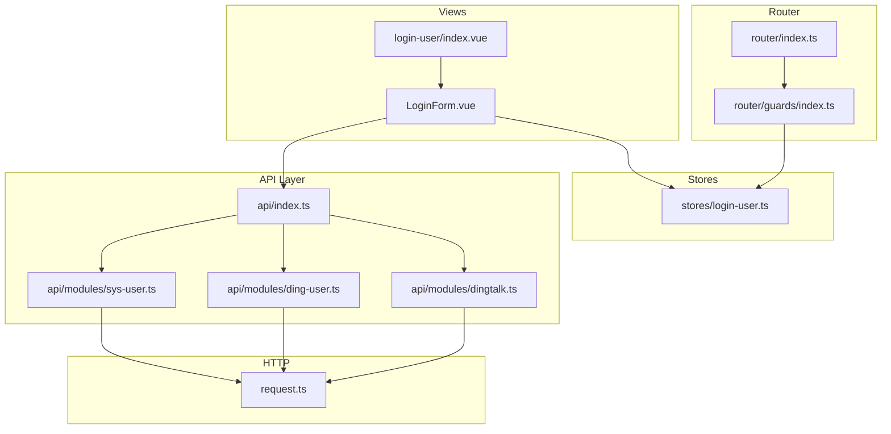
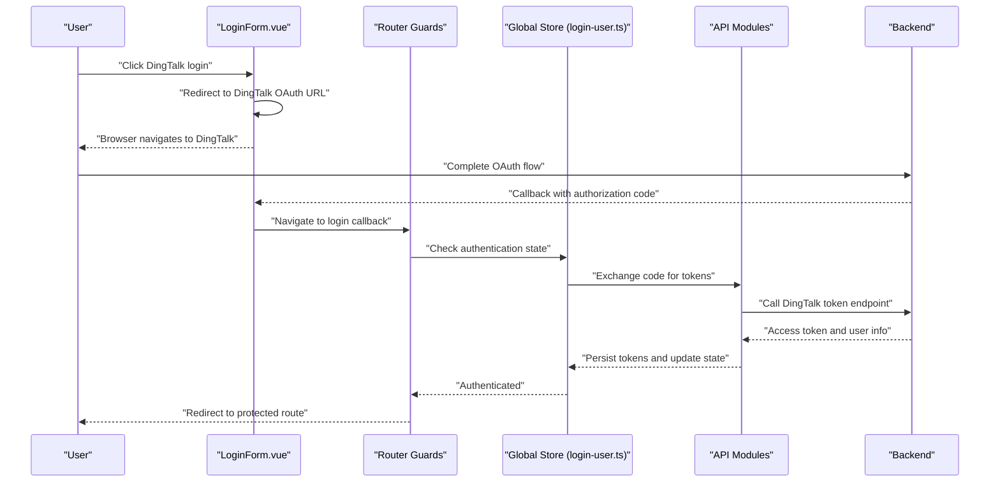
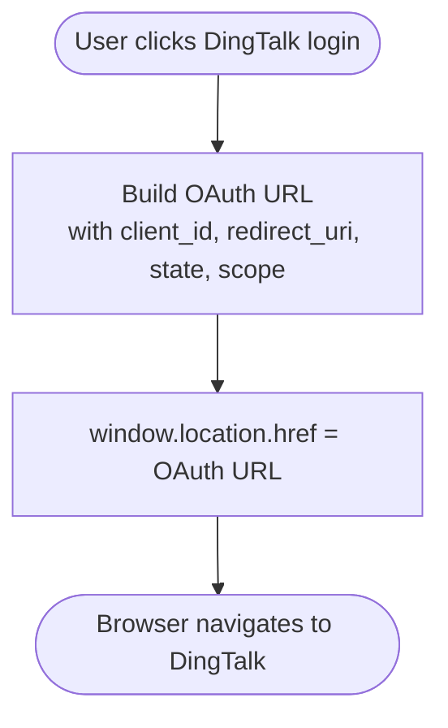
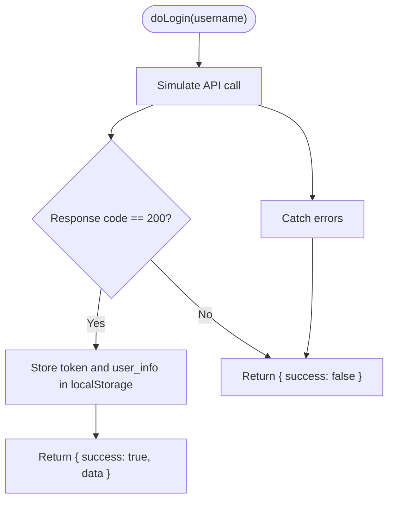
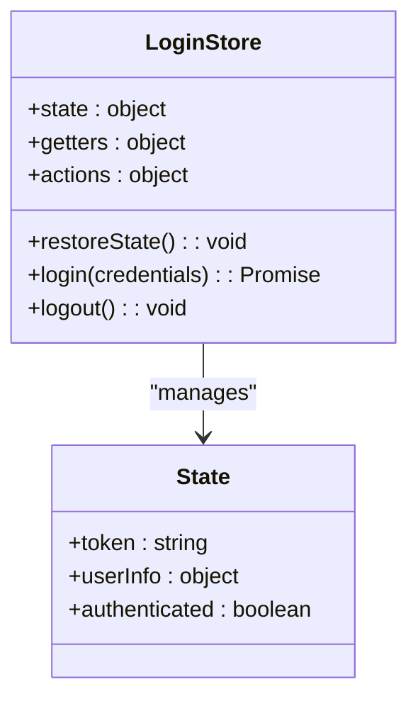
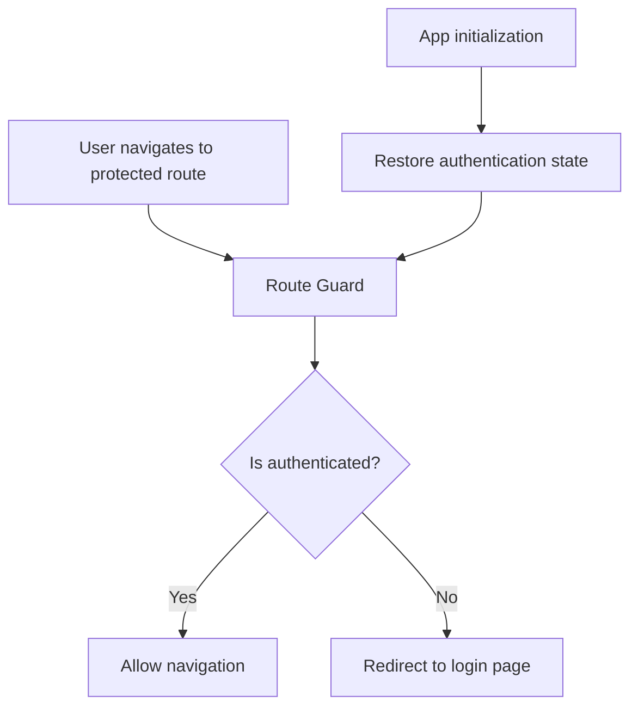
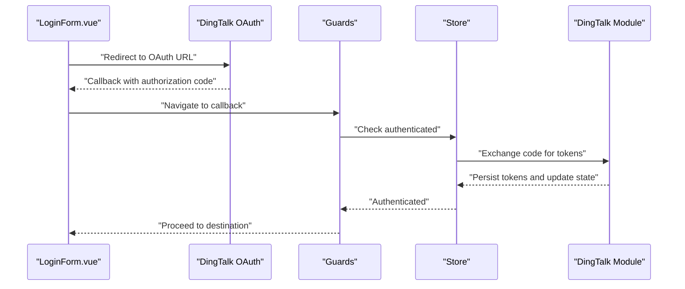
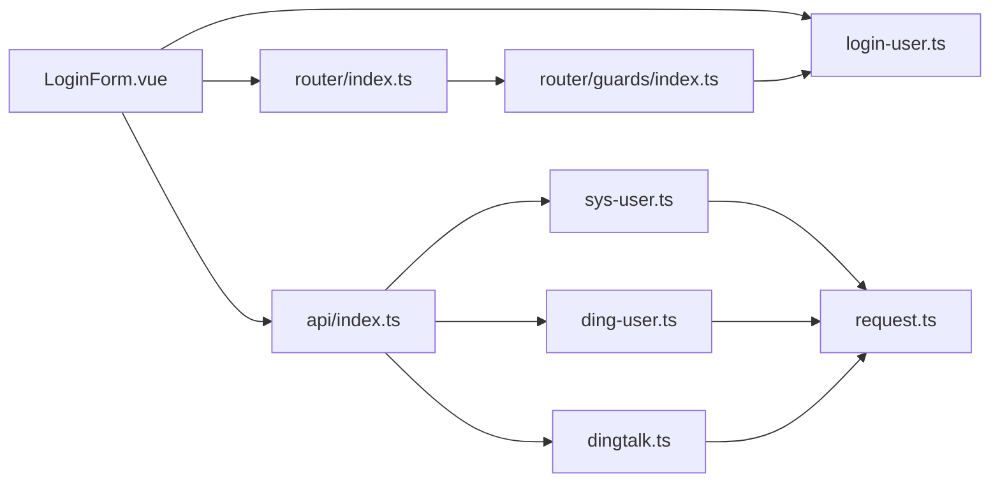

# Authentication & Login Flow

<cite>
**Referenced Files in This Document**
- [LoginForm.vue](file://src/views/login-user/components/LoginForm.vue)
- [login-api.js](file://src/views/login-user/js/login-api.js)
- [login-user.ts](file://src/stores/login-user.ts)
- [index.ts](file://src/router/index.ts)
- [guards/index.ts](file://src/router/guards/index.ts)
- [api/index.ts](file://src/api/index.ts)
- [dingtalk.ts](file://src/api/modules/dingtalk.ts)
- [sys-user.ts](file://src/api/modules/sys-user.ts)
- [ding-user.ts](file://src/api/modules/ding-user.ts)
- [request.ts](file://src/request.ts)
- [main.ts](file://src/main.ts)
</cite>

## Table of Contents
1. [Introduction](#introduction)
2. [Project Structure](#project-structure)
3. [Core Components](#core-components)
4. [Architecture Overview](#architecture-overview)
5. [Detailed Component Analysis](#detailed-component-analysis)
6. [Dependency Analysis](#dependency-analysis)
7. [Performance Considerations](#performance-considerations)
8. [Troubleshooting Guide](#troubleshooting-guide)
9. [Conclusion](#conclusion)

## Introduction
This document explains the authentication and login flow for the frontend application. It covers the login interface implementation, form validation patterns, authentication state management, and integration with both traditional and DingTalk OAuth authentication methods. It also documents the relationship with the global authentication store, route protection, and automatic login state checking, along with security considerations and user experience optimizations.

## Project Structure
The authentication and login feature spans several modules:
- Login UI: Vue component for the login form and DingTalk OAuth button
- Login API utilities: Local mock login flow and storage logic
- Global authentication store: Reactive user state and helpers
- Router and guards: Route protection and navigation logic
- API modules: Unified API access for system users and DingTalk endpoints
- Request wrapper: HTTP client configuration and interceptors

**Diagram sources**
- [LoginForm.vue:1-43](file://src/views/login-user/components/LoginForm.vue#L1-L43)
- [login-user.ts](file://src/stores/login-user.ts)
- [index.ts:1-43](file://src/router/index.ts#L1-L43)
- [guards/index.ts](file://src/router/guards/index.ts)
- [api/index.ts:1-13](file://src/api/index.ts#L1-L13)
- [sys-user.ts](file://src/api/modules/sys-user.ts)
- [ding-user.ts](file://src/api/modules/ding-user.ts)
- [dingtalk.ts](file://src/api/modules/dingtalk.ts)
- [request.ts](file://src/request.ts)

**Section sources**
- [LoginForm.vue:1-43](file://src/views/login-user/components/LoginForm.vue#L1-L43)
- [login-api.js:1-38](file://src/views/login-user/js/login-api.js#L1-L38)
- [login-user.ts](file://src/stores/login-user.ts)
- [index.ts:1-43](file://src/router/index.ts#L1-L43)
- [guards/index.ts](file://src/router/guards/index.ts)
- [api/index.ts:1-13](file://src/api/index.ts#L1-L13)

## Core Components
- LoginForm.vue: Provides the login UI and triggers DingTalk OAuth redirection. It currently exposes a method to navigate to DingTalk OAuth and comments indicating a traditional login flow.
- login-api.js: Implements a local doLogin function that simulates an API call, stores token and user info in localStorage, and returns a result object.
- login-user.ts: Defines the global authentication store with reactive user state, getters, and actions for login/logout and state restoration.
- router/index.ts: Declares routes including the login page and imports guards for route protection.
- router/guards/index.ts: Implements navigation guards to protect routes and enforce authentication checks.
- api/index.ts: Exports unified modules for system user and DingTalk operations.
- api/modules/dingtalk.ts: Exposes DingTalk OAuth endpoints and related utilities.
- api/modules/sys-user.ts: Exposes system user login/logout endpoints.
- api/modules/ding-user.ts: Exposes DingTalk user-related endpoints.
- request.ts: Centralized HTTP client with base URL and response interceptor logic.

**Section sources**
- [LoginForm.vue:1-43](file://src/views/login-user/components/LoginForm.vue#L1-L43)
- [login-api.js:1-38](file://src/views/login-user/js/login-api.js#L1-L38)
- [login-user.ts](file://src/stores/login-user.ts)
- [index.ts:1-43](file://src/router/index.ts#L1-L43)
- [guards/index.ts](file://src/router/guards/index.ts)
- [api/index.ts:1-13](file://src/api/index.ts#L1-L13)
- [dingtalk.ts](file://src/api/modules/dingtalk.ts)
- [sys-user.ts](file://src/api/modules/sys-user.ts)
- [ding-user.ts](file://src/api/modules/ding-user.ts)
- [request.ts](file://src/request.ts)

## Architecture Overview
The authentication flow integrates UI, state management, routing, and API modules:
- UI triggers either traditional login (via login-api.js) or DingTalk OAuth redirection (via LoginForm.vue).
- On successful authentication, the global store updates user state and persists tokens.
- Router guards check authentication status and redirect unauthenticated users to the login page.
- API modules encapsulate backend interactions for system users and DingTalk.

**Diagram sources**
- [LoginForm.vue:24-41](file://src/views/login-user/components/LoginForm.vue#L24-L41)
- [guards/index.ts](file://src/router/guards/index.ts)
- [login-user.ts](file://src/stores/login-user.ts)
- [dingtalk.ts](file://src/api/modules/dingtalk.ts)
- [sys-user.ts](file://src/api/modules/sys-user.ts)

## Detailed Component Analysis

### LoginForm Component Architecture
The LoginForm component provides a single action to initiate DingTalk OAuth. It constructs the OAuth URL with client ID, redirect URI, state, and scope, then redirects the browser to the DingTalk authorization endpoint.

**Diagram sources**
- [LoginForm.vue:24-41](file://src/views/login-user/components/LoginForm.vue#L24-L41)

**Section sources**
- [LoginForm.vue:1-43](file://src/views/login-user/components/LoginForm.vue#L1-L43)

### Traditional Login Flow (Local Mock)
The local doLogin function simulates an API call, validates response, and persists credentials in localStorage. It returns a structured result for downstream handling.

**Diagram sources**
- [login-api.js:5-38](file://src/views/login-user/js/login-api.js#L5-L38)

**Section sources**
- [login-api.js:1-38](file://src/views/login-user/js/login-api.js#L1-L38)

### Authentication State Management (Global Store)
The global store manages user authentication state, including token and user info persistence, restoration on app load, and logout cleanup. It exposes actions to log in/out and a getter to check authentication status.

**Diagram sources**
- [login-user.ts](file://src/stores/login-user.ts)

**Section sources**
- [login-user.ts](file://src/stores/login-user.ts)

### Route Protection and Automatic Login State Checking
The router guards enforce authentication across protected routes. They check the global store’s authentication state and redirect unauthenticated users to the login page. The store’s restoreState action is typically called during app initialization to restore prior sessions.

**Diagram sources**
- [guards/index.ts](file://src/router/guards/index.ts)
- [login-user.ts](file://src/stores/login-user.ts)

**Section sources**
- [guards/index.ts](file://src/router/guards/index.ts)
- [login-user.ts](file://src/stores/login-user.ts)

### DingTalk OAuth Integration
The component initiates OAuth by constructing the authorization URL and redirecting the browser. After successful authorization, the application receives an authorization code and exchanges it for tokens via DingTalk endpoints exposed by the API modules.

**Diagram sources**
- [LoginForm.vue:24-41](file://src/views/login-user/components/LoginForm.vue#L24-L41)
- [guards/index.ts](file://src/router/guards/index.ts)
- [login-user.ts](file://src/stores/login-user.ts)
- [dingtalk.ts](file://src/api/modules/dingtalk.ts)

**Section sources**
- [LoginForm.vue:24-41](file://src/views/login-user/components/LoginForm.vue#L24-L41)
- [dingtalk.ts](file://src/api/modules/dingtalk.ts)

### Form Validation Patterns
Validation patterns are not implemented in the current LoginForm component. Recommendations include:
- Input sanitization: Trim whitespace, enforce minimum length, and restrict special characters where appropriate.
- Real-time feedback: Show inline validation messages and disable submit until valid.
- Accessibility: Use aria attributes and semantic labels for screen readers.

[No sources needed since this section provides general guidance]

### Error Handling and Redirect Logic
- Local login: The doLogin function returns a structured result and logs exceptions, enabling callers to handle failures gracefully.
- OAuth callback: The guard ensures unauthenticated users are redirected to the login page, preventing unauthorized access.
- Session management: The store persists tokens and user info; on logout, it clears persisted data and resets state.

**Section sources**
- [login-api.js:34-38](file://src/views/login-user/js/login-api.js#L34-L38)
- [guards/index.ts](file://src/router/guards/index.ts)
- [login-user.ts](file://src/stores/login-user.ts)

### Security Considerations
- Token storage: Prefer secure, httpOnly cookies for production; avoid storing sensitive tokens in localStorage.
- CSRF protection: Use state parameters in OAuth flows and validate them server-side.
- Input sanitization: Sanitize and validate all inputs to prevent injection attacks.
- HTTPS enforcement: Ensure all authentication endpoints are served over HTTPS.
- Redirect safety: Validate redirect URIs against a whitelist to prevent open redirect vulnerabilities.

[No sources needed since this section provides general guidance]

### User Experience Optimization
- Loading indicators: Show loading states during login and OAuth callbacks.
- Clear messaging: Provide actionable error messages and retry mechanisms.
- Auto-redirect: After successful login, redirect to the originally requested page or a default dashboard.
- Graceful degradation: Handle network failures and server errors with user-friendly messages.

[No sources needed since this section provides general guidance]

## Dependency Analysis
The authentication subsystem depends on:
- Router and guards for navigation and protection
- Global store for state and persistence
- API modules for backend interactions
- Request wrapper for HTTP configuration

**Diagram sources**
- [LoginForm.vue:1-43](file://src/views/login-user/components/LoginForm.vue#L1-L43)
- [login-user.ts](file://src/stores/login-user.ts)
- [index.ts:1-43](file://src/router/index.ts#L1-L43)
- [guards/index.ts](file://src/router/guards/index.ts)
- [api/index.ts:1-13](file://src/api/index.ts#L1-L13)
- [sys-user.ts](file://src/api/modules/sys-user.ts)
- [ding-user.ts](file://src/api/modules/ding-user.ts)
- [dingtalk.ts](file://src/api/modules/dingtalk.ts)
- [request.ts](file://src/request.ts)

**Section sources**
- [LoginForm.vue:1-43](file://src/views/login-user/components/LoginForm.vue#L1-L43)
- [login-user.ts](file://src/stores/login-user.ts)
- [index.ts:1-43](file://src/router/index.ts#L1-L43)
- [guards/index.ts](file://src/router/guards/index.ts)
- [api/index.ts:1-13](file://src/api/index.ts#L1-L13)
- [sys-user.ts](file://src/api/modules/sys-user.ts)
- [ding-user.ts](file://src/api/modules/ding-user.ts)
- [dingtalk.ts](file://src/api/modules/dingtalk.ts)
- [request.ts](file://src/request.ts)

## Performance Considerations
- Minimize re-renders: Keep the login form lightweight and avoid unnecessary watchers.
- Debounce inputs: If adding real-time validation, debounce API calls to reduce network overhead.
- Lazy loading: Load DingTalk SDK or OAuth libraries only when needed.
- Caching: Reuse tokens and user info from the store to avoid redundant requests.

[No sources needed since this section provides general guidance]

## Troubleshooting Guide
Common issues and resolutions:
- OAuth redirect mismatch: Verify redirect_uri matches the configured value in DingTalk app settings.
- State parameter validation: Ensure the state parameter is validated server-side to prevent CSRF.
- Token persistence: Confirm tokens are stored and retrieved correctly from the global store and localStorage.
- Route protection: Check guards logic and ensure restoreState runs on app initialization.
- Network errors: Inspect request.ts interceptors and API module responses for error handling.

**Section sources**
- [LoginForm.vue:24-41](file://src/views/login-user/components/LoginForm.vue#L24-L41)
- [login-user.ts](file://src/stores/login-user.ts)
- [guards/index.ts](file://src/router/guards/index.ts)
- [request.ts](file://src/request.ts)

## Conclusion
The authentication and login flow combines a simple UI component, a global store for state management, router guards for protection, and modular API access for system and DingTalk integrations. While the current implementation focuses on DingTalk OAuth and a local mock login, extending it with robust form validation, secure token handling, and comprehensive error management will deliver a secure and user-friendly authentication experience.