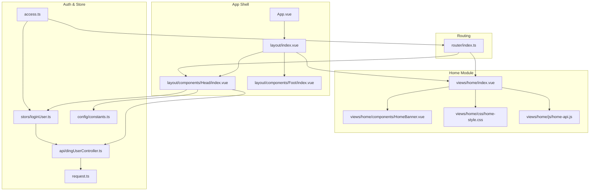
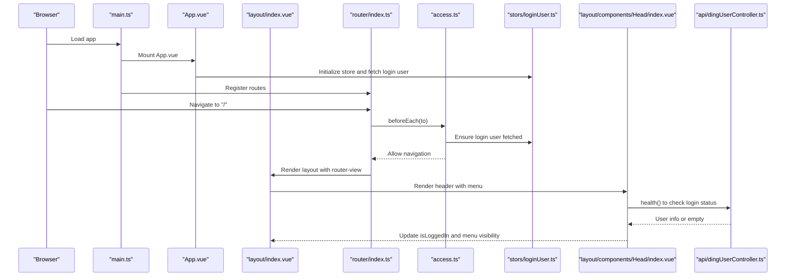
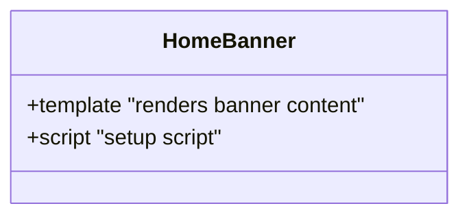
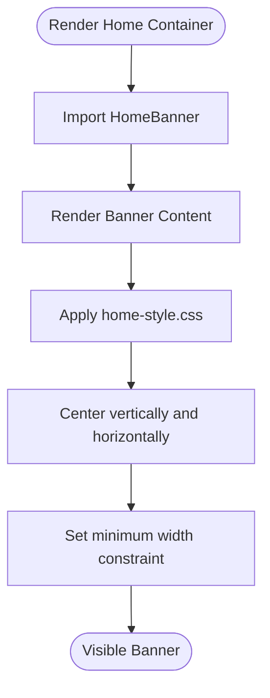
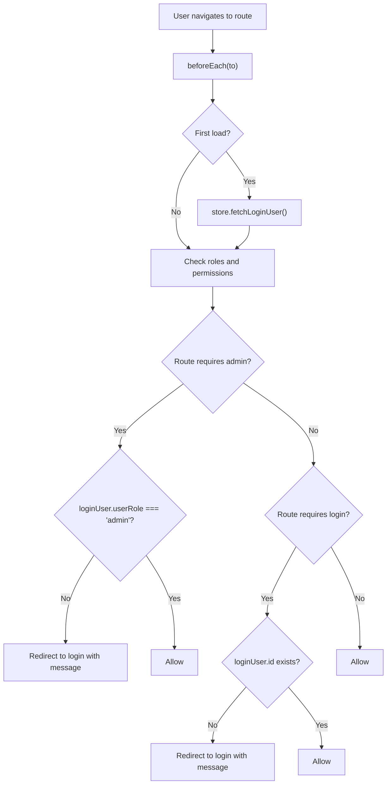
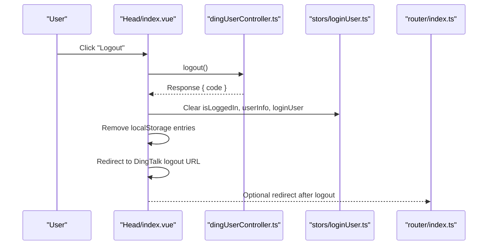
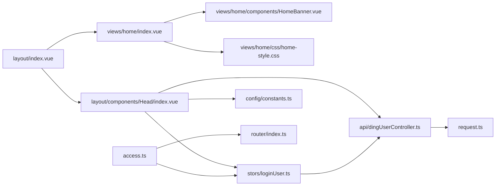

# Dashboard & Home Page

<cite>
**Referenced Files in This Document**
- [src/views/home/index.vue](file://src/views/home/index.vue)
- [src/views/home/components/HomeBanner.vue](file://src/views/home/components/HomeBanner.vue)
- [src/views/home/js/home-api.js](file://src/views/home/js/home-api.js)
- [src/views/home/css/home-style.css](file://src/views/home/css/home-style.css)
- [src/App.vue](file://src/App.vue)
- [src/router/index.ts](file://src/router/index.ts)
- [src/layout/index.vue](file://src/layout/index.vue)
- [src/layout/components/Head/index.vue](file://src/layout/components/Head/index.vue)
- [src/stors/loginUser.ts](file://src/stors/loginUser.ts)
- [src/access.ts](file://src/access.ts)
- [src/main.ts](file://src/main.ts)
- [src/api/dingUserController.ts](file://src/api/dingUserController.ts)
- [src/request.ts](file://src/request.ts)
- [src/style.css](file://src/style.css)
- [src/config/constants.ts](file://src/config/constants.ts)
</cite>

## Table of Contents
1. [Introduction](#introduction)
2. [Project Structure](#project-structure)
3. [Core Components](#core-components)
4. [Architecture Overview](#architecture-overview)
5. [Detailed Component Analysis](#detailed-component-analysis)
6. [Dependency Analysis](#dependency-analysis)
7. [Performance Considerations](#performance-considerations)
8. [Troubleshooting Guide](#troubleshooting-guide)
9. [Conclusion](#conclusion)
10. [Appendices](#appendices)

## Introduction
This document explains the dashboard and home page feature, focusing on the home landing page implementation, the banner component architecture, and responsive design patterns. It documents the HomeBanner component structure, data binding patterns, and API integration for dynamic content loading. It also covers CSS styling approaches, component composition, user interaction flows, customization examples, content management strategies, performance optimization techniques, authentication state integration, routing, and accessibility considerations.

## Project Structure
The home page feature is organized under the views/home module and integrates with the global layout and authentication system:
- Home page entry: [src/views/home/index.vue](file://src/views/home/index.vue)
- Banner component: [src/views/home/components/HomeBanner.vue](file://src/views/home/components/HomeBanner.vue)
- Home-specific API utilities: [src/views/home/js/home-api.js](file://src/views/home/js/home-api.js)
- Home styles: [src/views/home/css/home-style.css](file://src/views/home/css/home-style.css)
- Global app bootstrap and layout: [src/App.vue](file://src/App.vue), [src/layout/index.vue](file://src/layout/index.vue)
- Navigation header with authentication: [src/layout/components/Head/index.vue](file://src/layout/components/Head/index.vue)
- Authentication store and guards: [src/stors/loginUser.ts](file://src/stors/loginUser.ts), [src/access.ts](file://src/access.ts)
- Routing: [src/router/index.ts](file://src/router/index.ts)
- HTTP client and base configuration: [src/request.ts](file://src/request.ts)
- Global styles and constants: [src/style.css](file://src/style.css), [src/config/constants.ts](file://src/config/constants.ts)

**Diagram sources**
- [src/App.vue:1-19](file://src/App.vue#L1-L19)
- [src/layout/index.vue:1-29](file://src/layout/index.vue#L1-L29)
- [src/layout/components/Head/index.vue:1-279](file://src/layout/components/Head/index.vue#L1-L279)
- [src/views/home/index.vue:1-12](file://src/views/home/index.vue#L1-L12)
- [src/views/home/components/HomeBanner.vue:1-10](file://src/views/home/components/HomeBanner.vue#L1-L10)
- [src/views/home/css/home-style.css:1-22](file://src/views/home/css/home-style.css#L1-L22)
- [src/views/home/js/home-api.js:1-5](file://src/views/home/js/home-api.js#L1-L5)
- [src/router/index.ts:1-40](file://src/router/index.ts#L1-L40)
- [src/stors/loginUser.ts:1-33](file://src/stors/loginUser.ts#L1-L33)
- [src/access.ts:1-41](file://src/access.ts#L1-L41)
- [src/api/dingUserController.ts:1-43](file://src/api/dingUserController.ts#L1-L43)
- [src/request.ts:1-49](file://src/request.ts#L1-L49)
- [src/config/constants.ts:1-3](file://src/config/constants.ts#L1-L3)

**Section sources**
- [src/views/home/index.vue:1-12](file://src/views/home/index.vue#L1-L12)
- [src/views/home/components/HomeBanner.vue:1-10](file://src/views/home/components/HomeBanner.vue#L1-L10)
- [src/views/home/css/home-style.css:1-22](file://src/views/home/css/home-style.css#L1-L22)
- [src/views/home/js/home-api.js:1-5](file://src/views/home/js/home-api.js#L1-L5)
- [src/router/index.ts:1-40](file://src/router/index.ts#L1-L40)
- [src/layout/index.vue:1-29](file://src/layout/index.vue#L1-L29)
- [src/layout/components/Head/index.vue:1-279](file://src/layout/components/Head/index.vue#L1-L279)
- [src/stors/loginUser.ts:1-33](file://src/stors/loginUser.ts#L1-L33)
- [src/access.ts:1-41](file://src/access.ts#L1-L41)
- [src/api/dingUserController.ts:1-43](file://src/api/dingUserController.ts#L1-L43)
- [src/request.ts:1-49](file://src/request.ts#L1-L49)
- [src/style.css:1-13](file://src/style.css#L1-L13)
- [src/config/constants.ts:1-3](file://src/config/constants.ts#L1-L3)

## Core Components
- Home page container: renders the HomeBanner component and applies home-specific styles.
- HomeBanner: presentational component displaying welcome text and introductory paragraph.
- Home API utilities: placeholder for future dynamic content retrieval.
- Home styles: responsive banner layout with centered alignment and minimal width constraints.
- Global layout: provides the shell with header, content area, and footer.
- Header navigation: integrates authentication state, menu filtering, and logout flow.
- Authentication store: manages login state and fetches user info via API.
- Route guard: enforces permissions and redirects unauthenticated users.
- HTTP client: centralized request configuration with credentials and interceptors.

**Section sources**
- [src/views/home/index.vue:1-12](file://src/views/home/index.vue#L1-L12)
- [src/views/home/components/HomeBanner.vue:1-10](file://src/views/home/components/HomeBanner.vue#L1-L10)
- [src/views/home/js/home-api.js:1-5](file://src/views/home/js/home-api.js#L1-L5)
- [src/views/home/css/home-style.css:1-22](file://src/views/home/css/home-style.css#L1-L22)
- [src/layout/index.vue:1-29](file://src/layout/index.vue#L1-L29)
- [src/layout/components/Head/index.vue:1-279](file://src/layout/components/Head/index.vue#L1-L279)
- [src/stors/loginUser.ts:1-33](file://src/stors/loginUser.ts#L1-L33)
- [src/access.ts:1-41](file://src/access.ts#L1-L41)
- [src/api/dingUserController.ts:1-43](file://src/api/dingUserController.ts#L1-L43)
- [src/request.ts:1-49](file://src/request.ts#L1-L49)

## Architecture Overview
The home page is rendered as the root route and embedded within the global layout. The header dynamically reflects authentication state and filters menu items accordingly. The authentication store is hydrated on app initialization and route changes, ensuring consistent permission checks.

**Diagram sources**
- [src/main.ts:1-19](file://src/main.ts#L1-L19)
- [src/App.vue:1-19](file://src/App.vue#L1-L19)
- [src/layout/index.vue:1-29](file://src/layout/index.vue#L1-L29)
- [src/router/index.ts:1-40](file://src/router/index.ts#L1-L40)
- [src/access.ts:1-41](file://src/access.ts#L1-L41)
- [src/stors/loginUser.ts:1-33](file://src/stors/loginUser.ts#L1-L33)
- [src/layout/components/Head/index.vue:1-279](file://src/layout/components/Head/index.vue#L1-L279)
- [src/api/dingUserController.ts:1-43](file://src/api/dingUserController.ts#L1-L43)

## Detailed Component Analysis

### Home Banner Component
The HomeBanner component is a lightweight presentational element that displays a welcome message and introductory text. It currently uses static content but is structured to support dynamic data binding and future API integration.

**Diagram sources**
- [src/views/home/components/HomeBanner.vue:1-10](file://src/views/home/components/HomeBanner.vue#L1-L10)

**Section sources**
- [src/views/home/components/HomeBanner.vue:1-10](file://src/views/home/components/HomeBanner.vue#L1-L10)

### Home Container and Styles
The home container composes the HomeBanner and applies dedicated styles for vertical and horizontal centering, rounded corners, shadow, and minimum width constraints. These styles ensure the banner remains visually balanced across devices.

**Diagram sources**
- [src/views/home/index.vue:1-12](file://src/views/home/index.vue#L1-L12)
- [src/views/home/css/home-style.css:1-22](file://src/views/home/css/home-style.css#L1-L22)

**Section sources**
- [src/views/home/index.vue:1-12](file://src/views/home/index.vue#L1-L12)
- [src/views/home/css/home-style.css:1-22](file://src/views/home/css/home-style.css#L1-L22)

### API Integration for Dynamic Content
The current HomeBanner uses static content. To enable dynamic content:
- Introduce reactive data in HomeBanner using script setup.
- Call a function from home-api.js to fetch content.
- Bind template content to reactive properties.
- Add loading and error states for robust UX.

Example integration steps:
- Define a reactive property for banner content.
- Invoke a function exported by home-api.js during component setup.
- Update the template to render the reactive content.
- Handle loading and error states gracefully.

**Section sources**
- [src/views/home/js/home-api.js:1-5](file://src/views/home/js/home-api.js#L1-L5)
- [src/views/home/components/HomeBanner.vue:1-10](file://src/views/home/components/HomeBanner.vue#L1-L10)

### Authentication State and Routing Integration
The route guard ensures that protected areas are only accessible to authenticated users. It hydrates the authentication store on first load and enforces role-based access for admin routes.

**Diagram sources**
- [src/access.ts:1-41](file://src/access.ts#L1-L41)
- [src/stors/loginUser.ts:1-33](file://src/stors/loginUser.ts#L1-L33)

**Section sources**
- [src/access.ts:1-41](file://src/access.ts#L1-L41)
- [src/stors/loginUser.ts:1-33](file://src/stors/loginUser.ts#L1-L33)

### Header Navigation and User Interaction
The header component:
- Computes filtered menu items based on authentication and roles.
- Displays either a login button or a profile dropdown with actions.
- Handles logout by invoking the backend logout endpoint, clearing frontend state, and redirecting to DingTalk’s logout URL.

**Diagram sources**
- [src/layout/components/Head/index.vue:166-199](file://src/layout/components/Head/index.vue#L166-L199)
- [src/api/dingUserController.ts:28-34](file://src/api/dingUserController.ts#L28-L34)
- [src/stors/loginUser.ts:24-26](file://src/stors/loginUser.ts#L24-L26)
- [src/config/constants.ts:1-3](file://src/config/constants.ts#L1-L3)

**Section sources**
- [src/layout/components/Head/index.vue:1-279](file://src/layout/components/Head/index.vue#L1-L279)
- [src/api/dingUserController.ts:1-43](file://src/api/dingUserController.ts#L1-L43)
- [src/stors/loginUser.ts:1-33](file://src/stors/loginUser.ts#L1-L33)
- [src/config/constants.ts:1-3](file://src/config/constants.ts#L1-L3)

### CSS Styling Approach and Responsive Patterns
- Centering: The home root uses flexbox to center the banner both vertically and horizontally within the viewport.
- Spacing and typography: Consistent margins and font sizing improve readability.
- Minimum width: Ensures legibility on small screens.
- Shadow and background: Provide depth and visual separation from surrounding layout elements.

Responsive considerations:
- Use min-width to prevent content reflow on narrow screens.
- Maintain readable font sizes and spacing ratios.
- Prefer flexible units (percentages, em/rem) for scalable layouts.

**Section sources**
- [src/views/home/css/home-style.css:1-22](file://src/views/home/css/home-style.css#L1-L22)
- [src/layout/index.vue:19-29](file://src/layout/index.vue#L19-L29)

### Accessibility Considerations
- Semantic HTML: Ensure headings and paragraphs are used appropriately within the banner.
- Focus management: When adding interactive elements, ensure keyboard navigation works.
- Color contrast: Verify sufficient contrast between text and background.
- ARIA attributes: Add roles and labels where dynamic content is introduced.
- Screen reader compatibility: Announce dynamic content updates using ARIA live regions if applicable.

[No sources needed since this section provides general guidance]

## Dependency Analysis
The home page depends on the layout and header components, while the header depends on the authentication store and API. The route guard coordinates with the store to enforce permissions. The HTTP client centralizes request configuration and response handling.

**Diagram sources**
- [src/views/home/index.vue:1-12](file://src/views/home/index.vue#L1-L12)
- [src/views/home/components/HomeBanner.vue:1-10](file://src/views/home/components/HomeBanner.vue#L1-L10)
- [src/layout/index.vue:1-29](file://src/layout/index.vue#L1-L29)
- [src/layout/components/Head/index.vue:1-279](file://src/layout/components/Head/index.vue#L1-L279)
- [src/stors/loginUser.ts:1-33](file://src/stors/loginUser.ts#L1-L33)
- [src/access.ts:1-41](file://src/access.ts#L1-L41)
- [src/router/index.ts:1-40](file://src/router/index.ts#L1-L40)
- [src/api/dingUserController.ts:1-43](file://src/api/dingUserController.ts#L1-L43)
- [src/request.ts:1-49](file://src/request.ts#L1-L49)
- [src/config/constants.ts:1-3](file://src/config/constants.ts#L1-L3)

**Section sources**
- [src/views/home/index.vue:1-12](file://src/views/home/index.vue#L1-L12)
- [src/layout/index.vue:1-29](file://src/layout/index.vue#L1-L29)
- [src/layout/components/Head/index.vue:1-279](file://src/layout/components/Head/index.vue#L1-L279)
- [src/stors/loginUser.ts:1-33](file://src/stors/loginUser.ts#L1-L33)
- [src/access.ts:1-41](file://src/access.ts#L1-L41)
- [src/router/index.ts:1-40](file://src/router/index.ts#L1-L40)
- [src/api/dingUserController.ts:1-43](file://src/api/dingUserController.ts#L1-L43)
- [src/request.ts:1-49](file://src/request.ts#L1-L49)
- [src/config/constants.ts:1-3](file://src/config/constants.ts#L1-L3)

## Performance Considerations
- Lazy-load heavy assets within the banner only when needed.
- Debounce or throttle API calls if dynamic content is fetched frequently.
- Use virtualization for long lists inside the banner if extended in the future.
- Minimize reflows by avoiding frequent DOM writes; batch updates where possible.
- Cache user data in the store to avoid redundant network requests.
- Keep styles modular and scoped to reduce cascade complexity.

[No sources needed since this section provides general guidance]

## Troubleshooting Guide
Common issues and resolutions:
- Banner not centered: Verify the home root container has proper flex properties and sufficient height.
- Static content not updating: Ensure reactive properties are defined and bound in the banner component.
- Authentication redirects loop: Confirm the route guard logic and that the store hydration completes before navigation checks.
- Logout not clearing state: Ensure both frontend state and local storage are cleared and that the DingTalk logout URL is constructed with the correct client ID and return URL.

**Section sources**
- [src/views/home/css/home-style.css:1-22](file://src/views/home/css/home-style.css#L1-L22)
- [src/layout/components/Head/index.vue:166-199](file://src/layout/components/Head/index.vue#L166-L199)
- [src/access.ts:1-41](file://src/access.ts#L1-L41)
- [src/stors/loginUser.ts:24-26](file://src/stors/loginUser.ts#L24-L26)
- [src/config/constants.ts:1-3](file://src/config/constants.ts#L1-L3)

## Conclusion
The home page and banner feature form a clean, extensible foundation. The current implementation focuses on presentation and basic integration with the layout and authentication system. Future enhancements should emphasize dynamic content loading, improved accessibility, and performance optimizations while maintaining a responsive design.

[No sources needed since this section summarizes without analyzing specific files]

## Appendices

### Practical Examples

- Banner customization
  - Modify the banner content by introducing reactive properties and binding them in the template.
  - Add a loading indicator and error fallback for dynamic content fetching.

- Content management
  - Introduce a content service that fetches banner data from the backend.
  - Cache content in the store to avoid repeated requests.

- Performance optimization
  - Defer non-critical assets.
  - Use CSS containment and transform properties for smooth animations.
  - Minimize layout thrashing by batching DOM updates.

[No sources needed since this section provides general guidance]