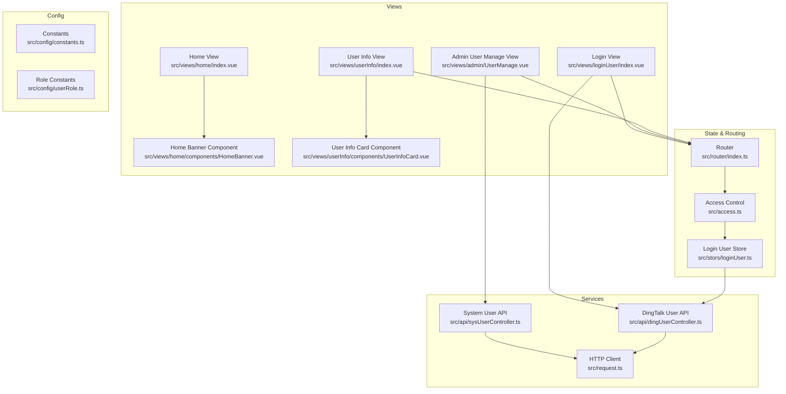
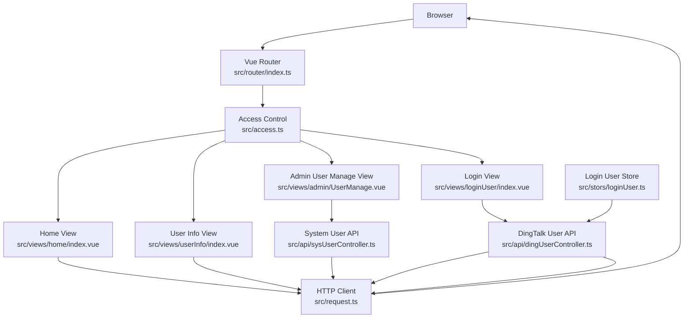
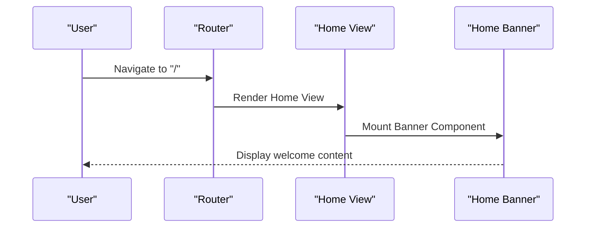
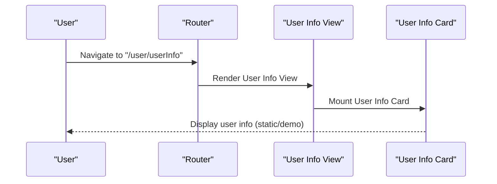
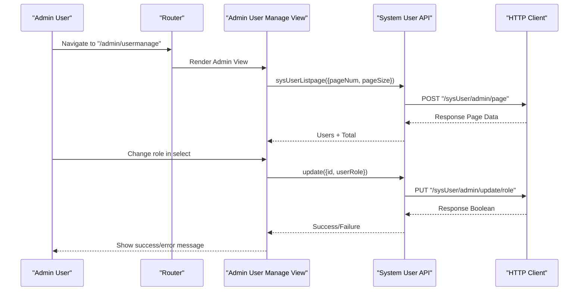
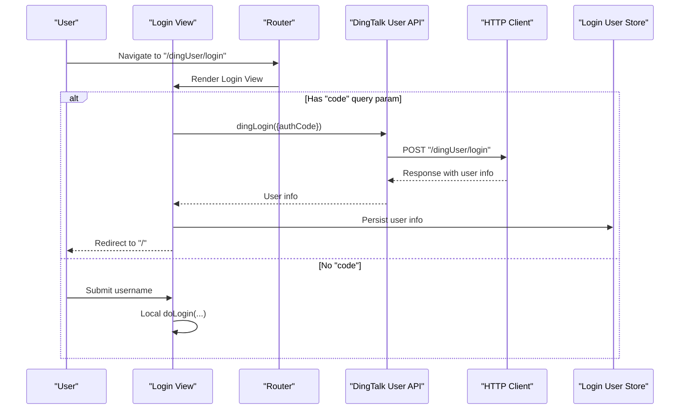
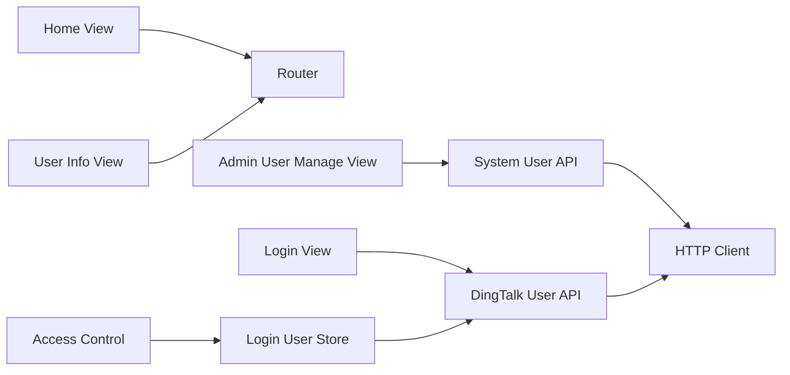
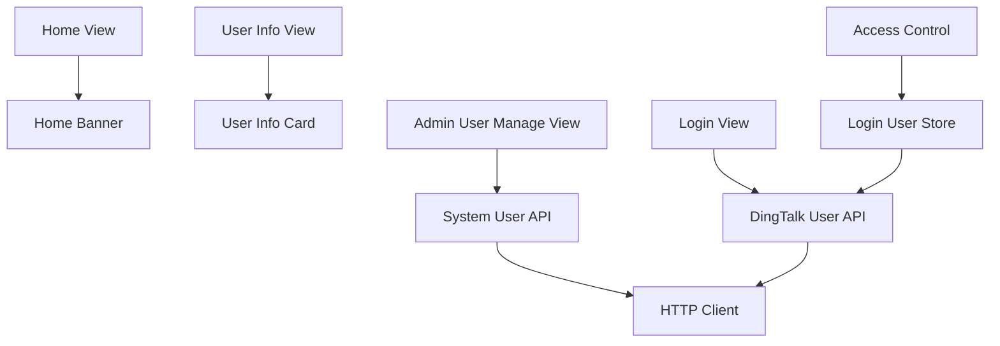

# Features & Functionality

<cite>
**Referenced Files in This Document**
- [src/views/home/index.vue](file://src/views/home/index.vue)
- [src/views/home/components/HomeBanner.vue](file://src/views/home/components/HomeBanner.vue)
- [src/views/userInfo/index.vue](file://src/views/userInfo/index.vue)
- [src/views/userInfo/components/UserInfoCard.vue](file://src/views/userInfo/components/UserInfoCard.vue)
- [src/views/admin/UserManage.vue](file://src/views/admin/UserManage.vue)
- [src/views/loginUser/index.vue](file://src/views/loginUser/index.vue)
- [src/api/sysUserController.ts](file://src/api/sysUserController.ts)
- [src/api/dingUserController.ts](file://src/api/dingUserController.ts)
- [src/stors/loginUser.ts](file://src/stors/loginUser.ts)
- [src/router/index.ts](file://src/router/index.ts)
- [src/request.ts](file://src/request.ts)
- [src/access.ts](file://src/access.ts)
- [src/config/constants.ts](file://src/config/constants.ts)
- [src/config/userRole.ts](file://src/config/userRole.ts)
</cite>

## Table of Contents
1. [Introduction](#introduction)
2. [Project Structure](#project-structure)
3. [Core Components](#core-components)
4. [Architecture Overview](#architecture-overview)
5. [Detailed Component Analysis](#detailed-component-analysis)
6. [Dependency Analysis](#dependency-analysis)
7. [Performance Considerations](#performance-considerations)
8. [Troubleshooting Guide](#troubleshooting-guide)
9. [Conclusion](#conclusion)

## Introduction
This section documents the application’s core features and functionality, focusing on:
- Home dashboard and landing page experience
- User information management and profile presentation
- Administrative user management capabilities
It explains feature architecture, data flow patterns, user interaction models, and the relationships between features and underlying services. Practical examples illustrate usage, data binding, and UI patterns, along with feature-specific configurations and integration points.

## Project Structure
The frontend is organized by feature and domain:
- Views: top-level pages such as home, user info, admin user management, login, and tests
- API modules: typed HTTP client wrappers for backend endpoints
- Store: global login user state management
- Router: route definitions and navigation
- Access control: global guards for permissions and redirects
- Request: Axios instance with interceptors for authentication and session handling
- Config: constants and role-related constants

**Diagram sources**
- [src/views/home/index.vue:1-12](file://src/views/home/index.vue#L1-L12)
- [src/views/home/components/HomeBanner.vue:1-10](file://src/views/home/components/HomeBanner.vue#L1-L10)
- [src/views/userInfo/index.vue:1-12](file://src/views/userInfo/index.vue#L1-L12)
- [src/views/userInfo/components/UserInfoCard.vue:1-15](file://src/views/userInfo/components/UserInfoCard.vue#L1-L15)
- [src/views/admin/UserManage.vue:1-147](file://src/views/admin/UserManage.vue#L1-L147)
- [src/views/loginUser/index.vue:1-71](file://src/views/loginUser/index.vue#L1-L71)
- [src/api/sysUserController.ts:1-34](file://src/api/sysUserController.ts#L1-L34)
- [src/api/dingUserController.ts:1-43](file://src/api/dingUserController.ts#L1-L43)
- [src/stors/loginUser.ts:1-33](file://src/stors/loginUser.ts#L1-L33)
- [src/router/index.ts:1-40](file://src/router/index.ts#L1-L40)
- [src/access.ts:1-41](file://src/access.ts#L1-L41)
- [src/request.ts:1-49](file://src/request.ts#L1-L49)
- [src/config/constants.ts:1-3](file://src/config/constants.ts#L1-L3)
- [src/config/userRole.ts:1-6](file://src/config/userRole.ts#L1-L6)

**Section sources**
- [src/router/index.ts:1-40](file://src/router/index.ts#L1-L40)
- [src/request.ts:1-49](file://src/request.ts#L1-L49)

## Core Components
- Home dashboard: renders a banner component and applies scoped styles
- User info: displays a user info card component
- Admin user management: lists users, supports pagination, and updates roles via inline select
- Login: supports manual login and DingTalk OAuth callback handling
- Global store: maintains current login user state and fetches it on demand
- Access control: enforces role-based and login-required guards
- HTTP client: centralized request configuration with credentials and automatic redirect on unauthenticated responses

**Section sources**
- [src/views/home/index.vue:1-12](file://src/views/home/index.vue#L1-L12)
- [src/views/home/components/HomeBanner.vue:1-10](file://src/views/home/components/HomeBanner.vue#L1-L10)
- [src/views/userInfo/index.vue:1-12](file://src/views/userInfo/index.vue#L1-L12)
- [src/views/userInfo/components/UserInfoCard.vue:1-15](file://src/views/userInfo/components/UserInfoCard.vue#L1-L15)
- [src/views/admin/UserManage.vue:1-147](file://src/views/admin/UserManage.vue#L1-L147)
- [src/views/loginUser/index.vue:1-71](file://src/views/loginUser/index.vue#L1-L71)
- [src/stors/loginUser.ts:1-33](file://src/stors/loginUser.ts#L1-L33)
- [src/access.ts:1-41](file://src/access.ts#L1-L41)
- [src/request.ts:1-49](file://src/request.ts#L1-L49)

## Architecture Overview
The application follows a layered architecture:
- Presentation layer: Vue single-file components and views
- Service layer: API modules encapsulate HTTP requests
- State layer: Pinia store for login user state
- Routing and access control: Vue Router with beforeEach guards
- Infrastructure: Axios instance with interceptors for authentication and session handling

**Diagram sources**
- [src/router/index.ts:1-40](file://src/router/index.ts#L1-L40)
- [src/access.ts:1-41](file://src/access.ts#L1-L41)
- [src/views/home/index.vue:1-12](file://src/views/home/index.vue#L1-L12)
- [src/views/userInfo/index.vue:1-12](file://src/views/userInfo/index.vue#L1-L12)
- [src/views/admin/UserManage.vue:1-147](file://src/views/admin/UserManage.vue#L1-L147)
- [src/views/loginUser/index.vue:1-71](file://src/views/loginUser/index.vue#L1-L71)
- [src/stors/loginUser.ts:1-33](file://src/stors/loginUser.ts#L1-L33)
- [src/api/sysUserController.ts:1-34](file://src/api/sysUserController.ts#L1-L34)
- [src/api/dingUserController.ts:1-43](file://src/api/dingUserController.ts#L1-L43)
- [src/request.ts:1-49](file://src/request.ts#L1-L49)

## Detailed Component Analysis

### Home Dashboard Implementation
- Purpose: Provide a landing page with a banner component and minimal styling
- Data flow: Stateless presentation; relies on router for navigation and access control
- UI pattern: Composition of a banner component inside the home view
- Interaction model: Navigation to other views via the header navigation component

**Diagram sources**
- [src/router/index.ts:1-40](file://src/router/index.ts#L1-L40)
- [src/views/home/index.vue:1-12](file://src/views/home/index.vue#L1-L12)
- [src/views/home/components/HomeBanner.vue:1-10](file://src/views/home/components/HomeBanner.vue#L1-L10)

**Section sources**
- [src/views/home/index.vue:1-12](file://src/views/home/index.vue#L1-L12)
- [src/views/home/components/HomeBanner.vue:1-10](file://src/views/home/components/HomeBanner.vue#L1-L10)

### User Information Management
- Purpose: Present user information in a structured card layout
- Data flow: The view composes a card component; the card currently displays static demo data
- UI pattern: List-based presentation with semantic headings
- Interaction model: Intended to integrate with the login user store and backend APIs for dynamic data

**Diagram sources**
- [src/router/index.ts:1-40](file://src/router/index.ts#L1-L40)
- [src/views/userInfo/index.vue:1-12](file://src/views/userInfo/index.vue#L1-L12)
- [src/views/userInfo/components/UserInfoCard.vue:1-15](file://src/views/userInfo/components/UserInfoCard.vue#L1-L15)

**Section sources**
- [src/views/userInfo/index.vue:1-12](file://src/views/userInfo/index.vue#L1-L12)
- [src/views/userInfo/components/UserInfoCard.vue:1-15](file://src/views/userInfo/components/UserInfoCard.vue#L1-L15)

### Administrative User Management
- Purpose: Allow administrators to manage system users, including viewing, paginating, and updating roles
- Data flow:
  - Fetch users with pagination parameters
  - Update a user’s role via inline select change
  - Handle success/error messaging and refresh on failure
- UI pattern: Element Plus table with avatar rendering, inline role selection, and pagination controls
- Interaction model: On mount, load users; on page size/current page change, reload; on role change, submit update and reflect feedback

**Diagram sources**
- [src/router/index.ts:1-40](file://src/router/index.ts#L1-L40)
- [src/views/admin/UserManage.vue:1-147](file://src/views/admin/UserManage.vue#L1-L147)
- [src/api/sysUserController.ts:1-34](file://src/api/sysUserController.ts#L1-L34)
- [src/request.ts:1-49](file://src/request.ts#L1-L49)

**Section sources**
- [src/views/admin/UserManage.vue:1-147](file://src/views/admin/UserManage.vue#L1-L147)
- [src/api/sysUserController.ts:1-34](file://src/api/sysUserController.ts#L1-L34)

### Login and Authentication Flow
- Purpose: Support manual login and DingTalk OAuth callback handling
- Data flow:
  - Manual login triggers a local handler that delegates to the login API module
  - DingTalk OAuth: on mount, check for a code query param; exchange it for user info via DingTalk API; persist user info and redirect to home
- UI pattern: Conditional rendering based on login state; progress indicator during DingTalk verification
- Interaction model: Redirects to home after successful login; preserves intended destination via redirect parameter

**Diagram sources**
- [src/views/loginUser/index.vue:1-71](file://src/views/loginUser/index.vue#L1-L71)
- [src/api/dingUserController.ts:1-43](file://src/api/dingUserController.ts#L1-L43)
- [src/request.ts:1-49](file://src/request.ts#L1-L49)
- [src/stors/loginUser.ts:1-33](file://src/stors/loginUser.ts#L1-L33)

**Section sources**
- [src/views/loginUser/index.vue:1-71](file://src/views/loginUser/index.vue#L1-L71)
- [src/api/dingUserController.ts:1-43](file://src/api/dingUserController.ts#L1-L43)
- [src/stors/loginUser.ts:1-33](file://src/stors/loginUser.ts#L1-L33)

### Relationship Between Features and Underlying Services
- Home and user info depend on routing and access control; they do not directly call APIs
- Admin user management depends on the system user API module and the HTTP client
- Login depends on DingTalk user API and persists user info via the login user store
- Access control depends on the login user store to enforce role-based restrictions

**Diagram sources**
- [src/views/home/index.vue:1-12](file://src/views/home/index.vue#L1-L12)
- [src/views/userInfo/index.vue:1-12](file://src/views/userInfo/index.vue#L1-L12)
- [src/views/admin/UserManage.vue:1-147](file://src/views/admin/UserManage.vue#L1-L147)
- [src/views/loginUser/index.vue:1-71](file://src/views/loginUser/index.vue#L1-L71)
- [src/api/sysUserController.ts:1-34](file://src/api/sysUserController.ts#L1-L34)
- [src/api/dingUserController.ts:1-43](file://src/api/dingUserController.ts#L1-L43)
- [src/stors/loginUser.ts:1-33](file://src/stors/loginUser.ts#L1-L33)
- [src/router/index.ts:1-40](file://src/router/index.ts#L1-L40)
- [src/access.ts:1-41](file://src/access.ts#L1-L41)
- [src/request.ts:1-49](file://src/request.ts#L1-L49)

**Section sources**
- [src/router/index.ts:1-40](file://src/router/index.ts#L1-L40)
- [src/access.ts:1-41](file://src/access.ts#L1-L41)
- [src/stors/loginUser.ts:1-33](file://src/stors/loginUser.ts#L1-L33)
- [src/api/sysUserController.ts:1-34](file://src/api/sysUserController.ts#L1-L34)
- [src/api/dingUserController.ts:1-43](file://src/api/dingUserController.ts#L1-L43)

### Feature-Specific Configurations and Customization Options
- HTTP base URL and credentials:
  - Base URL and withCredentials enable cookie-based session handling
  - Centralized in the HTTP client and reused by all API modules
- Role constants:
  - Role constants are defined for reuse across the app
- DingTalk client ID:
  - A constant is defined for DingTalk integration
- Pagination defaults:
  - Admin user management sets default page sizes and current page on size change

**Section sources**
- [src/request.ts:1-49](file://src/request.ts#L1-L49)
- [src/config/userRole.ts:1-6](file://src/config/userRole.ts#L1-L6)
- [src/config/constants.ts:1-3](file://src/config/constants.ts#L1-L3)
- [src/views/admin/UserManage.vue:115-124](file://src/views/admin/UserManage.vue#L115-L124)

## Dependency Analysis
- Coupling:
  - Views depend on components and API modules
  - API modules depend on the HTTP client
  - Access control depends on the login user store
- Cohesion:
  - Each view focuses on a single responsibility
  - API modules encapsulate endpoint-specific logic
- External dependencies:
  - Axios for HTTP requests
  - Element Plus for UI components in admin view
  - Vue Router and Pinia for routing and state

**Diagram sources**
- [src/views/home/index.vue:1-12](file://src/views/home/index.vue#L1-L12)
- [src/views/home/components/HomeBanner.vue:1-10](file://src/views/home/components/HomeBanner.vue#L1-L10)
- [src/views/userInfo/index.vue:1-12](file://src/views/userInfo/index.vue#L1-L12)
- [src/views/userInfo/components/UserInfoCard.vue:1-15](file://src/views/userInfo/components/UserInfoCard.vue#L1-L15)
- [src/views/admin/UserManage.vue:1-147](file://src/views/admin/UserManage.vue#L1-L147)
- [src/views/loginUser/index.vue:1-71](file://src/views/loginUser/index.vue#L1-L71)
- [src/api/sysUserController.ts:1-34](file://src/api/sysUserController.ts#L1-L34)
- [src/api/dingUserController.ts:1-43](file://src/api/dingUserController.ts#L1-L43)
- [src/stors/loginUser.ts:1-33](file://src/stors/loginUser.ts#L1-L33)
- [src/request.ts:1-49](file://src/request.ts#L1-L49)

**Section sources**
- [src/router/index.ts:1-40](file://src/router/index.ts#L1-L40)
- [src/access.ts:1-41](file://src/access.ts#L1-L41)
- [src/stors/loginUser.ts:1-33](file://src/stors/loginUser.ts#L1-L33)
- [src/api/sysUserController.ts:1-34](file://src/api/sysUserController.ts#L1-L34)
- [src/api/dingUserController.ts:1-43](file://src/api/dingUserController.ts#L1-L43)

## Performance Considerations
- Network efficiency:
  - Centralized HTTP client reduces duplication and ensures consistent timeouts and credentials
- UI responsiveness:
  - Loading indicators during admin user list fetch and role updates improve perceived performance
- Pagination:
  - Page size and current page changes trigger targeted reloads to avoid unnecessary data transfer
- State caching:
  - Login user store fetches user info once and reuses it across guards and views

[No sources needed since this section provides general guidance]

## Troubleshooting Guide
- Unauthenticated access:
  - The HTTP client interceptors detect unauthenticated responses and redirect to the login page with a redirect parameter
- Admin-only routes:
  - Access control checks user role and redirects non-admins to the login page with intended destination preserved
- Login failures:
  - DingTalk login handles error cases and network exceptions, displaying alerts and reloading the current route
- Admin role updates:
  - On failure or network errors, the admin view refreshes the user list to revert UI state

**Section sources**
- [src/request.ts:1-49](file://src/request.ts#L1-L49)
- [src/access.ts:1-41](file://src/access.ts#L1-L41)
- [src/views/loginUser/index.vue:1-71](file://src/views/loginUser/index.vue#L1-L71)
- [src/views/admin/UserManage.vue:1-147](file://src/views/admin/UserManage.vue#L1-L147)

## Conclusion
The application’s features are structured around clear separation of concerns:
- Home and user info provide presentation layers
- Admin user management integrates with backend APIs for CRUD-like operations
- Login leverages DingTalk OAuth and stores user info for downstream access control
- Access control and the HTTP client ensure secure, session-aware interactions
This design enables maintainable extensions, predictable data flows, and robust user experiences.