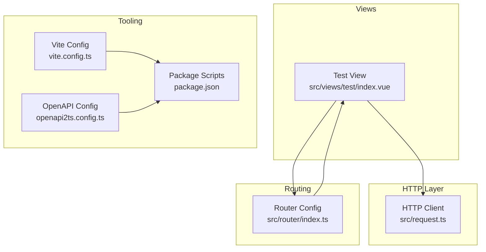
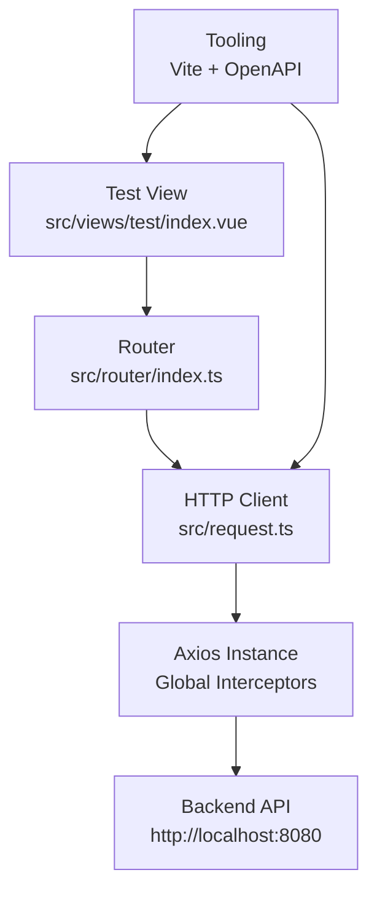
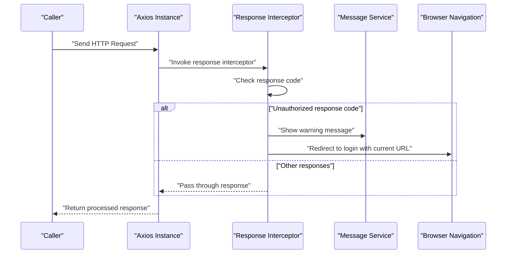
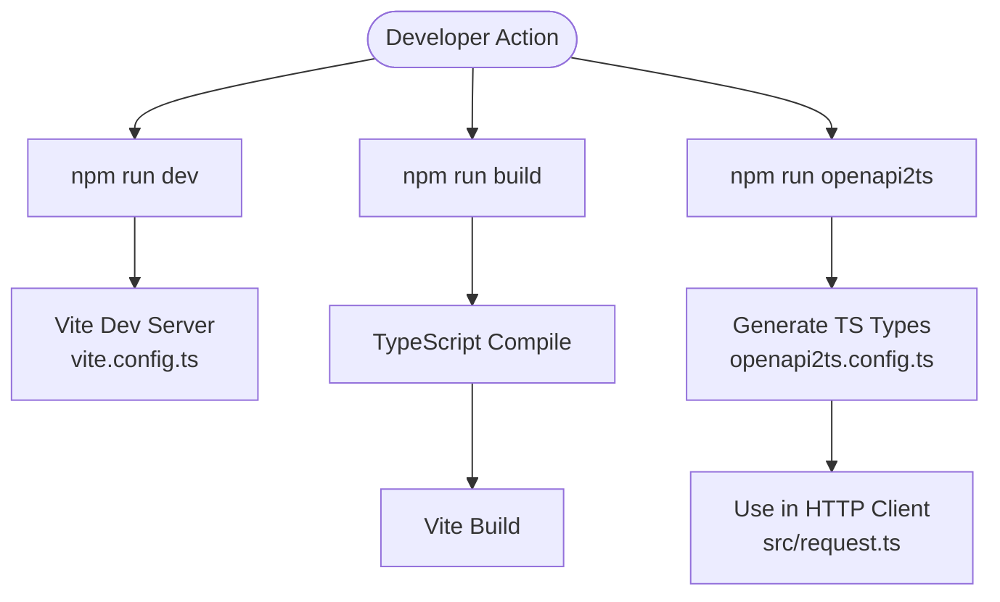
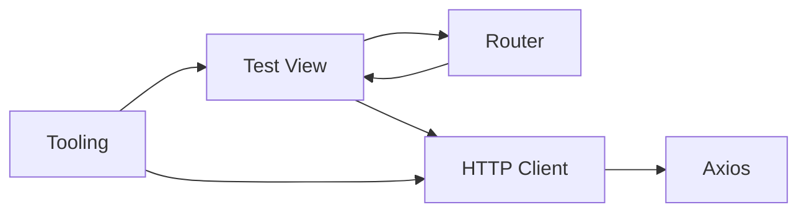

# Testing & Development Utilities

<cite>
**Referenced Files in This Document**
- [index.vue](file://src/views/test/index.vue)
- [request.ts](file://src/request.ts)
- [index.ts](file://src/router/index.ts)
- [package.json](file://package.json)
- [vite.config.ts](file://vite.config.ts)
- [openapi2ts.config.ts](file://openapi2ts.config.ts)
- [README.md](file://README.md)
</cite>

## Table of Contents
1. [Introduction](#introduction)
2. [Project Structure](#project-structure)
3. [Core Components](#core-components)
4. [Architecture Overview](#architecture-overview)
5. [Detailed Component Analysis](#detailed-component-analysis)
6. [Dependency Analysis](#dependency-analysis)
7. [Performance Considerations](#performance-considerations)
8. [Troubleshooting Guide](#troubleshooting-guide)
9. [Conclusion](#conclusion)

## Introduction
This document describes the testing and development utilities feature of the frontend application. It explains the test page implementation, development tooling integration, and utility function demonstration. The focus is on the test component architecture, API testing patterns, and development workflow support. It also documents the integration with various testing frameworks, debugging utilities, and development environment tools, providing practical examples for testing components, API endpoints, and user workflows.

## Project Structure
The testing and development utilities feature centers around a dedicated test page, a centralized HTTP client with interceptors, routing configuration, and development tooling integration via Vite and OpenAPI generation.

**Diagram sources**
- [index.vue:1-4](file://src/views/test/index.vue#L1-L4)
- [request.ts:1-49](file://src/request.ts#L1-L49)
- [index.ts:1-43](file://src/router/index.ts#L1-L43)
- [vite.config.ts:1-13](file://vite.config.ts#L1-L13)
- [openapi2ts.config.ts:1-7](file://openapi2ts.config.ts#L1-L7)
- [package.json:1-31](file://package.json#L1-L31)

**Section sources**
- [index.vue:1-4](file://src/views/test/index.vue#L1-L4)
- [request.ts:1-49](file://src/request.ts#L1-L49)
- [index.ts:1-43](file://src/router/index.ts#L1-L43)
- [vite.config.ts:1-13](file://vite.config.ts#L1-L13)
- [openapi2ts.config.ts:1-7](file://openapi2ts.config.ts#L1-L7)
- [package.json:1-31](file://package.json#L1-L31)

## Core Components
- Test View: A minimal test page designed to verify user login state rendering and serve as a development playground.
- HTTP Client: A centralized Axios instance with global request and response interceptors for unified API communication and authentication handling.
- Router: Routes configuration that exposes the test page and integrates with guards for access control.
- Tooling: Vite for development server and build, OpenAPI integration for generating TypeScript models and requests, and npm scripts for common tasks.

Key capabilities:
- Centralized HTTP configuration with base URL and credentials support.
- Global response interceptor handling authentication redirects and warnings.
- Route definition for the test page under a dedicated path.
- Development tooling enabling rapid iteration and API contract-driven development.

**Section sources**
- [index.vue:1-4](file://src/views/test/index.vue#L1-L4)
- [request.ts:1-49](file://src/request.ts#L1-L49)
- [index.ts:1-43](file://src/router/index.ts#L1-L43)
- [vite.config.ts:1-13](file://vite.config.ts#L1-L13)
- [openapi2ts.config.ts:1-7](file://openapi2ts.config.ts#L1-L7)
- [package.json:1-31](file://package.json#L1-L31)

## Architecture Overview
The testing and development utilities feature follows a layered architecture:
- Presentation Layer: Test view component.
- Routing Layer: Router configuration exposing the test route.
- HTTP Layer: Shared HTTP client with interceptors for authentication and error handling.
- Tooling Layer: Vite for dev/build, OpenAPI generation for type-safe API clients.

**Diagram sources**
- [index.vue:1-4](file://src/views/test/index.vue#L1-L4)
- [index.ts:1-43](file://src/router/index.ts#L1-L43)
- [request.ts:1-49](file://src/request.ts#L1-L49)
- [vite.config.ts:1-13](file://vite.config.ts#L1-L13)
- [openapi2ts.config.ts:1-7](file://openapi2ts.config.ts#L1-L7)

## Detailed Component Analysis

### Test View Component
The test view serves as a dedicated page for validating login state rendering and acting as a sandbox for quick UI checks during development.

Implementation highlights:
- Minimal template structure suitable for mounting interactive components or displaying login state indicators.
- Integrated into the router under a dedicated path for easy access during development and testing.

Development workflow benefits:
- Quick verification of UI rendering without navigating through complex user flows.
- Ideal location for temporarily adding debugging helpers or component demos.

**Section sources**
- [index.vue:1-4](file://src/views/test/index.vue#L1-L4)
- [index.ts:29-33](file://src/router/index.ts#L29-L33)

### HTTP Client and Interceptors
The HTTP client encapsulates shared configuration and cross-cutting concerns for API communication.

Core elements:
- Axios instance configured with a base URL and timeout.
- Request interceptor for pre-processing requests.
- Response interceptor handling authentication scenarios and error propagation.

Authentication flow:
- On receiving a specific unauthorized response code, the interceptor triggers a warning and redirects to the login page when appropriate.
- Ensures consistent handling of unauthenticated requests across the application.

**Diagram sources**
- [request.ts:25-47](file://src/request.ts#L25-L47)

**Section sources**
- [request.ts:1-49](file://src/request.ts#L1-L49)

### Router Integration
The router defines the test route and integrates with guards for access control.

Key aspects:
- Dedicated route path for the test view.
- Integration with route guards for protecting pages requiring authentication.
- Clean separation of test content from production routes.

**Section sources**
- [index.ts:29-33](file://src/router/index.ts#L29-L33)
- [index.ts:8-9](file://src/router/index.ts#L8-L9)

### Development Tooling Integration
The development environment leverages Vite and OpenAPI generation to streamline development and maintain type safety.

Vite configuration:
- Vue plugin enabled for single-file component support.
- Path aliasing for cleaner imports.

OpenAPI integration:
- Configuration pointing to the backend API documentation endpoint.
- Generation of TypeScript models and request utilities bound to the shared HTTP client.

NPM scripts:
- Development server startup.
- Build pipeline execution.
- Preview mode for local builds.

**Diagram sources**
- [vite.config.ts:1-13](file://vite.config.ts#L1-L13)
- [openapi2ts.config.ts:1-7](file://openapi2ts.config.ts#L1-L7)
- [package.json:6-10](file://package.json#L6-L10)

**Section sources**
- [vite.config.ts:1-13](file://vite.config.ts#L1-L13)
- [openapi2ts.config.ts:1-7](file://openapi2ts.config.ts#L1-L7)
- [package.json:6-10](file://package.json#L6-L10)

## Dependency Analysis
The test utilities feature depends on the following relationships:
- Test view relies on router configuration for navigation and visibility.
- HTTP client is consumed by components and services for API interactions.
- Tooling configuration influences how the application is built and how API types are generated.

**Diagram sources**
- [index.vue:1-4](file://src/views/test/index.vue#L1-L4)
- [index.ts:1-43](file://src/router/index.ts#L1-L43)
- [request.ts:1-49](file://src/request.ts#L1-L49)
- [vite.config.ts:1-13](file://vite.config.ts#L1-L13)
- [openapi2ts.config.ts:1-7](file://openapi2ts.config.ts#L1-L7)

**Section sources**
- [index.vue:1-4](file://src/views/test/index.vue#L1-L4)
- [index.ts:1-43](file://src/router/index.ts#L1-L43)
- [request.ts:1-49](file://src/request.ts#L1-L49)
- [vite.config.ts:1-13](file://vite.config.ts#L1-L13)
- [openapi2ts.config.ts:1-7](file://openapi2ts.config.ts#L1-L7)

## Performance Considerations
- Keep the test view lightweight to avoid unnecessary overhead during development.
- Use the HTTP client's centralized configuration to minimize repeated setup and ensure consistent timeouts and credentials handling.
- Leverage Vite's fast refresh for rapid iteration and avoid heavy bundling steps during active development.

## Troubleshooting Guide
Common issues and resolutions:
- Authentication redirect loops: Verify the unauthorized response code handling and ensure the redirect conditions exclude legitimate login endpoints.
- Network errors: Confirm the base URL matches the backend service and credentials are properly included for cross-origin requests.
- OpenAPI generation failures: Check the backend API documentation endpoint availability and the OpenAPI configuration path.
- Development server port conflicts: Adjust the Vite configuration or use the preview command for local builds.

**Section sources**
- [request.ts:25-47](file://src/request.ts#L25-L47)
- [openapi2ts.config.ts:1-7](file://openapi2ts.config.ts#L1-L7)
- [vite.config.ts:1-13](file://vite.config.ts#L1-L13)

## Conclusion
The testing and development utilities feature provides a focused, integrated environment for validating UI components, testing API interactions, and maintaining development workflows. By centralizing HTTP configuration, leveraging router protection, and integrating with Vite and OpenAPI tooling, developers can efficiently iterate on features, debug authentication flows, and ensure type-safe API consumption. The test view acts as a practical sandbox for component demos and quick checks, while the underlying infrastructure supports scalable and maintainable development practices.