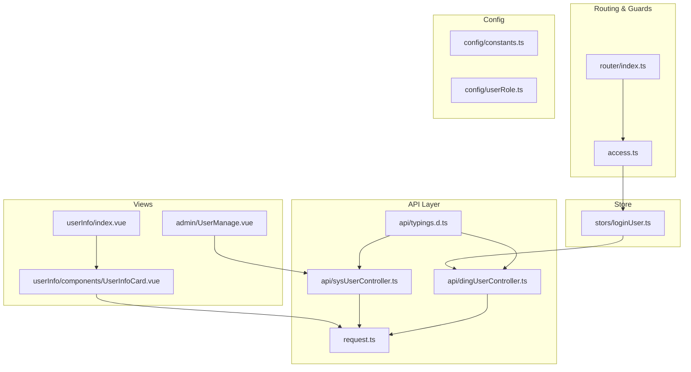
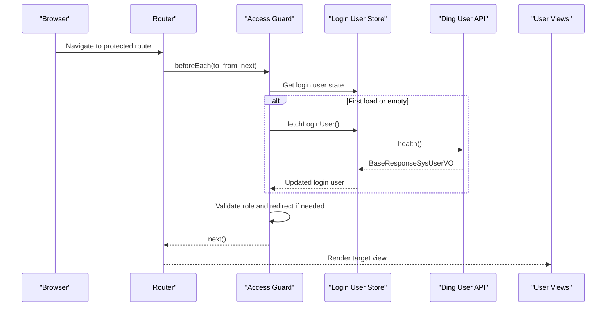
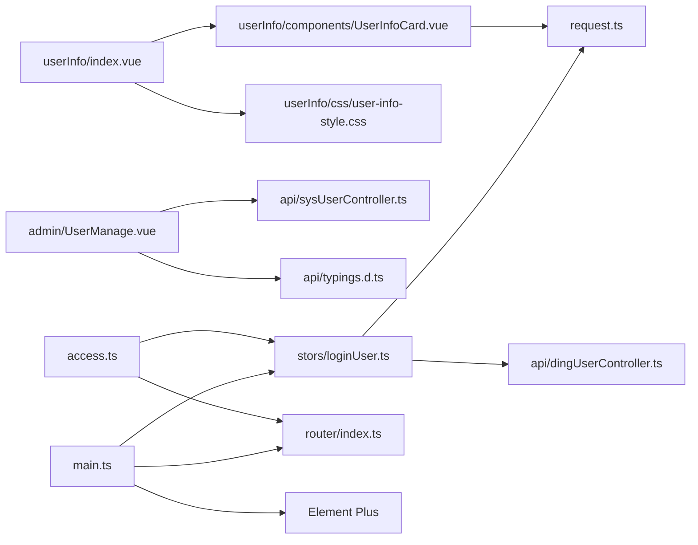

# User Management Interface

<cite>
**Referenced Files in This Document**
- [UserInfoCard.vue](file://src/views/userInfo/components/UserInfoCard.vue)
- [userInfo/index.vue](file://src/views/userInfo/index.vue)
- [user-info-api.js](file://src/views/userInfo/js/user-info-api.js)
- [user-info-style.css](file://src/views/userInfo/css/user-info-style.css)
- [UserManage.vue](file://src/views/admin/UserManage.vue)
- [loginUser.ts](file://src/stors/loginUser.ts)
- [dingUserController.ts](file://src/api/dingUserController.ts)
- [sysUserController.ts](file://src/api/sysUserController.ts)
- [access.ts](file://src/access.ts)
- [request.ts](file://src/request.ts)
- [router/index.ts](file://src/router/index.ts)
- [main.ts](file://src/main.ts)
- [App.vue](file://src/App.vue)
- [typings.d.ts](file://src/api/typings.d.ts)
- [constants.ts](file://src/config/constants.ts)
- [userRole.ts](file://src/config/userRole.ts)
</cite>

## Table of Contents
1. [Introduction](#introduction)
2. [Project Structure](#project-structure)
3. [Core Components](#core-components)
4. [Architecture Overview](#architecture-overview)
5. [Detailed Component Analysis](#detailed-component-analysis)
6. [Dependency Analysis](#dependency-analysis)
7. [Performance Considerations](#performance-considerations)
8. [Troubleshooting Guide](#troubleshooting-guide)
9. [Conclusion](#conclusion)

## Introduction
This document explains the user management interface feature, focusing on the user information display implementation, the UserInfoCard component architecture, and data presentation patterns. It documents user profile data binding, API integration for retrieving user information, and mechanisms for real-time updates. It also covers authentication state integration, permission validation, and the global user store. Practical guidance is included for user data formatting, card layout customization, responsive design considerations, common user management scenarios, error handling, and performance optimization.

## Project Structure
The user management feature spans several modules:
- User info display: a dedicated view with a card component and associated styles and API stubs
- Admin user management: a table-based interface for listing users and updating roles
- Authentication and routing: global guards, login state fetching, and route protection
- Global store: Pinia store for login user state
- API layer: request wrapper and typed API endpoints
- Configuration: constants and role constants

**Diagram sources**
- [userInfo/index.vue:1-12](file://src/views/userInfo/index.vue#L1-L12)
- [userInfo/components/UserInfoCard.vue:1-15](file://src/views/userInfo/components/UserInfoCard.vue#L1-L15)
- [admin/UserManage.vue:1-147](file://src/views/admin/UserManage.vue#L1-L147)
- [stors/loginUser.ts:1-33](file://src/stors/loginUser.ts#L1-L33)
- [api/dingUserController.ts:1-43](file://src/api/dingUserController.ts#L1-L43)
- [api/sysUserController.ts:1-34](file://src/api/sysUserController.ts#L1-L34)
- [api/typings.d.ts:1-58](file://src/api/typings.d.ts#L1-L58)
- [router/index.ts:1-40](file://src/router/index.ts#L1-L40)
- [access.ts:1-41](file://src/access.ts#L1-L41)
- [request.ts:1-49](file://src/request.ts#L1-L49)
- [config/constants.ts:1-3](file://src/config/constants.ts#L1-L3)
- [config/userRole.ts:1-6](file://src/config/userRole.ts#L1-L6)

**Section sources**
- [userInfo/index.vue:1-12](file://src/views/userInfo/index.vue#L1-L12)
- [userInfo/components/UserInfoCard.vue:1-15](file://src/views/userInfo/components/UserInfoCard.vue#L1-L15)
- [admin/UserManage.vue:1-147](file://src/views/admin/UserManage.vue#L1-L147)
- [stors/loginUser.ts:1-33](file://src/stors/loginUser.ts#L1-L33)
- [api/dingUserController.ts:1-43](file://src/api/dingUserController.ts#L1-L43)
- [api/sysUserController.ts:1-34](file://src/api/sysUserController.ts#L1-L34)
- [api/typings.d.ts:1-58](file://src/api/typings.d.ts#L1-L58)
- [router/index.ts:1-40](file://src/router/index.ts#L1-L40)
- [access.ts:1-41](file://src/access.ts#L1-L41)
- [request.ts:1-49](file://src/request.ts#L1-L49)
- [config/constants.ts:1-3](file://src/config/constants.ts#L1-L3)
- [config/userRole.ts:1-6](file://src/config/userRole.ts#L1-L6)

## Core Components
- UserInfoCard: renders static user information in a card layout with a simple template and script setup area for props and API integration
- User info view: composes the card component and applies dedicated styles
- Admin user management: lists users in a table, supports pagination, and allows role updates via dropdown selection
- Login user store: manages login state, fetches current user, and exposes setters for reactive updates
- API layer: provides typed endpoints for user data and authentication-related operations
- Routing and guards: enforce permissions and redirect unauthenticated or unauthorized users

Key responsibilities:
- Data presentation: UserInfoCard displays user attributes; UserManage presents paginated user records and role editing
- Data binding: reactive refs bind API responses to UI
- Real-time updates: store-driven reactivity and manual refresh after mutations
- Authentication and permissions: global guards validate roles and redirect accordingly

**Section sources**
- [userInfo/components/UserInfoCard.vue:1-15](file://src/views/userInfo/components/UserInfoCard.vue#L1-L15)
- [userInfo/index.vue:1-12](file://src/views/userInfo/index.vue#L1-L12)
- [admin/UserManage.vue:1-147](file://src/views/admin/UserManage.vue#L1-L147)
- [stors/loginUser.ts:1-33](file://src/stors/loginUser.ts#L1-L33)
- [api/sysUserController.ts:1-34](file://src/api/sysUserController.ts#L1-L34)
- [api/dingUserController.ts:1-43](file://src/api/dingUserController.ts#L1-L43)
- [access.ts:1-41](file://src/access.ts#L1-L41)

## Architecture Overview
The user management interface integrates routing, guards, a global store, and API services to deliver a cohesive user experience. The flow below illustrates how a user navigates to protected pages, how authentication state is fetched, and how user data is presented and updated.

**Diagram sources**
- [access.ts:11-39](file://src/access.ts#L11-L39)
- [stors/loginUser.ts:17-22](file://src/stors/loginUser.ts#L17-L22)
- [api/dingUserController.ts:6-11](file://src/api/dingUserController.ts#L6-L11)
- [router/index.ts:1-40](file://src/router/index.ts#L1-L40)

## Detailed Component Analysis

### UserInfoCard Component
Purpose:
- Present user profile information in a clean, card-based layout
- Serve as a foundation for dynamic data binding and API integration

Current implementation highlights:
- Static template with placeholders for username, email, and role
- Script setup area ready for props and lifecycle hooks
- Dedicated stylesheet for responsive and centered card layout

Data binding pattern:
- Bind reactive user fields to the template using Vue refs and props
- Fetch user data via the global store or a dedicated API method

Presentation patterns:
- Card container with shadows and padding
- List-based attribute display with consistent spacing
- Responsive minimum width and vertical centering for optimal UX

Customization tips:
- Add avatar rendering for profile images
- Localize labels and values
- Introduce edit mode toggles for inline updates

Responsive design considerations:
- Minimum width ensures readability on small screens
- Centered layout improves visibility across devices
- Typography sizing and spacing adapt to viewport constraints

**Section sources**
- [userInfo/components/UserInfoCard.vue:1-15](file://src/views/userInfo/components/UserInfoCard.vue#L1-L15)
- [user-info-style.css:1-25](file://src/views/userInfo/css/user-info-style.css#L1-L25)

### User Info View Composition
Purpose:
- Compose the UserInfoCard within a dedicated page
- Apply page-specific styles and integrate with routing

Implementation highlights:
- Imports and renders the UserInfoCard component
- Links to the user info stylesheet
- Serves as a container for future dynamic content

Integration points:
- Can wire the global login user store to populate the card
- Can integrate a dedicated user info API for additional details

**Section sources**
- [userInfo/index.vue:1-12](file://src/views/userInfo/index.vue#L1-L12)

### Admin User Management
Purpose:
- Display a paginated table of system users
- Allow role updates through a dropdown selection per row
- Provide pagination controls and loading states

Key features:
- Table columns for ID, avatar, nickname, and role
- Role column with editable select dropdown
- Pagination with page size and current page controls
- Loading indicator during network requests

Data flow:
- Fetch users via the system user API with pagination parameters
- On role change, call the update endpoint and handle success/error
- Refresh the table on errors to reflect server state

Error handling:
- Displays messages for failures and network exceptions
- Re-fetches data on errors to prevent stale UI

Performance considerations:
- Debounce or throttle frequent updates
- Use virtualized lists for very large datasets
- Optimize image loading for avatars

**Section sources**
- [admin/UserManage.vue:1-147](file://src/views/admin/UserManage.vue#L1-L147)
- [api/sysUserController.ts:6-33](file://src/api/sysUserController.ts#L6-L33)

### Global Login User Store
Purpose:
- Centralize login user state using Pinia
- Provide methods to fetch and set the current user
- Support reactivity across the application

Implementation highlights:
- Reactive login user ref initialized with defaults
- Async fetch method that calls the health endpoint
- Setter for programmatic updates

Integration with authentication:
- Used by guards to validate roles and permissions
- Fetched on initial app load and on navigation guards

**Section sources**
- [stors/loginUser.ts:1-33](file://src/stors/loginUser.ts#L1-L33)
- [api/dingUserController.ts:6-11](file://src/api/dingUserController.ts#L6-L11)

### API Integration and Typings
Purpose:
- Define typed contracts for backend responses
- Encapsulate HTTP requests with a shared request client

Key endpoints:
- Health: retrieve current login user
- System user list: paginated user listing for admin
- Update role: modify user roles

Typings:
- Base response wrappers for boolean, page data, string, and user VO
- Page metadata and user model definitions

Real-world usage:
- Admin view consumes paginated user list and update role
- Login user store consumes health endpoint
- Request client centralizes base URL, timeouts, and interceptors

**Section sources**
- [api/dingUserController.ts:6-11](file://src/api/dingUserController.ts#L6-L11)
- [api/sysUserController.ts:6-33](file://src/api/sysUserController.ts#L6-L33)
- [api/typings.d.ts:1-58](file://src/api/typings.d.ts#L1-L58)
- [request.ts:1-49](file://src/request.ts#L1-L49)

### Authentication State and Permission Validation
Purpose:
- Enforce route-level permissions
- Redirect unauthenticated or unauthorized users
- Initialize login user state on first load

Implementation highlights:
- Navigation guard checks login state and redirects as needed
- Admin-only routes require admin role
- Test routes require login presence
- Initial fetch of login user on first navigation

Integration points:
- Uses the global login user store
- Leverages router’s beforeEach hook

**Section sources**
- [access.ts:11-39](file://src/access.ts#L11-L39)
- [stors/loginUser.ts:17-22](file://src/stors/loginUser.ts#L17-L22)
- [router/index.ts:1-40](file://src/router/index.ts#L1-L40)

### Application Bootstrap and Routing
Purpose:
- Register plugins (Pinia, Element Plus)
- Configure routes and mount the app

Highlights:
- Creates app instance and registers plugins
- Mounts the root component
- Defines routes including user info, login, admin user management, and test pages

**Section sources**
- [main.ts:1-19](file://src/main.ts#L1-L19)
- [router/index.ts:1-40](file://src/router/index.ts#L1-L40)
- [App.vue:1-19](file://src/App.vue#L1-L19)

## Dependency Analysis
The user management feature exhibits clear separation of concerns:
- Views depend on components and styles
- Components depend on the store and API layer
- Guards depend on the store and router
- API layer depends on the request client and shared typings

**Diagram sources**
- [userInfo/index.vue:1-12](file://src/views/userInfo/index.vue#L1-L12)
- [userInfo/components/UserInfoCard.vue:1-15](file://src/views/userInfo/components/UserInfoCard.vue#L1-L15)
- [user-info-style.css:1-25](file://src/views/userInfo/css/user-info-style.css#L1-L25)
- [admin/UserManage.vue:1-147](file://src/views/admin/UserManage.vue#L1-L147)
- [api/sysUserController.ts:1-34](file://src/api/sysUserController.ts#L1-L34)
- [api/typings.d.ts:1-58](file://src/api/typings.d.ts#L1-L58)
- [request.ts:1-49](file://src/request.ts#L1-L49)
- [stors/loginUser.ts:1-33](file://src/stors/loginUser.ts#L1-L33)
- [api/dingUserController.ts:1-43](file://src/api/dingUserController.ts#L1-L43)
- [access.ts:1-41](file://src/access.ts#L1-L41)
- [router/index.ts:1-40](file://src/router/index.ts#L1-L40)
- [main.ts:1-19](file://src/main.ts#L1-L19)

**Section sources**
- [userInfo/index.vue:1-12](file://src/views/userInfo/index.vue#L1-L12)
- [userInfo/components/UserInfoCard.vue:1-15](file://src/views/userInfo/components/UserInfoCard.vue#L1-L15)
- [admin/UserManage.vue:1-147](file://src/views/admin/UserManage.vue#L1-L147)
- [stors/loginUser.ts:1-33](file://src/stors/loginUser.ts#L1-L33)
- [api/sysUserController.ts:1-34](file://src/api/sysUserController.ts#L1-L34)
- [api/dingUserController.ts:1-43](file://src/api/dingUserController.ts#L1-L43)
- [api/typings.d.ts:1-58](file://src/api/typings.d.ts#L1-L58)
- [access.ts:1-41](file://src/access.ts#L1-L41)
- [router/index.ts:1-40](file://src/router/index.ts#L1-L40)
- [request.ts:1-49](file://src/request.ts#L1-L49)
- [main.ts:1-19](file://src/main.ts#L1-L19)

## Performance Considerations
- Network efficiency
  - Use pagination to limit payload sizes
  - Cache frequently accessed user data in the store
  - Debounce rapid UI triggers (e.g., role updates)
- Rendering performance
  - Virtualize large tables if user counts grow significantly
  - Lazy-load avatars and defer heavy computations
- Store reactivity
  - Minimize unnecessary reactive updates
  - Batch updates when modifying multiple rows
- API reliability
  - Implement retry logic for transient failures
  - Use optimistic updates with rollback on error

## Troubleshooting Guide
Common issues and resolutions:
- Unauthenticated access to protected routes
  - Ensure the login user store is populated before navigation
  - Verify the global guard logic and redirect behavior
- Role mismatch leading to permission errors
  - Confirm the user role value matches expected constants
  - Check backend role mapping and frontend option values
- API failures and error messages
  - Inspect response codes and messages from the request client
  - Use centralized error handling to surface actionable feedback
- Stale UI after role updates
  - Refresh the user list after mutation failures or network errors
  - Re-fetch data to align UI with server state

Operational checks:
- Confirm the request client base URL and credentials settings
- Validate route definitions and navigation guards
- Ensure store initialization occurs on app boot

**Section sources**
- [access.ts:11-39](file://src/access.ts#L11-L39)
- [stors/loginUser.ts:17-22](file://src/stors/loginUser.ts#L17-L22)
- [request.ts:26-47](file://src/request.ts#L26-L47)
- [admin/UserManage.vue:91-113](file://src/views/admin/UserManage.vue#L91-L113)

## Conclusion
The user management interface combines a simple yet extensible UserInfoCard with robust admin capabilities. The design leverages a global login user store, typed API endpoints, and route guards to ensure secure and responsive user experiences. By following the documented patterns for data binding, API integration, and error handling, teams can extend the feature with additional fields, real-time updates, and advanced filtering while maintaining performance and usability.