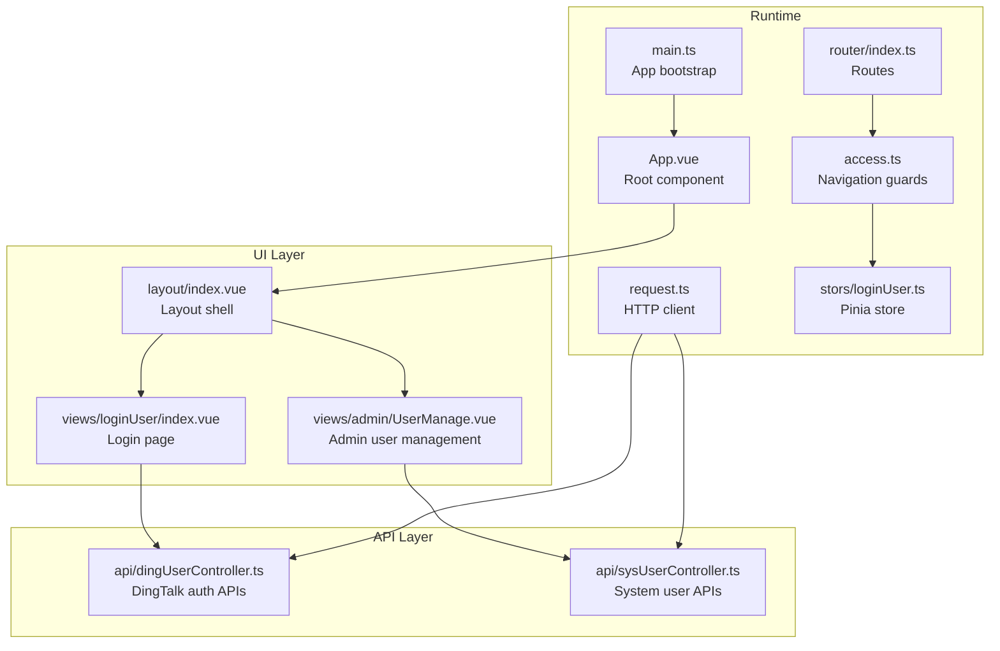
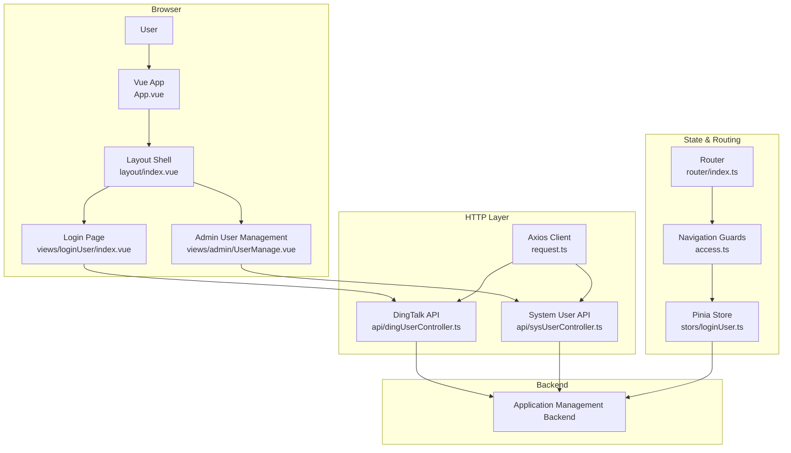
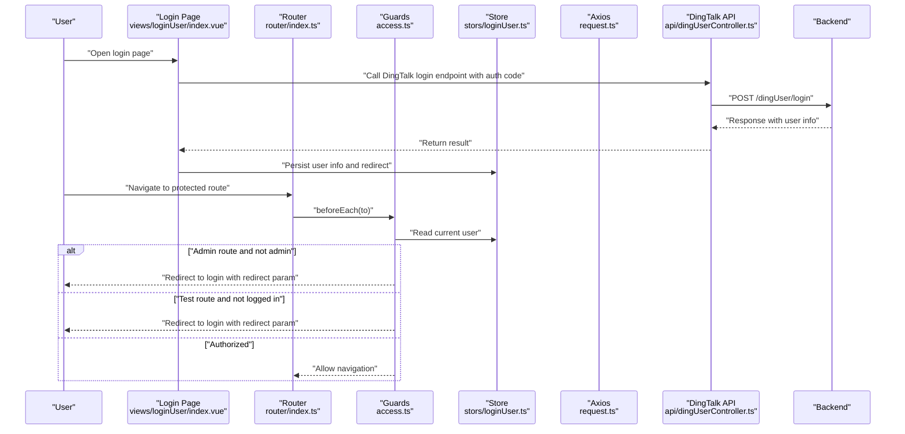
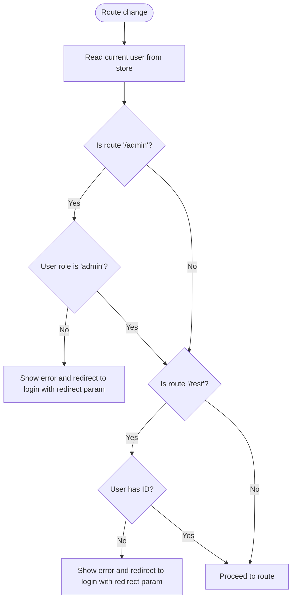
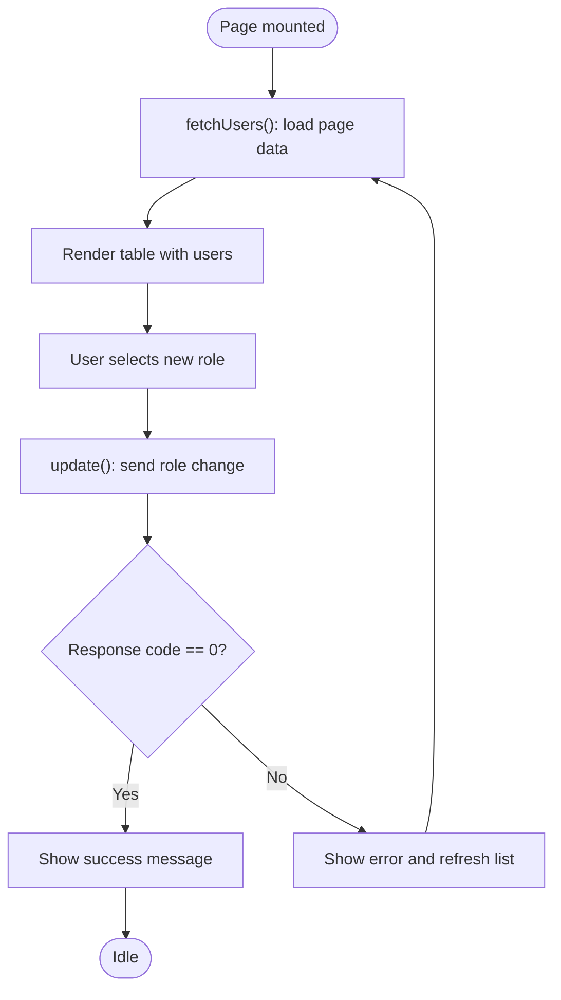
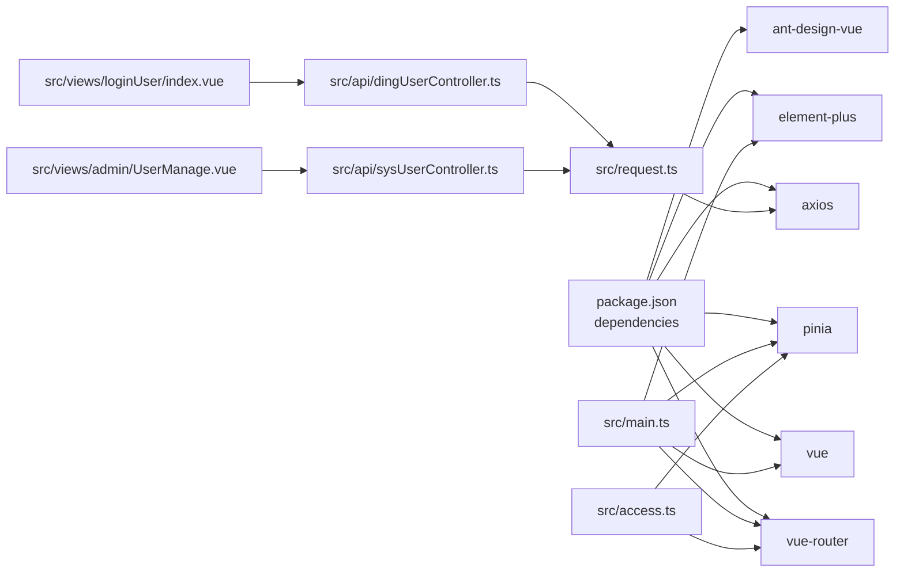

# Project Overview

<cite>
**Referenced Files in This Document**
- [README.md](file://README.md)
- [package.json](file://package.json)
- [vite.config.ts](file://vite.config.ts)
- [src/main.ts](file://src/main.ts)
- [src/App.vue](file://src/App.vue)
- [src/router/index.ts](file://src/router/index.ts)
- [src/access.ts](file://src/access.ts)
- [src/request.ts](file://src/request.ts)
- [src/stors/loginUser.ts](file://src/stors/loginUser.ts)
- [src/config/constants.ts](file://src/config/constants.ts)
- [src/config/userRole.ts](file://src/config/userRole.ts)
- [src/api/index.ts](file://src/api/index.ts)
- [src/api/dingUserController.ts](file://src/api/dingUserController.ts)
- [src/api/sysUserController.ts](file://src/api/sysUserController.ts)
- [src/layout/index.vue](file://src/layout/index.vue)
- [src/views/loginUser/index.vue](file://src/views/loginUser/index.vue)
- [src/views/admin/UserManage.vue](file://src/views/admin/UserManage.vue)
</cite>

## Table of Contents
1. [Introduction](#introduction)
2. [Project Structure](#project-structure)
3. [Core Components](#core-components)
4. [Architecture Overview](#architecture-overview)
5. [Detailed Component Analysis](#detailed-component-analysis)
6. [Dependency Analysis](#dependency-analysis)
7. [Performance Considerations](#performance-considerations)
8. [Troubleshooting Guide](#troubleshooting-guide)
9. [Conclusion](#conclusion)

## Introduction
This Single Sign-On (SSO) frontend is a Vue 3 SPA built with TypeScript and Vite, designed to support an enterprise-grade application management backend SSO system. Its primary purpose is to provide a unified authentication and authorization experience for users across multiple applications, while integrating with backend services for user identity verification, session management, and role-based access control.

Key goals:
- Provide a modern, responsive web interface for enterprise authentication workflows.
- Support multi-platform authentication, including DingTalk OAuth-style authorization.
- Enforce role-based access control (RBAC) to restrict sensitive administrative pages.
- Offer user-facing features such as profile viewing and, where applicable, administrative user management.

Technology stack highlights:
- Vue 3 with Composition API and TypeScript for type-safe, maintainable UI development.
- Vite for fast development builds and optimized production bundling.
- Element Plus for polished UI components and consistent design language.
- Pinia for centralized state management of login sessions and user metadata.
- Ant Design Vue for auxiliary UI elements and notifications.
- Axios for HTTP client configuration and global interceptors.

## Project Structure
The project follows a feature-based layout with clear separation of concerns:
- Application bootstrap and plugin registration in main.ts.
- Global routing configuration and navigation guards in router/index.ts and access.ts.
- Centralized HTTP client and interceptors in request.ts.
- Authentication and user state management via Pinia store in stors/loginUser.ts.
- API clients for backend endpoints in api/.
- Layout and page components under layout/ and views/.
- Shared configuration constants and roles under config/.

**Diagram sources**
- [src/main.ts:1-19](file://src/main.ts#L1-L19)
- [src/App.vue:1-19](file://src/App.vue#L1-L19)
- [src/router/index.ts:1-40](file://src/router/index.ts#L1-L40)
- [src/access.ts:1-41](file://src/access.ts#L1-L41)
- [src/request.ts:1-49](file://src/request.ts#L1-L49)
- [src/stors/loginUser.ts:1-33](file://src/stors/loginUser.ts#L1-L33)
- [src/layout/index.vue:1-29](file://src/layout/index.vue#L1-L29)
- [src/views/loginUser/index.vue:1-71](file://src/views/loginUser/index.vue#L1-L71)
- [src/views/admin/UserManage.vue:1-147](file://src/views/admin/UserManage.vue#L1-L147)
- [src/api/dingUserController.ts:1-43](file://src/api/dingUserController.ts#L1-L43)
- [src/api/sysUserController.ts](file://src/api/sysUserController.ts)

**Section sources**
- [README.md:1-6](file://README.md#L1-L6)
- [package.json:1-31](file://package.json#L1-L31)
- [src/main.ts:1-19](file://src/main.ts#L1-L19)
- [src/App.vue:1-19](file://src/App.vue#L1-L19)
- [src/router/index.ts:1-40](file://src/router/index.ts#L1-L40)
- [src/access.ts:1-41](file://src/access.ts#L1-L41)
- [src/request.ts:1-49](file://src/request.ts#L1-L49)
- [src/stors/loginUser.ts:1-33](file://src/stors/loginUser.ts#L1-L33)
- [src/layout/index.vue:1-29](file://src/layout/index.vue#L1-L29)
- [src/views/loginUser/index.vue:1-71](file://src/views/loginUser/index.vue#L1-L71)
- [src/views/admin/UserManage.vue:1-147](file://src/views/admin/UserManage.vue#L1-L147)
- [src/api/dingUserController.ts:1-43](file://src/api/dingUserController.ts#L1-L43)
- [src/api/sysUserController.ts](file://src/api/sysUserController.ts)

## Core Components
- Application bootstrap and plugins
  - Initializes Vue app, registers Pinia, Vue Router, and Element Plus globally.
  - Mounts the root component to the DOM.
  - Reference: [src/main.ts:1-19](file://src/main.ts#L1-L19)

- Root component and layout
  - App.vue sets up the layout shell and triggers initial login user fetch.
  - layout/index.vue composes header, content area, and footer.
  - References: [src/App.vue:1-19](file://src/App.vue#L1-L19), [src/layout/index.vue:1-29](file://src/layout/index.vue#L1-L29)

- Routing and navigation guards
  - Defines SPA routes for home, login, user info, test, and admin user management.
  - Implements global beforeEach guard for RBAC checks and redirect logic.
  - References: [src/router/index.ts:1-40](file://src/router/index.ts#L1-L40), [src/access.ts:1-41](file://src/access.ts#L1-L41)

- HTTP client and interceptors
  - Configures Axios base URL, credentials, and global request/response interceptors.
  - Handles automatic redirection to login for 401 responses.
  - Reference: [src/request.ts:1-49](file://src/request.ts#L1-L49)

- Authentication state management
  - Pinia store manages current login user, fetches user info from backend, and exposes setters.
  - Reference: [src/stors/loginUser.ts:1-33](file://src/stors/loginUser.ts#L1-L33)

- API clients
  - Provides typed wrappers for DingTalk-style login, logout, and test endpoints.
  - Exposes system user list and update endpoints for admin management.
  - References: [src/api/dingUserController.ts:1-43](file://src/api/dingUserController.ts#L1-L43), [src/api/sysUserController.ts](file://src/api/sysUserController.ts)

- Login page and user management
  - Login page handles manual login and DingTalk OAuth callback, persists user info, and redirects on success.
  - Admin user management page lists users, displays avatars, and allows role updates with pagination.
  - References: [src/views/loginUser/index.vue:1-71](file://src/views/loginUser/index.vue#L1-L71), [src/views/admin/UserManage.vue:1-147](file://src/views/admin/UserManage.vue#L1-L147)

**Section sources**
- [src/main.ts:1-19](file://src/main.ts#L1-L19)
- [src/App.vue:1-19](file://src/App.vue#L1-L19)
- [src/layout/index.vue:1-29](file://src/layout/index.vue#L1-L29)
- [src/router/index.ts:1-40](file://src/router/index.ts#L1-L40)
- [src/access.ts:1-41](file://src/access.ts#L1-L41)
- [src/request.ts:1-49](file://src/request.ts#L1-L49)
- [src/stors/loginUser.ts:1-33](file://src/stors/loginUser.ts#L1-L33)
- [src/api/dingUserController.ts:1-43](file://src/api/dingUserController.ts#L1-L43)
- [src/api/sysUserController.ts](file://src/api/sysUserController.ts)
- [src/views/loginUser/index.vue:1-71](file://src/views/loginUser/index.vue#L1-L71)
- [src/views/admin/UserManage.vue:1-147](file://src/views/admin/UserManage.vue#L1-L147)

## Architecture Overview
The SSO frontend integrates tightly with the backend through a well-defined HTTP client and Pinia-managed authentication state. Navigation guards enforce RBAC policies, ensuring only authorized users can access admin pages. The login flow supports both manual and DingTalk OAuth-style authorization, leveraging backend endpoints for secure session establishment.

**Diagram sources**
- [src/App.vue:1-19](file://src/App.vue#L1-L19)
- [src/layout/index.vue:1-29](file://src/layout/index.vue#L1-L29)
- [src/views/loginUser/index.vue:1-71](file://src/views/loginUser/index.vue#L1-L71)
- [src/views/admin/UserManage.vue:1-147](file://src/views/admin/UserManage.vue#L1-L147)
- [src/router/index.ts:1-40](file://src/router/index.ts#L1-L40)
- [src/access.ts:1-41](file://src/access.ts#L1-L41)
- [src/stors/loginUser.ts:1-33](file://src/stors/loginUser.ts#L1-L33)
- [src/request.ts:1-49](file://src/request.ts#L1-L49)
- [src/api/dingUserController.ts:1-43](file://src/api/dingUserController.ts#L1-L43)
- [src/api/sysUserController.ts](file://src/api/sysUserController.ts)

## Detailed Component Analysis

### Authentication and Authorization Flow
This sequence illustrates the end-to-end login and permission enforcement process, from user interaction to backend validation and state synchronization.

**Diagram sources**
- [src/views/loginUser/index.vue:1-71](file://src/views/loginUser/index.vue#L1-L71)
- [src/router/index.ts:1-40](file://src/router/index.ts#L1-L40)
- [src/access.ts:1-41](file://src/access.ts#L1-L41)
- [src/stors/loginUser.ts:1-33](file://src/stors/loginUser.ts#L1-L33)
- [src/request.ts:1-49](file://src/request.ts#L1-L49)
- [src/api/dingUserController.ts:1-43](file://src/api/dingUserController.ts#L1-L43)

**Section sources**
- [src/views/loginUser/index.vue:1-71](file://src/views/loginUser/index.vue#L1-L71)
- [src/router/index.ts:1-40](file://src/router/index.ts#L1-L40)
- [src/access.ts:1-41](file://src/access.ts#L1-L41)
- [src/stors/loginUser.ts:1-33](file://src/stors/loginUser.ts#L1-L33)
- [src/request.ts:1-49](file://src/request.ts#L1-L49)
- [src/api/dingUserController.ts:1-43](file://src/api/dingUserController.ts#L1-L43)

### Role-Based Access Control (RBAC)
The navigation guard enforces RBAC by checking the current user’s role and the target route. It ensures that only administrators can access admin routes, and only authenticated users can access test routes. On unauthorized attempts, the user is redirected to the login page with a redirect parameter.

**Diagram sources**
- [src/access.ts:1-41](file://src/access.ts#L1-L41)
- [src/stors/loginUser.ts:1-33](file://src/stors/loginUser.ts#L1-L33)

**Section sources**
- [src/access.ts:1-41](file://src/access.ts#L1-L41)
- [src/stors/loginUser.ts:1-33](file://src/stors/loginUser.ts#L1-L33)

### User Management Page
The admin user management page provides a paginated table of users with role editing capabilities. It fetches user data from the backend, displays avatars and roles, and updates user roles via an API call. Error handling ensures a consistent UX when requests fail.

**Diagram sources**
- [src/views/admin/UserManage.vue:1-147](file://src/views/admin/UserManage.vue#L1-L147)
- [src/api/sysUserController.ts](file://src/api/sysUserController.ts)

**Section sources**
- [src/views/admin/UserManage.vue:1-147](file://src/views/admin/UserManage.vue#L1-L147)
- [src/api/sysUserController.ts](file://src/api/sysUserController.ts)

### Conceptual Overview for Beginners
- What the app does: It lets users log in once and access multiple related applications without re-entering credentials. It also lets administrators manage users and their roles.
- How it works: When you visit a page, the app checks if you are logged in and whether you have permission. If not, it takes you to the login page. After logging in, you can navigate freely within allowed areas.
- Where it connects: The app talks to a backend service that verifies your identity and manages permissions. It uses cookies stored by the browser to keep you logged in.

### Technical Details for Experienced Developers
- Technology stack: Vue 3 + TypeScript + Vite + Element Plus + Pinia + Ant Design Vue + Axios.
- Build and dev: Use Vite for dev server and optimized builds; TypeScript compiles to JavaScript with vue-tsc.
- Routing: Vue Router with history mode; routes include home, login, user info, test, and admin user management.
- State: Pinia store holds the current user; initialized on app mount and refreshed on navigation.
- Interceptors: Axios configured with base URL and credentials; global interceptor handles 401 by redirecting to login.
- RBAC: beforeEach guard checks user role and route prefix; redirects unauthorized users to login with a redirect parameter.
- Multi-platform auth: Login page supports DingTalk-style OAuth; after successful authorization, user info is persisted and the app navigates to home.

**Section sources**
- [README.md:1-6](file://README.md#L1-L6)
- [package.json:1-31](file://package.json#L1-L31)
- [src/main.ts:1-19](file://src/main.ts#L1-L19)
- [src/router/index.ts:1-40](file://src/router/index.ts#L1-L40)
- [src/access.ts:1-41](file://src/access.ts#L1-L41)
- [src/request.ts:1-49](file://src/request.ts#L1-L49)
- [src/stors/loginUser.ts:1-33](file://src/stors/loginUser.ts#L1-L33)
- [src/views/loginUser/index.vue:1-71](file://src/views/loginUser/index.vue#L1-L71)
- [src/views/admin/UserManage.vue:1-147](file://src/views/admin/UserManage.vue#L1-L147)

## Dependency Analysis
External libraries and their roles:
- Vue 3: Reactive UI framework with Composition API.
- Vue Router: Client-side routing for SPA navigation.
- Pinia: Centralized state management for user session.
- Element Plus: UI component library for forms, tables, and dialogs.
- Ant Design Vue: Notifications and auxiliary UI elements.
- Axios: HTTP client with interceptors for global error handling.

Internal module dependencies:
- App bootstraps router, store, and UI library.
- Views depend on API clients and shared UI components.
- Access guards depend on store and router.
- Request client is consumed by API modules and indirectly by views.

**Diagram sources**
- [package.json:12-29](file://package.json#L12-L29)
- [src/main.ts:1-19](file://src/main.ts#L1-L19)
- [src/access.ts:1-41](file://src/access.ts#L1-L41)
- [src/request.ts:1-49](file://src/request.ts#L1-L49)
- [src/views/loginUser/index.vue:1-71](file://src/views/loginUser/index.vue#L1-L71)
- [src/views/admin/UserManage.vue:1-147](file://src/views/admin/UserManage.vue#L1-L147)
- [src/api/dingUserController.ts:1-43](file://src/api/dingUserController.ts#L1-L43)
- [src/api/sysUserController.ts](file://src/api/sysUserController.ts)

**Section sources**
- [package.json:12-29](file://package.json#L12-L29)
- [src/main.ts:1-19](file://src/main.ts#L1-L19)
- [src/access.ts:1-41](file://src/access.ts#L1-L41)
- [src/request.ts:1-49](file://src/request.ts#L1-L49)
- [src/views/loginUser/index.vue:1-71](file://src/views/loginUser/index.vue#L1-L71)
- [src/views/admin/UserManage.vue:1-147](file://src/views/admin/UserManage.vue#L1-L147)
- [src/api/dingUserController.ts:1-43](file://src/api/dingUserController.ts#L1-L43)
- [src/api/sysUserController.ts](file://src/api/sysUserController.ts)

## Performance Considerations
- Prefer lazy loading for heavy views to reduce initial bundle size.
- Debounce or throttle frequent API calls (e.g., pagination) to avoid excessive network requests.
- Use virtual scrolling for large user lists to improve rendering performance.
- Minimize unnecessary re-renders by passing only required props and using shallow refs where appropriate.
- Enable production optimizations via Vite build and ensure proper caching headers from the backend.

## Troubleshooting Guide
Common issues and resolutions:
- Unauthorized access to admin/test routes:
  - Ensure the user store is populated before navigation guards run.
  - Verify the user role is correctly set by the backend and matches expectations.
  - Confirm the redirect logic preserves the intended destination via the redirect query parameter.
  - References: [src/access.ts:1-41](file://src/access.ts#L1-L41), [src/stors/loginUser.ts:1-33](file://src/stors/loginUser.ts#L1-L33)

- Automatic login redirect on 401:
  - Review the Axios response interceptor logic to confirm it triggers only for non-login endpoints.
  - Ensure the login page path is excluded from automatic redirect.
  - References: [src/request.ts:25-47](file://src/request.ts#L25-L47)

- DingTalk OAuth login failures:
  - Validate the auth code handling and backend endpoint compatibility.
  - Confirm the response payload structure and error messages are handled gracefully.
  - References: [src/views/loginUser/index.vue:33-71](file://src/views/loginUser/index.vue#L33-L71), [src/api/dingUserController.ts:13-26](file://src/api/dingUserController.ts#L13-L26)

- Admin user management errors:
  - Check that the list and update endpoints return expected status codes.
  - Implement retry logic and fallback to refresh the list on failures.
  - References: [src/views/admin/UserManage.vue:67-128](file://src/views/admin/UserManage.vue#L67-L128), [src/api/sysUserController.ts](file://src/api/sysUserController.ts)

**Section sources**
- [src/access.ts:1-41](file://src/access.ts#L1-L41)
- [src/stors/loginUser.ts:1-33](file://src/stors/loginUser.ts#L1-L33)
- [src/request.ts:25-47](file://src/request.ts#L25-L47)
- [src/views/loginUser/index.vue:33-71](file://src/views/loginUser/index.vue#L33-L71)
- [src/api/dingUserController.ts:13-26](file://src/api/dingUserController.ts#L13-L26)
- [src/views/admin/UserManage.vue:67-128](file://src/views/admin/UserManage.vue#L67-L128)
- [src/api/sysUserController.ts](file://src/api/sysUserController.ts)

## Conclusion
This SSO frontend provides a robust foundation for enterprise authentication and authorization workflows. It leverages modern web technologies to deliver a responsive, secure, and maintainable user experience. With clear separation of concerns, strong RBAC enforcement, and integrated admin capabilities, it supports scalable deployment across enterprise environments.