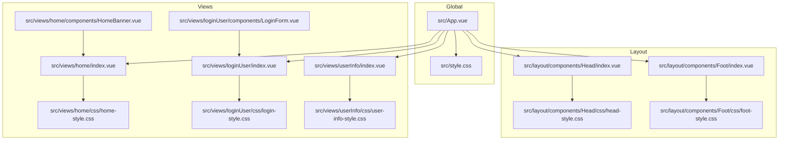
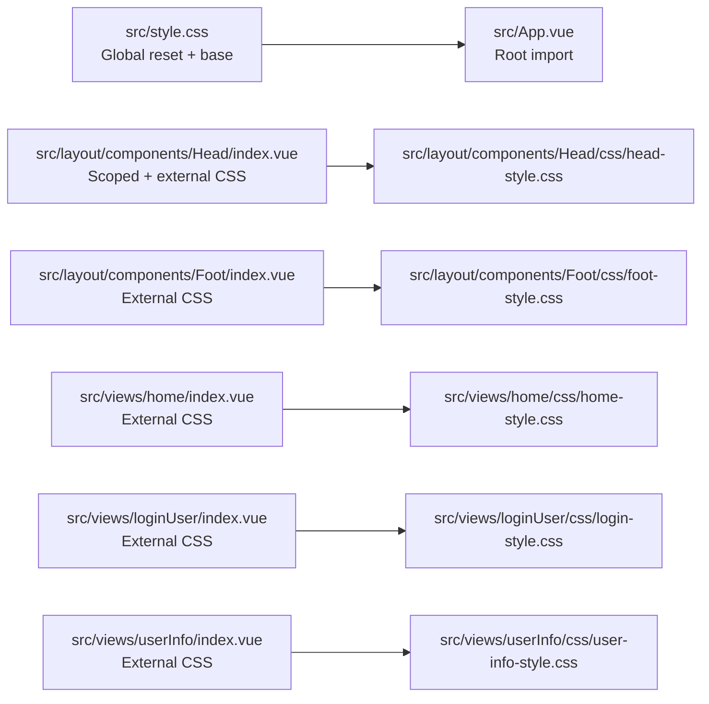
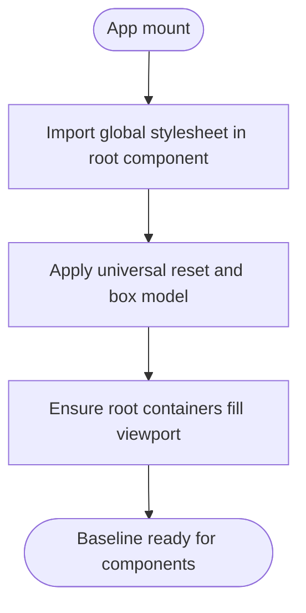
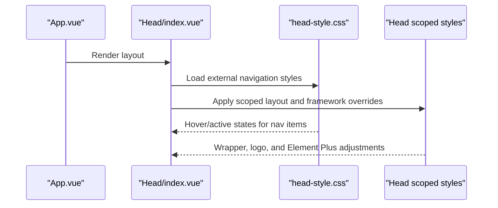
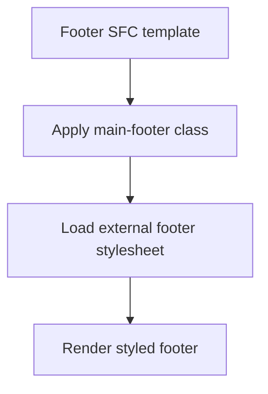
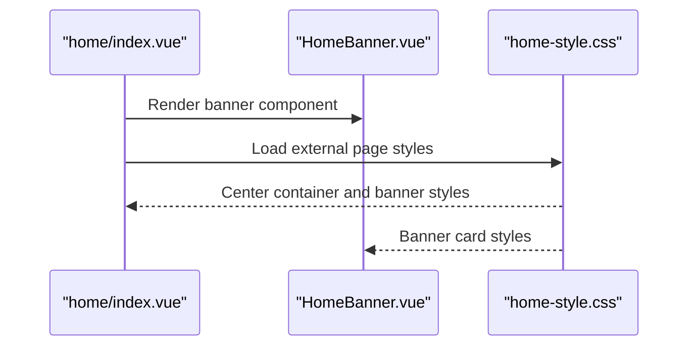
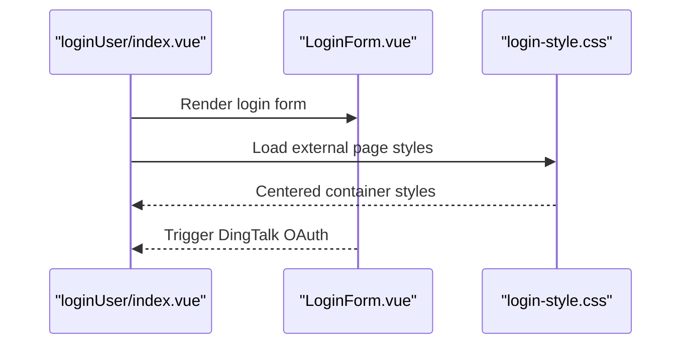
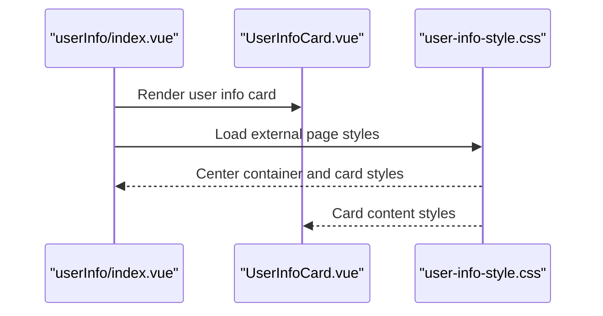
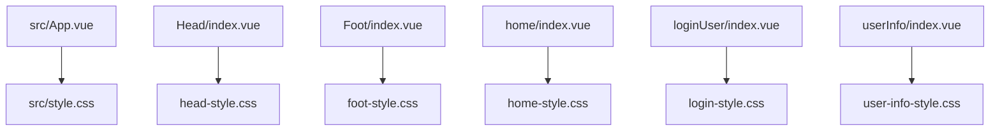

# CSS Architecture & Organization

<cite>
**Referenced Files in This Document**
- [src/style.css](file://src/style.css)
- [src/App.vue](file://src/App.vue)
- [src/layout/components/Head/index.vue](file://src/layout/components/Head/index.vue)
- [src/layout/components/Head/css/head-style.css](file://src/layout/components/Head/css/head-style.css)
- [src/layout/components/Foot/index.vue](file://src/layout/components/Foot/index.vue)
- [src/layout/components/Foot/css/foot-style.css](file://src/layout/components/Foot/css/foot-style.css)
- [src/views/home/index.vue](file://src/views/home/index.vue)
- [src/views/home/css/home-style.css](file://src/views/home/css/home-style.css)
- [src/views/home/components/HomeBanner.vue](file://src/views/home/components/HomeBanner.vue)
- [src/views/loginUser/index.vue](file://src/views/loginUser/index.vue)
- [src/views/loginUser/css/login-style.css](file://src/views/loginUser/css/login-style.css)
- [src/views/loginUser/components/LoginForm.vue](file://src/views/loginUser/components/LoginForm.vue)
- [src/views/userInfo/index.vue](file://src/views/userInfo/index.vue)
- [src/views/userInfo/css/user-info-style.css](file://src/views/userInfo/css/user-info-style.css)
- [package.json](file://package.json)
</cite>

## Table of Contents
1. [Introduction](#introduction)
2. [Project Structure](#project-structure)
3. [Core Components](#core-components)
4. [Architecture Overview](#architecture-overview)
5. [Detailed Component Analysis](#detailed-component-analysis)
6. [Dependency Analysis](#dependency-analysis)
7. [Performance Considerations](#performance-considerations)
8. [Troubleshooting Guide](#troubleshooting-guide)
9. [Conclusion](#conclusion)
10. [Appendices](#appendices)

## Introduction
This document explains the CSS architecture and organization patterns used in the frontend project. It covers the global CSS foundation, reset and normalization practices, viewport and box model standardization, and component-based CSS organization. It also documents naming conventions, maintainability strategies, specificity management, inheritance patterns, and modular styling approaches. Practical examples are provided via file references to real code locations.

## Project Structure
The project follows a clear separation of concerns:
- Global baseline styles are centralized in a single stylesheet and imported at the application root.
- Component-level styles are grouped alongside their Vue SFCs, with optional external CSS files for shared component styles.
- Layout components (header, footer) and view components (home, login, user info) each own their own stylesheets.

**Diagram sources**
- [src/App.vue:1-19](file://src/App.vue#L1-L19)
- [src/style.css:1-13](file://src/style.css#L1-L13)
- [src/layout/components/Head/index.vue:1-279](file://src/layout/components/Head/index.vue#L1-L279)
- [src/layout/components/Head/css/head-style.css:1-18](file://src/layout/components/Head/css/head-style.css#L1-L18)
- [src/layout/components/Foot/index.vue:1-15](file://src/layout/components/Foot/index.vue#L1-L15)
- [src/layout/components/Foot/css/foot-style.css:1-10](file://src/layout/components/Foot/css/foot-style.css#L1-L10)
- [src/views/home/index.vue:1-12](file://src/views/home/index.vue#L1-L12)
- [src/views/home/css/home-style.css:1-22](file://src/views/home/css/home-style.css#L1-L22)
- [src/views/home/components/HomeBanner.vue:1-10](file://src/views/home/components/HomeBanner.vue#L1-L10)
- [src/views/loginUser/index.vue:1-71](file://src/views/loginUser/index.vue#L1-L71)
- [src/views/loginUser/css/login-style.css:1-6](file://src/views/loginUser/css/login-style.css#L1-L6)
- [src/views/loginUser/components/LoginForm.vue:1-42](file://src/views/loginUser/components/LoginForm.vue#L1-L42)
- [src/views/userInfo/index.vue:1-12](file://src/views/userInfo/index.vue#L1-L12)
- [src/views/userInfo/css/user-info-style.css:1-25](file://src/views/userInfo/css/user-info-style.css#L1-L25)

**Section sources**
- [src/App.vue:1-19](file://src/App.vue#L1-L19)
- [src/style.css:1-13](file://src/style.css#L1-L13)
- [src/layout/components/Head/index.vue:1-279](file://src/layout/components/Head/index.vue#L1-L279)
- [src/layout/components/Foot/index.vue:1-15](file://src/layout/components/Foot/index.vue#L1-L15)
- [src/views/home/index.vue:1-12](file://src/views/home/index.vue#L1-L12)
- [src/views/loginUser/index.vue:1-71](file://src/views/loginUser/index.vue#L1-L71)
- [src/views/userInfo/index.vue:1-12](file://src/views/userInfo/index.vue#L1-L12)

## Core Components
- Global baseline: A single global stylesheet normalizes margins/paddings and standardizes the box model, while ensuring the root container fills the browser viewport.
- Layout components:
  - Header navigation defines primary navigation styles and hover/active states.
  - Footer defines consistent footer typography, spacing, and borders.
- View components:
  - Home page centers content and styles a hero banner card.
  - Login page centers a form container.
  - User info page centers a profile card.

These components demonstrate a modular, file-per-feature organization that scales across the application.

**Section sources**
- [src/style.css:1-13](file://src/style.css#L1-L13)
- [src/layout/components/Head/css/head-style.css:1-18](file://src/layout/components/Head/css/head-style.css#L1-L18)
- [src/layout/components/Foot/css/foot-style.css:1-10](file://src/layout/components/Foot/css/foot-style.css#L1-L10)
- [src/views/home/css/home-style.css:1-22](file://src/views/home/css/home-style.css#L1-L22)
- [src/views/loginUser/css/login-style.css:1-6](file://src/views/loginUser/css/login-style.css#L1-L6)
- [src/views/userInfo/css/user-info-style.css:1-25](file://src/views/userInfo/css/user-info-style.css#L1-L25)

## Architecture Overview
The CSS architecture combines global resets and base styles with component-scoped styles. Global styles are imported at the application root, while component-specific styles are attached either via scoped styles inside the SFC or via external CSS files linked from the SFC.

**Diagram sources**
- [src/style.css:1-13](file://src/style.css#L1-L13)
- [src/App.vue:16-18](file://src/App.vue#L16-L18)
- [src/layout/components/Head/index.vue:203-279](file://src/layout/components/Head/index.vue#L203-L279)
- [src/layout/components/Head/css/head-style.css:1-18](file://src/layout/components/Head/css/head-style.css#L1-L18)
- [src/layout/components/Foot/index.vue:14](file://src/layout/components/Foot/index.vue#L14)
- [src/layout/components/Foot/css/foot-style.css:1-10](file://src/layout/components/Foot/css/foot-style.css#L1-L10)
- [src/views/home/index.vue:11](file://src/views/home/index.vue#L11)
- [src/views/home/css/home-style.css:1-22](file://src/views/home/css/home-style.css#L1-L22)
- [src/views/loginUser/index.vue:19](file://src/views/loginUser/index.vue#L19)
- [src/views/loginUser/css/login-style.css:1-6](file://src/views/loginUser/css/login-style.css#L1-L6)
- [src/views/userInfo/index.vue:11](file://src/views/userInfo/index.vue#L11)
- [src/views/userInfo/css/user-info-style.css:1-25](file://src/views/userInfo/css/user-info-style.css#L1-L25)

## Detailed Component Analysis

### Global CSS Foundation
- Reset and normalization: Removes default margins and paddings and sets a consistent box model across elements.
- Viewport and root sizing: Ensures html, body, and the root app container fill the browser viewport and suppress horizontal overflow.
- Integration: Imported at the root component level to establish baseline styles for all components.

**Diagram sources**
- [src/style.css:1-13](file://src/style.css#L1-L13)
- [src/App.vue:16-18](file://src/App.vue#L16-L18)

**Section sources**
- [src/style.css:1-13](file://src/style.css#L1-L13)
- [src/App.vue:16-18](file://src/App.vue#L16-L18)

### Header Navigation Styles
- External CSS file encapsulates navigation container, list layout, and interactive states (hover/active).
- Scoped styles in the SFC define layout and alignment for the wrapper, logo positioning, and Element Plus overrides.
- Composition: External CSS handles semantic navigation styles; scoped CSS handles layout and framework-specific tweaks.

**Diagram sources**
- [src/layout/components/Head/index.vue:203-279](file://src/layout/components/Head/index.vue#L203-L279)
- [src/layout/components/Head/css/head-style.css:1-18](file://src/layout/components/Head/css/head-style.css#L1-L18)

**Section sources**
- [src/layout/components/Head/index.vue:203-279](file://src/layout/components/Head/index.vue#L203-L279)
- [src/layout/components/Head/css/head-style.css:1-18](file://src/layout/components/Head/css/head-style.css#L1-L18)

### Footer Styles
- External CSS file defines footer background, typography, spacing, and border.
- Minimal SFC template with a single class applied to the footer element.

**Diagram sources**
- [src/layout/components/Foot/index.vue:14](file://src/layout/components/Foot/index.vue#L14)
- [src/layout/components/Foot/css/foot-style.css:1-10](file://src/layout/components/Foot/css/foot-style.css#L1-L10)

**Section sources**
- [src/layout/components/Foot/index.vue:1-15](file://src/layout/components/Foot/index.vue#L1-L15)
- [src/layout/components/Foot/css/foot-style.css:1-10](file://src/layout/components/Foot/css/foot-style.css#L1-L10)

### Home Page Styles
- External CSS centers content and styles a hero banner card with shadow, padding, radius, and typography.
- The HomeBanner component uses a dedicated class for its inner content.

**Diagram sources**
- [src/views/home/index.vue:11](file://src/views/home/index.vue#L11)
- [src/views/home/css/home-style.css:1-22](file://src/views/home/css/home-style.css#L1-L22)
- [src/views/home/components/HomeBanner.vue:1-10](file://src/views/home/components/HomeBanner.vue#L1-L10)

**Section sources**
- [src/views/home/index.vue:1-12](file://src/views/home/index.vue#L1-L12)
- [src/views/home/css/home-style.css:1-22](file://src/views/home/css/home-style.css#L1-L22)
- [src/views/home/components/HomeBanner.vue:1-10](file://src/views/home/components/HomeBanner.vue#L1-L10)

### Login Page Styles
- External CSS centers the login container.
- The LoginForm component provides a button triggering DingTalk OAuth redirection.

**Diagram sources**
- [src/views/loginUser/index.vue:19](file://src/views/loginUser/index.vue#L19)
- [src/views/loginUser/css/login-style.css:1-6](file://src/views/loginUser/css/login-style.css#L1-L6)
- [src/views/loginUser/components/LoginForm.vue:25-41](file://src/views/loginUser/components/LoginForm.vue#L25-L41)

**Section sources**
- [src/views/loginUser/index.vue:1-71](file://src/views/loginUser/index.vue#L1-L71)
- [src/views/loginUser/css/login-style.css:1-6](file://src/views/loginUser/css/login-style.css#L1-L6)
- [src/views/loginUser/components/LoginForm.vue:1-42](file://src/views/loginUser/components/LoginForm.vue#L1-L42)

### User Info Page Styles
- External CSS centers content and styles a profile card with shadow, padding, radius, and typography.
- The UserInfoCard component uses a dedicated class for its inner content.

**Diagram sources**
- [src/views/userInfo/index.vue:11](file://src/views/userInfo/index.vue#L11)
- [src/views/userInfo/css/user-info-style.css:1-25](file://src/views/userInfo/css/user-info-style.css#L1-L25)

**Section sources**
- [src/views/userInfo/index.vue:1-12](file://src/views/userInfo/index.vue#L1-L12)
- [src/views/userInfo/css/user-info-style.css:1-25](file://src/views/userInfo/css/user-info-style.css#L1-L25)

## Dependency Analysis
- Global styles depend on the root component importing the baseline stylesheet.
- Component SFCs depend on either scoped styles or external CSS files.
- External CSS files are referenced via the SFC’s style tag with an external path.
- There are no circular CSS dependencies; styles are unidirectional from SFCs to CSS files.

**Diagram sources**
- [src/App.vue:16-18](file://src/App.vue#L16-L18)
- [src/layout/components/Head/index.vue:203](file://src/layout/components/Head/index.vue#L203)
- [src/layout/components/Foot/index.vue:14](file://src/layout/components/Foot/index.vue#L14)
- [src/views/home/index.vue:11](file://src/views/home/index.vue#L11)
- [src/views/loginUser/index.vue:19](file://src/views/loginUser/index.vue#L19)
- [src/views/userInfo/index.vue:11](file://src/views/userInfo/index.vue#L11)

**Section sources**
- [src/App.vue:16-18](file://src/App.vue#L16-L18)
- [src/layout/components/Head/index.vue:203](file://src/layout/components/Head/index.vue#L203)
- [src/layout/components/Foot/index.vue:14](file://src/layout/components/Foot/index.vue#L14)
- [src/views/home/index.vue:11](file://src/views/home/index.vue#L11)
- [src/views/loginUser/index.vue:19](file://src/views/loginUser/index.vue#L19)
- [src/views/userInfo/index.vue:11](file://src/views/userInfo/index.vue#L11)

## Performance Considerations
- Prefer external CSS files for reusable component styles to enable caching and reduce inline CSS overhead.
- Keep selectors shallow and avoid deeply nested scoped styles to minimize specificity wars and improve maintainability.
- Consolidate global resets and base styles in a single file to reduce HTTP requests and ensure consistent baseline rendering.
- Use component-scoped styles judiciously; rely on external styles for shared layouts and repeated UI patterns.

## Troubleshooting Guide
- Specificity conflicts:
  - External CSS for semantic components (navigation, footer) can override framework defaults; ensure targeted selectors and avoid overly broad rules.
  - Scoped styles in SFCs can override external CSS when necessary; verify the order of imports and the presence of deep selectors for framework components.
- Box model anomalies:
  - Confirm that the global box model normalization is applied before component-specific styles.
- Viewport overflow:
  - Verify that the root container fills the viewport and that horizontal overflow is suppressed as intended.

**Section sources**
- [src/layout/components/Head/index.vue:246-270](file://src/layout/components/Head/index.vue#L246-L270)
- [src/style.css:1-13](file://src/style.css#L1-L13)

## Conclusion
The project employs a clean, modular CSS architecture:
- A single global stylesheet establishes a normalized baseline and viewport behavior.
- Component-based organization groups styles alongside Vue SFCs, using external CSS files for shared component styles and scoped styles for layout and framework overrides.
- Naming conventions emphasize semantic clarity (e.g., main-nav, main-footer, home-root, user-info-root).
- Maintainability is improved through separation of concerns, predictable file placement, and minimal specificity conflicts.

## Appendices
- Package dependencies include Vue and Element Plus, which influence styling composition and require careful scoping and overrides in component styles.

**Section sources**
- [package.json:12-29](file://package.json#L12-L29)