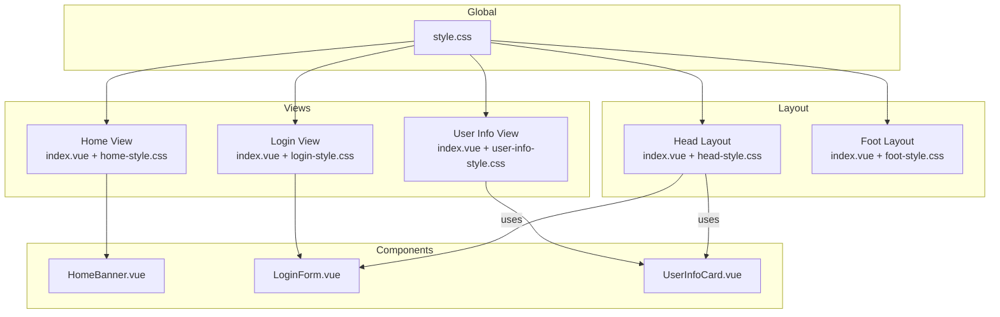
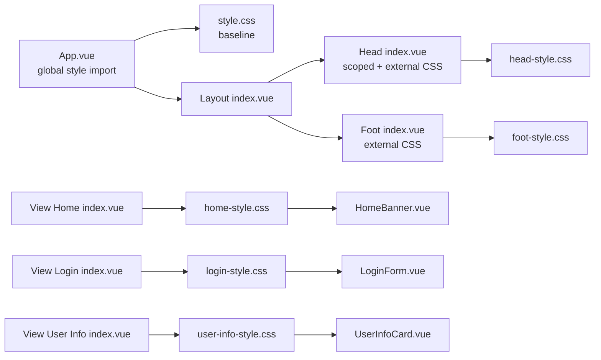
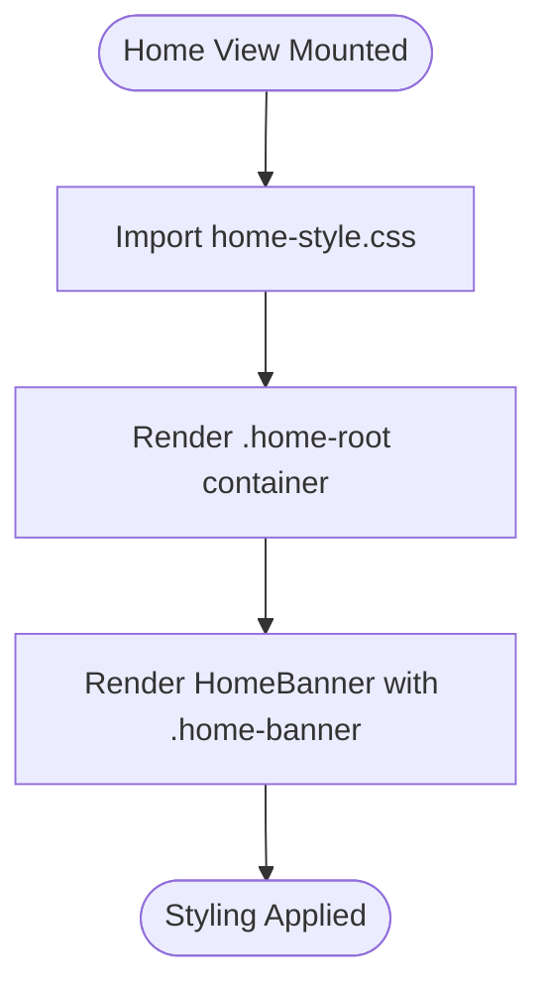
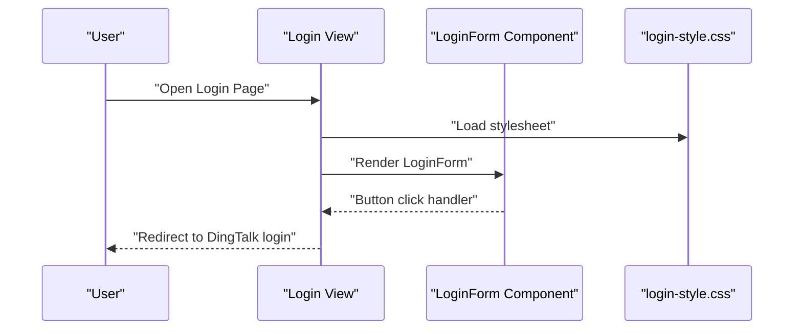
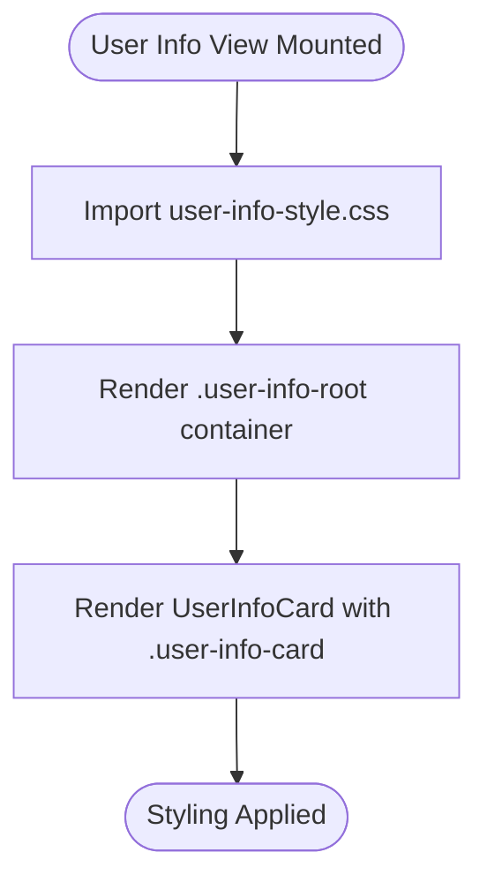
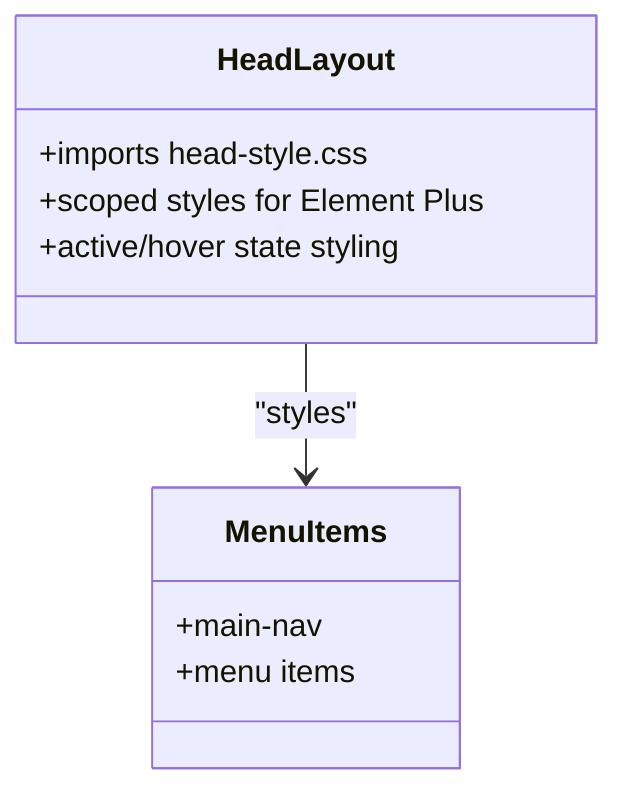
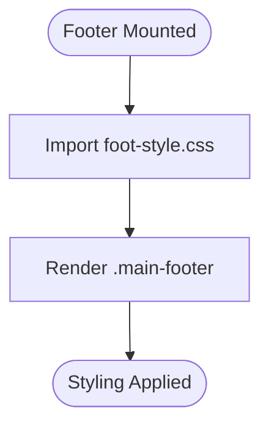
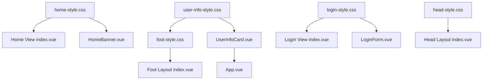

# Component-Specific Styling

<cite>
**Referenced Files in This Document**
- [App.vue](file://src/App.vue)
- [style.css](file://src/style.css)
- [index.vue](file://src/views/home/index.vue)
- [home-style.css](file://src/views/home/css/home-style.css)
- [HomeBanner.vue](file://src/views/home/components/HomeBanner.vue)
- [index.vue](file://src/views/loginUser/index.vue)
- [login-style.css](file://src/views/loginUser/css/login-style.css)
- [LoginForm.vue](file://src/views/loginUser/components/LoginForm.vue)
- [index.vue](file://src/views/userInfo/index.vue)
- [user-info-style.css](file://src/views/userInfo/css/user-info-style.css)
- [UserInfoCard.vue](file://src/views/userInfo/components/UserInfoCard.vue)
- [index.vue](file://src/layout/components/Head/index.vue)
- [head-style.css](file://src/layout/components/Head/css/head-style.css)
- [index.vue](file://src/layout/components/Foot/index.vue)
- [foot-style.css](file://src/layout/components/Foot/css/foot-style.css)
</cite>

## Table of Contents
1. [Introduction](#introduction)
2. [Project Structure](#project-structure)
3. [Core Components](#core-components)
4. [Architecture Overview](#architecture-overview)
5. [Detailed Component Analysis](#detailed-component-analysis)
6. [Dependency Analysis](#dependency-analysis)
7. [Performance Considerations](#performance-considerations)
8. [Troubleshooting Guide](#troubleshooting-guide)
9. [Conclusion](#conclusion)

## Introduction
This document explains the component-specific styling approach used across the frontend application. It focuses on how individual view components (home page, login interface, user information pages) apply their own styles, how layout components manage navigation and footer styling, and how global styles unify the base layout. It also covers CSS class naming conventions, component-scoped selectors, style encapsulation, and strategies for maintaining consistency and reusability across components.

## Project Structure
The styling strategy is organized around:
- Global baseline styles in a single global stylesheet
- Component-scoped styles via dedicated CSS files per view
- Layout components with their own CSS and scoped styles
- Shared component partials that rely on class names for styling

**Diagram sources**
- [style.css:1-13](file://src/style.css#L1-L13)
- [index.vue:11](file://src/views/home/index.vue#L11)
- [home-style.css:1-22](file://src/views/home/css/home-style.css#L1-L22)
- [index.vue:19](file://src/views/loginUser/index.vue#L19)
- [login-style.css:1-6](file://src/views/loginUser/css/login-style.css#L1-L6)
- [index.vue:11](file://src/views/userInfo/index.vue#L11)
- [user-info-style.css:1-25](file://src/views/userInfo/css/user-info-style.css#L1-L25)
- [index.vue:203](file://src/layout/components/Head/index.vue#L203)
- [head-style.css:1-18](file://src/layout/components/Head/css/head-style.css#L1-L18)
- [index.vue:14](file://src/layout/components/Foot/index.vue#L14)
- [foot-style.css:1-10](file://src/layout/components/Foot/css/foot-style.css#L1-L10)

**Section sources**
- [style.css:1-13](file://src/style.css#L1-L13)
- [index.vue:11](file://src/views/home/index.vue#L11)
- [index.vue:19](file://src/views/loginUser/index.vue#L19)
- [index.vue:11](file://src/views/userInfo/index.vue#L11)
- [index.vue:203](file://src/layout/components/Head/index.vue#L203)
- [index.vue:14](file://src/layout/components/Foot/index.vue#L14)

## Core Components
This section outlines the primary styling patterns used by key components and how they achieve style encapsulation and consistency.

- Global baseline
  - The global stylesheet establishes a consistent box model and viewport sizing, ensuring predictable layout across all components.
  - Reference: [style.css:1-13](file://src/style.css#L1-L13)

- Home page
  - The home view applies a dedicated stylesheet and uses a root container class to center content and a banner component class for card-like presentation.
  - References:
    - [index.vue:11](file://src/views/home/index.vue#L11)
    - [home-style.css:1-22](file://src/views/home/css/home-style.css#L1-L22)
    - [HomeBanner.vue:1-10](file://src/views/home/components/HomeBanner.vue#L1-L10)

- Login interface
  - The login view imports a local stylesheet and renders a login form component. The form component uses inline styles for a single button but relies on the view’s stylesheet for layout.
  - References:
    - [index.vue:19](file://src/views/loginUser/index.vue#L19)
    - [login-style.css:1-6](file://src/views/loginUser/css/login-style.css#L1-L6)
    - [LoginForm.vue:1-42](file://src/views/loginUser/components/LoginForm.vue#L1-L42)

- User information page
  - The user info view imports a dedicated stylesheet and uses a card component class for consistent presentation.
  - References:
    - [index.vue:11](file://src/views/userInfo/index.vue#L11)
    - [user-info-style.css:1-25](file://src/views/userInfo/css/user-info-style.css#L1-L25)
    - [UserInfoCard.vue:1-15](file://src/views/userInfo/components/UserInfoCard.vue#L1-L15)

- Navigation header
  - The header layout imports its own stylesheet and uses scoped styles to customize Element Plus menu styles while keeping layout styles separate.
  - References:
    - [index.vue:203](file://src/layout/components/Head/index.vue#L203)
    - [head-style.css:1-18](file://src/layout/components/Head/css/head-style.css#L1-L18)

- Footer
  - The footer layout imports a dedicated stylesheet and renders a simple footer element with a consistent class.
  - References:
    - [index.vue:14](file://src/layout/components/Foot/index.vue#L14)
    - [foot-style.css:1-10](file://src/layout/components/Foot/css/foot-style.css#L1-L10)

**Section sources**
- [style.css:1-13](file://src/style.css#L1-L13)
- [index.vue:11](file://src/views/home/index.vue#L11)
- [home-style.css:1-22](file://src/views/home/css/home-style.css#L1-L22)
- [HomeBanner.vue:1-10](file://src/views/home/components/HomeBanner.vue#L1-L10)
- [index.vue:19](file://src/views/loginUser/index.vue#L19)
- [login-style.css:1-6](file://src/views/loginUser/css/login-style.css#L1-L6)
- [LoginForm.vue:1-42](file://src/views/loginUser/components/LoginForm.vue#L1-L42)
- [index.vue:11](file://src/views/userInfo/index.vue#L11)
- [user-info-style.css:1-25](file://src/views/userInfo/css/user-info-style.css#L1-L25)
- [UserInfoCard.vue:1-15](file://src/views/userInfo/components/UserInfoCard.vue#L1-L15)
- [index.vue:203](file://src/layout/components/Head/index.vue#L203)
- [head-style.css:1-18](file://src/layout/components/Head/css/head-style.css#L1-L18)
- [index.vue:14](file://src/layout/components/Foot/index.vue#L14)
- [foot-style.css:1-10](file://src/layout/components/Foot/css/foot-style.css#L1-L10)

## Architecture Overview
The styling architecture separates concerns across global, view-level, and layout-level stylesheets, with component-level class names ensuring style isolation.

**Diagram sources**
- [App.vue:16-18](file://src/App.vue#L16-L18)
- [style.css:1-13](file://src/style.css#L1-L13)
- [index.vue:203](file://src/layout/components/Head/index.vue#L203)
- [head-style.css:1-18](file://src/layout/components/Head/css/head-style.css#L1-L18)
- [index.vue:14](file://src/layout/components/Foot/index.vue#L14)
- [foot-style.css:1-10](file://src/layout/components/Foot/css/foot-style.css#L1-L10)
- [index.vue:11](file://src/views/home/index.vue#L11)
- [home-style.css:1-22](file://src/views/home/css/home-style.css#L1-L22)
- [HomeBanner.vue:1-10](file://src/views/home/components/HomeBanner.vue#L1-L10)
- [index.vue:19](file://src/views/loginUser/index.vue#L19)
- [login-style.css:1-6](file://src/views/loginUser/css/login-style.css#L1-L6)
- [LoginForm.vue:1-42](file://src/views/loginUser/components/LoginForm.vue#L1-L42)
- [index.vue:11](file://src/views/userInfo/index.vue#L11)
- [user-info-style.css:1-25](file://src/views/userInfo/css/user-info-style.css#L1-L25)
- [UserInfoCard.vue:1-15](file://src/views/userInfo/components/UserInfoCard.vue#L1-L15)

## Detailed Component Analysis

### Home Page Styling
- Approach
  - The home view imports a dedicated stylesheet and centers content using a root container class.
  - The banner component uses a distinct class to render a card-like element with typography and spacing.
- Style Encapsulation
  - Styles are imported at the view level, minimizing leakage into other views.
- Naming Conventions
  - Root container uses a descriptive class indicating the view context.
  - Component-level class indicates the component identity and purpose.
- Consistency
  - Typography and spacing are defined in the view stylesheet to keep content presentation uniform.

**Diagram sources**
- [index.vue:11](file://src/views/home/index.vue#L11)
- [home-style.css:1-22](file://src/views/home/css/home-style.css#L1-L22)
- [HomeBanner.vue:1-10](file://src/views/home/components/HomeBanner.vue#L1-L10)

**Section sources**
- [index.vue:11](file://src/views/home/index.vue#L11)
- [home-style.css:1-22](file://src/views/home/css/home-style.css#L1-L22)
- [HomeBanner.vue:1-10](file://src/views/home/components/HomeBanner.vue#L1-L10)

### Login Interface Styling
- Approach
  - The login view imports a local stylesheet for layout and renders a login form component.
  - The form component uses inline styles for a single button; other interactive elements rely on framework defaults.
- Style Encapsulation
  - The view stylesheet is scoped to the login context; inline styles are minimal and localized.
- Naming Conventions
  - Container class describes the layout context.
  - Component class identifies the form container.
- Consistency
  - Button color and text are centralized in the component; layout remains consistent via the view stylesheet.

**Diagram sources**
- [index.vue:19](file://src/views/loginUser/index.vue#L19)
- [login-style.css:1-6](file://src/views/loginUser/css/login-style.css#L1-L6)
- [LoginForm.vue:1-42](file://src/views/loginUser/components/LoginForm.vue#L1-L42)

**Section sources**
- [index.vue:19](file://src/views/loginUser/index.vue#L19)
- [login-style.css:1-6](file://src/views/loginUser/css/login-style.css#L1-L6)
- [LoginForm.vue:1-42](file://src/views/loginUser/components/LoginForm.vue#L1-L42)

### User Information Page Styling
- Approach
  - The user info view imports a dedicated stylesheet and renders a user info card component.
  - The card component uses a class to present structured information with consistent spacing and typography.
- Style Encapsulation
  - Styles are isolated to the user info view and component, preventing interference with other views.
- Naming Conventions
  - Root container class indicates the view context.
  - Component class indicates the card identity and purpose.
- Consistency
  - List and typography styles are defined in the view stylesheet to maintain a uniform look.

**Diagram sources**
- [index.vue:11](file://src/views/userInfo/index.vue#L11)
- [user-info-style.css:1-25](file://src/views/userInfo/css/user-info-style.css#L1-L25)
- [UserInfoCard.vue:1-15](file://src/views/userInfo/components/UserInfoCard.vue#L1-L15)

**Section sources**
- [index.vue:11](file://src/views/userInfo/index.vue#L11)
- [user-info-style.css:1-25](file://src/views/userInfo/css/user-info-style.css#L1-L25)
- [UserInfoCard.vue:1-15](file://src/views/userInfo/components/UserInfoCard.vue#L1-L15)

### Navigation Header Styling
- Approach
  - The header layout imports its own stylesheet and uses scoped styles to customize Element Plus menu visuals.
  - Active and hover states are styled to provide clear feedback.
- Style Encapsulation
  - Scoped styles prevent global side effects; external stylesheet handles layout and theme colors.
- Naming Conventions
  - Descriptive class names indicate navigation and state (active/hover).
- Consistency
  - Theme colors and hover feedback are centralized in the header stylesheet.

**Diagram sources**
- [index.vue:203](file://src/layout/components/Head/index.vue#L203)
- [head-style.css:1-18](file://src/layout/components/Head/css/head-style.css#L1-L18)

**Section sources**
- [index.vue:203](file://src/layout/components/Head/index.vue#L203)
- [head-style.css:1-18](file://src/layout/components/Head/css/head-style.css#L1-L18)

### Footer Styling
- Approach
  - The footer layout imports a dedicated stylesheet and renders a simple footer element with a consistent class.
- Style Encapsulation
  - Styles are isolated to the footer layout, keeping footer-specific styles separate from other components.
- Naming Conventions
  - Descriptive class names indicate the footer identity and purpose.
- Consistency
  - Footer typography and borders are defined centrally for uniformity.

**Diagram sources**
- [index.vue:14](file://src/layout/components/Foot/index.vue#L14)
- [foot-style.css:1-10](file://src/layout/components/Foot/css/foot-style.css#L1-L10)

**Section sources**
- [index.vue:14](file://src/layout/components/Foot/index.vue#L14)
- [foot-style.css:1-10](file://src/layout/components/Foot/css/foot-style.css#L1-L10)

## Dependency Analysis
This section maps how styles depend on each other and how they are applied across components.

**Diagram sources**
- [style.css:1-13](file://src/style.css#L1-L13)
- [index.vue:11](file://src/views/home/index.vue#L11)
- [home-style.css:1-22](file://src/views/home/css/home-style.css#L1-L22)
- [HomeBanner.vue:1-10](file://src/views/home/components/HomeBanner.vue#L1-L10)
- [index.vue:19](file://src/views/loginUser/index.vue#L19)
- [login-style.css:1-6](file://src/views/loginUser/css/login-style.css#L1-L6)
- [LoginForm.vue:1-42](file://src/views/loginUser/components/LoginForm.vue#L1-L42)
- [index.vue:11](file://src/views/userInfo/index.vue#L11)
- [user-info-style.css:1-25](file://src/views/userInfo/css/user-info-style.css#L1-L25)
- [UserInfoCard.vue:1-15](file://src/views/userInfo/components/UserInfoCard.vue#L1-L15)
- [index.vue:203](file://src/layout/components/Head/index.vue#L203)
- [head-style.css:1-18](file://src/layout/components/Head/css/head-style.css#L1-L18)
- [index.vue:14](file://src/layout/components/Foot/index.vue#L14)
- [foot-style.css:1-10](file://src/layout/components/Foot/css/foot-style.css#L1-L10)

**Section sources**
- [style.css:1-13](file://src/style.css#L1-L13)
- [index.vue:11](file://src/views/home/index.vue#L11)
- [home-style.css:1-22](file://src/views/home/css/home-style.css#L1-L22)
- [HomeBanner.vue:1-10](file://src/views/home/components/HomeBanner.vue#L1-L10)
- [index.vue:19](file://src/views/loginUser/index.vue#L19)
- [login-style.css:1-6](file://src/views/loginUser/css/login-style.css#L1-L6)
- [LoginForm.vue:1-42](file://src/views/loginUser/components/LoginForm.vue#L1-L42)
- [index.vue:11](file://src/views/userInfo/index.vue#L11)
- [user-info-style.css:1-25](file://src/views/userInfo/css/user-info-style.css#L1-L25)
- [UserInfoCard.vue:1-15](file://src/views/userInfo/components/UserInfoCard.vue#L1-L15)
- [index.vue:203](file://src/layout/components/Head/index.vue#L203)
- [head-style.css:1-18](file://src/layout/components/Head/css/head-style.css#L1-L18)
- [index.vue:14](file://src/layout/components/Foot/index.vue#L14)
- [foot-style.css:1-10](file://src/layout/components/Foot/css/foot-style.css#L1-L10)

## Performance Considerations
- Keep styles modular and scoped to reduce cascade complexity and improve maintainability.
- Prefer class-based selectors over deep nesting to minimize specificity conflicts.
- Centralize theme colors and spacing tokens in shared styles to avoid duplication and improve consistency.

## Troubleshooting Guide
- Styles not applying
  - Verify the stylesheet is imported in the component or layout file.
  - Confirm class names match between template and stylesheet.
- Conflicts with framework components
  - Use scoped styles and deep selectors carefully; ensure specificity is sufficient.
- Global layout issues
  - Check global baseline styles for unintended side effects on component layouts.

## Conclusion
The application employs a clear, modular styling strategy:
- Global baseline styles unify the base layout.
- View-level stylesheets encapsulate component presentation.
- Layout components manage navigation and footer styling separately.
- Component-level class names ensure style isolation and reusability.
Adhering to consistent naming conventions and keeping styles scoped will help maintain visual coherence and simplify future enhancements.