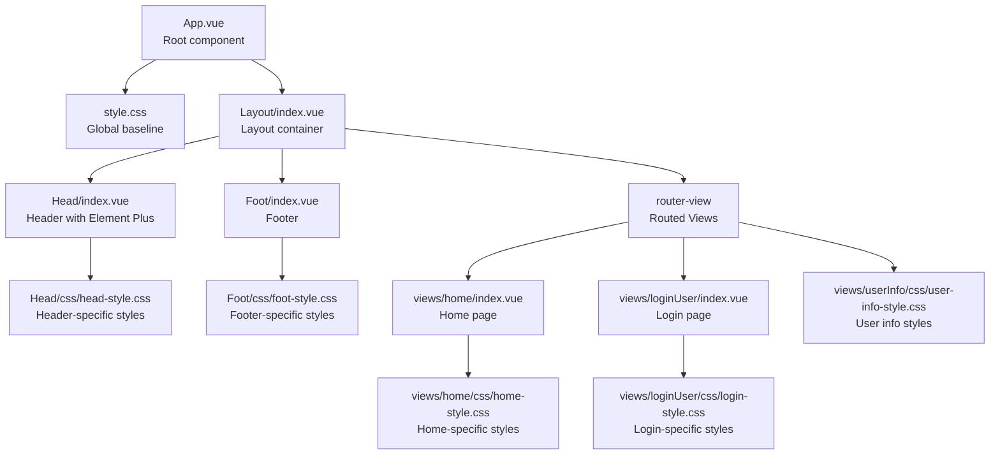
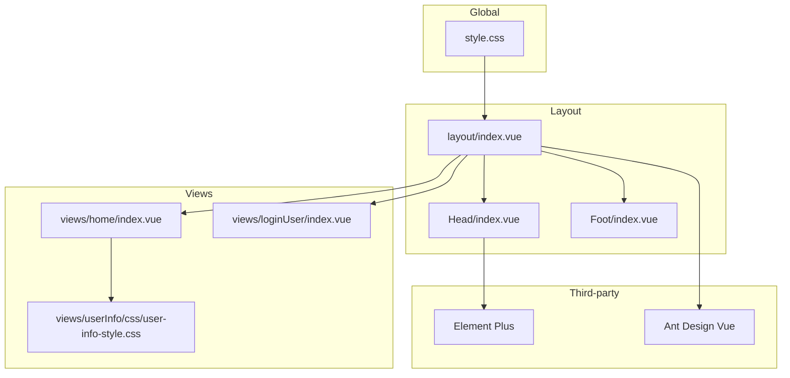
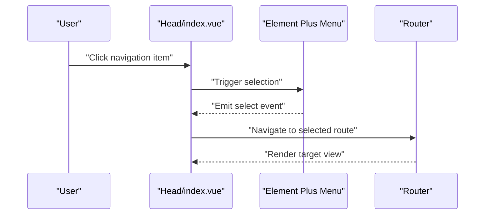
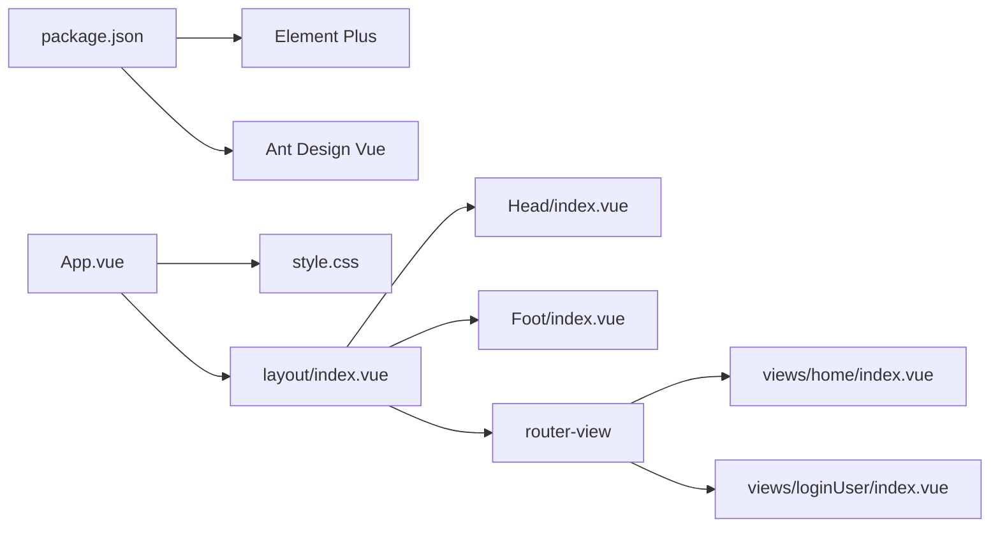

# Styling & Theming

<cite>
**Referenced Files in This Document**
- [src/style.css](file://src/style.css)
- [src/App.vue](file://src/App.vue)
- [src/layout/index.vue](file://src/layout/index.vue)
- [src/layout/components/Head/index.vue](file://src/layout/components/Head/index.vue)
- [src/layout/components/Head/css/head-style.css](file://src/layout/components/Head/css/head-style.css)
- [src/layout/components/Foot/index.vue](file://src/layout/components/Foot/index.vue)
- [src/layout/components/Foot/css/foot-style.css](file://src/layout/components/Foot/css/foot-style.css)
- [src/views/home/index.vue](file://src/views/home/index.vue)
- [src/views/home/css/home-style.css](file://src/views/home/css/home-style.css)
- [src/views/loginUser/index.vue](file://src/views/loginUser/index.vue)
- [src/views/loginUser/css/login-style.css](file://src/views/loginUser/css/login-style.css)
- [src/views/userInfo/css/user-info-style.css](file://src/views/userInfo/css/user-info-style.css)
- [package.json](file://package.json)
- [vite.config.ts](file://vite.config.ts)
</cite>

## Table of Contents
1. [Introduction](#introduction)
2. [Project Structure](#project-structure)
3. [Core Components](#core-components)
4. [Architecture Overview](#architecture-overview)
5. [Detailed Component Analysis](#detailed-component-analysis)
6. [Dependency Analysis](#dependency-analysis)
7. [Performance Considerations](#performance-considerations)
8. [Troubleshooting Guide](#troubleshooting-guide)
9. [Conclusion](#conclusion)

## Introduction
This section documents the styling architecture and theming system of the frontend application. It explains how global styles are organized, how component-specific styles are structured, and how third-party design systems (Element Plus and Ant Design Vue) are integrated. It also covers responsive design patterns, CSS architecture, customization options, optimization strategies, browser compatibility, and maintainability practices.

## Project Structure
The styling system follows a hybrid approach:
- Global baseline styles are centralized in a single stylesheet and imported at the root component level.
- Layout-level components own their own CSS files and are included via the component’s style block.
- View-level pages include page-scoped styles to encapsulate presentation logic per route.
- Third-party design systems (Element Plus and Ant Design Vue) are integrated globally via package dependencies.

**Diagram sources**
- [src/App.vue:16-18](file://src/App.vue#L16-L18)
- [src/style.css:1-13](file://src/style.css#L1-L13)
- [src/layout/index.vue:19-29](file://src/layout/index.vue#L19-L29)
- [src/layout/components/Head/index.vue:203](file://src/layout/components/Head/index.vue#L203)
- [src/layout/components/Head/css/head-style.css:1-18](file://src/layout/components/Head/css/head-style.css#L1-L18)
- [src/layout/components/Foot/index.vue:14](file://src/layout/components/Foot/index.vue#L14)
- [src/layout/components/Foot/css/foot-style.css:1-10](file://src/layout/components/Foot/css/foot-style.css#L1-L10)
- [src/views/home/index.vue:11](file://src/views/home/index.vue#L11)
- [src/views/home/css/home-style.css:1-22](file://src/views/home/css/home-style.css#L1-L22)
- [src/views/loginUser/index.vue:19](file://src/views/loginUser/index.vue#L19)
- [src/views/loginUser/css/login-style.css:1-6](file://src/views/loginUser/css/login-style.css#L1-L6)
- [src/views/userInfo/css/user-info-style.css:1-25](file://src/views/userInfo/css/user-info-style.css#L1-L25)

**Section sources**
- [src/App.vue:16-18](file://src/App.vue#L16-L18)
- [src/style.css:1-13](file://src/style.css#L1-L13)
- [src/layout/index.vue:19-29](file://src/layout/index.vue#L19-L29)
- [src/layout/components/Head/index.vue:203](file://src/layout/components/Head/index.vue#L203)
- [src/layout/components/Foot/index.vue:14](file://src/layout/components/Foot/index.vue#L14)
- [src/views/home/index.vue:11](file://src/views/home/index.vue#L11)
- [src/views/loginUser/index.vue:19](file://src/views/loginUser/index.vue#L19)

## Core Components
- Global baseline styles: Establish a consistent box model, viewport sizing, and overflow behavior for the entire app.
- Layout container: Provides a flex-based layout with a sticky footer-like behavior and deep targeting for routed content.
- Header component: Integrates Element Plus menu and avatar, with scoped and module-level styles to customize appearance and hover/active states.
- Footer component: Minimal, theme-consistent footer styling.
- Page-level styles: Encapsulated per view to keep presentation close to the component’s context.

Key integration points:
- Element Plus is used for navigation and UI primitives; scoped styles leverage :deep selectors to target nested component internals.
- Ant Design Vue is declared as a dependency; while not directly styled here, it is available for use alongside Element Plus.

**Section sources**
- [src/style.css:1-13](file://src/style.css#L1-L13)
- [src/layout/index.vue:19-29](file://src/layout/index.vue#L19-L29)
- [src/layout/components/Head/index.vue:205-279](file://src/layout/components/Head/index.vue#L205-L279)
- [src/layout/components/Foot/index.vue:14](file://src/layout/components/Foot/index.vue#L14)
- [package.json:12-19](file://package.json#L12-L19)

## Architecture Overview
The styling architecture emphasizes:
- Centralized global resets and base styles.
- Component-scoped styles with optional module-level CSS for layout and page-specific presentation.
- Deep targeting for third-party components to achieve cohesive theming without modifying external libraries.

**Diagram sources**
- [src/style.css:1-13](file://src/style.css#L1-L13)
- [src/layout/index.vue:1-29](file://src/layout/index.vue#L1-L29)
- [src/layout/components/Head/index.vue:1-48](file://src/layout/components/Head/index.vue#L1-L48)
- [src/layout/components/Foot/index.vue:1-15](file://src/layout/components/Foot/index.vue#L1-L15)
- [src/views/home/index.vue:1-12](file://src/views/home/index.vue#L1-L12)
- [src/views/loginUser/index.vue:1-71](file://src/views/loginUser/index.vue#L1-L71)
- [src/views/userInfo/css/user-info-style.css:1-25](file://src/views/userInfo/css/user-info-style.css#L1-L25)
- [package.json:12-19](file://package.json#L12-L19)

## Detailed Component Analysis

### Global Baseline Styles
- Purpose: Normalize margins/padding, unify box-sizing, and ensure the root container fills the viewport.
- Impact: Provides a consistent foundation for all components and prevents unexpected spacing or overflow.

**Section sources**
- [src/style.css:1-13](file://src/style.css#L1-L13)
- [src/App.vue:16-18](file://src/App.vue#L16-L18)

### Layout Container
- Purpose: Defines a flex column layout with a minimum height of the viewport and uses :deep to allow routed content to expand and push the footer to the bottom.
- Behavior: Ensures content area grows to fill available vertical space.

**Section sources**
- [src/layout/index.vue:19-29](file://src/layout/index.vue#L19-L29)

### Header (Navigation Bar)
- Element Plus integration: Uses el-menu for navigation, el-sub-menu for nested items, and el-avatar for user profile.
- Theming and customization:
  - Scoped styles adjust layout, alignment, and typography.
  - Module-level CSS defines hover/active states and theme color usage.
  - Deep targeting (:deep) adjusts inner elements of Element Plus components to match branding.
- Accessibility and UX: Hover/focus feedback and consistent typography improve usability.

**Diagram sources**
- [src/layout/components/Head/index.vue:159-161](file://src/layout/components/Head/index.vue#L159-L161)
- [src/layout/components/Head/index.vue:205-279](file://src/layout/components/Head/index.vue#L205-L279)

**Section sources**
- [src/layout/components/Head/index.vue:1-48](file://src/layout/components/Head/index.vue#L1-L48)
- [src/layout/components/Head/index.vue:203](file://src/layout/components/Head/index.vue#L203)
- [src/layout/components/Head/css/head-style.css:1-18](file://src/layout/components/Head/css/head-style.css#L1-L18)

### Footer
- Purpose: Provides a minimal, theme-consistent footer with centered text and subtle borders.
- Styling: Uses a dedicated CSS file and is included via the component’s style block.

**Section sources**
- [src/layout/components/Foot/index.vue:14](file://src/layout/components/Foot/index.vue#L14)
- [src/layout/components/Foot/css/foot-style.css:1-10](file://src/layout/components/Foot/css/foot-style.css#L1-L10)

### Home Page
- Purpose: Centers content and applies card-like presentation with shadows and rounded corners.
- Styling: Includes a page-level stylesheet to encapsulate banner and content layout.

**Section sources**
- [src/views/home/index.vue:11](file://src/views/home/index.vue#L11)
- [src/views/home/css/home-style.css:1-22](file://src/views/home/css/home-style.css#L1-L22)

### Login Page
- Purpose: Centers the login form and provides loading messaging during DingTalk OAuth verification.
- Styling: Includes a page-level stylesheet for container layout and spacing.

**Section sources**
- [src/views/loginUser/index.vue:19](file://src/views/loginUser/index.vue#L19)
- [src/views/loginUser/css/login-style.css:1-6](file://src/views/loginUser/css/login-style.css#L1-L6)

### User Info Page
- Purpose: Presents user details in a card layout with clean typography and spacing.
- Styling: Uses a dedicated stylesheet to define card, list, and text styles.

**Section sources**
- [src/views/userInfo/css/user-info-style.css:1-25](file://src/views/userInfo/css/user-info-style.css#L1-L25)

### Theme Variables and Third-Party Integration
- Element Plus: Used extensively for UI components. Scoped styles leverage :deep to target internal elements and apply brand colors and typography.
- Ant Design Vue: Declared as a dependency; ready for use alongside Element Plus. No direct styling is applied in the current codebase.

**Section sources**
- [src/layout/components/Head/index.vue:266-270](file://src/layout/components/Head/index.vue#L266-L270)
- [package.json:12-19](file://package.json#L12-L19)

## Dependency Analysis
- Global styles depend on the root component to ensure baseline styles are loaded first.
- Layout components depend on their respective CSS modules for visual consistency.
- View-level styles are independent but rely on layout containers for proper stacking and spacing.
- Third-party dependencies (Element Plus, Ant Design Vue) are resolved via package.json and used in components without additional CSS imports.

**Diagram sources**
- [package.json:12-19](file://package.json#L12-L19)
- [src/App.vue:16-18](file://src/App.vue#L16-L18)
- [src/style.css:1-13](file://src/style.css#L1-L13)
- [src/layout/index.vue:1-29](file://src/layout/index.vue#L1-L29)
- [src/layout/components/Head/index.vue:1-48](file://src/layout/components/Head/index.vue#L1-L48)
- [src/layout/components/Foot/index.vue:1-15](file://src/layout/components/Foot/index.vue#L1-L15)
- [src/views/home/index.vue:1-12](file://src/views/home/index.vue#L1-L12)
- [src/views/loginUser/index.vue:1-71](file://src/views/loginUser/index.vue#L1-L71)

**Section sources**
- [package.json:12-19](file://package.json#L12-L19)
- [src/App.vue:16-18](file://src/App.vue#L16-L18)
- [src/layout/index.vue:1-29](file://src/layout/index.vue#L1-L29)

## Performance Considerations
- CSS organization: Keep styles modular and scoped to reduce cascade complexity and improve cacheability.
- Deep targeting: Use :deep selectively to avoid excessive specificity and maintain readability.
- Vendor CSS: Prefer using component-level styles for third-party overrides to minimize global side effects.
- Build pipeline: Vite compiles and bundles styles efficiently; ensure unused CSS is removed via tree-shaking and minification.

## Troubleshooting Guide
- Layout not filling viewport:
  - Verify global baseline styles and root container sizing.
  - Confirm layout container uses :deep to allow content to grow.
- Navigation hover/active states not applying:
  - Ensure module-level CSS is included and scoped styles target the correct selectors.
  - Use :deep to override Element Plus internal styles when necessary.
- Footer overlapping content:
  - Check layout container flex behavior and ensure main content area expands properly.
- Page-specific styles not taking effect:
  - Confirm style blocks are included in the component and not conflicting with global styles.

**Section sources**
- [src/style.css:1-13](file://src/style.css#L1-L13)
- [src/layout/index.vue:26-28](file://src/layout/index.vue#L26-L28)
- [src/layout/components/Head/index.vue:203](file://src/layout/components/Head/index.vue#L203)
- [src/layout/components/Head/css/head-style.css:1-18](file://src/layout/components/Head/css/head-style.css#L1-L18)

## Conclusion
The styling architecture combines a global baseline with component-scoped and module-level CSS to deliver a cohesive, maintainable design system. Element Plus is integrated for navigation and user profile UI, while Ant Design Vue is available for future components. The approach balances customization with performance and readability, supporting responsive layouts and consistent theming across the application.