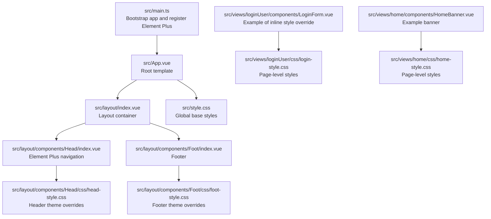
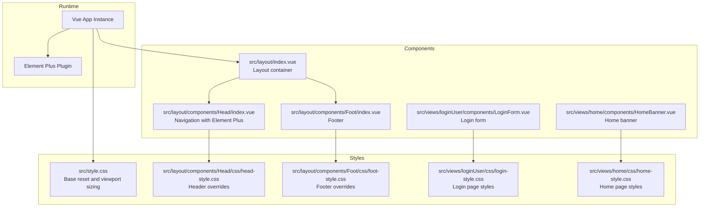
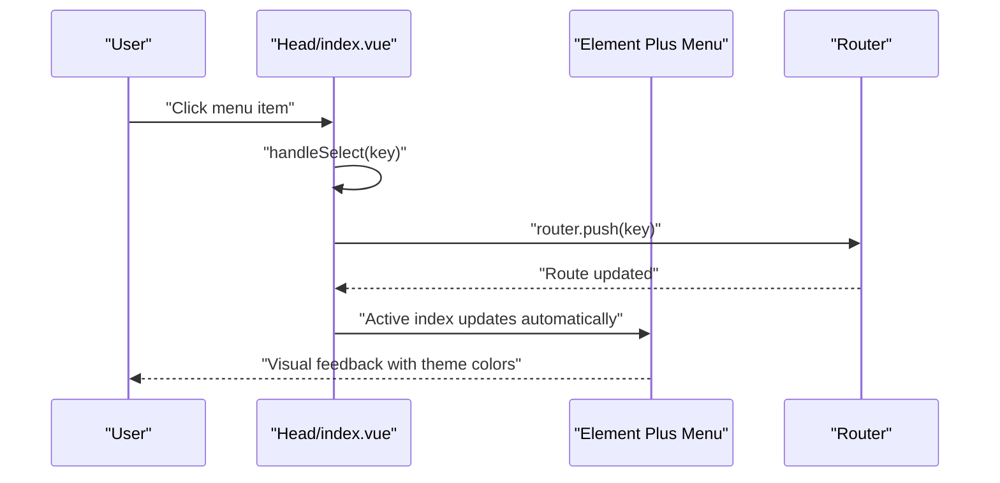
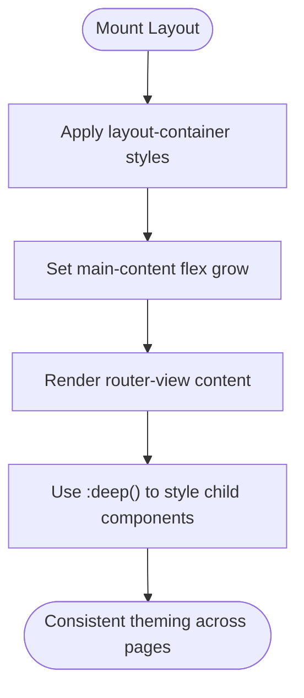
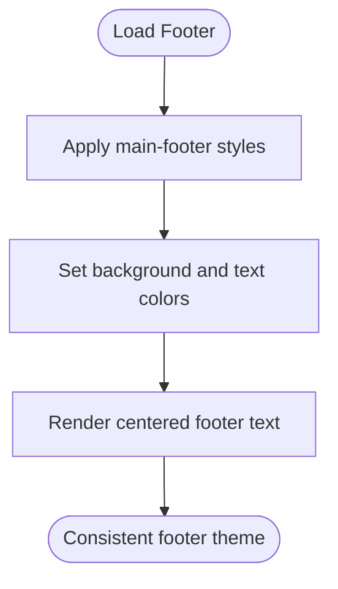
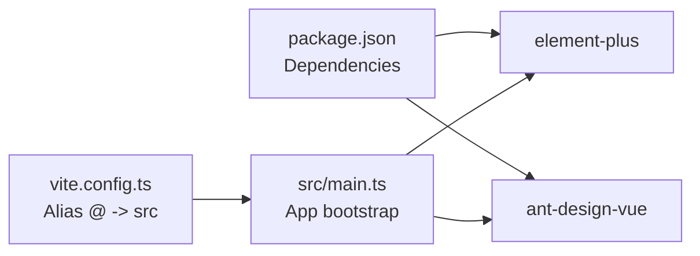

# UI Library Integration & Theming

<cite>
**Referenced Files in This Document**
- [main.ts](file://src/main.ts)
- [package.json](file://package.json)
- [vite.config.ts](file://vite.config.ts)
- [App.vue](file://src/App.vue)
- [layout/index.vue](file://src/layout/index.vue)
- [Head/index.vue](file://src/layout/components/Head/index.vue)
- [Head/head-style.css](file://src/layout/components/Head/css/head-style.css)
- [Foot/index.vue](file://src/layout/components/Foot/index.vue)
- [Foot/foot-style.css](file://src/layout/components/Foot/css/foot-style.css)
- [loginUser/LoginForm.vue](file://src/views/loginUser/components/LoginForm.vue)
- [loginUser/login-style.css](file://src/views/loginUser/css/login-style.css)
- [home/HomeBanner.vue](file://src/views/home/components/HomeBanner.vue)
- [home/home-style.css](file://src/views/home/css/home-style.css)
- [FootInfo.vue](file://src/layout/components/Foot/components/FootInfo.vue)
</cite>

## Table of Contents
1. [Introduction](#introduction)
2. [Project Structure](#project-structure)
3. [Core Components](#core-components)
4. [Architecture Overview](#architecture-overview)
5. [Detailed Component Analysis](#detailed-component-analysis)
6. [Dependency Analysis](#dependency-analysis)
7. [Performance Considerations](#performance-considerations)
8. [Troubleshooting Guide](#troubleshooting-guide)
9. [Conclusion](#conclusion)
10. [Appendices](#appendices)

## Introduction
This document explains how the frontend integrates UI libraries and applies theming strategies across the application. It focuses on:
- Integration with Element Plus and Ant Design Vue
- Theme customization and component styling overrides
- CSS variable usage for theming and design tokens
- Maintaining design consistency while customizing pre-built components
- Practical examples of theme variable configuration, component style overrides, and responsive design patterns
- Best practices for performance and accessibility

## Project Structure
The application is a Vue 3 single-page application using Vite. UI libraries are integrated globally via the application bootstrap. Layout and page components demonstrate Element Plus usage and custom styling. Global and scoped styles define base theming and component-level overrides.

**Diagram sources**
- [main.ts:1-19](file://src/main.ts#L1-L19)
- [App.vue:1-19](file://src/App.vue#L1-L19)
- [layout/index.vue:1-29](file://src/layout/index.vue#L1-L29)
- [Head/index.vue:1-279](file://src/layout/components/Head/index.vue#L1-L279)
- [Head/head-style.css:1-18](file://src/layout/components/Head/css/head-style.css#L1-L18)
- [Foot/index.vue:1-15](file://src/layout/components/Foot/index.vue#L1-L15)
- [Foot/foot-style.css:1-10](file://src/layout/components/Foot/css/foot-style.css#L1-L10)
- [style.css:1-13](file://src/style.css#L1-L13)
- [loginUser/LoginForm.vue:1-42](file://src/views/loginUser/components/LoginForm.vue#L1-L42)
- [loginUser/login-style.css:1-6](file://src/views/loginUser/css/login-style.css#L1-L6)
- [home/HomeBanner.vue:1-10](file://src/views/home/components/HomeBanner.vue#L1-L10)
- [home/home-style.css:1-22](file://src/views/home/css/home-style.css#L1-L22)

**Section sources**
- [main.ts:1-19](file://src/main.ts#L1-L19)
- [vite.config.ts:1-13](file://vite.config.ts#L1-L13)
- [App.vue:1-19](file://src/App.vue#L1-L19)
- [layout/index.vue:1-29](file://src/layout/index.vue#L1-L29)

## Core Components
- Application bootstrap registers Element Plus globally and mounts the root component.
- Layout composes header, content area, and footer. The content area uses deep selectors to style Element Plus components.
- Header navigation demonstrates Element Plus menu usage with custom CSS overrides and CSS variables for primary color alignment.
- Footer showcases a minimal theme override via external CSS.
- Page-level components illustrate inline style overrides and dedicated CSS files for responsive layouts.

Key integration points:
- Element Plus registration and global stylesheet import
- Scoped and deep CSS targeting for component overrides
- CSS variables for theme consistency

**Section sources**
- [main.ts:6-18](file://src/main.ts#L6-L18)
- [layout/index.vue:26-28](file://src/layout/index.vue#L26-L28)
- [Head/index.vue:246-270](file://src/layout/components/Head/index.vue#L246-L270)
- [Head/head-style.css:1-18](file://src/layout/components/Head/css/head-style.css#L1-L18)
- [Foot/foot-style.css:1-10](file://src/layout/components/Foot/css/foot-style.css#L1-L10)
- [loginUser/LoginForm.vue:8-10](file://src/views/loginUser/components/LoginForm.vue#L8-L10)
- [loginUser/login-style.css:1-6](file://src/views/loginUser/css/login-style.css#L1-L6)
- [home/home-style.css:1-22](file://src/views/home/css/home-style.css#L1-L22)

## Architecture Overview
The theming architecture combines:
- Global UI library registration for consistent component behavior
- Base global styles for typography and layout
- Scoped and deep CSS for component-level overrides
- CSS variables to centralize theme tokens and maintain consistency

**Diagram sources**
- [main.ts:1-19](file://src/main.ts#L1-L19)
- [style.css:1-13](file://src/style.css#L1-L13)
- [layout/index.vue:1-29](file://src/layout/index.vue#L1-L29)
- [Head/index.vue:1-279](file://src/layout/components/Head/index.vue#L1-L279)
- [Head/head-style.css:1-18](file://src/layout/components/Head/css/head-style.css#L1-L18)
- [Foot/index.vue:1-15](file://src/layout/components/Foot/index.vue#L1-L15)
- [Foot/foot-style.css:1-10](file://src/layout/components/Foot/css/foot-style.css#L1-L10)
- [loginUser/LoginForm.vue:1-42](file://src/views/loginUser/components/LoginForm.vue#L1-L42)
- [loginUser/login-style.css:1-6](file://src/views/loginUser/css/login-style.css#L1-L6)
- [home/HomeBanner.vue:1-10](file://src/views/home/components/HomeBanner.vue#L1-L10)
- [home/home-style.css:1-22](file://src/views/home/css/home-style.css#L1-L22)

## Detailed Component Analysis

### Element Plus Integration and Navigation Theming
The header navigation uses Element Plus components and applies custom styles to achieve a cohesive brand theme:
- Uses Element Plus menu with horizontal mode and nested sub-menus
- Applies custom CSS to adjust hover/active states and unify text colors with the primary theme color
- Leverages CSS variables to align interactive states with the primary color token

**Diagram sources**
- [Head/index.vue:159-161](file://src/layout/components/Head/index.vue#L159-L161)
- [Head/index.vue:246-270](file://src/layout/components/Head/index.vue#L246-L270)

Practical examples:
- Primary color alignment using CSS variables for hover/active states
- Deep selector usage to style nested Element Plus elements consistently
- Inline style overrides for specific actions (e.g., a branded button)

**Section sources**
- [Head/index.vue:3-47](file://src/layout/components/Head/index.vue#L3-L47)
- [Head/index.vue:246-270](file://src/layout/components/Head/index.vue#L246-L270)
- [Head/head-style.css:1-18](file://src/layout/components/Head/css/head-style.css#L1-L18)
- [loginUser/LoginForm.vue:8-10](file://src/views/loginUser/components/LoginForm.vue#L8-L10)

### Layout Container and Content Area Styling
The layout container ensures the content area expands to fill available space and uses deep selectors to style child components, particularly Element Plus components inside the router view.

**Diagram sources**
- [layout/index.vue:19-29](file://src/layout/index.vue#L19-L29)

**Section sources**
- [layout/index.vue:19-29](file://src/layout/index.vue#L19-L29)

### Footer Theming
The footer applies a subtle background and typography treatment, complementing the header’s prominent branding.

**Diagram sources**
- [Foot/index.vue:1-15](file://src/layout/components/Foot/index.vue#L1-L15)
- [Foot/foot-style.css:1-10](file://src/layout/components/Foot/css/foot-style.css#L1-L10)

**Section sources**
- [Foot/index.vue:1-15](file://src/layout/components/Foot/index.vue#L1-L15)
- [Foot/foot-style.css:1-10](file://src/layout/components/Foot/css/foot-style.css#L1-L10)

### Page-Level Theming Patterns
- Login page uses a dedicated container class for vertical centering and spacing
- Home banner applies background, shadows, and responsive padding for readability
- Both demonstrate separation of concerns between component markup and styling

**Section sources**
- [loginUser/login-style.css:1-6](file://src/views/loginUser/css/login-style.css#L1-L6)
- [home/home-style.css:1-22](file://src/views/home/css/home-style.css#L1-L22)

### Ant Design Vue Integration Notes
The project includes Ant Design Vue as a dependency. While not actively used in the current codebase, it can be integrated similarly to Element Plus:
- Register Ant Design Vue globally during app bootstrap
- Import Ant Design Vue styles
- Use Ant Design Vue components alongside Element Plus where appropriate
- Maintain a unified theming strategy by centralizing design tokens and CSS variables

[No sources needed since this section provides general guidance]

## Dependency Analysis
The application depends on Element Plus and Ant Design Vue for UI components. These libraries are registered globally and consumed across layout and page components. Vite resolves module aliases for development ergonomics.

**Diagram sources**
- [package.json:12-19](file://package.json#L12-L19)
- [main.ts:6-18](file://src/main.ts#L6-L18)
- [vite.config.ts:7-11](file://vite.config.ts#L7-L11)

**Section sources**
- [package.json:12-19](file://package.json#L12-L19)
- [main.ts:6-18](file://src/main.ts#L6-L18)
- [vite.config.ts:7-11](file://vite.config.ts#L7-L11)

## Performance Considerations
- Prefer scoped styles and deep selectors judiciously to avoid excessive specificity and reduce reflows.
- Keep global resets minimal and targeted to prevent unnecessary repaints.
- Use CSS variables for theme tokens to enable efficient runtime updates without altering component markup.
- Lazy-load heavy components and defer non-critical CSS where appropriate.
- Minimize inline styles; favor CSS classes for maintainability and caching benefits.

[No sources needed since this section provides general guidance]

## Troubleshooting Guide
Common theming and integration issues:
- Element Plus styles not applied: Ensure the global stylesheet import occurs after registering the plugin and before mounting the app.
- Deep selector not working: Verify the use of the deep combinator for styling nested Element Plus components.
- CSS variable not reflecting theme changes: Confirm the CSS variable is defined at the appropriate scope and used consistently across components.
- Ant Design Vue conflicts: If integrating Ant Design Vue, namespace styles carefully and avoid conflicting class names.

**Section sources**
- [main.ts:6-18](file://src/main.ts#L6-L18)
- [Head/index.vue:246-270](file://src/layout/components/Head/index.vue#L246-L270)

## Conclusion
The project integrates Element Plus globally and applies a consistent theming strategy using scoped and deep CSS, CSS variables, and page-level styles. By centralizing design tokens and leveraging CSS variables, the application maintains design consistency while customizing pre-built components. Ant Design Vue is available as a future enhancement for additional component options.

[No sources needed since this section summarizes without analyzing specific files]

## Appendices

### Practical Theming Examples Index
- Header navigation primary color alignment using CSS variables
  - [Head/index.vue:246-270](file://src/layout/components/Head/index.vue#L246-L270)
- Deep selector usage for Element Plus menu items
  - [Head/index.vue:273-279](file://src/layout/components/Head/index.vue#L273-L279)
- Inline style overrides for branded buttons
  - [loginUser/LoginForm.vue:8-10](file://src/views/loginUser/components/LoginForm.vue#L8-L10)
- Global base styles for consistent layout
  - [style.css:1-13](file://src/style.css#L1-L13)
- Page-level responsive banners and containers
  - [home/home-style.css:1-22](file://src/views/home/css/home-style.css#L1-L22)
  - [loginUser/login-style.css:1-6](file://src/views/loginUser/css/login-style.css#L1-L6)