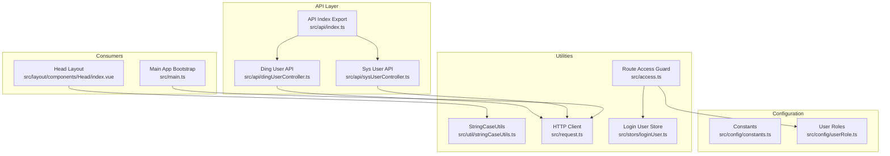
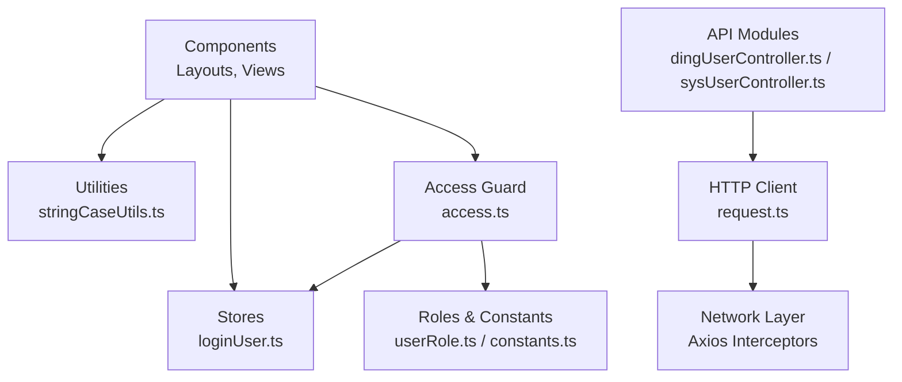
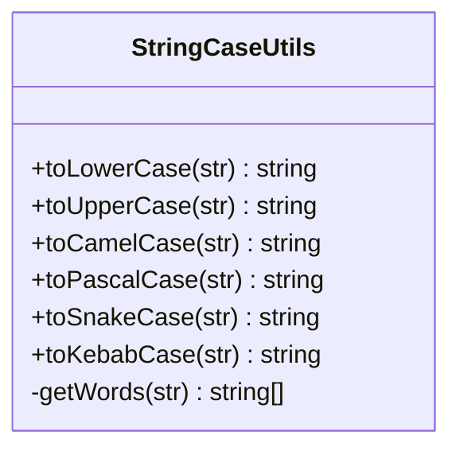
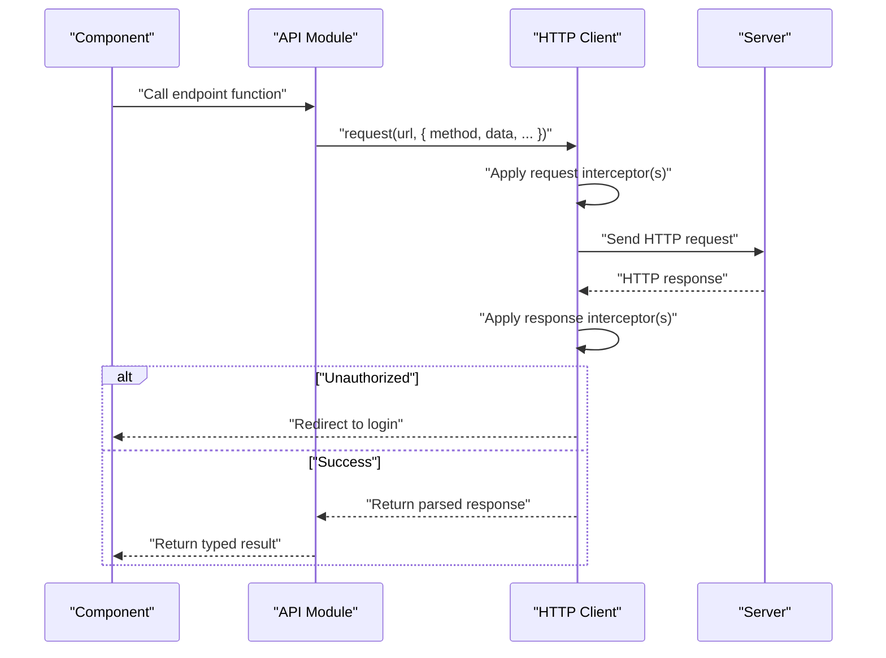
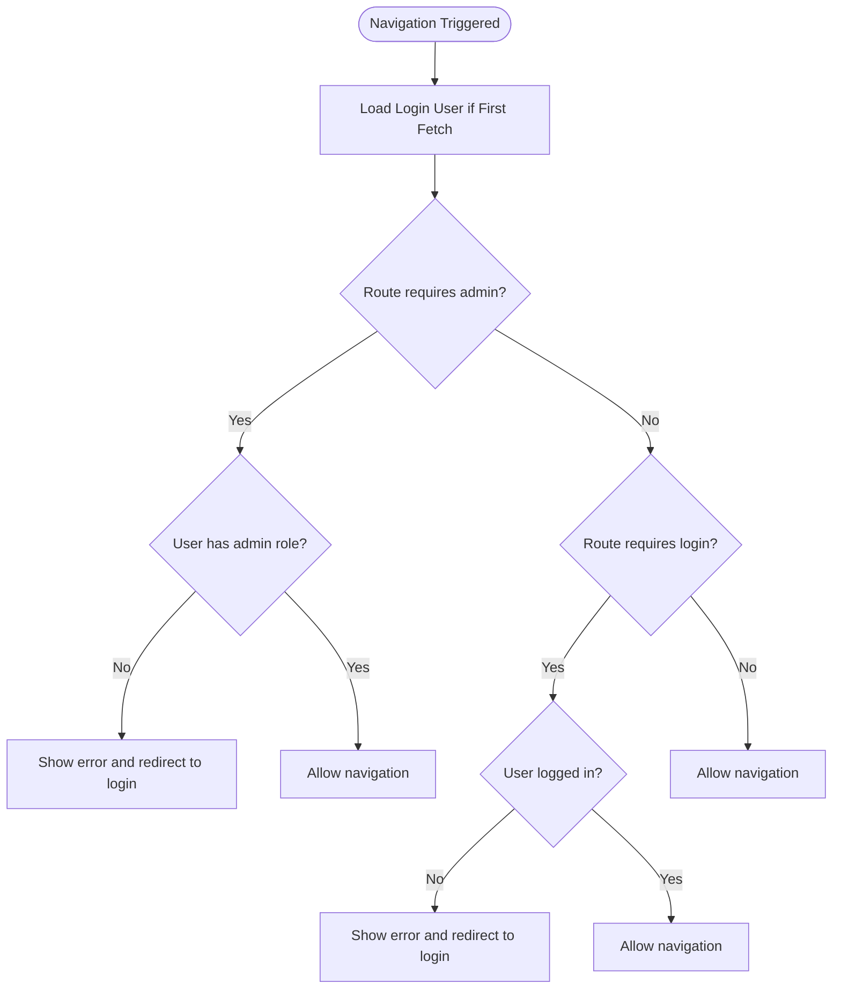
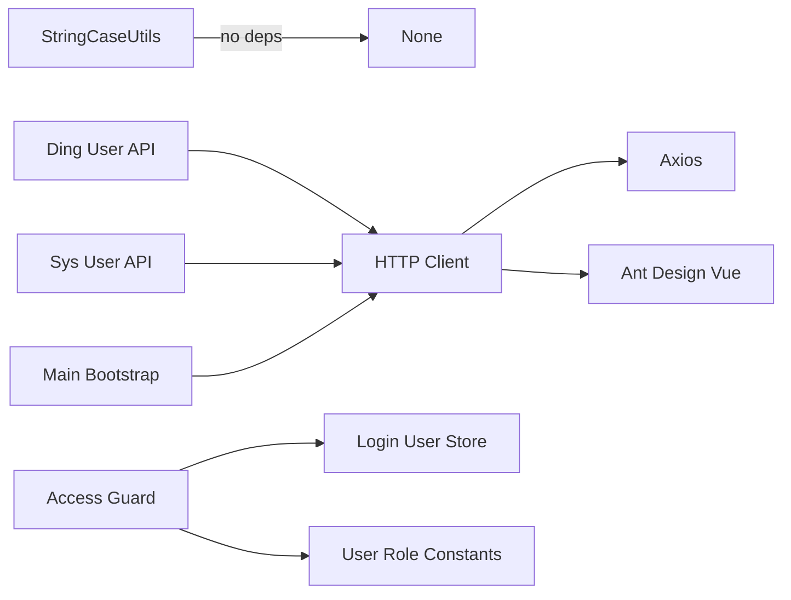

# Utilities & Helpers

<cite>
**Referenced Files in This Document**
- [stringCaseUtils.ts](file://src/util/stringCaseUtils.ts)
- [request.ts](file://src/request.ts)
- [access.ts](file://src/access.ts)
- [loginUser.ts](file://src/stors/loginUser.ts)
- [constants.ts](file://src/config/constants.ts)
- [userRole.ts](file://src/config/userRole.ts)
- [dingUserController.ts](file://src/api/dingUserController.ts)
- [sysUserController.ts](file://src/api/sysUserController.ts)
- [index.vue](file://src/layout/components/Head/index.vue)
- [main.ts](file://src/main.ts)
</cite>

## Table of Contents
1. [Introduction](#introduction)
2. [Project Structure](#project-structure)
3. [Core Components](#core-components)
4. [Architecture Overview](#architecture-overview)
5. [Detailed Component Analysis](#detailed-component-analysis)
6. [Dependency Analysis](#dependency-analysis)
7. [Performance Considerations](#performance-considerations)
8. [Troubleshooting Guide](#troubleshooting-guide)
9. [Conclusion](#conclusion)

## Introduction
This section documents the utility architecture and helper modules used across the frontend application. It focuses on reusable helper patterns, string case conversion utilities, and integration strategies. It also covers design principles, testing strategies, and maintenance considerations for utility functions, along with third-party integrations and custom helper implementations.

## Project Structure
Utilities and helpers are organized under dedicated modules:
- src/util: Contains reusable utility classes and functions (e.g., stringCaseUtils).
- src/request: Centralized HTTP client with interceptors for global request/response handling.
- src/stors: Pinia stores for global state (e.g., login user).
- src/config: Constants and role definitions used by helpers and components.
- src/api: API module exports that integrate with the centralized request client.
- src/access: Global route guard leveraging helpers and stores for permission checks.
- src/layout/components/Head/index.vue: Example consumer of stringCaseUtils.

**Diagram sources**
- [stringCaseUtils.ts:30-110](file://src/util/stringCaseUtils.ts#L30-L110)
- [request.ts:1-49](file://src/request.ts#L1-L49)
- [access.ts:1-41](file://src/access.ts#L1-L41)
- [loginUser.ts:1-33](file://src/stors/loginUser.ts#L1-L33)
- [constants.ts:1-3](file://src/config/constants.ts#L1-L3)
- [userRole.ts:1-6](file://src/config/userRole.ts#L1-L6)
- [dingUserController.ts:1-43](file://src/api/dingUserController.ts#L1-L43)
- [sysUserController.ts:1-34](file://src/api/sysUserController.ts#L1-L34)
- [index.vue:56-56](file://src/layout/components/Head/index.vue#L56-L56)
- [main.ts:1-19](file://src/main.ts#L1-L19)

**Section sources**
- [stringCaseUtils.ts:1-110](file://src/util/stringCaseUtils.ts#L1-L110)
- [request.ts:1-49](file://src/request.ts#L1-L49)
- [access.ts:1-41](file://src/access.ts#L1-L41)
- [loginUser.ts:1-33](file://src/stors/loginUser.ts#L1-L33)
- [constants.ts:1-3](file://src/config/constants.ts#L1-L3)
- [userRole.ts:1-6](file://src/config/userRole.ts#L1-L6)
- [dingUserController.ts:1-43](file://src/api/dingUserController.ts#L1-L43)
- [sysUserController.ts:1-34](file://src/api/sysUserController.ts#L1-L34)
- [index.vue:56-56](file://src/layout/components/Head/index.vue#L56-L56)
- [main.ts:1-19](file://src/main.ts#L1-L19)

## Core Components
- StringCaseUtils: A static utility class providing case conversion helpers for common naming conventions (lowercase, uppercase, camelCase, PascalCase, snake_case, kebab-case). It normalizes input by splitting on non-alphanumeric boundaries and handling camelCase transitions.
- HTTP Client (request.ts): An Axios-based client with base configuration and global interceptors for unified request/response handling, including automatic login redirection on unauthorized responses.
- Route Access Guard (access.ts): A global router guard that enforces permissions using the login user store and role constants.
- Login User Store (loginUser.ts): A Pinia store exposing user info and methods to fetch and set the current login user.
- Configuration (constants.ts, userRole.ts): Shared constants and roles consumed by guards and helpers.
- API Modules (dingUserController.ts, sysUserController.ts): Thin wrappers around the HTTP client for specific endpoints.

Key characteristics:
- Reusability: Utilities are imported and used across components and modules.
- Cohesion: Each utility module has a single responsibility (string conversion, HTTP, routing, state).
- Decoupling: Consumers depend on abstractions (store methods, constants) rather than hard-coded values.

**Section sources**
- [stringCaseUtils.ts:30-110](file://src/util/stringCaseUtils.ts#L30-L110)
- [request.ts:5-47](file://src/request.ts#L5-L47)
- [access.ts:11-40](file://src/access.ts#L11-L40)
- [loginUser.ts:9-32](file://src/stors/loginUser.ts#L9-L32)
- [constants.ts:1-3](file://src/config/constants.ts#L1-L3)
- [userRole.ts:1-6](file://src/config/userRole.ts#L1-L6)
- [dingUserController.ts:6-11](file://src/api/dingUserController.ts#L6-L11)
- [sysUserController.ts:6-18](file://src/api/sysUserController.ts#L6-L18)

## Architecture Overview
The utility architecture follows a layered pattern:
- Utilities provide pure or minimally coupled helpers (StringCaseUtils).
- HTTP utilities encapsulate network concerns (request.ts).
- State utilities manage global state (loginUser.ts).
- Access utilities enforce policy (access.ts).
- API modules compose HTTP utilities for domain-specific endpoints.
- Consumers (layouts, pages, stores) import and use these utilities.

**Diagram sources**
- [stringCaseUtils.ts:30-110](file://src/util/stringCaseUtils.ts#L30-L110)
- [request.ts:1-49](file://src/request.ts#L1-L49)
- [access.ts:1-41](file://src/access.ts#L1-L41)
- [loginUser.ts:1-33](file://src/stors/loginUser.ts#L1-L33)
- [userRole.ts:1-6](file://src/config/userRole.ts#L1-L6)
- [dingUserController.ts:1-43](file://src/api/dingUserController.ts#L1-L43)
- [sysUserController.ts:1-34](file://src/api/sysUserController.ts#L1-L34)

## Detailed Component Analysis

### StringCaseUtils
Purpose:
- Normalize and convert strings across naming conventions while handling mixed separators and camelCase transitions.

Core methods and behavior:
- toLowerCase: Converts the entire string to lowercase.
- toUpperCase: Converts the entire string to uppercase.
- toCamelCase: Lowercases the first word, capitalizes subsequent words, and concatenates without separators.
- toPascalCase: Capitalizes the first letter of each word and concatenates without separators.
- toSnakeCase: Joins words with underscores in lowercase.
- toKebabCase: Joins words with hyphens in lowercase.
- Internal helper getWords: Splits on non-alphanumeric boundaries, inserts spaces around camelCase transitions, trims, and splits by whitespace.

Integration patterns:
- Imported directly by components that require consistent naming transformations.
- Used in UI rendering and data preparation contexts.

Usage example references:
- Head layout component imports and uses StringCaseUtils for consistent label casing.

**Diagram sources**
- [stringCaseUtils.ts:30-110](file://src/util/stringCaseUtils.ts#L30-L110)

**Section sources**
- [stringCaseUtils.ts:30-110](file://src/util/stringCaseUtils.ts#L30-L110)
- [index.vue:56-56](file://src/layout/components/Head/index.vue#L56-L56)

### HTTP Client (request.ts)
Purpose:
- Provide a centralized Axios instance with shared configuration and global interceptors for consistent request/response behavior.

Key features:
- Base URL and timeout configuration.
- Request interceptor allowing pre-processing of requests.
- Response interceptor handling unauthorized responses by redirecting to login and warning messages.
- Exported default client for use across API modules.

Integration patterns:
- API modules import the client and call endpoints with method and data options.
- Main bootstrap registers the client globally via plugins.

**Diagram sources**
- [request.ts:5-47](file://src/request.ts#L5-L47)
- [dingUserController.ts:6-11](file://src/api/dingUserController.ts#L6-L11)
- [sysUserController.ts:6-18](file://src/api/sysUserController.ts#L6-L18)

**Section sources**
- [request.ts:1-49](file://src/request.ts#L1-L49)
- [dingUserController.ts:1-43](file://src/api/dingUserController.ts#L1-L43)
- [sysUserController.ts:1-34](file://src/api/sysUserController.ts#L1-L34)
- [main.ts:1-19](file://src/main.ts#L1-L19)

### Route Access Guard (access.ts)
Purpose:
- Enforce route-level permissions using the login user store and role constants.

Behavior:
- On navigation, ensures the login user is loaded before checking permissions.
- Redirects unauthenticated users attempting protected routes.
- Restricts admin-only routes to users with the appropriate role.

Integration patterns:
- Registered as a global router guard.
- Uses the login user store and role constants for checks.

**Diagram sources**
- [access.ts:11-40](file://src/access.ts#L11-L40)
- [loginUser.ts:17-22](file://src/stors/loginUser.ts#L17-L22)
- [userRole.ts:1-6](file://src/config/userRole.ts#L1-L6)

**Section sources**
- [access.ts:1-41](file://src/access.ts#L1-L41)
- [loginUser.ts:1-33](file://src/stors/loginUser.ts#L1-L33)
- [userRole.ts:1-6](file://src/config/userRole.ts#L1-L6)

### Login User Store (loginUser.ts)
Purpose:
- Manage the current login user’s state globally using Pinia.

Responsibilities:
- Holds a reactive reference to the login user object.
- Provides a method to fetch the login user via the health endpoint.
- Exposes a setter to update the login user.

Integration patterns:
- Accessed by the route guard to check roles and authentication state.
- Used by components to render user-specific UI.

**Section sources**
- [loginUser.ts:1-33](file://src/stors/loginUser.ts#L1-L33)

### Configuration (constants.ts, userRole.ts)
Purpose:
- Provide shared constants and roles used by guards and helpers.

Examples:
- DING_CLIENT_ID: Used by authentication flows.
- SYS_ROLE_USER: Role constant for user-level access.

**Section sources**
- [constants.ts:1-3](file://src/config/constants.ts#L1-L3)
- [userRole.ts:1-6](file://src/config/userRole.ts#L1-L6)

### API Modules (dingUserController.ts, sysUserController.ts)
Purpose:
- Wrap the HTTP client to expose typed functions for specific endpoints.

Patterns:
- Accept optional options to merge into the request call.
- Set Content-Type headers where applicable.
- Return typed responses for downstream consumption.

**Section sources**
- [dingUserController.ts:1-43](file://src/api/dingUserController.ts#L1-L43)
- [sysUserController.ts:1-34](file://src/api/sysUserController.ts#L1-L34)

## Dependency Analysis
Utility dependencies and coupling:
- StringCaseUtils is a standalone utility with no external dependencies.
- HTTP client depends on Axios and Ant Design Vue for notifications.
- Access guard depends on the login user store and role constants.
- API modules depend on the HTTP client and export typed functions.
- Main bootstrap integrates the HTTP client with the app.

**Diagram sources**
- [stringCaseUtils.ts:30-110](file://src/util/stringCaseUtils.ts#L30-L110)
- [request.ts:1-49](file://src/request.ts#L1-L49)
- [access.ts:1-41](file://src/access.ts#L1-L41)
- [loginUser.ts:1-33](file://src/stors/loginUser.ts#L1-L33)
- [userRole.ts:1-6](file://src/config/userRole.ts#L1-L6)
- [dingUserController.ts:1-43](file://src/api/dingUserController.ts#L1-L43)
- [sysUserController.ts:1-34](file://src/api/sysUserController.ts#L1-L34)
- [main.ts:1-19](file://src/main.ts#L1-L19)

**Section sources**
- [stringCaseUtils.ts:30-110](file://src/util/stringCaseUtils.ts#L30-L110)
- [request.ts:1-49](file://src/request.ts#L1-L49)
- [access.ts:1-41](file://src/access.ts#L1-L41)
- [loginUser.ts:1-33](file://src/stors/loginUser.ts#L1-L33)
- [userRole.ts:1-6](file://src/config/userRole.ts#L1-L6)
- [dingUserController.ts:1-43](file://src/api/dingUserController.ts#L1-L43)
- [sysUserController.ts:1-34](file://src/api/sysUserController.ts#L1-L34)
- [main.ts:1-19](file://src/main.ts#L1-L19)

## Performance Considerations
- StringCaseUtils: The internal word-splitting logic uses regular expressions and array transformations. For very large inputs, consider batching or memoization if reused frequently in tight loops.
- HTTP Client: Centralized interceptors avoid duplication but can add overhead per request. Keep interceptors minimal and efficient.
- Access Guard: Avoid redundant user fetches by leveraging the first-fetch flag and caching the resolved user state in the store.
- API Modules: Reuse the HTTP client to benefit from connection pooling and reduced initialization overhead.

## Troubleshooting Guide
Common issues and resolutions:
- Unauthorized responses redirect unexpectedly:
  - Verify the response interceptor logic and ensure non-login routes are excluded from redirect conditions.
  - Confirm the server response code and message align with the interceptor’s expectations.
- Incorrect case conversions:
  - Validate input strings for empty or null values.
  - Ensure mixed separators (spaces, underscores, hyphens) are handled as expected by the internal word splitter.
- Permission errors on protected routes:
  - Confirm the login user store is populated before navigation.
  - Verify the user role constant matches the backend role values.
- Network timeouts or failures:
  - Adjust the HTTP client timeout and retry logic as needed.
  - Inspect the request configuration and endpoint URLs.

**Section sources**
- [request.ts:25-47](file://src/request.ts#L25-L47)
- [access.ts:11-40](file://src/access.ts#L11-L40)
- [stringCaseUtils.ts:36-48](file://src/util/stringCaseUtils.ts#L36-L48)

## Conclusion
The utility and helper architecture emphasizes modularity, reusability, and separation of concerns. StringCaseUtils provides robust, consistent naming transformations; the HTTP client centralizes networking concerns with global interceptors; the access guard enforces permissions using a global store and constants; and API modules cleanly wrap endpoints. Following the documented design principles, testing strategies, and maintenance considerations will help keep the utility layer maintainable and scalable.